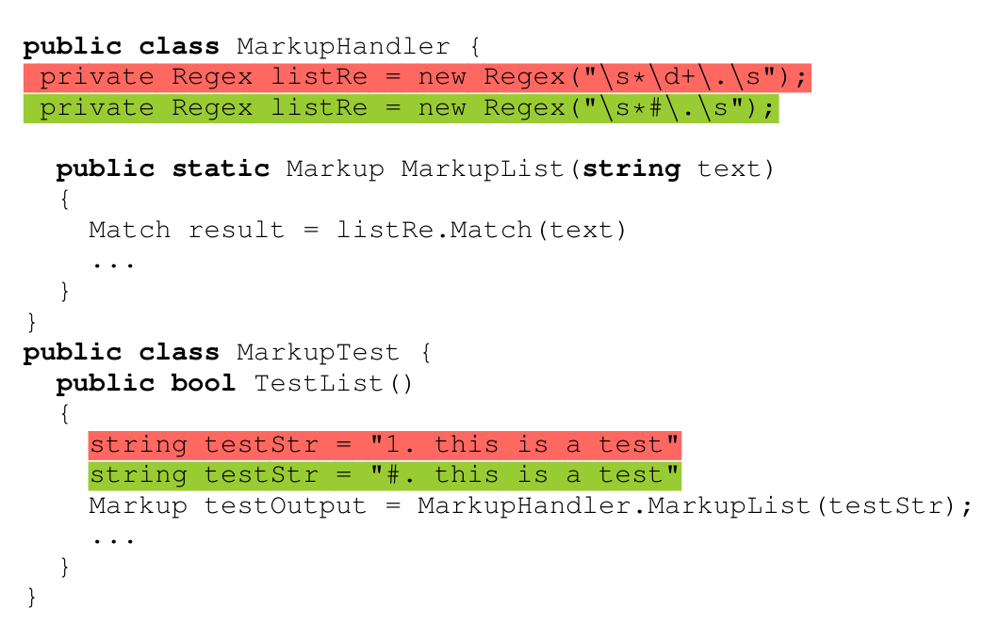

## TABLE I
LIST OF QUESTIONS

| Question | Items |
|---|---|
| RQ1 | • For this review, do you consider the decomposition we’ve created to be intuitive (correspond to your intention in having made the changes)? • For this review, is the decomposition “correct”? |
| RQ2 | • For this review, are the non-trivial partitions more important than trivial partitions? • For this review, are the trivial changes easier for reviewers to understand than the partitions? I.e., would they need less context to understand those changes? |
| RQ3 | • For this review, do you think this decomposition would help your reviewers to understand your changes? Why? • Do you think it would help to structure the changes in a code review? • Would you like to use this tool for your next code review? |

At the end of each session, we asked 7 detailed questions whose answers provide data to support conclusions for our three main research questions. Table I lists such questions and maps them to our main research questions. Surprisingly, while using CLUSTERCHANGES, all the 20 participants provided answers to some of these questions even before we asked them. We discuss these answers with more details in the next section.

The interviews lasted approximately 15–35 minutes. One participant did not allow us to record the interview; we had technical recording problems in three other interviews. We transcribed each recorded interview and had detailed notes from the others. At the end of each interview, although we had not offered it as an incentive, we compensated participants with a $5 gift card for lunch.

### D. Coding Interviews

All four authors coded four transcribed interviews in a meeting together to define and calibrate the codes. Codes were created for each question. Besides that, sentences that could not be related to any of the questions but provided valuable feedback we coded as “other”. For example, we coded the sentence “It would be nice to rename the partitions” as other; we found that many of these statements gave us valuable information about a missing feature of our tool. Then all four authors coded the same seven interviews individually. Since we used more than two raters for the transcriptions we used Fleiss’ Kappa [16] on the individually coded responses to determine inter-rater reliability. The inter-rater reliability was 72%, which Landis and Koch consider to be substantial agreement [17]. The remaining interviews were each coded by an individual author.

In total, we coded 572 sentences extracted from our notes and audio transcripts: 366 (64%) were coded as none. These were sentences that do not provide any information to answer our questions. Of the remaining 206 (36%) sentences, 115 were coded to RQ1, 37 to RQ2, 46 to RQ3, and 33 to the other category. Note that 18 sentences were coded to more than one category.

Fig. 6. Missed relationship between two diff-regions in a changeset.

### E. Results and Analysis

1) RQ1: Of the 20 participants, 16 said that our non-trivial partitions were both correct and complete, i.e., the non-trivial partitions were indeed independent, the diff-regions within each partition were related and there were no missing conceptual groups. Of the remaining 4, 2 said that there should not have been more than one partition, while the other 2 said that while the non-trivial partitions were correct, some of the trivial partitions should have been grouped together in a new non-trivial partition.

Figure 6 shows an example of two trivial partitions that one participant thought should be in the same partition. In each pair of colored lines, the top red line had been removed and the bottom green line had been added. The developer changed both a string containing a regular expression (in listRe) and a string used to test the regular expression (testStr). The strings are related only through a method call to a method, MarkupList, which although defined in the changeset had not been modified. Such a relationship is not captured by CLUSTERCHANGES and the two diff-regions remain in separate partitions.

Interestingly, even though we did not explain the details of our analysis, one of the participants realized how difficult it would be to group such changes: “In some sort of hypothetical perfect splitting that read my mind, there is one change in one line which was a variable changed (regular expression) that could be in a different partition. But I would not expect that, because it is difficult” [P9].

The 2 participants that said their code changes shouldn’t be partitioned were not clear about the reasons that led them to disagree with the partitions, but both mentioned that all the changes are somewhat related to a general concept, even if they are not related to each other. One of them was skeptical about our approach and stated at the beginning of the interview that “there is no reason [...] to commit unrelated changes” [P13].

We identified a pattern for the 16 cases in which we created the expected partitions. Even though all the diff-regions within non-trivial partitions were placed correctly and the partitions matched developers’ reasoning about their own changes, 14 developers would have moved some (not more than 3) of the