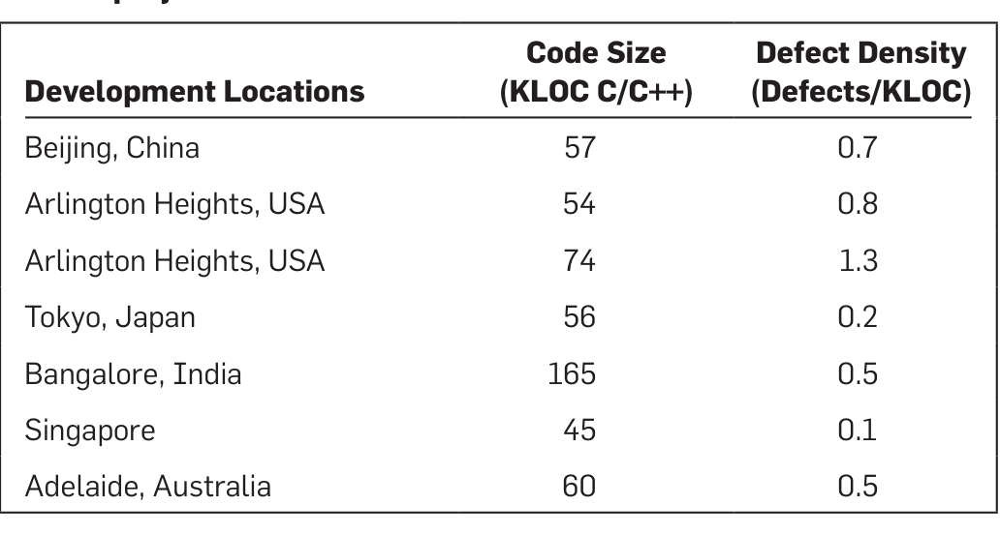
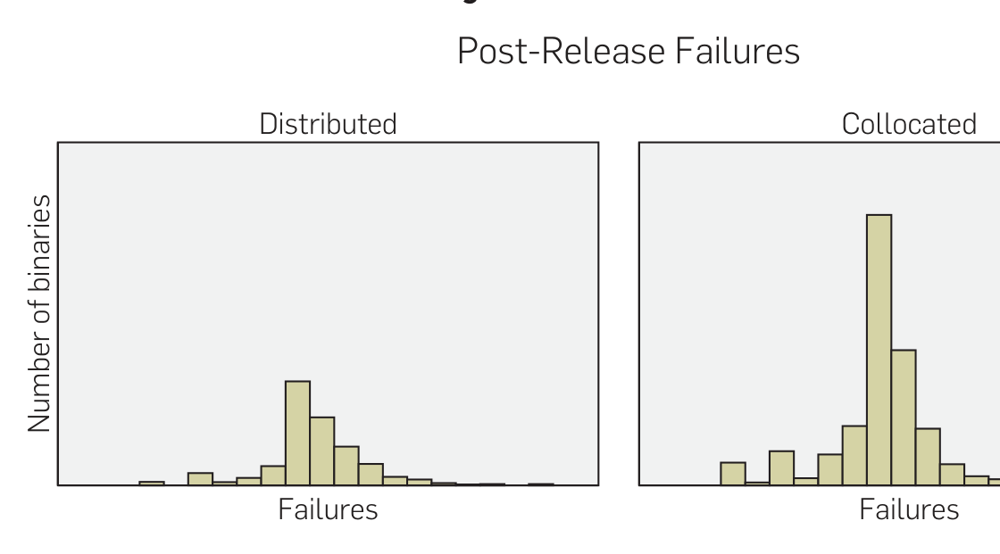
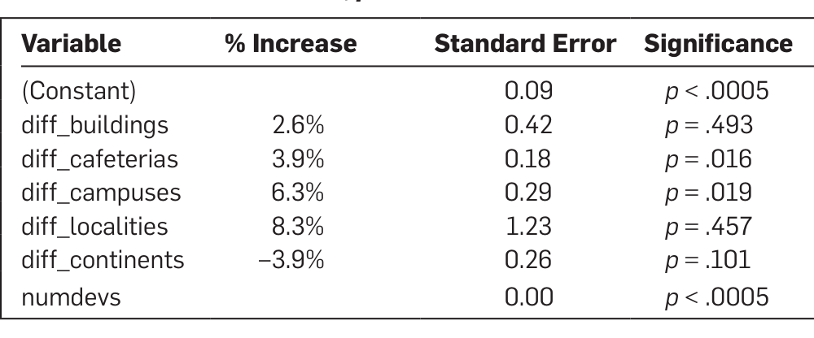
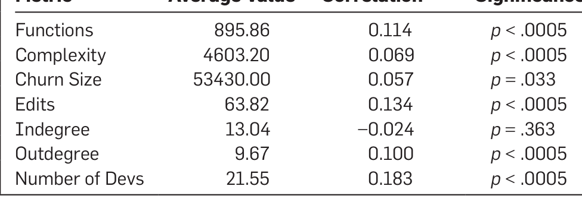

DOI: 10.1145/1536616

# Does Distributed Development Affect Software Quality?
## An Empirical Case Study of Windows Vista

By Christian Bird, Nachiappan Nagappan, Premkumar Devanbu, Harald Gall, and Brendan Murphy

## Abstract
Existing literature on distributed development in software engineering, and other fields discusses various challenges, including cultural barriers, expertise transfer difficulties, and communication and coordination overhead. Conventional wisdom, in fact, holds that distributed software development is riskier and more challenging than collocated development. We revisit this belief, empirically studying the overall development of Windows Vista and comparing the post-release failures of components that were developed in a distributed fashion with those that were developed by collocated teams. We found a negligible difference in failures. This difference becomes even less significant when controlling for the number of developers working on a binary. Furthermore, we also found that component characteristics (such as code churn, complexity, dependency information, and test code coverage) differ very little between distributed and collocated components. Finally, we examine the software process used during the Vista development cycle and examine how it may have mitigated some of the difficulties of distributed development introduced in prior work in this area.

## 1. INTRODUCTION
Globally distributed software development is an increasingly common strategic response to issues such as skill set availability, acquisitions, government restrictions, increased code size, cost and complexity, and other resource constraints.4, 9 In this paper, we examine development that is globally distributed, but completely within Microsoft. This style of global development within a single company is to be contrasted with outsourcing, which involves multiple companies. It is widely believed that distributed collaboration involves challenges not inherent in collocated teams, including delayed feedback, restricted communication, less shared project awareness, difficulty of synchronous communication, inconsistent development and build environments, and lack of trust and confidence between sites.20 While there are studies that have examined the delay associated with distributed development and the direct causes for them,11 there has been much less attention (see e.g., Rammasubbu and Balan21) to the effect of distributed development on software quality in terms of post-release failures.

In this paper, we use historical development data from the implementation of Windows Vista, along with post-release failure information, to empirically evaluate the hypothesis that globally distributed software development leads to more failures. We focus on post-release failures at the level of individual executables and libraries (which we refer to as binaries) shipped as part of the operating system and use the IEEE definition of a failure as “the inability of a system or component to perform its required functions within specified performance requirements.” Post-release failures are the most costly to companies in terms of reputation and market share.

Using geographical and commit data for the developers that worked on Vista, we divide the Vista binaries into those developed by (a) distributed and (b) collocated teams; we then examine the distribution of post-release failures in both populations. Binaries are classified as developed in a distributed manner if at least 25% of the commits came from locations other than where a binary’s owner resides. We find that there is a small (around 10%) increase in the number of failures of binaries written by distributed teams (hereafter referred to as distributed binaries) over those written by collocated teams (collocated binaries). However, when controlling for team size, the difference becomes negligible. In order to see if only smaller, less complex, or less critical binaries are chosen for distributed development (which could explain why distributed binaries have approximately the same number of failures), we examined many relevant properties of these binaries, but found no difference between distributed and collocated binaries. We present our methods and findings in this paper.

## 2. MOTIVATION AND CONTRIBUTIONS
Distributed software development is a general concept that can be operationalized in various ways. Development may be distributed along many dimensions with various distinctive characteristics.8 There are key questions that should be clarified when discussing a distributed software project. Who or what is distributed and at what level? Are people or the artifacts distributed? Are people dispersed individually or dispersed in groups?

It is important to consider the way that developers and other entities are distributed. The distribution can be across

> A previous version of this article appeared in Proceedings of the 31st International Conference on Software Engineering (May 2009).

---

geographical, organizational, temporal, or stakeholder boundaries.14 A scenario involving one company outsourcing work to another will certainly differ from another, where multiple, distributed teams work within the same company. A recent special issue of IEEE Software focused on globally distributed development, but the majority of the papers dealt with offshoring relationships between separate companies and outsourcing, which are likely very different from distributed sites within the same company.2, 5, 6 Even within a company, the development may or may not span organizational structure at different levels. Do geographical locations span the globe, including multiple time zones, languages, and cultures or are they simply in different cities of the same state or nation?

We are interested in studying the effect of globally distributed software development within the same company, because there are many issues involved in outsourcing that are independent of geographical distribution (e.g., expertise finding, different process, and an asymmetric relationship). Our main motivation is to confirm or refute the notion that global software development leads to more failures within the context of our setting.

To our knowledge, this is the first large scale distributed development study that considers distributed development within an organization. This study augments the current body of knowledge and differs from prior studies by making the following contributions:

1. We examine distributed development at multiple levels of separation (building, campus, continent, etc.).
2. We examine a large scale software development effort, composed of thousands of binaries and thousands of developers.
3. We examine complexity and maintenance characteristics of the distributed and collocated binaries to check for inherent differences that might influence post-release quality.
4. Our study examines a project in which all sites involved are part of the same company and have been using the same process and tools for years.

There is a large body of theory describing the difficulties inherent in distributed development. We summarize them here.

Communication suffers due to a lack of unplanned and informal meetings.10 Engineers do not get to know each other on a personal basis. Synchronous communication becomes less common due to time zone and language barriers. Even when communication is synchronous, the communication channels, such as conference calls or instant messaging, are less rich than face-to-face and collocated group meetings. Developers may take longer to solve problems because they lack the ability to step into a neighboring office to ask for help. They may not even know the correct person to contact at a remote site.

Coordination breakdowns occur due to this lack of communication and lower levels of group awareness.1, 3 When managers must manage across large distances, it becomes more difficult to stay aware of people's tasks and how they are interrelated. Different sites often use different tools and processes which can also make coordinating between sites difficult.

Diversity in operating environments may cause management problems.1 Often there are relationships between the organization doing development and external entities such as governments and third party vendors. In a geographically dispersed project, these entities will be different based on location (e.g., national policies on labor practices may differ between the United States and India).

Distance can reduce team cohesion20 in groups collaborating remotely. Eating, sharing an office, or working late together to meet a deadline, all contribute to a feeling of being part of a team. These opportunities are diminished by distance.

Organizational and national cultural barriers may complicate globally distributed work.4 Coworkers must be aware of cultural differences in communication behaviors. One example of a cultural difference within Microsoft became apparent when a large company meeting was originally (and unknowingly) planned on a major national holiday for one of the sites involved.

Based on these prior observations and an examination of the hurdles involved in globally distributed development we expect that difficulties in communication and coordination will lead to an increase in the number of failures in code produced by distributed teams over code from collocated teams. We formulate our testable hypothesis formally.

H1: Binaries that are developed by teams of engineers that are distributed will have more post-release failures than those developed by collocated engineers.

We are also interested to see if the binaries that are distributed differ from their collocated counterparts in any significant ways. It is possible that managers, aware of the difficulties mentioned above, may choose to develop simpler, less frequently changing, or less critical software in a distributed fashion. We therefore present our second hypothesis.

H2: Binaries that are distributed will be less complex, experience less code churn, and have fewer dependencies than collocated binaries.

## 3. RELATED WORK

There is a wealth of literature in the area of globally distributed software development. It has been the focus of multiple special issues of IEEE Software, workshops at ICSE and the International Conference on Global Software Engineering. Here we survey important work in the area, including both studies and theory of globally distributed work in software development.

There have been a number of experience reports for globally distributed software development projects at various companies including Siemens,13 Alcatel,7 Motorola,1 Lucent,10 and Philips.15

### 3.1. Effects on bug resolution

In an empirical study of globally distributed software development,11 Herbsleb and Mockus examined the time to resolution of Modification Requests (MRs) in two departments of Lucent working on distinct network elements for a telecommunication system. The average time needed to complete a “single-site” MR was 5 days versus 12.7 for “distributed.” When controlling for other factors such as number of people working on an MR, how diffused the changes

---

are across the code base, size of the change, and severity, the effect of being distributed was no longer significant. They hypothesize that large and/or multi-module changes are both more time consuming and more likely to involve multiple sites. These changes require more people, which introduce delay. They conclude that distributed development indirectly introduces delay due to correlated factors such as team size and breadth of changes required.

Thanh et al.19 examined the effect of distributed development on delay between communications and time to resolution of work items in IBM’s Jazz project, which was developed at five globally distributed sites. While Kruskal–Wallis tests showed a statistically significant difference in resolution times for items that were more distributed, the Kendall Tau correlations of time to resolution and time between comments with number of sites were extremely low (below 0.1 in both cases). This indicates that distributed collaboration does not have a strong effect.

Herbsleb and Mockus12 formulate an empirical theory of coordination in software engineering and test hypotheses based on this theory. They precisely define software engineering as requiring a sequence of decisions associated with a project. Each decision constrains the project and future decisions in some way, until all choices have been made, and the final product does or does not satisfy the requirements. It is therefore important that only feasible decisions (those which will lead to a project that does satisfy the requirements) be made. They present a coordination theory, and develop testable hypotheses regarding productivity, measured as number of MRs resolved per unit time. They find that (a) people who are assigned work from many sources have lower productivity, and that (b) MRs that require work in multiple modules have a longer cycle time than those which require changes to just one.

Unlike the above papers, our study focuses on the effect of distributed development on defect occurrence, rather than on defect resolution time.

### 3.2. Effects on quality and productivity

Diomidis Spinellis examined the effect of distributed development on productivity, code style, and defect density in the FreeBSD code base.23 He measured the geographical distance between developers, the number of defects per source file, as well as productivity in terms of number of lines committed per month. A correlation analysis showed that there is little, if any, relationship between geographic distance of developers and productivity and defect density. It should be noted that this is a study of open source software which is, by its very nature, distributed and has a very different process model from commercial software.

Cusick and Prasad5 examined the practices used by Wolters Kluwer Corporate Legal Services when outsourcing software development tasks and present their model for deciding if a project is offshorable and how to manage it effectively. Their strategies include keeping communication channels open, using consistent development environments and machine configurations, bringing offshore project leads onsite for meetings, developing and using necessary infrastructure and tools, and managing where the control and domain expertise lies.

They also point out that there are some drawbacks that are difficult to overcome and should be expected such as the need for more documentation, more planning for meetings, higher levels of management overhead, and cultural differences. This work was based on an offshoring relationship with a separate vendor and not collaboration between two entities within the same company. We expect that the challenges faced in distributed development may differ based on the type of relationship between distributed sites.

Ramasubbu and Balan21 examined the relationship between the dispersion (a measure of geographic dispersion) of a project and its development productivity and conformance quality. They gathered information from 42 projects over 2 years and found that projects that had more dispersion also had lower levels of productivity and conformance quality, though the effects were strongly mitigated through quality management approaches. In their study, productivity and quality were measured on a project basis between different projects, while our study examines characteristics of components within one large software project, which arguably provides better control over possibly confounding project-specific factors.

Our study examines distributed development in the context of one commercial entity, which differs greatly from both open source projects and outsourcing relationships.

### 3.3. Issues and solutions

In his paper on global software teams,3 Carmel categorizes project risk factors into four categories that act as centrifugal forces that pull global projects apart. These are:

- Loss of communication richness
- Coordination breakdowns
- Geographic dispersion
- Cultural differences

In 2001, Battin et al.1 discussed the challenges and their solutions relative to each of Carmel’s categories in a large scale project implementing the 3G Trial (Third Generation Cellular System) at Motorola. By addressing these challenges in this project, they found that globally distributed software development did not increase defect density, and in fact, had lower defect density than the industrial average. Table 1 lists the various locations, the size of the code developed at those locations, and their defect density. They summarize the key actions necessary for success with global development in order of importance:

- Use Liaisons
- Distribute entire things for entire life cycle
- Plan to accommodate time and distance

Carmel and Agarwal4 present three tactics for alleviating distance in global software development, each with examples, possible solutions, and caveats:

- Reduce intensive collaboration.
- Reduce national and organizational cultural distance.
- Reduce temporal distance.

---

Table 1. Locations, code size, and defect density from Motorola’s 3G trial project for each site.

> **Image description:** A three-column table showing seven development locations with their C/C++ code size (in KLOC) and defect density (defects per KLOC) from Motorola’s 3G trial. Rows list: Beijing, China (57 KLOC, 0.7 defects/KLOC); Arlington Heights, USA (54 KLOC, 0.8) and a second Arlington Heights entry (74 KLOC, 1.3); Tokyo, Japan (56 KLOC, 0.2); Bangalore, India (165 KLOC, 0.5); Singapore (45 KLOC, 0.1); and Adelaide, Australia (60 KLOC, 0.5). Notably, the largest code base is Bangalore (165 KLOC) but its defect density is moderate (0.5), while a 74 KLOC module from Arlington Heights has the highest defect density (1.3), indicating no simple monotonic relationship between module size and defect density across sites.

Nagappan et al. investigated the influence of organizational structure on software quality in Windows Vista.18 They found a strong relationship between how development is distributed across the organizational structure and the number of post-release failures in binaries shipped with the operating system. Along with other organizational measures, they measured the level of code ownership by the organization that the binary owner belonged to, the number of organizations that contributed at least 10% to the binary, and the organizational level of the person whose reporting engineers perform more than 75% of the edits. Our paper complements this study by examining geographically, rather than organizationally, distributed development.

## 4. Methods and Analysis

### 4.1. Data collection

Windows Vista is a large commercial software project involving a few thousand developers. It comprises thousands of binaries (defined as individual files containing machine code such as executables or libraries) with a source code base of tens of millions of LOC. Developers were distributed across 59 buildings and 21 campuses in Asia, Europe, and North America. Vista was developed completely in-house without any outsourced elements.

Our data focuses on three properties: code quality, geographical location, and code ownership. Our measure of code quality is post-release failures, since these matter most to end-users, cost the most to fix, and affect product and company reputation. These failures are recorded for the 6 months following the release of Vista at the binary level.

The geographical location of each software developer at Microsoft is obtained from the people management software at the time of release to manufacturing of Vista. This data includes the building, campus, region, country, and continent information. While some developers occasionally move, it is standard practice at Microsoft to keep a software engineer at one location during an entire product cycle. Most of the developers of Vista didn’t move during the observation period.

Finally we gathered the number of commits made by each engineer to each binary. We remove build engineers from the analysis because their changes are broad, but not substantive. Many files have fields that need to be updated prior to a build, but the actual source code is not modified. By combining this data with developer geographical data, we determine the level of distribution of each binary and categorize these levels into a hierarchy. Microsoft practices a strong code ownership development process. We found that on average, 49% of the commits for a particular binary can be attributed to one engineer. Although we are basing our analysis on data from the development phase, in most cases, this is indicative of the distribution that was present during the design phase as well.

We categorized the distribution of binaries into the following geographic levels. Our reasoning behind this classification is explained below.

- **Building:** Developers who work in the same building (and often the same floor) will enjoy more face-to-face and informal contact. A binary classified at the building level may have been worked on by developers on different floors of the same building.

- **Cafeteria:** Several buildings share a cafeteria. One cafeteria services between one and five nearby buildings. Developers in different, but nearby buildings, may “share meals” together or meet by chance during meal times. In addition, the typically shorter geographical distance facilitates impromptu meetings.

- **Campus:** A campus represents a group of buildings in one location. For instance, in the United States, there are multiple campuses. Some campuses are located in the same city. It is easy to travel between buildings on the same campus by foot while travel between campuses (even in the same city) requires a vehicle.

- **Locality:** We use localities to represent groups of geographically proximate campuses. For instance, the Seattle locality contains all of the campuses in western Washington. One can travel within a locality by car on day trips, but travel between localities often requires air travel and multi-day trips. Also, all sites in a particular locality operate in the same time zone, making coordination and communication within a locality easier than between localities.

- **Continent:** All of the locations on a given continent fall into this category. We choose to group at the continent level rather than the country level because Microsoft has offices in Vancouver Canada and we wanted those to be grouped together with other west coast sites (Seattle to Vancouver is less than 3 h by road). If developers are located in the same continent, but not the same locality, then it is likely that cultural similarities exist, but they operate in different time zones and rarely speak face to face.

- **World:** Binaries developed by engineers on different continents are placed in this category. This level of geographical distribution means that face-to-face meetings are rare and synchronous communication such as phone calls or online chats are hindered by time differences. Also, cultural and language differences are more likely.

For every level of geographical dispersion there are more than two entities from the lower level within that level. That is, Vista was developed in more than three continents, localities, etc. Each binary is assigned the lowest level in the hierarchy from which at least 75% of the commits were made. Thus,

---

Figure 1: Hierarchy of distribution levels in Windows Vista.

> **Image description:** A schematic showing how commits to a single binary (cmroute.dll) are distributed across the geographic hierarchy used in the study. Nested colored panels represent continent → locality/campus → building (e.g., North America → Redmond → Bldg 40) and list individual developers with their commit counts (for example, in Redmond Bldg 40: John 67, Tom 10, Zach 3; in Hyderabad Bldg 1: Ram 16, Prem 10, Srini 9, Vijay 8, Pradesh 7, Sita 6, Raju 2). Arrows from the North America and Asia panels point into a central cmroute.dll container that shows its source files (cmroute.cpp, cmroute.h, etc.), illustrating that this binary received contributions from multiple buildings, campuses, and continents and thus how the paper’s distribution levels are derived for a real binary.

If engineers residing in one region make at least 75% of the commits for a binary, but there is no campus that accounts for 75%, then the binary is categorized at the region level. This threshold was chosen based on results of prior work on development distributed across organizational boundaries that is standardized across Windows.18 Figure 1 illustrates the geographic distribution of commits to an actual binary (with names anonymized). To assess the sensitivity of our results to this selection and address any threats to validity we performed the analysis using thresholds of 60%, 75%, 90%, and 100% with consistently similar results.

Note that whether a binary is distributed or not is orthogonal to the actual location where it was developed. Some binaries that are classified at the building level were developed entirely in a building in Hyderabad, India while others were owned in Redmond, Washington.

Figure 2 illustrates the hierarchy and shows the proportion of binaries that fall into each category. Note that a majority of binaries have over 75% of their commits coming from just one building. The reason that so few binaries fall into the continent level is that the United States is the only country which contains multiple localities. Although the proportion of binaries categorized above the campus level is barely 10%, this still represents a sample of over 380 binaries; enough for a strong level of statistical power.

We initially examined the number of binaries and distribution of failures for each level of our hierarchy. In addition, we divided the binaries into “distributed” and “collocated” categories in five different ways using, each time using a different level shown in Figure 2 (e.g., one split categorizes building and cafeteria level binaries as collocated and the rest as distributed). These categorizations are used to determine if there is a level of distribution above which there is a significant increase in the number of failures. The results from analysis of these dichotomized data sets were consistent in nearly all respects. We therefore present the results of the first data set and point out deviations between the data sets where they occurred.

### 4.2. Experimental analysis

We examined the distribution of the number of post-release failures per binary in both populations. Figure 3 shows histograms of the number of bugs for distributed and collocated binaries. Absolute numbers are omitted from the histograms for confidentiality, but the horizontal and vertical scales are the same for both histograms. A visual inspection indicates that although the mass is different, with more binaries categorized as collocated than distributed, the distribution of failures are very similar.

A Mann–Whitney test was used to quantitatively measure the difference in means because the number of failures was not normally distributed.16 The difference in means is statistically significant, but small. While the average number of failures per binary is higher when the binary was distributed, the actual magnitude of the increase is only about 8%. In a prior study by Herbsleb and Mockus,11 time to resolution of

Figure 2. Commits to the library cmroute.dll. For clarity, location of anonymized developers is shown only in terms of continents, regions, and buildings.

> **Image description:** A concentric‑ring diagram labels six geographic distribution levels with their percentages: Building 68%, Cafeteria 2.3%, Campus 17%, Locality 5.6%, Continent 0.2%, and World 5.9%. The paper assigns each binary to the lowest level from which at least 75% of commits originated, so the chart shows that a clear majority of binaries (68%) had most work done within a single building, while only a small fraction were shared across wider regions. Combining Locality, Continent and World (≈11.7%) indicates the portion of binaries with substantial cross‑locality or cross‑continental contributions (the authors note this still represents several hundred binaries in their dataset).

---

> Figure 3. Histograms of the number of failures per binary for distributed (left) and collocated (right) binaries. Although numbers are not shown on the axes, the scales are the same in both histograms.

> **Image description:** Two side‑by‑side histograms compare the distribution of post‑release failures per binary: the left panel labeled “Distributed” and the right panel labeled “Collocated.” The x‑axis (Failures) and y‑axis (Number of binaries) are shown without numeric tick labels but the authors note the two plots use identical scales, allowing direct visual comparison. Both distributions concentrate at low-to-moderate failure counts and have similar shapes, although the collocated panel shows a taller central peak (more binaries with that failure count) while the distributed panel is slightly more spread; overall the visual similarity matches the paper’s quantitative finding of only a small increase in failures for distributed binaries (≈8% unadjusted, and much smaller/negligible after controlling for number of developers).

MRs were positively correlated with the level of distribution of the participants. After further analysis, they discovered that the level of distribution was not significant when controlling for the number of people participating. We performed a similar analysis on our data.

We used linear regression to examine the effect of distributed development on the number of failures. Our initial model contained only the binary variable indicating whether or not the binary was distributed. The number of developers working on a binary was then added to the model and we examined the coefficients in the model. In these models, distributed is a binary variable indicating if the binary is distributed and numdevs is the number of developers that worked on the binary. We show here the results of analysis when splitting the binaries at the regions level. The F-statistic and p value show how likely the null hypothesis (the hypothesis that the predictor variable has no effect on the response variable) is. We give the percentage increase in failures when the binaries are distributed based on the parameter values. As numdevs is only included in the models to examine effect of distribution when controlling for number of developers we do not include estimates or percentage increase.

We performed this analysis on all five splits of the binaries (one at each level as shown in Figure 2). The estimates for distributed coefficient for all models were below 17%, and dropped even further to below 9% when controlling for number of developers (many were below this value, but the numbers cited are upper bounds). In addition, the effect of distributed in models that accounted for the number of developers was only statistically significant when dividing binaries at the continents level. In concrete terms, this indicates that a binary contributed to by 20 developers in Redmond will have relatively the same number of defects as one that has commits from 20 developers around the world.

We also used linear regression to examine the effect of the level of distribution on the number of failures of a binary. Since the level of distribution is a nominal variable that can take on six different values, we encode it into five binary variables. The variable diff_buildings is 1 if the binary was distributed among different buildings that all were served by the same cafeteria and 0 otherwise, etc. The percentage increase for each diff represents the increase in failures relative to binaries that are developed by engineers in the same building.

### Model 1. F statistic = 12.43, p < .0005

| Variable    | % Increase | Standard Error | Significance    |
|-------------|-----------:|---------------:|-----------------|
| (Constant)  | 0.30       |                | p < .0005       |
| distributed | 9.2%       | 0.31           | p < .0005       |

### Model 3. F statistic = 25.48, p < .0005

| Variable         | % Increase | Standard Error | Significance    |
|------------------|-----------:|---------------:|-----------------|
| (Constant)       | 0.09       |                | p < .0005       |
| diff_buildings   | 15.1%      | 0.50           | p < .0005       |
| diff_cafeterias  | 16.3%      | 0.21           | p < .0005       |
| diff_campuses    | 12.6%      | 0.35           | p < .0005       |
| diff_localities  | 2.6%       | 1.47           | p = .824        |
| diff_continents  | -5.1%      | 0.31           | p = .045        |

This indicates that on average, a distributed binary has 9.2% more failures than a collocated binary. However, the result changes when controlling for the number of developers working on a binary. The parameter estimates of the model indicate that binaries developed by engineers on the same campus served by different cafeterias have, on average, 16% more post-release failures than binaries developed in the same building. Interestingly, the change in number of failures is quite low for those developed in multiple regions and continents. However, when controlling for development team size, only binaries categorized at the levels of different cafeterias and different campuses show a statistically significant increase in failures.

### Model 2. F statistic = 720.74, p < .0005

| Variable    | % Increase | Standard Error | Significance    |
|-------------|-----------:|---------------:|-----------------|
| (Constant)  | 0.25       |                | p < .0005       |
| distributed | 4.6%       | 0.25           | p = .056        |
| numdevs     | 0.00       |                | p < .0005       |

---

over binaries developed in the same building. Even so, the actual effects are relatively minor (4% and 6%, respectively).

> **Image description:** This regression table (Model 4) reports percentage changes in post‑release failures for binaries whose commits are dispersed at various geographic levels, using same‑building binaries as the baseline and controlling for number of developers (numdevs). Coefficients show modest estimated increases: diff_cafeterias +3.9% (SE 0.18, p = .016) and diff_campuses +6.3% (SE 0.29, p = .019) are the only distribution levels with statistically significant increases. diff_buildings (+2.6%, p = .493), diff_localities (+8.3%, p = .457) and diff_continents (−3.9%, p = .101) are not statistically significant. The numdevs predictor is highly significant (p < .0005), indicating team size is an important control in the model.

Model 4. F statistic = 242.73, p < .0005

### 4.3. Differences in binaries

Two important observations can be made from these models. The first is that the variance explained by the predictor variables as measured in the adjusted R^2 value (not shown) for the built models rises from 2% and 4% (models 1 and 3) to 33% (models 2 and 4) when adding the number of developers. The second is that when controlling for the number of developers, not all levels of distribution show a significant effect, but the increase in post-release failures for those that do is minimal with values at or below 6%. To put this into perspective, a binary with 4 failures if collocated would have 4.24 failures if distributed. Although our response variable is different from Herbsleb and Mockus, our findings are consistent with their result that when controlling for the number of people working on a development task, distribution does not have a large effect. Based on these results, we are unable to reject the null hypothesis and H1 is not confirmed.

This leads to the surprising conclusion that in the context in which Windows Vista was developed, teams that were distributed wrote code that had virtually the same number of post-release failures as those that were collocated.

One possible explanation for this lack of difference in failures could be that distributed binaries are smaller, less complex, have fewer dependencies, etc. Although the number of failures changes only minimally when the binaries are distributed, we are interested in the differences in characteristics between distributed and collocated binaries. This was done to determine if informed decisions were made about which binaries should be developed in a distributed manner. For instance, prior work has shown that the number of failures is highly correlated with code complexity and number of dependencies.17, 24 Therefore, it is possible that only less complex binaries or those with less dependents were chosen for distribution in an effort to mitigate the perceived dangers of distributed development.

We gathered metrics for each of the binaries in an attempt to determine if there is a difference in the nature of binaries that are distributed. These measures fall into five broad categories.

#### Size and complexity
Our code size and complexity measures include number of independent paths through the code, number of functions, classes, parameters, blocks, lines, local and global variables, and cyclomatic complexity. From the call graph we extract the fan in and fan out of each function. For object oriented code we include measures of class coupling, inheritance depth, the number of base classes, subclasses and class methods, and the number of public, protected, and private data members and methods. All of these are measured as totals for the whole binary and as maximums on a function or class basis as applicable.

#### Code churn
As measures of code churn we examine the change in size of the binary, the frequency of edits and the churn size in terms of lines removed, added, and modified from the beginning of Vista development until release to manufacturing.

#### Test coverage
The number of blocks and arcs as well as the block coverage and arc coverage are recorded during the testing cycle for each binary.

#### Dependencies
Many binaries have dependencies on one another (in the form of method calls, data types, registry values that are read or written, etc.). We calculate the number of direct incoming and outgoing dependencies as well as the transitive closure of these dependencies. The depth in the dependency graph is also recorded.

#### People
We include a number of statistics on the people and organizations that worked on the binaries. These include all of the metrics in our prior organizational metrics paper18 such as the number of engineers that worked on the binary.

We began with a manual inspection of the 20 binaries with the least and 20 binaries with the most number of post-release failures in both the distributed and collocated categories and examined the values of the metrics described above. The only discernible differences were metrics relative to the number of people working on the code, such as team size.

> **Image description:** A small table excerpt reporting representative binary metrics (Functions, Complexity, Churn Size, Edits, Indegree, Outdegree, Number of Devs) with their average values, Spearman rank correlations against the geographic distribution level, and significance levels. All correlations are numerically small: Number of Devs shows the largest positive correlation (rho = 0.183, p < .0005), followed by Edits (rho = 0.134, p < .0005) and Functions (rho = 0.114, p < .0005); Outdegree and Complexity have weaker positive correlations (≈0.10 and 0.069, respectively). Indegree is slightly negative (rho = −0.024) and not significant (p ≈ .363). The small magnitudes (despite several low p‑values) illustrate the paper’s point that measured code, churn, and dependency metrics differ little between distributed and collocated binaries.

Metric  Average Value  Correlation  Significance  
Functions  895.86  0.114  p < .0005

We evaluated the effect of these metrics on level of distribution in the entire population by examining the Spearman rank correlation of distribution level of binaries (not limited to the "top 20" lists) with the code metrics. Most metrics had correlation levels below 0.1 and the few that were above that level, such as number of engineers, never exceeded 0.25. Logistic regression was used to examine the relationship of the development metrics with distribution level. The increase in classification accuracy between a naive model including no independent variables and a stepwise refined model with 15 variables was only 4%. When removing data related to people that worked on the source, the refined model’s accuracy only improved 2.7% from the naive model.

We include the average values for a representative sample of the metrics along with a Spearman rank correlation with the level of distribution for the binaries and the significance of the correlation. Although the p-values are quite low, the magnitude of the correlation is small. This is attributable to the very large sample of binaries (over 3,000).

---

We conclude that there is no discernible difference in the measured metrics between distributed and collocated binaries.

## 5. DISCUSSION

We have presented an unexpected, but encouraging result: it is possible to conduct in-house globalized distributed development without adversely impacting quality. It is certainly important to understand why this occurred and how this experience can be repeated in other projects and contexts. To prime this future endeavor, we make some observations concerning pertinent practices that have improved communication, coordination, team cohesion, etc., and reduced the impact of differences in culture and business context. These observations come from discussions with management as well as senior and experienced developers.

### Relationship between Sites

Much of the work on distributed development examines outsourcing relationships.2, 6 Others have looked at strategic partnerships between companies or scenarios in which a foreign remote site was acquired.10 These create situations where relationships are asymmetric. Engineers at different sites may feel competitive or may for other reasons be less likely to help each other. In our situation, all sites have existed and worked together on software for many years. There is no threat that if one site performs better, the other will be shut down. The pay scale and benefits are equivalent at all sites in the company.

### Cultural Barriers

In a study of distributed development within Lucent at sites in Great Britain and Germany, Herbsleb and Grinter10 found that significant national cultural barriers existed. These led to a lack of trust between sites and misinterpreted actions due to lack of cultural context. This problem was alleviated when a number of engineers (liaisons) from one site visited another for an extended period of time. Battin et al.1 found that when people from different sites spent time working together in close proximity, many issues such as trust, perceived ability and delayed response to communication requests were assuaged.

A similar strategy was used during the development of Vista. Development occurred mostly in the United States (predominantly in Redmond) and Hyderabad, India. In the initial development phases, a number of engineers and executives left Redmond to work at the Indian site. Many of these people had 10+ years within Microsoft, and understood the company’s development process. In addition, the majority of these employees were originally from India, removing one key challenge from globally distributed work. These people acted as facilitators, information brokers, recommenders, and cultural liaisons4 and had already garnered a high level of trust and confidence from the engineers in the United States. Despite constituting only a small percent of the Indian workforce, they helped to reduce both organizational and national cultural distances.4

### Communication

Communication is the single most referenced problem in globally distributed development. Face-to-face meetings are difficult and rare and people are less likely to communicate with others that they don’t know personally. Distributed sites are also more likely to use asynchronous communication channels such as email which introduce a task resolution delay.22

The Vista developers made heavy use of synchronous communication daily. Employees took on the responsibility of staying at work late or arriving early for a status conference call on a rotating basis, changing the site that needed to keep odd hours every week. Keeping in close and frequent contact increases the level of awareness and the feeling of “teamness.”1, 4 This also helps to convey status and resolve issues quickly before they escalate. Engineers also regularly traveled between remote sites during development for important meetings.

### Consistent Use of Tools

Both Battin1 and Herbsleb and Mockus11 cite the importance of the configuration management tools used. In the case of Motorola’s project, a single, distributed configuration management tool was used with great success. At Lucent, each site used their own management tools, which led to an initial phase of rapid development at the cost of cumbersome integration work toward the end. Microsoft employs the use of one configuration management and builds system throughout all of its sites. Every engineer is familiar with the same source code management tools, development environment, documentation method, defect tracking system, and integration process. The integration process for code is incremental, allowing problems to surface early.

### End-to-End Ownership

Distributed ownership is a problem with distributed development. When an entity fails, needs testing, or requires a modification, it may not be clear who is responsible for performing the task or assigning the work. Battin mentions ownership of a component for the entire life cycle as one of three critical strategies when distributing development tasks. While binaries were committed to from different sites during the implementation phase, Microsoft practices strong code ownership. One developer is clearly “in control” of a particular piece of code from design, through implementation, and into testing and maintenance. Effort is made to minimize the number of ownership changes.

### Common Schedules

All of the development that we examined was part of one large software project. The project was not made up of distributed modules that shipped separately. Rather, Vista had a fixed release date for all parties and milestones were shared across all sites. Thus all engineers had a strong interest in working together to accomplish their tasks within common time frames.

### Organizational Integration

Distributed sites in Microsoft do not operate in organizational isolation. There is no top level executive at India or China that all the engineers in those locations report to. Rather, the organizational structure spans geographical locations at low levels. It is not uncommon for engineers at multiple sites to have a common direct manager. This, in turn, causes geographically dispersed developers to be more integrated into the company and the project. The manager can act as a facilitator between engineers who may not be familiar with one another and can also spot problems due to poor coordination earlier than in an organizational structure based purely on geography, with less coupling between sites. Prior work has shown that organizationally distributed development dramatically affects the number of post-release defects.18. This organizational integration across geographic boundaries reconciles

---

## 6. THREATS TO VALIDITY

### Construct Validity
The data collection on a system the size of Windows Vista is automated. Metrics and other data were collected using production‑level quality tools and we have no reason to believe that there were large errors in measurement.

### Internal Validity
In Section 5 we listed observations about the distributed development process used at Microsoft. While we have reason to believe that these alleviate the problems associated with distributed development, a causal relationship has not been empirically shown. Further study is required to determine to what extent each of these practices actually helps. In addition, although we attempted an exhaustive search of differences in characteristics between distributed and collocated binaries, it is possible that they differ in some way not measured by our analysis in Section 4.3.

### External Validity
It is unclear how well our results generalize to other situations. We examine one large project and there is a dearth of literature that examines the effect of distributed development on post‑release failures. We have identified similarities in Microsoft’s development process with other successful distributed projects, which may indicate important principles and strategies to use. There are many ways in which distributed software projects may vary and the particular characteristics must be taken into account. For instance, we have no reason to expect that a study of an outsourced project would yield the same results as ours.

## 7. CONCLUSION
In our study we divide binaries based on the level of geographic dispersion of their commits. We studied the post‑release failures for the Windows Vista code base and concluded that distributed development has little to no effect. We posit that this negative result is a significant finding as it refutes, at least in the context of Vista development, conventional wisdom and widely held beliefs about distributed development. When coupled with prior work,1,11 our results support the conclusion that there are scenarios in which distributed development can work for large software projects. Based on earlier work,18 our study shows that organizational differences are much stronger indicators of quality than geography. An organizationally compact but geographically distributed project would be better than a geographically local, organizationally distributed project.

We have presented a number of observations about the development practices at Microsoft which may mitigate some of the hurdles associated with distributed development, but no causal link has been established. There is a strong similarity between these practices and those that have worked for other teams in the past1 as well as solutions proposed in other work.10 Directly examining the effects of these practices is an important direction for continued research in globally distributed software development. Devanbu and Bird acknowledge that their work is in part supported by the National Science Foundation, under Grant NSF‑SOD 0613949.

## References
1. Battin, R.D., Crocker, R., Kreidler, J., Subramanian, K. Leveraging resources in global software development. IEEE Softw. 18, 2 (Mar./Apr. 2001), 70–77.  
2. Bhat, J.M., Gupta, M., Murthy, S.N. Overcoming requirements engineering challenges: lessons from offshore outsourcing. IEEE Softw. 23, 6 (Sept./Oct. 2006), 38–44.  
3. Carmel, E. Global Software Teams: Collaborating across Borders and Time Zones. Prentice Hall, 1999.  
4. Carmel, E., Agarwal, R. Tactical approaches for alleviating distance in global software development. IEEE Softw. 18, 2 (Mar./Apr. 2001), 22–29.  
5. Cusick, J., Prasad, A. A practical management and engineering approach to offshore collaboration. IEEE Softw. 23, 5 (Sept./Oct. 2006), 20–29.  
6. Desouza, K.C., Awaza, Y., Baloh, P. Managing knowledge in global software development efforts: Issues and practices. IEEE Softw. 23, 5 (Sept./Oct. 2006), 30–37.  
7. Ebert, C., Neve, P.D. Surviving global software development. IEEE Softw. 18, 2 (2001), 62–69.  
8. Gumm, D.C. Distribution dimensions in software development projects: a taxonomy. IEEE Softw. 23 (2006), 545–551.  
9. Herbsleb, J. Global software engineering: the future of socio‑technical coordination. International Conference on Software Engineering, 2007, 188–198.  
10. Herbsleb, J., Grinter, R. Architectures, coordination, and distance: Conway’s law and beyond. IEEE Softw. (1999).  
11. Herbsleb, J., Mockus, A. An empirical study of speed and communication in globally distributed software development. IEEE Trans. Softw. Eng. (2003).  
12. Herbsleb, J.D., Mockus, A. Formulation and preliminary test of an empirical theory of coordination in software engineering. In Proceedings of 11th International Symposium on Foundations of Software Engineering (2003).  
13. Herbsleb, J.D., Paulish, D.J., Bass, M. Global software development at Siemens: experience from nine projects. In Proceedings of the 27th International Conference on Software Engineering (2005), ACM, 524–533.  
14. Holmstrom, H., Conchuir, E., Agerfalk, P., Fitzgerald, B. Global software development challenges: a case study on temporal, geographical and socio‑cultural distance. Proceedings of the IEEE International Conference on Global Software Engineering (2006), 3–11.  
15. Kommeren, R., Parviainen, P. Philips experiences in global distributed software development. Empirical Softw. Eng. 12, 6 (2007), 647–660.  
16. Mann, H.B., Whitney, D.R. On a test of whether one of two random variables is stochastically larger than the other. Ann. Math. Stat. 18, 1 (1947), 50–60.  
17. Nagappan, N., Ball, T., Zeller, A. Mining metrics to predict component failures. In Proceedings of the International Conference on Software Engineering (2006).  
18. Nagappan, N., Murphy, B., Basili, V. The influence of organizational structure on software quality: an empirical case study. In Proceedings of the 30th International Conference on Software Engineering (2008).  
19. Nguyen, T., Wolf, T., Damian, D. Global software development and delay: Does distance still matter? In Proceedings of the International Conference on Global Software Engineering (2008).  
20. Olson, G.M., Olson, J.S. Distance matters. Hum. Comp. Interact. 15, 2/3 (2000), 139–178.  
21. Rammasubbu, N., Balan, R. Globally distributed software development project performance: an empirical analysis. In Proceedings of the 6th Joint Meeting of the European Software Engineering Conference and the ACM SIGSOFT Symposium on the Foundations of Software Engineering (2007), ACM, New York, NY, USA, 125–134.  
22. Sosa, M., Eppinger, S., Pich, M., McKendrick, D., Stout, S., Manage, T., Insead, F. Factors that influence technical communication in distributed product development: an empirical study in the telecommunications industry. IEEE Trans. Eng. Manage. 49, 1 (2002), 45–58.  
23. Spinellis, D. Global software development in the FreeBSD project. In GSD ‘06: Proceedings of the 2006 International Workshop on Global Software Development for the Practitioner (Shanghai, China, 2006), 73–79.  
24. Zimmermann, T., Nagappan, N. Predicting defects using network analysis on dependency graphs. In Proceedings of the International Conference on Software Engineering (2008).

Christian Bird (cabird@ucdavis.edu), University of California, Davis, Davis, CA.  
Nachiappan Nagappan (nachin@microsoft.com), Microsoft Research, Redmond, WA.  
Premkumar Devanbu (ptdevanbu@ucdavis.edu), University of California, Davis, Davis, CA.  
Harald Gall (gall@ifi.uzh.ch), University of Zurich, Zurich, Switzerland.  
Brendan Murphy (bmurphy@microsoft.com), Microsoft Research, Cambridge, England.