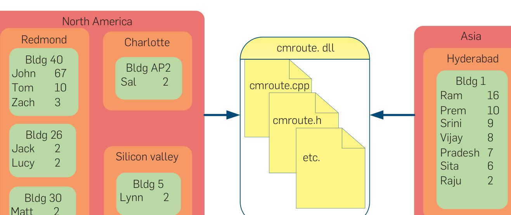
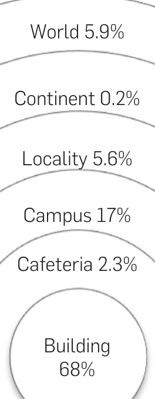

Figure 1: Hierarchy of distribution levels in Windows Vista.

If engineers residing in one region make at least 75% of the commits for a binary, but there is no campus that accounts for 75%, then the binary is categorized at the region level. This threshold was chosen based on results of prior work on development distributed across organizational boundaries that is standardized across Windows.18 Figure 1 illustrates the geographic distribution of commits to an actual binary (with names anonymized). To assess the sensitivity of our results to this selection and address any threats to validity we performed the analysis using thresholds of 60%, 75%, 90%, and 100% with consistently similar results.

Note that whether a binary is distributed or not is orthogonal to the actual location where it was developed. Some binaries that are classified at the building level were developed entirely in a building in Hyderabad, India while others were owned in Redmond, Washington.

Figure 2 illustrates the hierarchy and shows the proportion of binaries that fall into each category. Note that a majority of binaries have over 75% of their commits coming from just one building. The reason that so few binaries fall into the continent level is that the United States is the only country which contains multiple localities. Although the proportion of binaries categorized above the campus level is barely 10%, this still represents a sample of over 380 binaries; enough for a strong level of statistical power.

We initially examined the number of binaries and distribution of failures for each level of our hierarchy. In addition, we divided the binaries into “distributed” and “collocated” categories in five different ways using, each time using a different level shown in Figure 2 (e.g., one split categorizes building and cafeteria level binaries as collocated and the rest as distributed). These categorizations are used to determine if there is a level of distribution above which there is a significant increase in the number of failures. The results from analysis of these dichotomized data sets were consistent in nearly all respects. We therefore present the results of the first data set and point out deviations between the data sets where they occurred.

### 4.2. Experimental analysis

We examined the distribution of the number of post-release failures per binary in both populations. Figure 3 shows histograms of the number of bugs for distributed and collocated binaries. Absolute numbers are omitted from the histograms for confidentiality, but the horizontal and vertical scales are the same for both histograms. A visual inspection indicates that although the mass is different, with more binaries categorized as collocated than distributed, the distribution of failures are very similar.

A Mann–Whitney test was used to quantitatively measure the difference in means because the number of failures was not normally distributed.16 The difference in means is statistically significant, but small. While the average number of failures per binary is higher when the binary was distributed, the actual magnitude of the increase is only about 8%. In a prior study by Herbsleb and Mockus,11 time to resolution of

Figure 2. Commits to the library cmroute.dll. For clarity, location of anonymized developers is shown only in terms of continents, regions, and buildings.

