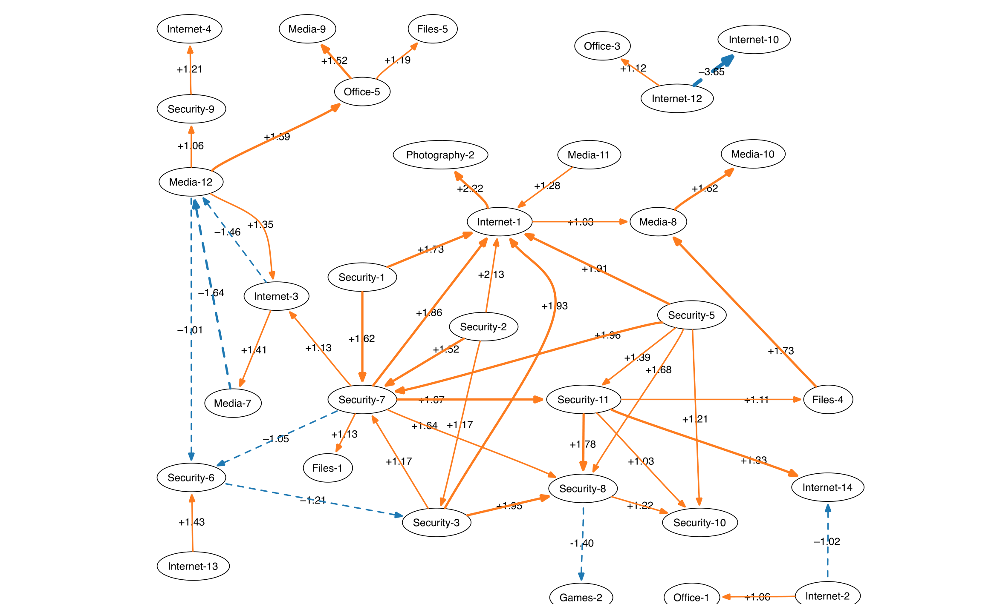

Figure 1. The strongest influence relationships between applications. Solid orange lines indicate that the source application has a positive relationship with reliability of the target application while dashed blue lines indicate a negative relationship. Regression coefficients for the models are also presented.

Changed together with B, A fails to build. Thus B influences A’s build outcome.

| A | B | C | Built Component | Build Outcome |
|---:|---:|---:|---|---|
| 1 | 1 | 0 | A | Fail |
| 1 | 0 | 1 | A | Pass |
| 1 | 1 | 1 | A | Fail |
| 0 | 1 | 1 | C | Pass |
| 1 | 1 | 1 | B | Pass |

### 3.6 Association Rule Mining

In addition to the identification of influence of individual factors (with logistic regression and influence networks), we identified the influence of factor combinations on application reliability. For this purpose, we employed association rule mining [11] to mine association rules of the form X → Y, read as “if X occurs, then Y will occur”, where X is a set of factors (such as an application installed) and X is called the antecedent and Y is the consequent.

For our study, we focus on rules in which X is a non-empty and non-singleton set of features describing either hardware or application installation or application usage and Y describes the application reliability. Further, we only focus on rules that are statistically significant (i.e., support >= 0.1), have high predictability (to protect the privacy of certain aspects of data, we cannot report the exact confidence threshold), and have high interest (i.e., lift >= 1.1). A rule X → Y with high lift suggests that the probability of Y increases (or decreases) by at least 10% when X occurs. To mine application-specific association rules, we consider for each application the application profiles of all machines on which the application was launched. Further, for each application, we mine three sets of rules by considering features describing hardware, application installation, and application usage separately. (We used the Apriori algorithm provided by the R arules library [12] to mine rules.)

## 4. RELIABILITY FACTORS

In this section, we show our results: How do individual features influence the reliability of individual applications? We start with hardware features.

### 4.1 Hardware Features

Our first hypothesis relates hardware features to application reliability:

H1. Less powerful hardware (processor speed, memory size…) is correlated with lower application reliability.

Our findings regarding the influence of hardware features are summarized in Table 1. The table lists for each feature the number of outgoing edges in the influence network with negative and positive polarity, followed by the Strength and Positivity scores for the feature. With regard to hardware factors, the number of processors,