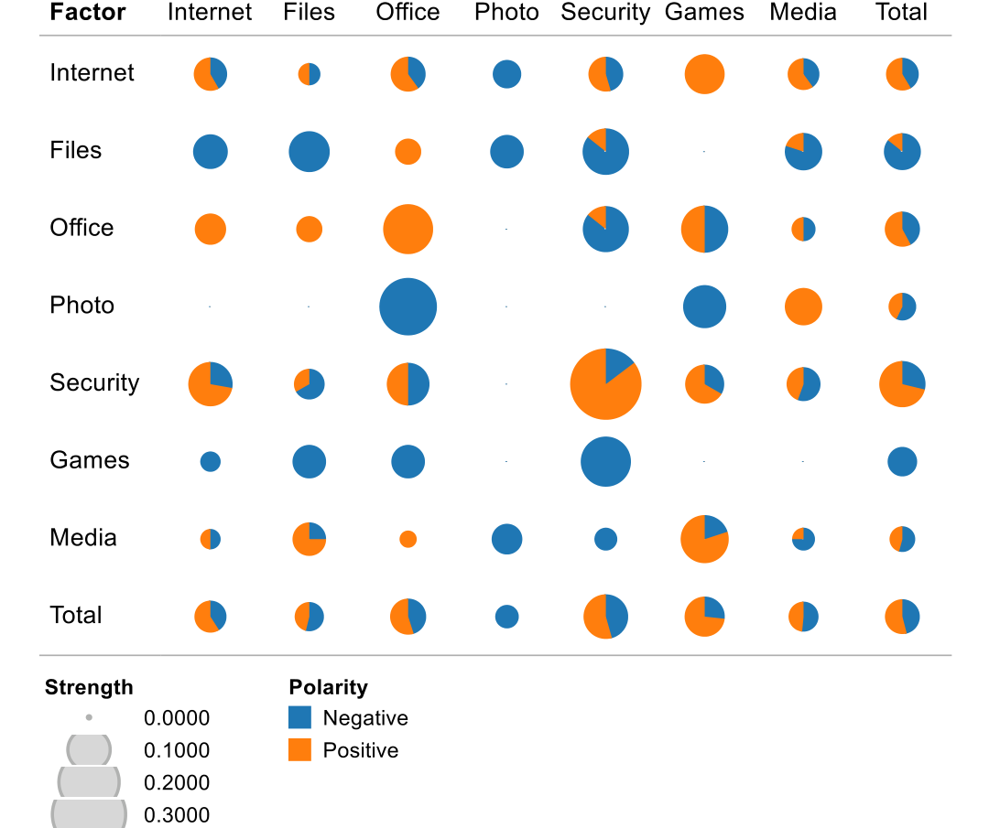

## Table 1. Impact of hardware features on application reliability.

INFLUENCE ON RELIABILITY (53 apps)

| Feature | — | + | Strength | Positivity |
| --- | ---: | ---: | ---: | ---: |
| above median | | | | |
| # processors | 0 | 0 | 0.0% | |
| Processor speed | 0 | 11 | 20.8% | 100.0% |
| # logical drives | 1 | 2 | 5.7% | 66.7% |
| # physical drives | 1 | 0 | 1.9% | 0.0% |
| Drive size | 0 | 0 | 0.0% | |
| Memory size | 0 | 6 | 11.3% | 100.0% |
| Video memory | 0 | 0 | 0.0% | |

drive size, and video memory size had no relationship with application reliability (strength of 0%). While some coefficients were significant, none satisfied our thresholds of +/- 0.40546. However, a higher-than-median processor speed is related to higher reliability of 20.8% of applications and a higher memory size is beneficial for 11.3% of the applications in our sample (both features have positivity of 100%). This confirms H1: A faster processor and more memory implies higher reliability.

A possible explanation can be that executing numerous programs concurrently on less powerful hardware leads to resource contention (for example memory), which in turn could lower application reliability. Unfortunately our data sources do not provide sufficient information to validate this explanation: in particular, we do not have access to third-party code.

### 4.2 Installed Applications

Let us now turn from hardware to software. Our hypothesis is that applications can impact each other’s reliability:

H2. Usage of one application can influence the reliability of another application.

To investigate this hypothesis, we have plotted the strongest positive (plain arrows) and negative (dotted arrows) influences between applications in Figure 1. The figure only shows influences with a coefficient of less than −1 or greater than +1. Note the relationship between Internet-12 and Internet-10 with a coefficient of −3.65; the corresponding odds ratio is 1/38.47 (=e−3.65). This indicates that in the presence of Internet-12, the reliability of the Internet-10 application is dramatically decreased. H2 is confirmed: Usage of applications influences the reliability of others.

### 4.3 Application Categories

Is it that just individual applications influence the reliability of others, or do similar applications share common traits? Our hypothesis is that

H3. There are categories of applications which tend to similarly impact applications (or be impacted by them).

To check this hypothesis, we have summarized our findings in a bubble heat map in Figure 2.

Here, each cell visualizes the strength and positivity of the influence of the category in the row on the category in the column. The size of the pie corresponds to the strength (the maximum strength in our experiments was 0.400 within Security applications). We have color-coded cells to make it easier to identify patterns. Orange colors (light gray in black and white printouts) indicate positive, while blue colors (dark gray) indicate negative influence. The more orange, the higher the positivity. When the strength was zero (and positivity is undefined), the cell is left blank.

Figure 2. Impact of different categories on application reliability. Each row shows how an app category influences the reliability of other app categories. The width of a pie indicates the strength of the influence. The amount of orange (or light gray in black and white printouts) indicates the positivity.

By reading the figure by rows, one can see the influence of an application category on the reliability of other application categories. For instance, the Photo category has negative influence on the reliability of Office and Games applications, but positive influence on the Media category. We also see that some categories (such as Files and Games) universally tend to decrease the reliability of others, supporting H3.

By reading the figure by column, one can see how an application category is influenced by others. We see, for instance, that the category Security is negatively influenced by all non-Security categories. H3 is thus confirmed: Some categories of applications impact others (and are impacted) in a similar way. Let us now discuss some findings in detail.

#### 4.3.1 File-sharing applications

The Files row in Figure 2 tells a striking story: usage of file applications mostly correlated with lower reliability of other applications. Except for Office and Games applications the positivity is below 20%. The total strength for all Files applications is 8.1% and the total positivity is 14.3%. From a technical standpoint, this may come as a surprise: why should the installation of, say, a simple unarchiving program, affect the reliability of other programs?

One possible explanation is quite simple: it is not the file application itself that matters, it is how one uses it: to download content and programs from the Internet, sometimes from dubious sources—and it is these files which on average make other applications unreliable.

> In our study, usage of file and file-sharing programs is mostly correlated with lower application reliability

#### 4.3.2 Office applications

Office applications are slightly correlated with increased reliability. The total strength is 7.3% and the positivity is 57.9%. There is a noticeable drop in positivity to 14.3% for security applications, which we will discuss below.