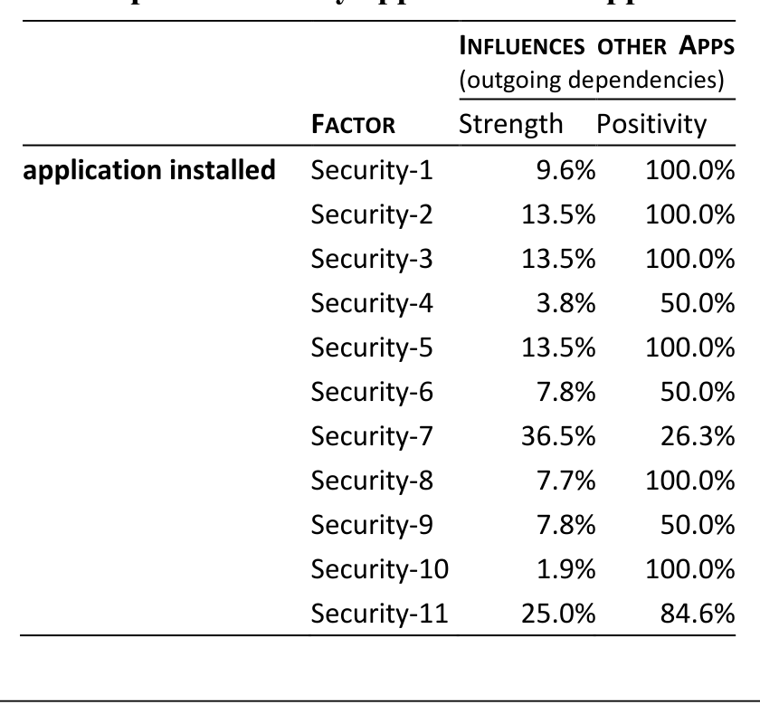

## Table 2. Impact of security applications on app reliability
INFLUENCES OTHER APPS

We found usage of the office applications in our set to be slightly correlated with higher application reliability. As with file-sharing applications, we believe that it is not the applications themselves, but the context in which they are being used that determines reliability. One might suspect that office applications are most often used in relatively well-secure enterprise environments, and these environments contribute to improved application reliability. The office applications in our dataset are day-to-day applications used to view documents and perform minimal editing. Hence, it is indeed possible that office applications improve application reliability.

### 4.3.3 Security applications

Given the discussions on file sharing and office usage, one might assume that security applications generally improve reliability—after all, their purpose is to protect users from negative influences. Unfortunately, the picture is not that clear. Some applications (such as Internet-1) dramatically profit from the presence of any security application (see Figure 2). Also, as Table 2 shows, six of the eleven security applications exclusively increase reliability when they do affect other applications (positivity of 100%). However, not all security applications are beneficial to application reliability: Security-7 is a security application whose presence correlates with almost universally reduced application reliability. It affects 36.5% of applications and for only 26.3% the influence was positive.

The category where security applications increase reliability the most is security applications (strength 30.9%, positivity 85.3%). Seven out of 11 security applications prevent other security applications from failing—an effect also visible in Figure 2. A possible explanation is that they prevent malware that would affect the next application in the command chain.

Security applications also increase the reliability of Internet (strength 11.8%, positivity 72.2%) and Games applications (strength 9.1%, positivity 66.7%). Overall, the total strength is 12.8% and the positivity is 71.2%.

> In our study, security applications mostly increase the reliability of other applications.

Security applications may increase the reliability of other applications but they are negatively affected by almost every other application (see the Security column in Figure 2). With a few exceptions, the presence of other applications decreases reliability of security applications. This could be due to several reasons. Security applications could be too restrictive (e.g. prohibit read access to certain registry keys), and this could cause application failures.

> We found the reliability of security applications to be affected by most non-security applications.

### 4.3.4 Games

Looking at Figure 2, one might assume that makers of security applications must hate gamers: For all three games, installation correlates with increased chances of security applications failing (strength 15.2%, positivity 0%). This also holds for Internet, Files, and Office applications, which becomes significantly less reliable (positivity in all cases 0%). Such effects may be due to specific usage profiles, such as a correlation between gaming and file sharing.

> We found the three games in our set to be related to decreased reliability of other applications.

### 4.4 Usage Frequency

In our investigations thus far, we have not differentiated between whether an application was frequently used or just installed. This distinction makes a difference on how an application impacts others: Does this take place via some interference during installation? Or does mere execution of an application impact others? Our hypothesis is

H4. The more an application is used, the higher its impact on others.

To shed some light into this question, we built two additional regression models:

- Installation only (no further usage). The first model considers applications that were installed, but then hardly ever used. This category contained applications that were executed four times or less—typically, just the installation process, and 2–3 initial trial launches.
- Frequent usage. In the second model, we only looked at applications that were executed five times or more. (Again, the time period considered was the first week after the initial OS launch.)

Figure 3 shows the relationship of “installation-only” applications with reliability. For files, photography and game applications, their installation alone can be related to lower reliability of other applications (see the solid blue/dark gray bubbles, which indicate a positivity of 0%).

For the other categories, the striking feature in Figure 3 is that only installing the applications but not using them has a mostly positive impact on reliability. Why would this be the case? Figure 4 gives a hint, showing the influence of “frequent usage” applications. What we see is a strong negative influence. In other words, installing (but not using) applications has a positive effect simply because of the lack of usage.

We thus concur that H4 is confirmed: The more an application is used, the greater the influence on reliability. However, this influence on reliability is generally negative.

## 5. FEATURE COMBINATIONS

Association rules based solely on hardware factors suggest that application reliability improved when the application was executed on powerful hardware. Further, the number of processors, number of logical drives, number of physical drives, memory size, and drive size occurred more frequently in the mined rules. This suggests that improvement in application reliability depends more on larger storage space and more powerful processing units.