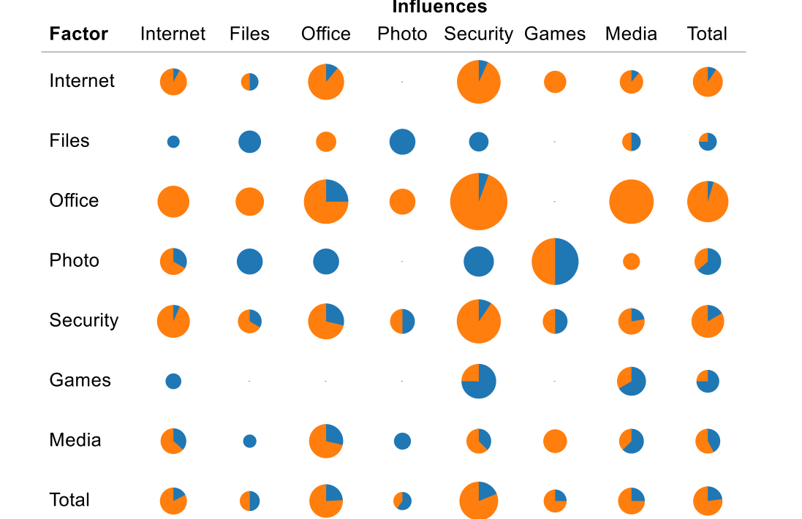
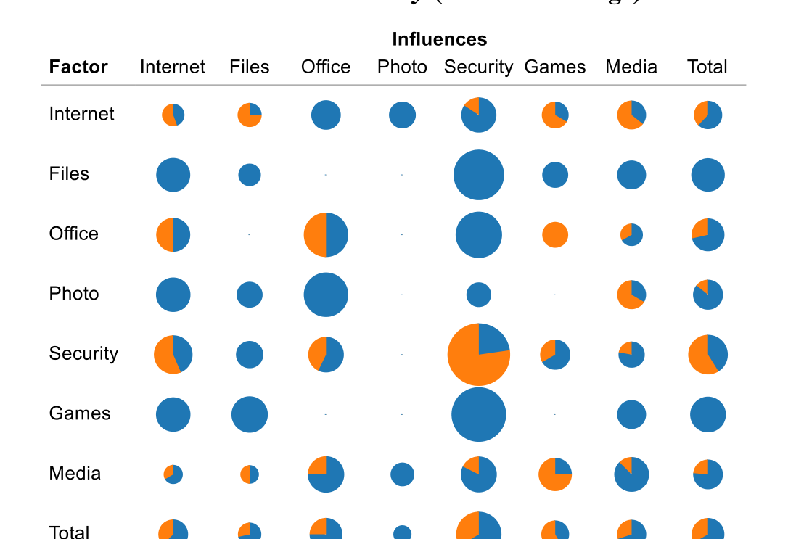

Of the 53 applications, we were able to generate rules for 25 applications based on application installation (I) and application usage (U) features. The set of all association mining rules is too large to present in this paper; we therefore present those rules that have the largest effect or are most interesting.

{I-Internet-6, I-Files-5} → DecreaseReliability-Media-4  
{I-Security-8, I-Internet-9} → IncreaseReliability-Media-4  
{U-Media-1, U-Files-5} → DecreaseReliability-Media-4  
{U-Office-2, U-Security-8} → IncreaseReliability-Media-4

By construction, many feature combinations (i.e., antecedents) identified by association rules contained features (e.g. I-Files-5, U-Security-10) that already show a relationship with application reliability based on results from logistic regression. Besides such trivial feature combinations, association rules also identified feature combinations involving features that individually do not show a correlation with application reliability, e.g. {I-Office-2, I-Security-10} → IncreaseReliability-Files-2.

In addition, association rules identified the overall relationship of feature combinations with application reliability; specifically, when features involved in a combination had opposing relationships with application reliability when considered in isolation (as identified by logistic regression). For example, logistic regression suggested that the reliability of Internet-14 increases with the installation of Office-2 and decreases with the installation of Files-5. However, the rule {I-Office-2, I-Files-5} → DecreaseReliability-Internet-14 suggested that the reliability of Internet-14 decreases when both Office-2 and Files-5 were installed. Further, in the 277 rules with application installation and usage features, features corresponding to 21 applications (out of 53 apps) appeared as part of antecedents.

Collectively, these observations suggest that combinations of features can affect application reliability even when features involved in a combination do not affect application reliability in isolation. In our study, application reliability also depends on combinations of features.

Figure 3. Impact on application reliability for installation only (no further usage)

Figure 4. Impact on application reliability for installation and frequent usage

## 6. DISCUSSION

### 6.1 How can applications affect each other?
The first and foremost question is: Why and how does an individual application affect another application after all? Shouldn’t the operating system protect applications from influencing each other? In principle, yes. However, an operating system should also enable applications to cooperate with each other. Consider sharing resources: If two applications A and B share the same library C, and installing A updates C to fix the latest security issues, such an update may well trigger a bug in B that was previously masked. A similar situation can occur with registry entries that are shared by multiple applications (this is by design in many cases, allowing applications to become aware of each other and interact effectively). On Windows, several applications come with their own drivers and kernel extensions; security applications, as discussed above, hook in deep into the system. A games application taking control of the video hardware may change display resolution or prevent other applications from accessing the display—situations that other applications must be resilient to.

In this study, we did not investigate individual interferences. First of all, we suffer from a lack of more detailed usage profiles: We simply do not know how specific applications are being used, except for launches and failures—and this lack of knowledge is probably a good thing. Likewise, we do not know how applications failed; we have no logs, stack traces, or like diagnostic information, nor can we debug third-party binaries.

In a well-designed and developed application, none of these issues should matter. But as the number of applications on a system grows, so do the possible negative influences.

### 6.2 Implications of this work
What we see in this study is that the reliability of an application can depend on factors that are not under control by application developers. This implies that assessing the reliability of an application in a single, well-defined context may produce an incomplete and inaccurate estimate of its real world reliability. This consequence affects the following fields:

- Testing is the most frequently used method to assess reliability. System testing is normally conducted in well-defined environments, such as an operating system installation out of the box. Our results imply that testing should place a special focus on real machines with different software configurations and usage profiles, in order to identify possible interferences from third-party applications and shared resources such as the Windows registry. Unfortunately, these additional demands on diversity further increase the complexity of system testing.