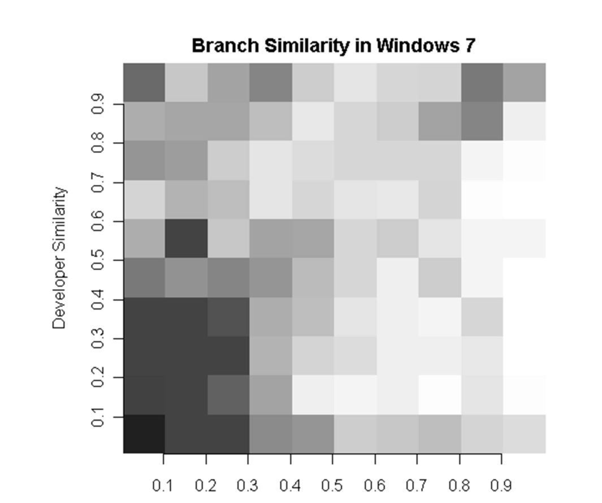
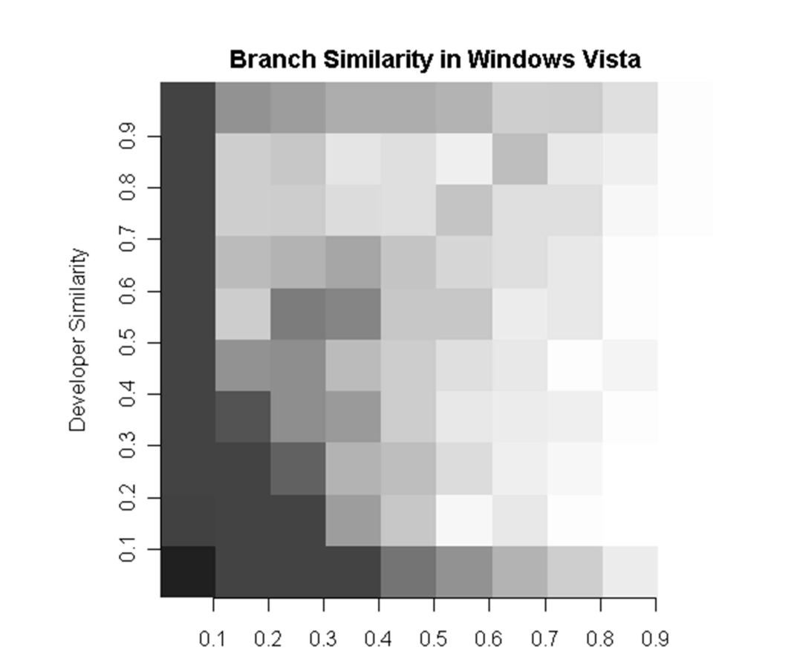

Figure 1. Branch Similarity in Windows 7. Darker cells have more branch pairs with the indicated file and developer similarity. Lighter cells in the bottom right and darker cells on the top and left support our hypothesis.

Between these similarities. Each pair of branches has a team similarity and a goal similarity, and can thus be characterized by one point on a plane. Each cell in the heatmap is shaded according to the number of points that fall within the confines of that cell (essentially, colored according to density). Darker values indicate that many branch-pair similarities fell in that cell.

While a visual depiction is useful for observing goal and team similarity, we also perform a rigorous statistical analysis. It is unclear how to test that an implication is true to a statistically significant degree. A correlation of goal similarity with team similarity can give some sense of the relationship, but may not completely capture it because we do not expect that high team similarity will always lead to high goal similarity; the same team may work on disparate goals. A correlation will only indicate if high values of one are always associated with high values of the other and low values of one are always associated with low values of the other. Concretely, a correlation can validate:

High Team Similarity ⇔ High Goal Similarity

This is in fact not what we are asking. Nonetheless, we use correlation as it provides a lower bound on the strength of the implication relationship. In our case, we use a Spearman rank correlation [11] because both similarity distributions are highly right skewed (most mass is on the left); the majority of branch pairs have very low similarity in both virtual teams and goals.

To augment this analysis, we also define an inequality relationship between team similarity and goal similarity. If high goal similarity generally leads to high team similarity then we would expect the following inequality to hold.

Virtual Team Similarity > Goal Similarity

We then examine what proportion of branch pairs maintains this inequality relationship. We don’t expect that all branch pairs will exhibit this property, but we do expect that the majority will. In order to test this statistically, we use a binomial test [12]. This test treats each pair of branches as an individual Bernoulli trial that is true if the inequality holds and false otherwise. It indicates if the inequality is true the majority of the time to a statistically significant degree.

To control for false discovery, a phenomenon where multiple statistical tests on the same data may result in spurious statistically significant results, we use Benjamini-Hochberg correction of p-values [13].

Figure 2. Branch Similarity in Windows Vista. Most darker cells are in areas where developer similarity is higher than file similarity, indicating that our hypothesis is supported in Windows Vista.

If the inequality is true the majority of the time to a statistically significant degree.

3.2 Findings & Discussion

Figure 1 shows the branch similarity heatmap for the branches used in development for Windows 7. This visualization provides evidence supporting our theory. First, note that the cell with the most similarities has developer similarity and file similarity values both between 0 and 0.1. This is because on average, most branches are not similar to each other in either virtual team or goal space. Of interest are the two portions of the heatmap divided by the diagonal x = y line. The cells below the x = y line (bottom and right) are far less dense than the cells above the x = y line (top and left). This indicates that most of the time, virtual team similarity is at least as high as goal similarity for a pair of branches. If two branches share a similar goal, they tend to have similar virtual teams of developers working on them. This relationship is not, however, converse. There are cells with high density near the top left, which represents many pairs of branches with high virtual team similarity, but not high goal similarity. Just because the virtual teams on two branches are similar does not mean that their goals will (or should) be similar.

While this visual examination appears to support our hypothesis, we also evaluated our hypothesis using statistical inference. For Windows 7, the Spearman rank correlation of team similarity with goal similarity was 0.39 and a test of significance yielded p ≪ 0.01, indicating a statistically significant, but moderate effect. One reason why this correlation may not completely capture the entire story is that there are many pairs of branches that have high team similarity but low goal similarity. This lowers the correlation value, but is in fact in line with our hypothesis that high goal similarity will lead to high team similarity.