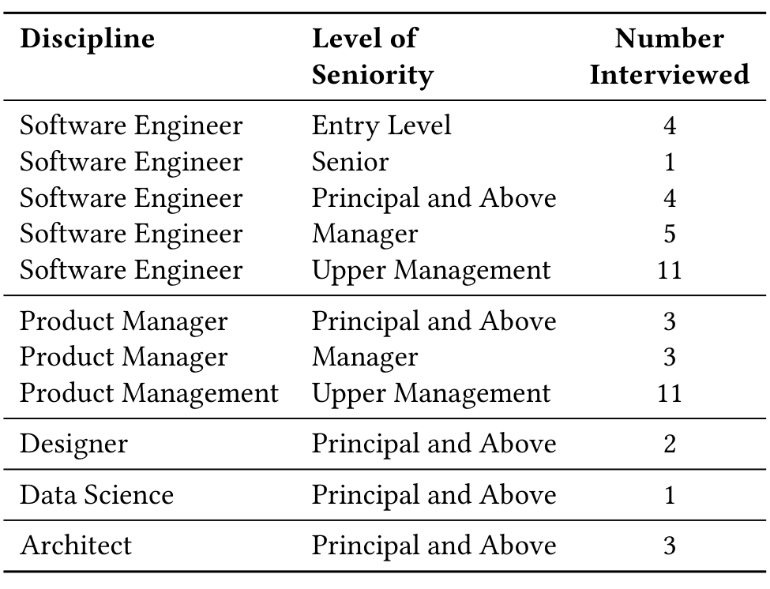

## 3 RESEARCH SETTING

Building software often involves people that are globally distributed, existing legacy software, and teams that came from different places (original teams, acquired teams, newly created teams, etc.) and coordination between many autonomous teams has been found to be challenging [29]. In this large software organization (approximately 4,000 engineers and program managers spread across the world), the Vice President asked the first author to analyze why decisions made at the top level of the organization often took a long time to yield changes in the code and why some cross-group projects were successful and quick, while others face resistance and eventually fail. This led the first author and two research colleagues to do an exploratory study on challenges faced by large software engineering teams in this company. They found that one of the top challenges when building distributed software is goal setting and following through on those goals. This ranges from actually choosing what the goals should be, to measuring the goals, to sharing it out, to working with other teams, to motivating other teams to care about your goals, and to making business and product decisions based on the data coming from measuring those goals. Together these challenges look like those that the objective and key result framework purports to address and, in fact, many teams inside the organization were using this framework. As such, the authors decided to study the use of objectives and key results in large software engineering teams.

Challenges such as these do not only exist in this company. For example, prior research found that in large-scale agile teams goals are often set at management but don't involve teams and team members do not know what the goals are [26]. They also found teams struggle with setting and communicating goals [26]. Prior research by Trinkenreich et al. looked at how to help a company create OKRs, as there is not much concrete help on creating measurable key results for objectives [36]. Indeed, the proper use of objectives and key results is also a widely felt challenge. In fact, Nicole Forsgren (then VP at GitHub, now researcher at Microsoft) stated: “OKRs — and especially challenges implementing them — are a big issue. It’s one of the main things I’m asked about when I meet with top customers.” Indeed, an entire software industry has sprung up to help companies use OKRs more seamlessly, with companies such as WorkBoard, Lattice, ClearPoint and WeekDone all vying for this market. In addition, in 2021 Microsoft purchased OKR software company Ally.io for $76 million dollars [28] and now sells OKR software under the name Viva Goals.

Research Questions. As the organization has been using the OKR framework in some capacity for approximately two years, most teams are familiar with it and have been attempting to use it as their primary approach to setting, tracking, and achieving goals. After creating a measure of OKR maturity, we wanted to understand what behaviors, team practices and cultures were associated with a higher maturity, in order to understand where OKRs would work best and how to improve maturity through a variety of avenues.

RQ1: What behaviors, team practices and work cultures are associated with a good OKR practice?

Management had indicated that there has been mixed success at adoption of the OKR framework across the organization and some

Table 1: Breakdown of interview participants based on role, level and number interviewed.

teams have had difficulty using the process. Thus, another goal was to identify and characterize the challenges that teams have faced as they have attempted to use the OKR framework.

RQ2: What challenges are faced when implementing an OKR system in a large organization?

As some teams have been more successful in adopting the OKR framework, we sought to understand what factors, practices, and tools they employed in an effort to share this knowledge with other teams adopting the framework.

RQ3: What best practices can improve an OKR process?

With this research, we intend to learn best practices and recommendations from software teams who have already attempted to use the framework, drawing on both their successes and failures. The findings from RQ1, RQ2, and RQ3 are discussed in Sections 5, 6, and 7 and provide a set of lessons learned and recommended practices for the use of the OKR framework in large software organizations.

## 4 METHODOLOGY

In this section we will outline our approach for conducting the initial interviews and subsequent survey design, deployment and analysis. The section is structured into three parts: participants, data collection, and data analysis.

### 4.1 Participants

Interviews. The study began with an exploratory set of interviews of leaders and individual contributors both inside the organization and with partner organizations that worked with it. A total of 47 individuals from within and around the organization were chosen for interviews. In order to get good representation, a diverse selection of individuals were chosen with consideration given to the following criteria: global location, level at the company, role in organization and gender. The Table 1 shows a breakdown of interviews by discipline and level or seniority and the number of each interviewed.