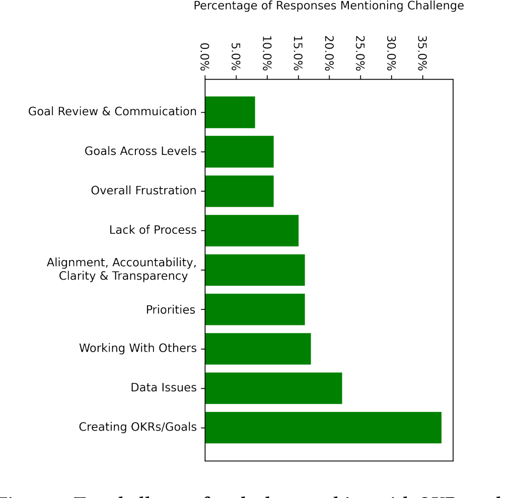

Figure 1: Top challenges faced when working with OKRs and goals as reported by survey participants.

setting OKRs:

- Select measurable goals that would actually correspond to a real business need and won’t promote behavior only to make number nice (ex. contributions would push people to do many very small commits, damaging productivity).
- Arbitrary goal setting based on limited data and knowledge. Prioritization based on the arbitrary goals.
- Knowing what are appropriate and reasonable goals.
- Getting started. It is a big culture shift to go from tracking output to outcomes, and our team has significantly improved in this area in the past year.

As shown in the last verbatim, it seems there is a fair amount of activation energy required to move into an OKR mindset. Historically large software companies may have tracked the work they are doing vs the outcome that work drove. Measuring outcomes (such as new users acquired, sales, etc.) can be much harder than just measuring the work one did.

### 6.2 Data Issues

Some kind of issue with data access or data pipe issues were mentioned by more respondents than any other single challenge. Recent changes in how data can be stored and handled (with things such as the General Data Protection Regulation (GDPR) from the EU, the Executive Order around data in America, etc.) means data access is an issue in all engineering teams. Some examples of issues reported are:

- Getting consistent, trusted data. You need this to both set and track the KRs.
- The many layers of tech required to gather data and build actionable reports. You need to know a lot about a lot of different tech stacks.

> Tracking goals is a bit harder because our data systems are not always set up to be conducive for this — it can be frustrating to figure out how to get data to track a particular goal, and all of the privacy/security hoops that we have to jump through are infuriating. Reporting OKRs isn't too bad, but sometimes the challenges of tracking OKRs can also make the reporting more complicated.

As stated above, data is key to setting and tracking OKRs, but in this large organization getting access to data was a serious pain point. Companies need to comply with a variety of data requirements, but they can still attempt to set up their data pipeline in a way that makes it easier for individual contributors to meaningfully measure progress. Using a smaller set of tools, thinking about the data needed for a feature before feature creation, and adequate training on data access can all help alleviate the challenges of working with data.

### 6.3 Working With Others

One of the superpowers of OKRs is the ability to “Align and Connect for Teamwork”. In theory, when all OKRs are shared broadly and transparently, teams can see dependencies or accidental duplication of work early and correct. In this large organization with many teams, working with others continues to be a challenge. This team builds a large piece of software that has existed for many years, with some teams being new, some old, and some acquired, making for many different ways of working. Ideally aligning on a single OKR process and tool will help these teams work together, but at the time of the study working across teams still proved difficult. Some specific challenges people reported are below:

- It is difficult to get alignment at my manager and skip manager’s level on what are the actual outcomes we are trying to drive. This makes it more difficult to work on cross-team projects where the defined OKRs are slightly different and each team has tunnel vision about their specifically defined metrics.
- Working with partner teams that have old-school processes that involve a lot of paperwork (they want formal specs, lengthy OKR definitions, reviews and scorecards every week, etc.). There is SO much overhead with even just engaging at the surface-level with those teams that it completely deflates the morale of everyone on our team with wanting to engage with them (but of course we keep on doing it because it’s what’s best for the product).
- Cross-functional efforts are difficult to quantify and measure especially those which have dependencies on other teams' work. The goal tracking and measuring is broken because of: a) No standard way of tracking it. (We use OneNote, daily/weekly scrum, online tools and eventually Outlook) and b) Because of no standard way of tracking it, it is difficult to align your day-to-day work to a certain goal.

### 6.4 Priorities

The first superpower of OKRs is “Focus and Commit to Priorities” [9]. When the OKR system is used properly, everyone can see each other’s commitments and work, and individual contributors can see their work connect up to top level goals of the organization. In our study of this organization that was early in the process of using OKRs, there were considerable struggles with priorities. Individuals felt like leadership selects a priority and then has the ability to change it at will. Aligning work to leadership priorities, then, becomes a futile exercise. In addition, they found it hard to align on a priority as a team. If individuals publicly state what they