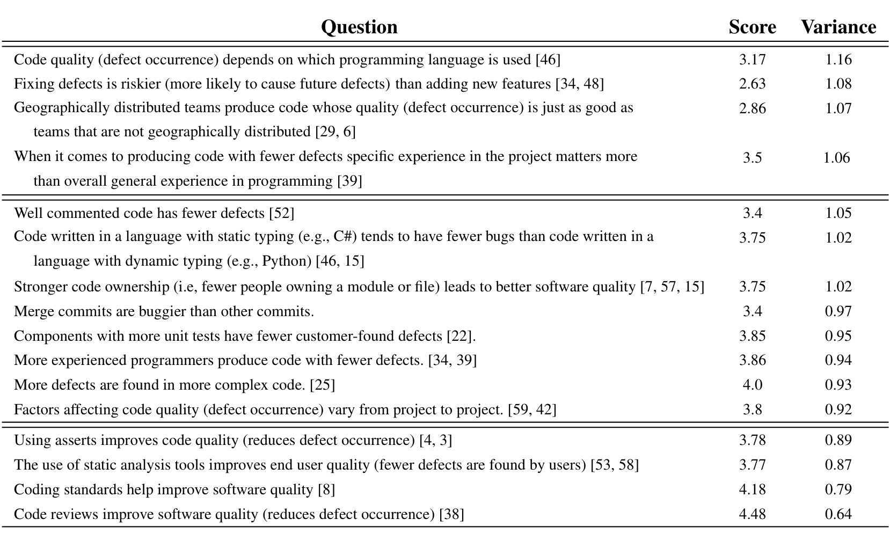

## Belief & Evidence in Empirical Software Engineering

Prem Devanbu*  
Dept of Computer Science  
UC Davis  
Davis, California, 95616, USA  
ptdevanbu@ucdavis.edu

Thomas Zimmermann, Christian Bird  
Microsoft Research  
Redmond, Washington, USA  
{tzimmer, cbird}@microsoft.com

## ABSTRACT

Empirical software engineering has produced a steady stream of evidence-based results concerning the factors that affect important outcomes such as cost, quality, and interval. However, programmers often also have strongly-held a priori opinions about these issues. These opinions are important, since developers are highly-trained professionals whose beliefs would doubtless affect their practice. As in evidence-based medicine, disseminating empirical findings to developers is a key step in ensuring that the findings impact practice. In this paper, we describe a case study on the prior beliefs of developers at Microsoft, and the relationship of these beliefs to actual empirical data on the projects in which these developers work. Our findings are that a) programmers do indeed have very strong beliefs on certain topics, b) their beliefs are primarily formed based on personal experience, rather than on findings in empirical research, and c) beliefs can vary with each project, but do not necessarily correspond with actual evidence in that project. Our findings suggest that more effort should be taken to disseminate empirical findings to developers and that more in-depth study of the interplay of belief and evidence in software practice is needed.

## 1. INTRODUCTION

We all learn from experience; however, what we learn is profoundly influenced by our prior beliefs. If a new experience roundly contradicts strongly-held prior beliefs, we often tend to cling to these beliefs, unwilling to let go until our pet theories are repeatedly and resoundingly refuted. On the other hand, if a new experience is mostly consistent with (but somewhat differentiated from) our prior beliefs, we are more willing to accept it, as long as we don't have to revise our beliefs too much. Sticking to prior beliefs is not always just mindless stubbornness: in fact, it is often sensible. Prior beliefs are either themselves learned from experience, or are innate (in our genes); in either case, it would be imprudent and perhaps dangerous to abandon them too quickly. We all are, therefore, naturally suspicious of new phenomena that contradict our beliefs.

Science (and engineering practice) are all about learning from experience. Not surprisingly, the effects of prior beliefs in science are complex, even paradoxical; however, these effects are vitally important to the continued vibrancy and societal impact of experimental disciplines. On the one hand, when a new experiment reports surprising or unexpected results, we demand that the experiment be very convincing. How the experimental subjects were chosen, we ask. How was the data collected? How was it analyzed? What was the effect size? Questions and debates thicken and intensify for more surprising results; getting the community to accept these results can be a challenge! This resistance to new ideas is a serious issue in medicine, where it is vital that physicians embrace and adopt new practices that are supported by evidence and findings; but they won't do this if they are not convinced. Chaloner et al. [11] have argued, from a Bayesian perspective, that rigorous, demanding experimental design constraints are needed (or even, morally obligated) when the findings might contradict strongly-held prior beliefs and practices, and might actually save lives.

On the other hand, paradoxically, students of the sociology of science have noted that surprising results are disproportionately rewarded by the scientific community. Prestigious journals such as Science and Nature favor surprising results, which are more likely to attract mainstream media attention. The same is arguably true in computer science; surprising results tend to be received more favorably. However, a Bayesian analysis on this [21, 55] yields the rather pessimistic view that surprising results are more often wrong (Section 2.2). This leads to a distressing situation: surprising (and therefore perhaps wrong) results get lots of media attention, and thus are actually more likely to be noticed by politicians, influence policy, etc.

This paper, to our knowledge, is the first to empirically assess developer belief and project evidence in empirical software engineering. The cost, pervasiveness, and socio-economic impact of software are well-known, and provide a durable and formidable imperative for evidence-based improvements in the practice of software engineering [27], just as in medicine. And so, just as in medicine, we argue that taking the prior beliefs of practitioners into account can strengthen the field in several ways: first, we could have a stronger impact on practice, more carefully and systematically disseminating our work; second, by deploying more robust and rigorous experimental techniques when findings may contradict programmers' beliefs (and thus encounter resistance); and, finally, by being influenced by prior beliefs, we can more systematically ameliorate the risk of making false discoveries ourselves (especially in settings where large sample sizes are difficult to obtain).

* Devanbu’s primary appointment is listed; however, his contributions to this paper were made mostly during his visit to the other authors at Microsoft Research.

Permission to make digital or hard copies of all or part of this work for personal or

---

We make the following contributions:

1. We surveyed developers in several large Microsoft projects as to the strength (and disposition) of their beliefs regarding several consequential claims about empirical software engineering. The survey results suggest that developers do hold strong, and diverse opinions, and that some results inspire more passion and dissension than others. We also find that their beliefs don't always correspond with known results in empirical software engineering.

2. Our survey results indicate that developers' beliefs are primarily based on "personal experience" and far less so on research results; this suggests that empirical software engineering researchers need to make more efforts to disseminate our findings.

3. Finally, we investigated the relationship between Microsoft developer beliefs concerning the quality effects of distributed development, and the actual phenomena, as observable from project data. While developers in two different projects expressed differing opinions, we found that the project data consistently indicated very little quality effect of distribution (as did previous findings at Microsoft).

Our work suggests that a) more, and more systematic effort is required to disseminate empirical findings and b) further study on the sources of developer belief, and how it might be changed, are needed.

The rest of the paper is structured as follows: we begin in Section 2 with a review of the Bayesian and Frequentist approaches to evidence and belief, and prior related work in Medicine. We relate this work to software engineering research in Section 3. We then present our approach to surveying developers' beliefs, and the results of these surveys in Section 4; Section 5 presents actual quantitative evidence from two projects relating specifically to the quality effects of distributed software development, and the apparent inconsistency of this evidence with developers' beliefs as found in the surveys. In this study, we did not specifically study how developers incorporate empirical evidence with prior beliefs, and whether this conforms with the Bayesian model; we hope to do so in future research.

## 2. BACKGROUND

The project of adapting belief to evidence is as old as science itself: the goal is to design a repeatable procedure to gather data relevant to a hypothesis under study, and then use this data to shed light on the hypothesis. Certainly, of course, experimenters come with some sort of belief concerning the hypothesis, before they gather any data. Once the data is gathered, however, it must be analyzed to make an inference regarding the hypothesis; at this point, there is a systematic process by which one's prior beliefs are integrated with the data; this is the realm of statistical inference. Two competing statistical inference methods are available: Frequentist and Bayesian.

### 2.1 Two Conflicting Views

Frequentist analysis of experimental data arguably has its roots in the monumental work of R. A. Fisher. The decades-old views of Fisher (and his collaborators Neyman and Pearson), to this day, dominate the statistical analysis of experimental data. Frequentists assert that the probability of correctness of a theory should be indirectly (but exclusively) inferred from the frequency with which the consequents of the theory are observed in experiments, when viewed in light of assumed sampling distributions of the measurements of concern. This view is empirical, and entirely grounded on observation, and data, leaving no room for prior belief. It doesn't matter what you believe, before or after the experiment: the data is the data, and it speaks to the observer via the p-value — as long as the experiment is powerful and well-designed. This way, of ignoring prior belief, and taking a neutral belief stance, is epistemically symmetric: all beliefs are considered equi-probable, viz., as sides of a fair dice — with all possible related hypotheses being considered equally likely before the experiment begins; and after the experiment is done, and the data is gathered, you can calculate the probability (p-value) of the observation, under each (a priori equiprobable) hypothesis, and reject the null hypothesis if it renders the data observation sufficiently improbable.

Bayesians assert that probability and statistics should reflect a state of subjective belief: if I were to say that the probability of an event x is 0.3, I'm essentially stating that I would bet 30 cents on a possible payoff of $1, should the event occur. In the Bayesian world-view, the prior belief regarding the hypothesis must be considered. In an experimental setting, we probe the world, gather data, and interpret the data in the context of our prior belief, and then combine the prior belief with experimental data to yield an updated posterior belief. Bayesians argue that is a more realistic view of people actually react to evidence: we are more doubtful of outlandish claims, and ask for stronger evidence: thus, a report from NASA that an asteroid is sterile is likely to attract less skepticism than a claimed discovery of evidence of intelligent alien life thereon. In other words, given two experimental results with the same p-value, the one that is less dissonant with our preconceptions (viz., less surprising) will convince us more.

The use of the frequentist p-value has recently come under attack, most prominently by Ioannidis et al. [21], with the publication of their alarmingly titled paper "Why most published scientific results are wrong". The paper notes that quite a number of very prominently reported scientific results turn out to be wrong, and are subsequently retracted.

### 2.2 Ascertainment, Publication, and Media Biases

Critiques and alternative perspectives on frequentist p-values are having a strong impact in fields such as medicine; these critiques have not yet made a strong impact in empirical software engineering. We present an overview below.

At the outset, we note that many of the arguments below are applicable in settings where experimental power (viz., the unlikelihood of a false negative finding) is limited by practical considerations, such as cost, effort, or the need for human subjects. Thus, these arguments are applicable more in research settings where controlled experiments are done with human subjects. In the (currently more popular) "big data" settings, which are based on historical data mined from software repositories, the following arguments are less of a concern. These are essentially observational studies where large sample sizes, and available variances in variables of interest, enable sophisticated multiple regression analysis. In these cases, sample sizes in the thousands (or even more; in this paper, we have sample sizes in the hundreds of thousands) afford formidable experimental power (even for effects that are statistically small) and also yield very low p-values (false positive rates). This power allows experimental p-values to take a dominant role, and attenuate the effect of prior beliefs.

However, the following are still applicable in experimental settings in software engineering, where human subjects may be used, and samples are small; and so are presented for completeness.

---

### 2.2.1 The problem with p-values

Wacholder [55] and later, Ioannidis [21] have argued that frequentist p-values are only one component of a rational approach to scientific knowledge. Their critiques have two main thrusts. First is a purely Bayesian argument: if one assumes that the prior probabilities of a hypothesis being true, π, or false, (1 − π) are not equal, and that the hypothesis is actually false, then simple experimental error (false positive rate, or alpha, as well as false negative rate beta) leads to a higher rate of erroneous alternative hypothesis confirmation ("false discovery"), as given by the formula

(1 − π)α / [π(1 − β) + (1 − π)α]  (1)

More concretely, if you give a hypothesis a 25% prior chance of being true (π = 0.25), and even your false negative rate is vanishingly small, then with a p-value of 0.05, there is an almost 13% risk of false discovery. This can be viewed as a Bayesian account of the popular adage "extraordinary claims require extra-ordinary evidence"; the more extra-ordinary the claim, the lower the prior belief, i.e., the lower the value of π.

The second argument is that the inherent variation in p-values due to sampling error has an unfortunate interaction with the career incentives of scientists. Because of the desire to publish, there is often a tendency to meander towards a favorable conclusion, and stop there; thus, e.g., one might (often unconsciously) tend to redesign the experiment a few times when it appears that conclusions are not what is expected, and stop the redesign when the conclusion (i.e., the p-value) is in the expected range for a significant finding in the desired direction. Another complication, as pointed out in Ioannidis [20], ethical imperatives that govern medical research, might require the studies be halted when the treatment appears effective, and the treatment be provided to all, including the control group. Unfortunately, first-principle sampling probabilities indicate that the initial effect in the sample being observed in such early-stop studies could by chance tend to be higher than the effect in the general population; and thus the effect sizes observed upon replication would tend to be smaller.

The third and final point here is that the media focus on surprising results often emphasizes findings that might be false discoveries. Findings are "surprising" precisely when the prior subjective belief in them is low (viz., π is small). A purely Bayesian analysis would lead one conclude that the risk of false discovery is high in this setting; combining this with the career incentives mentioned above, leads to an unfortunate mix of incentives and false discovery risk. Worst of all, media coverage leads to greater public awareness and political influence!

As mentioned earlier, this issue is more of a concern for cases where experimental power and sample sizes are limited; so researchers doing human-subjects studies, for example, should carefully consider the admonishments of Ioannidis and Wacholder.

### 2.2.2 Bayesian Experimental Design

A more constructive ("Positivist") Bayesian analysis of prior beliefs can be found in the work of Chaloner et al. Chaloner [11] and her colleagues argue that practitioner belief matters. Even if an experiment has a true and therapeutically important finding, unless medical practitioners buy into it, they won’t change their practice, and the work will have no pragmatic effect. Thus, an experimental design (concerning a health outcome of great public value) that ignores practitioners’ prior belief could be criticized as being unethical (even if it has adequate experimental power, large effect size, and low p-values) if it fails to gather evidence to overcome practitioners’ prior beliefs (if these are known a-priori).

In Bayesian experimental design, one decides ahead of time a desired level of utility to be gained from an experiment; typically this is the information gain with respect to the subjective distribution of an outcome of interest (say duration over which a patient remains symptom-free after treatment). This gain corresponds to the net reduction of uncertainty (increased knowledge) as a result of the experiment. Next, the prior belief of practitioners is gathered and aggregated (usually using a survey methodology). Based on the information gain goals, and the prior beliefs, an optimization process chooses experimental parameters (sample sizes, treatment (dosage) levels, etc.). If the practitioners are skeptical, their prior belief is generally clustered around the belief that the treatment is ineffective; then a high information gain (viz., high experimental power, large effect sizes, and low p-values) are required to overcome their skepticism.

Thus when designing human-studies experiments in software engineering on topics that inspire a great deal of passion among developers, such as the role of programming languages in software quality (see below), it would be quite sensible to design experiments with large sample sizes and high power, so as to provide evidence that would "move the needle" on practitioner belief.

## 2.3 From Evidence to Belief

For society to reap maximum benefit, scientific evidence must translate into practitioner belief. This imperative to transmit research findings to practitioners has long been recognized in Medicine. However, busy practitioners have trouble keeping up with research. A great deal of effort [12] has been made to digest and disseminate findings to practitioners in a brief, digestible form. Online, curated, indexed, catalogued collections of scientific results, such as the Cochrane Collaboration[1] or the American College of Physicians[2] provide practitioners a convenient, reliable, up-to-date, and centralized means to access research findings on relevant topics.

Kitchenham et al. have been strong advocates of similar efforts in software engineering: practitioners should be made more aware of the latest empirical findings! Their pioneering paper [27] was published in 2004. Since then, and rather unexpectedly, empirical work in SE has accelerated, gaining momentum from the flood of data in open-source repositories. Hundreds of papers on empirical findings have been published, in flagship conferences like ICSE, FSE, ASE, PLDI, POPL, OOPSLA, etc., as well as in more specialized conferences on repository mining, empirical work, software maintenance and re-engineering, and others. A broad set of aspects of software product and process has come under study. Secondarily, as advocated by evidence-based practice pioneers [24, 26], systematic literature reviews are starting to be published.

What has been the impact of all this activity? Have empirical findings translated into practitioner belief?

The enduring influence of Kitchenham et al., and the tremendous rate of research results coming forth in empirical software engineering, makes this an opportune moment to study, in the trenches, as it were, what developers actually believe, and how this relates to the actual evidence. This is the central goal of this paper.

> What do programmers believe, and how do these beliefs relate to the actual empirical evidence?

## 3. A RESEARCH PROGRAM

1 http://www.cochrane.org  
2 http://www.acponline.org

---

> **Image description:** A table of survey statements about software engineering shows each item's mean agreement score (1=Strongly Disagree to 5=Strongly Agree) and variance, with rows ordered by decreasing variance (most controversial at the top). The most controversial items include: “Code quality depends on programming language” (score 3.17, variance 1.16), “Fixing defects is riskier than adding features” (2.63, 1.08), “Geographically distributed teams produce code as good as collocated teams” (2.86, 1.07), and “Specific project experience matters more than general experience” (3.50, 1.06). The least controversial / most agreed items (low variance, high score) are: “Code reviews improve software quality” (4.48, 0.64), “Coding standards help improve quality” (4.18, 0.79), and positive beliefs about asserts and static analysis (asserts 3.78, 0.89; static analysis 3.77, 0.87). This supports the paper’s claim that developers strongly endorse some practices (low variance, high score) while holding divided opinions on topics like language effects and the risk of bug fixes (higher variance and mid-range scores).

Table 1: The four most controversial, viz., inciting the most disparity in agreement (top above the first double line) and least controversial (below the 2nd double line) statements in our survey. The Score is numerical (1–Strongly Disagree to 5–Strongly Agree). An answer score of 3 indicates neutrality. The Variance is a measure of disagreement between respondents. The citations indicate relevant work; due to space reasons, we preferred to cite only the most closely related works. The item on merge commits was added opportunistically, to help future research.

Like Medicine, software engineering is highly consequential to personal health and safety, social well-being, and the economy. As in Medicine, outcomes of interest (e.g., cost, quality, and interval) arise from the interaction of technical factors (programming languages, architectures, designs, software tools) with human and social factors. Thus outcomes arising from any given factor (e.g., sound static typing) may be quite different in practice than in theory, and must be evaluated empirically, using controlled or natural experiments. Researchers in ESE now produce a steady stream of evidence-based findings regarding the factors affecting cost, quality, and interval in software development. However, like medicine, SE is knowledge-intensive; software developers are skilled, trained practitioners who can be expected to practice their craft based on a set of beliefs gleaned, thoughtfully, not only from their training, but also from their own work experience.

Prima facie, there are good reasons to believe that many of the arguments quoted above (which arise in the Biological sciences and Medicine) apply equally well to software. Articles in trade magazines, and in the blogosphere, suggest that developers do often hold passionate opinions on such matters as static vs. dynamic typing, compiled vs. scripting languages, etc. These opinions may be based on actual experience, or may be held for ideological reasons (or self-interest), even in the face of evidence to the contrary. Regardless of the origins of prior beliefs, there is good reason to believe that the way these practitioners respond to new evidence will be influenced by their prior beliefs.

Given that developers are highly-trained, quantitatively oriented professionals, one can expect them to have strong opinions that are both informed by, and inform, their practice. The above discussion suggests a wide range of questions: What opinions do programmers hold? How do they come by this evidence? Do beliefs vary? Do they change? Why? Do beliefs and evidence contradict? Or reinforce? How are we to combine the two in formulating research results? If developers’ beliefs are dissonant with evidence, why is that? How can we change developers’ beliefs? There may be many such questions; we believe that the answers to these questions will play a vital role in ensuring that findings from empirical software engineering actually have an impact in the practice of software engineering.

Note that this argument applies equally well to beliefs and findings that relate to artifacts and artifact performance (language features, static analysis tools, verification algorithms, etc.) as well as beliefs and findings that relate to process aspects (distributed development, agile methods, team organization, etc.). The nature and trajectory of the interactions between belief and evidence in software engineering practice is a complex, important, and impactful phenomenon, worthy of sustained study.

Prior work in this area of beliefs and evidence has been primarily qualitative in nature. Rainer et al.’s focus group studies find that when programmers form views about software process improvement, they “favour local opinion over independent empirical evidence” [43]. Passos [37], using a qualitative interview-based approach, shows that organizational and project contexts influence belief formation. Dybå et al.’s practice prescriptions for evidence-based software engineering require (see Step 4, [13]) that the presentation and incorporation of evidence is always contextualized within prior belief and experience. Jørgensen et al. [23], in a study of effort estimation practice, found that managers’ prior beliefs influenced how they interpreted neutral (randomly-generated) data; they also found, more disturbingly, evidence suggesting that findings in research papers could also have been affected by prior biases. Our work here is complementary to the above research; we show, quantitatively, that practitioner beliefs can be inconsistent with project evidence, which suggests the need for careful reconciliation.

---

## 4. RESEARCH QUESTION AND METHODOLOGY

The central question in our initial foray (into the project described above) is recapitulated below:

> What do programmers believe, and how do these beliefs relate to the actual empirical evidence?

Our initial focus was to address these questions in the specific context of one large industrial organization (Microsoft) and gather data on both programmers' beliefs, and, secondly, to perform a detailed case study to judge the relationship of these beliefs to actual evidence in some specific projects.

### Survey Design

The core of the survey started with a series of empirically falsifiable claims, mostly drawn from software engineering research. We chose a number of claims for inclusion in our survey, based on the following set of criteria:

- The consequences of the claim being true or false are "actionable", viz., consequential for software practice.
- We believed that our target population (Microsoft developers) would have opinions on these claims.
- We believed that this population would have had experience with the tools or processes in question, and would have been able to form not just an opinion, but an informed one.
- We believed that regardless of expressed opinion, we would be able to gather evidence strongly relevant to the claims.

Opportunistically, we also added a few claims that we found interesting, but about which, as of yet, we weren't aware of well-established results. We added these as possible avenues of future study, to take advantage of this survey instance to gather some more useful data on developer beliefs. The full list of claims is in Table 1.

For each of these claims, we asked developers to respond on a 5-point Likert scale (Strongly Disagree, Disagree, Neutral, Agree, Strongly Agree). Finally, in all cases, we scripted the survey to choose questions on which developers expressed more polarized opinions, and asked them to explain the origins of their view (more details below, Section 4.1, under "Opinion Formation"). In addition, they were also asked to provide a rationale, in the form of "reasons for your answer". This rationale was used as a way for us to understand the answers.

In addition we collected demographic evidence, similar to Lo et al [31]. The following information was gathered:

- Demographics: Age, gender, years at Microsoft, years as a developer, highest level of schooling.
- Employment: Primary division, years at current job, job title, whether they are managing anyone.
- Geographic: Primary work location.

### Target Audience

Our target audience were people primarily in a software engineering discipline at Microsoft: this included developers, testers, program managers, and their immediate supervisors. These people, we felt, would have the opportunity to form informed opinions about the claims that were offered to them. We identified about 2500 professionals, from various locations around the world, in various projects, and sent an email with a link to the survey and solicited a response.

No identifying information was required or gathered from respondents; they could, separately, and without connection to their answers, volunteer to offer themselves for a follow-up interview. Distinct from the survey, they could also enter their email addresses to be entered into a raffle to win a gift card.

### 4.1 Survey Results

We now present our main findings from the survey.

Overall impressions
We received a total of 564 responses, a response rate around 22%. Survey respondents varied in age, gender, location, etc. The mean age was 32.5 (σ = 8). The respondents skewed male (497 male, 53 female, 7 other, and 7 didn't state). They were largely college educated. Of those that stated, 267 had Bachelor's degrees, 211 had Master's, and 29 had a PhD; the rest didn't respond. Respondents are from all locations of Microsoft; of the ones who stated location, the largest cohort was from the US (386); the rest were from India (48), China (39), Europe (66), and other locations (25). While these demographics suggest capture of a broad cross-section of the overall population of developers, it should be noted that all respondents to one degree or another are influenced by the business context of Microsoft, and to a large extent, the (dominantly male) North American software engineering culture.

We scored the Likert scale from 1 for "Strongly Disagree" to 5 for "Strongly Agree". In Table 1 we present the average score and standard deviation for all the claims in our survey. The higher the average, the more the agreement with the claim; the higher the variance, the more the disagreement within respondents as to the claim. We have listed the claims in Table 1 in decreasing order of variance; thus, we interpret the ordering as going from most controversial claim to least controversial.

Overall, the claim that people disagreed with most (2.63) concerned the riskiness of fixing defects (as compared with new features) and the claim that most people agreed with concerned the benefits of code reviews (4.48).

#### 4.1.1 Controversial Claims

We turn now to the claims that incited the most disparity in the answers; we take these to be controversial claims. The most controversial claim of all relates to the effect of programming language choice on code quality. Most of the developers who disagreed with this statement focused on the notion that programmer's skill matters more than the language (e.g., "Every trade has its master. It depends on who writes the code"). Some focused on application logic (not programming language) as the main determinant of quality ("Most defects stem from the application logic rather than particular platform/tools"). Developers who agreed with this claim focused on language features, such as static typing or memory management (e.g., "Because statically typed languages make mistakes more difficult", "Managed code is designed to be less prone to defects"). Interestingly, as it turns out, this is a topic on which there is limited literature, with results just recently starting to emerge [46]; this certainly has long been a controversial topic, and one mightn't expect developer opinion on this much-debated topic to be moved towards consensus by just one publication.

Moving through the most-controversial list, the next claim relates to defect repair commits being riskier than new feature additions. Developers who disagree felt that bug fixes involve small-scope changes, which are less risky (e.g., "defects are generally small and localized; features are broader"); other felt that all types

---

of changes are risky. People in agreement felt that defect repair entails greater risk of regression failure and code decay. Previous work [34,48] provides pretty strong evidence that defect repair changes are quite risky, but this turns out to be the claim that attracts the most disagreement from our survey respondents (lowest average agreement score, 2.63).

The next opinion relates to the effects of geographical distribution on software quality. Respondents who disagreed (with the proposition that geographically distributed development doesn't affect software quality) focused heavily on communication issues with distant team members (e.g., “Lack of easy communication is the reason. Time zone differences are a big hindrance for easy communication.”) and the absence of face-to-face communication, the inability to meet in the hallways, talk over a whiteboard, etc. People who agreed thought that electronic collaboration tools (email, shared repositories, distributed review tools) made distributed development workable (e.g., “we can communicate by code review and online meeting”).

Interestingly, two studies, both done at Microsoft, on different projects examined this very issue: one found that distributed development had no effect on software quality, and the other found a very small, barely discernible effect. We examine this specific issue in much greater depth below (Section 6).

The next claim states: specific experience matters. Developers who disagreed stated several reasons: first, they believed that skill, once developed, was portable: “Excellent engineering and coding practices are a skill that transfers between projects.” Developers who agreed tended to focus on the importance of domain experience: “The domain experience helps alleviate common pattern of issues. General experience in programming allows us to have strong grasp on design patterns. However how that pattern translates to the problem at hand is a function of the specific project experience.” There is strong evidence that specific experience matters more than general experience [39], and also that minor contributors, with little specific experience, are strongly implicated in errors [7].

Overall, in the survey results, considering the most controversial questions, rather unexpectedly, we find some supported by strong, consistent empirical evidence3. These are also questions which most would consider highly consequential and actionable; indeed these are precisely the sorts of questions where one might most wish to find consistency between research findings and practitioner belief, and also between practitioners.

### 4.1.2 Un-controversial Claims

We now turn to questions which incited the least disparity in responder agreement. We note that the least controversial claim, the one that most people agreed with (4.48, variance of 0.64), was that code reviews improve software quality. It is interesting that this is perhaps one of the most well-supported findings in empirical software engineering, with numerous studies confirming their benefits, going back to Fagan’s work at IBM in the 1970s. It is heartening to note that these established findings from our field have taken hold in developers’ belief systems, at least in this case.

The situation is more complex on the other beliefs. Thus, programmers are strongly congruent on the belief (4.18, variance of 0.78) that coding standards help improve software quality. The rationale comments from the programmers who answered this question clearly indicate that developers who agreed with this claim believed that coding standards reduced defect occurrence. However, actual empirical evidence on this is quite limited; we could find only one published result, which examined a coding standard in the context of one industrial case study, which found scant evidence that the coding standard was beneficial. Comments from programmers, however, clearly indicate that they believe coding standards make code easier to maintain (e.g., “Coding standards can help to make the code written by different developers easier to read and maintain” and “If everyone in the team follows coding standards, it will be very easy to review others’ code and requires less time.”). This relates coding standards to readability of code; recent results on natural coding conventions [2] and coding reviews in pull requests [17] show that predictable, regular coding styles are preferred. This finding suggests that more research in this area would be well warranted.

Our survey respondents also widely believed that static analysis tools improve software quality. This is another area where the results in the literature are not as consistent nor as strong as developer belief: Zheng et al. report that static analysis tools are only about a third as effective as testing, and no cheaper than inspections; however they are helpful, especially in identifying certain kinds of coding errors, relating to error-checking or assignments; while Rahman et al. [41] report that while static bug finders are helpful, they are not much better than statistical defect prediction, which only depends on process measures; and Wagner et al. [56] report that static bug finders can find different errors, but suffer from very high false positive rates. The developers’ overall strong belief in static analysis tools, however, suggests that more study of their benefits would be valuable.

Developers also believe that asserts are beneficial. In their rationale, they offer two distinct benefits: the documentary function (e.g., “Well placed asserts make people aware of the assumptions they make when coding.”), where asserts help understand code, and the more common diagnostic function (e.g., “Using asserts usually helps to detect errors at the earliest point.”), where asserts can help quickly detect violations of coding assumptions, or interface pre-conditions. This is also an area where there is not a lot of research into understanding what the precise role of the two functions (documentary and diagnostic) of asserts is, and the relative benefits of each.

Finally, we note another claim “more defects are found in more complex code” which has a high level of average agreement (4.0) with some controversy (0.93). Developers repeatedly observe (in the rationale) that complex code is more difficult to maintain (“harder to understand, debug and test”, “Complex code is harder to reason”, “It hidden (hides) the purpose of the code, and confuse reviewers or maintainers”). These beliefs suggest that metrics that can identify complex code could be useful in predicting defects. Thus far, attempts to define complexity metrics have been stymied by the fact that they are all strongly correlated with size [14]: so complexity metrics simply end up predicting that bigger files contain more bugs. Indeed, recent work casts doubt on usefulness of any kind of product metric (property of source code) to usefully predict defects [40]. However, programmers’ strong belief that complex code is buggy code suggests that further study, perhaps to develop metrics that better isolate complexity, somehow de-correlated from size, would be a helpful way to predict defective code.

### 4.1.3 Opinion Formation

Our survey did solicit (as described earlier) developers’ statements on how they formed their opinion. In this section, we present those results.

3 While the geographic distribution question has had some contradictory results, the results within Microsoft data are largely consistently supporting the claim that geographic distribution doesn’t affect software quality.

---

> **Image description:** Boxplots of importance rankings (y-axis 0–5, higher = more influential) for seven sources of opinion show that "Personal Experience" has a very high median (at 5) and a tight interquartile range, indicating it was almost always ranked top. "Peer Opinion" and "Mentor/Manager" have medians around 4 with moderate spread, "Trade Journal" centers near 3, while "Research Paper" and "Other" have the lowest medians (around 1–0) and wider variability with many low or zero ranks. The paper reports the raw selection counts behind these patterns (Personal Experience chosen 1,033 times; Peers 674; Mentors/Managers 499; Research Papers 257; Other 148), supporting the interpretation that developers rely primarily on personal experience and close social sources, and place little weight on research papers.

Figure 1: Factors stated as most influential on forming opinions of survey respondents.

For the two beliefs on which each developer expressed the strongest opinions (either agreeing or disagreeing) we asked them to rank possible factors in his/her opinion formation. Thus if the developer said they "Strongly Disagreed" with the claim that programming language choice affects defect occurrence, they would be presented with this answer, and asked:

> What factors played a role in your previous answer?  
> Please choose the relevant factors from the list below, and rank them

They were given a choice of "Personal experience", "What I hear from my peers", "What I hear from my mentors/managers", "Articles in industry magazines", "Research papers", and "Other". We then gathered the ranks given for each of the above factors. Thus, we had for each of the answers (agreement/disagreement with the claims), and each of the possible factors, a collection of ranks. If a particular factor is ranked more frequently, more highly, we would get a higher range of values for that factor. Thus for each factor, we gathered a collection of ranks assigned to that factor. For clarity (so that higher ranks appear higher in the plot, we inverted the rank, so on the plot higher values correspond to higher ranks). The results are in Figure 1.

The highest ranked factor influencing respondents’ opinions on the given claims is Personal experience, which was chosen for ranking 1,033 times. A look at the box plot in Figure 1 shows that it was almost always ranked at the top, and a handful of times at other positions. Next was What I hear from my peers, which was chosen for ranking 674 times, with a median second rank. Next was What I hear from my mentors/managers, chosen 499 times for ranking, and with a median third rank. The lowest ranked was Other, chosen 148 times. Just above that, in fifth position, was Research papers, chosen 257 times for ranking. We take a couple of conclusions from this.

First, the factors affecting opinion are consistent with earlier work in social science—the strength of influence on opinion formation decays with strength of social connection—things we hear from people closer to us matter more than others.4

Brown & Reingen [9], for example, found that stronger social ties are more influential in opinion formation than weaker ones. This provides a reasonable framework to understand why developers give strongest weight to personal experience, and then to peers, and then to managers. Furthermore, developers appear to be influenced by trade journals rather than research papers; this may also be because they view trade journals as closer to their situation than research papers; this requires further study.

Secondly, while this type of opinion formation might be acceptable in ordinary society, this is hardly an ideal way for professionals to form opinions. Personal experience is highly isolated, and doesn’t provide a broad sample of experience. A particular developer’s experience may be based on recollections of his or her own work experience, with his/her code, team, project etc., and have little to do with overall, large-scale trends. Furthermore, what we remember can also be highly influenced by salience rather than frequency. We tend to remember emotionally-laden experiences [10] and don’t necessarily recall more mundane occurrences quite so well. Thus one developer might vividly recall having a very difficult time repairing another person’s low-quality bug fixes, at one time, and then conclude all defect-repairs are risky; she might not recall, or even notice, that most bug-fixes were entirely adequate, and never cause any trouble. She might then strongly argue this view, repeatedly, that repairing bugs is risky; however, if a statistical analysis were done, at large scale, in her project, of the entire population of bug fixes, there might be a very different conclusion to be drawn.

In Medicine, the need to have therapeutic practice based on evidence is well-recognized, and there is a concerted, well-funded, systematic effort to disseminate scientific evidence from research findings to physicians. Indeed, most modern physicians, if asked, would profess to be strongly evidence- and research-based in their practice.

Consider how you would react if your physician said that his or her medical decisions are most strongly based on "personal experience" and much less so on "research"? The current state of evidence-based practice in Medicine offers an inspiring model for a more organized and effective dissemination of research results in Software Engineering.

## 5. EVIDENCE

Of the top 3 most controversial statements, we chose one of them, “Geographically distributed teams produce code whose quality, viz., defect occurrence, is just as good as teams that are not geographically distributed” to examine in more detail: we decided to compare the beliefs of programmers, with evidence from actual project data drawn from two large projects, which we denote as Pr-A and Pr-B. They are both quite large: Pr-A is an operating system, and consists of about 400,000 files, with over 150M SLOC and Pr-B is a web service, and consists of about 430,000 files, with about 85 Million SLOC. Our choice to delve into this particular question, with these two particular projects, was based on a curious phenomenon: statistical analysis revealed Pr-A members tended to be ones who largely disagreed with the above statement, while Pr-B members tended to largely agree with the statement (p < 0.001, using Pearson’s Chi-squared test). This difference in belief is particularly striking, given that projects practice widely distributed development: both Pr-A and Pr-B have around 8,000 developers located in over 100 different buildings, in dozens of cities in about a dozen different countries around the world. In both projects, a non-trivial number of files received commit activity from multiple buildings, cities, regions, and countries (see Table

4 In case they expressed strong (or equally strong) opinions on more than 2 claims, we chose 2 at random.

---

> **Image description:** This table reports, for two large Microsoft projects (Pr-A and Pr-B), the percentage of files for which at least 75% of commits originate from a single building, city, region, or nation. Pr-A: 56% (same building), 90% (same city), 91% (same region), 92% (same nation). Pr-B: 76% (same building), 80% (same city), 83% (same region), 85% (same nation). Interpreting these numbers, Pr-A has lower single-building concentration but is more localized at the city/region/nation levels (suggesting many buildings within the same city/region), whereas Pr-B has higher same-building concentration and comparatively more cross-city/region/nation activity (i.e., greater geographic dispersion across larger scales).

Table 2: Proportion of files in projects with majority (75%) commits from one building, one city, one region, and one nation. Clearly, while Pr-A “lives” in more buildings, Pr-B has substantively more activity outside of a single city, region, and country.

2).

Thus, developers in both countries could be expected to have personal experience with distributed development, and thus would have had the opportunity to form their beliefs based on their experiences. The statistically significant differences that emerge in the survey, therefore, could be presumed to be based on intrinsic, observable differences in the two projects.

Perhaps Pr-A had encountered more quality difficulties in distributed development, and Pr-B had none. Findings on this topic, while by no means uniform [29, 6, 18, 45, 44], tend to lean on the side of agreement with the statement above, particularly with respect to teams at Microsoft [29, 6]. To examine these issues in more detail, we gathered data on development histories (who changed what file, how much, and when), defect repair (commits that marked as defective in the logs, using techniques popularized by Mockus et al [33], and Sliwerski et al [50]), as well as developer locations at the time changes were made (using internal Microsoft databases). Using this gathered data, we used known techniques for studying the effects of geographical distribution, based on measures used in earlier work [29, 6].

Our data was gathered on a per-file basis; Pr-A and Pr-B both had around 400,000 files, and the data comprised millions of changes, performed starting in 2012. We gathered several metrics on these files, described below. Since the goal of this study to gather quantitative, project-specific evidence on software quality, the main phenomenon we were interested reflected the number of bug-fix commits. This, then, is our primary response variable:

**nfix** Number of defect repairs associated to the file. This data was gathered using project-specific conventions on identifying defect repair changes. One project used the convention that all bug-fix logs began with "BUG: ...". The other project had a range of conventions for bug-fix logs. These conventions were known to the authors from prior investigations, and informants in the respective development communities.

Next, since our goal is to attempt to isolate and measure the effect of geographic distribution, it is important to control for known confounds that might affect the nfix outcome. We use 4 different control measures, all chosen from prior work on the determinants of software quality.

- **meansize** Average size of the file, in lines of code. This is a control variable; in general size is expected to be strongly correlated with number of fixes.
- **chgcnt** Number of commits made to the file. Prior work has established that change (churn) is strongly correlated with defects; the more files change, the more likely it is that defects are introduced [35].

- **todc** Total number of distinct developers committing to the file. Prior research as indicated that the number of developers involved in a file influences quality [6, 39, 32], and can be a confounding factor in studies of the effect of distributed development on quality [6].
- **otop** Ownership: percentage of commits made by the most frequent committer to this file. Strong, dominant ownership, i.e., the proportion of commits made by the majority contributor to a file, can influence software quality [39], so we include this as a control.

### Binary indicators of localization level of files

We used 4 binary variables, indicating whether more than 75% of the commits were made within one building (in1b), in one city (in1c), region (in1r), and nation (in1n) respectively. This modeling approach and the threshold levels used were based on prior work by Bird et al [6], and Kocaguneli et al [29]. As Kocaguneli et al justify, these variables “indicate the smallest geographical entity” within which “developers account for 75% of the edits to a file”. The variables capture different degrees to which a file can be distributed: for example distances within a building are walkable; within a city, some transportation, or a phone call may be involved; outside of the same city personal contact is even harder, and once outside a country time-zones complicate personal live communications. As with Kocaguneli et al we performed sensitivity analysis, and got similar results for thresholds ranging from 65% to 85%.

Table 2 shows the level of distributed development activity in both Pr-A and Pr-B, using the binary indicator variables described above. Thus, for Pr-B, 76% of files have 75% or more of their commits from a single city, and 80% of the files have 75% or more of their commits from a single building. As can be seen, there are a non-trivial number of files in both projects that have significant distributed development activity. Thus these projects are both reasonable settings to study the quality effects of distributed development, as well as being settings where developers can be expected to have had reasonable experience with the practice and consequences of distributed development.

We began our data analysis by modeling the nfix variable as a response, against just the controls (meansize, chgcnt, todc and otop). All our models are linear regression models; model diagnostics were performed using recommended criteria: in all cases, the residual distributions (from the linear models) were inspected using the qqnorm plots to ensure acceptable normality; variance inflation was found to be in recommended ranges, and outliers were removed to avoid high-leverage points. The data was reasonably balanced between zeros, and non-zeros, and there was no indication of zero inflation. In addition, since the data were slighly over-dispersed, we compared the linear regression models with count (quasi-poisson) models, and got essentially the same results; for simplicity, we just present the results of linear regression. The model for Pr-A (Model 2) and Pr-B (Model 3) are shown below.

The models show the direction and significance of the effect (T-value magnitude shows significance, the sign shows the direction of the effect); the p-values are all highly significant (and calculable from the T-distribution).

We infer from the models above is that a) all the controls are significant, and b) the effects are in the directions that we might

---

Model 1 Effect on number of repairs, at each level of (non) distribution. We show effect size measured using Cohen’s f2. All effects much lower than the small effect threshold, which is 0.02. All effects, however, are statistically significant (p < 0.001), except for the “same city” effect in Pr-B, thanks to large sample sizes. Linear regression diagnostics (normality of residuals, VIF, heteroskedasticity, etc) are well controlled.

Project Same Building Same City Same Region Same Country Model  
Cohen’s f2 and (T value) Cohen’s f2 and (T value) Cohen’s f2 and (T value) Cohen’s f2 and (T value) F Significance

> **Image description:** Two-row table comparing the effect of file localization (same building, city, region, country) on number of defect-repair commits for two large projects (Pr‑A, Pr‑B). For each localization level it reports Cohen’s f² (effect size) and the model t‑value: all f² values are extremely small (≤0.0035), well below the 0.02 threshold for a “small” effect, even though many t‑values are highly significant due to very large sample sizes. The pattern shows negative t‑values for “same building” in both projects (Pr‑A: f²=0.0015, t=−20.9; Pr‑B: f²=0.0035, t=−30.0), indicating slightly fewer fixes for files concentrated in one building, while effects at city/region/country levels are small and mixed (e.g., Pr‑A same city f²<0.001, t=11.3; Pr‑B same city f²<0.001, t=−2.17, p=0.03). In short, localization yields statistically detectable but practically negligible impacts on defect repairs once size, churn, number of developers and ownership are controlled for.

> **Image description:** Two linear-regression summary panels (Model 2 for Pr-A, Model 3 for Pr-B) report model fit and t-values for the control predictors of number of defect repairs (nfix). Pr-A’s model has F = 2.5e+5 and R^2 = 0.65, while Pr-B’s has F = 6.4e+4 and R^2 = 0.34; all listed predictors are highly significant (p < .001). The t-values indicate change count (chgcnt) and total distinct developers (todc) are the strongest positive predictors (Pr-A: chgcnt 548.3, todc 59.3; Pr-B: chgcnt 241.6, todc 88.2), meansize has a smaller positive effect (Pr-A 4.7, Pr-B 13.6), and ownership (otop) is negatively associated with fixes (Pr-A −17.2, Pr-B −40.0). Overall, churn and number of developers drive most of the explained variation in nfix, ownership is linked to fewer fixes, and the controls explain substantially more variance for Pr-A than for Pr-B.

expect, viz. defects increase significantly with size of files, churn, total number of developers committing to a file; defects decrease with ownership level.

To gauge the effect of the experimental variables, we add the indicator variables for each distribution level as described above, in turn to the above models. In other words, we built 4 successive models for each of the two projects, adding (in turn) the variables in 1b, in1c etc. In total, we have 8 different models, each consisting of the four control variables and one indicator variable. Each model would thus give us an indication of the effect on files which were (mostly) changed within the one geographic location indicated by the operative indicator variable. The results are shown in Model 1.

For each indicator variable, we calculated the percentage difference in annual defect-repair activity corresponding to that level of localization, when controlling for file size, change count, number of developers, and file ownership. All levels of localization had a statistically significant impact on software quality. All indicator variables showed statistically significant effects in the model. Given the large sample sizes (several hundred thousand files), we can expect to be able to measure even small effects.

However, the inclusion of the localization variables didn’t change the explanatory power of the models in any instance: in all cases, the proportionate change in R2 value was less than 5*10^-3 (0.5%). We used the Cohen’s f2 measure to gauge the effect size of these indicator variables. Cohen’s f2 values are computed as (R^2_AB − R^2_A) / (1 − R^2_AB) where the subscript indicates the regressors included in the model;

R^2_AB measures the multiple R^2 while including regressors B as well as regressors A, while R^2_A is the value with just regressors A. This f^2 is a measure of the additional variance explained by the addition of regressor B into the model. In our cases A is just the controls used in Models 1 and 2 above, B is the binary indicator variable for each level of localization.

A threshold value of 0.02 (2%) for f^2 is suggested5 as a minimum value to determine that an effect size is small; in all cases, our computed f^2 values were a lot smaller than even that, leading us to the conclusion: the effect of localization on software quality at all levels, in both Pr-A and Pr-B, when controlling for confounding factors, is minimal. These findings are consistent with earlier findings within the Microsoft setting by Bird et al and Kocaguneli et al. Another noteworthy aspect of the effect of distribution is that it is not always in the same direction. Thus for both Pr-A and Pr-B, it appears clear that it is (very slightly) better to be in the same building (negative t-values, -20.9, and -30.0 respectively), and for Pr-B it is possibly very slightly better (barely significant, t = -2.17, p = 0.03, negligible f^2) to be in the same city. For all other cases, it appears consistently, and statistically significantly, very slightly better to be distributed! Although the f^2 for the effect in the positive direction in these cases is small, the t-values are all quite strongly positive, indicating that files mostly committed in the same geographic area (city, region, nation) are actually very slightly more defect-prone!!!

> Thus, the respondents from Pr-B had formed beliefs that were consistent with the actual evidence from that project, whereas the respondents from Pr-A had formed beliefs that were inconsistent with the actual data from that project.

This case study, in conjunction with the responses to our survey, suggests that developers form opinions subjectively, and anecdotally, based on personal experience. One possible explanation for the difference in beliefs might be confirmation bias6. Pr-A (see Table 2) is less distributed geographically than Pr-B. Pr-A started earlier, with its beginnings in Puget Sound, the long-time headquarters of Microsoft. As a project that was initially developed in just one location, developers from Pr-A may be more familiar, comfortable, and trusting with non-distributed development, whereas Pr-B members may have had richer experience with distributed development, and might have a more realistic view.

Indeed, in the absence of controls, as prior studies have noted, it would appear that distributed files are indeed more defective: Bird5 (See https://en.wikipedia.org/wiki/Effect_size), and the pwr package in R.

6 Confirmation bias is a kind of bias that “connotes the seeking or interpreting of evidence in ways that are partial to existing beliefs, expectations, or a hypothesis in hand” [36]

---

### Threats to Validity

Our formulation of distribution levels is based on prior analysis of the same data; however, our quantization of distribution might fail to capture more subtle effects, such as those relating to personal relationships. In addition we interpret software quality directly as relating to defects; other aspects of quality (such as maintainability, readability, etc.) are not modeled.

## 6. RELATED WORK

There have been several prior reports of surveys of developers in several settings. Surveys have been done to explore developer attitudes, such as work habits [30], or motivation [19]. Others have explored what developers do [49, 28]. Most related to our work are studies of the epistemic attitudes of developers, viz., what they know, believe, or would like to know about. Begel & Zimmermann [5] used a survey methodology to find questions that are of most interest to developers. More recently, Lo et al. [31] surveyed developers as to their views on the relevance of various research results from software engineering. That survey asked for developer views on the relevance of the research, not on the correctness thereof. To our knowledge, we are the first to survey developers explicitly as to their agreement with claims from empirical software engineering, and then attempt to relate some of the survey results with statistical analysis of data drawn directly from the project in which the respondents work.

There has been a considerable body of work on the factors that drive methodology adoption. Hardgrave et al. [16] find that developers’ opinions play a strong role in choice of software development methodology than other factors, including social and organizational pressure. Sultan & Chan [51] study the influence of individual attributes on the adoption of OO technologies. Others have studied how beliefs affect the adoption of C by COBOL programmers [1]. Roberts et al. study the attributes of software development methods that influence adoption [47].

There has been considerable interest in the field of medicine on the interaction of belief and evidence, which we discussed in the background section at the beginning of this paper.

The results of our study are very much in support of Kitchenham et al.’s project [27, 13] to promote systematic, prompt, and wide dissemination of empirical study results.

## 7. CONCLUSIONS

Our goal in this paper was to explore the relationship between quantitative evidence and practitioner belief in software engineering settings. We conducted a survey of developer beliefs with respect to several claims of practical importance. We found that some claims attracted more agreement, and dissension than others. Surprisingly, the level of agreement didn’t always correspond very well with the strength of evidence in regards to the claim.

Indeed, we found that programmers give “personal experience” as the strongest influence in forming their opinions. Interestingly, “Research papers” were ranked the second lowest, just above “Other”. We also selected a specific question regarding the quality effects of geographic distribution, where respondents from one team tended to believe that geographic distribution was bad for software quality, and from a different team tended to believe it had no bad effect. Based on a quantitative analysis of the project repositories of both, we found that geographic distribution had a barely measurable effect on quality; it was statistically significant, but only because of very large sample sizes (in the hundreds of thousands). Furthermore, the effect was not always in the expected direction; sometimes the effect was good, and sometimes bad. Thus, we found that one team’s beliefs were consistent with the evidence, and another team’s wasn’t. This finding illustrates the risks that programmers might face by relying too much on their personal experience; subjective, personal recollection is notoriously error-prone.

We draw two recommendations from our findings:

### Dissemination

Our findings reinforce those of Kitchenham et al. in regards to evidence-based software engineering. Given the volume of findings and publications in empirical software engineering, greater efforts should be made to set up systematic ways to collect, organize, disseminate our research to practitioners, so that they (as do Medical Doctors) come to rely on verified evidence, rather than personal observation, which can be biased, error-prone and spotty. Initiatives like the Cochrane Collaboration offer a practical model.

### Research Directions

However, prior experience in Medicine, notably the work of Ioannidis, Chaloner and colleagues, suggests that practitioner belief should be given due attention. Especially in areas where research results are few and preliminary, or where large sample-sizes are hard-won, we would be well-advised to take practitioner belief into account both in developing hypotheses for study, as well as designing experimental methods. In our study, for example, developers strongly endorse Coding Standards, and the use of Static analysis tools; there is limited empirical understanding of the effects of these practices, and further study could well be warranted.

## 8. ACKNOWLEDGMENTS

We thank all survey participants for responding to our survey.

## 9. REFERENCES

[1] R. Agarwal and J. Prasad. A field study of the adoption of software process innovations by information systems professionals. Engineering Management, IEEE Transactions on, 47(3):295–308, 2000.

[2] M. Allamanis, E. T. Barr, C. Bird, and C. Sutton. Learning natural coding conventions. In Proceedings of the 22nd ACM SIGSOFT International Symposium on Foundations of Software Engineering, pages 281–293. ACM, 2014.

[3] M. F. Aniche, G. Oliva, M. Gerosa, et al. What do the asserts in a unit test tell us about code quality? a study on open source and industrial projects. In Software Maintenance and Reengineering (CSMR), 2013 17th European Conference on, pages 111–120. IEEE, 2013.

[4] B. Baudry, Y. L. Traon, and J.-M. Jézéquel. Robustness and diagnosability of oo systems designed by contracts. In

---

Software Metrics Symposium, 2001. METRICS 2001. Proceedings. Seventh International, pages 272–284. IEEE, 2001.

[5] A. Begel and T. Zimmermann. Analyze this! 145 questions for data scientists in software engineering. In Proceedings of the 36th International Conference on Software Engineering, pages 12–23. ACM, 2014.

[6] C. Bird, N. Nagappan, P. Devanbu, H. Gall, and B. Murphy. Does distributed development affect software quality?: an empirical case study of Windows Vista. Communications of the ACM, 52(8):85–93, 2009.

[7] C. Bird, N. Nagappan, B. Murphy, H. Gall, and P. Devanbu. Don’t touch my code!: examining the effects of ownership on software quality. In Proceedings of the 19th ACM SIGSOFT symposium and the 13th European conference on Foundations of software engineering, pages 4–14. ACM, 2011.

[8] C. Boogerd and L. Moonen. Evaluating the relation between coding standard violations and faults within and across software versions. In Mining Software Repositories, 2009. MSR ’09. 6th IEEE International Working Conference on, pages 41–50. IEEE, 2009.

[9] J. J. Brown and P. H. Reingen. Social ties and word-of-mouth referral behavior. Journal of Consumer Research, pages 350–362, 1987.

[10] A. Burke, F. Heuer, and D. Reisberg. Remembering emotional events. Memory & Cognition, 20(3):277–290, 1992.

[11] K. Chaloner and I. Verdinelli. Bayesian experimental design: A review. Statistical Science, pages 273–304, 1995.

[12] F. Davidoff, B. Haynes, D. Sackett, and R. Smith. Evidence based medicine. BMJ: British Medical Journal, 310(6987):1085, 1995.

[13] T. Dybå, B. A. Kitchenham, and M. Jorgensen. Evidence-based software engineering for practitioners. IEEE Software, 22(1):58–65, 2005.

[14] K. El Emam, S. Benlarbi, N. Goel, and S. N. Rai. The confounding effect of class size on the validity of object-oriented metrics. Software Engineering, IEEE Transactions on, 27(7):630–650, 2001.

[15] S. Hanenberg. An experiment about static and dynamic type systems: Doubts about the positive impact of static type systems on development time. In ACM SIGPLAN Notices, volume 45, pages 22–35. ACM, 2010.

[16] B. C. Hardgrave, F. D. Davis, and C. K. Riemenschneider. Investigating determinants of software developers’ intentions to follow methodologies. Journal of Management Information Systems, 20(1):123–151, 2003.

[17] V. J. Hellendoorn, P. T. Devanbu, and A. Bacchelli. Will they like this? evaluating code contributions with language models. In Mining Software Repositories (MSR), 2015 IEEE/ACM 12th Working Conference on, 2015.

[18] J. D. Herbsleb and A. Mockus. An empirical study of speed and communication in globally distributed software development. Software Engineering, IEEE Transactions on, 29(6):481–494, 2003.

[19] G. Hertel, S. Niedner, and S. Herrmann. Motivation of software developers in open source projects: an internet-based survey of contributors to the Linux kernel. Research Policy, 32(7):1159–1177, 2003.

[20] J. P. Ioannidis. Effect of the statistical significance of results on the time to completion and publication of randomized efficacy trials. JAMA, 279(4):281–286, 1998.

[21] J. P. Ioannidis. Why most published research findings are false. Chance, 18(4):40–47, 2005.

[22] D. S. Janzen. Software architecture improvement through test-driven development. In Companion to the 20th annual ACM SIGPLAN conference on Object-oriented programming, systems, languages, and applications, pages 240–241. ACM, 2005.

[23] M. Jorgensen and E. Papatheocharous. Believing is seeing: Confirmation bias studies in software engineering. In Software Engineering and Advanced Applications (SEAA), 2015 41st Euromicro Conference on, pages 92–95. IEEE, 2015.

[24] S. Keele. Guidelines for performing systematic literature reviews in software engineering. In Technical report, Ver. 2.3 EBSE Technical Report. EBSE, 2007.

[25] C. F. Kemerer. Software complexity and software maintenance: A survey of empirical research. Annals of Software Engineering, 1(1):1–22, 1995.

[26] B. Kitchenham, O. P. Brereton, D. Budgen, M. Turner, J. Bailey, and S. Linkman. Systematic literature reviews in software engineering–a systematic literature review. Information and Software Technology, 51(1):7–15, 2009.

[27] B. A. Kitchenham, T. Dyba, and M. Jorgensen. Evidence-based software engineering. In Proceedings of the 26th international conference on software engineering, pages 273–281. IEEE Computer Society, 2004.

[28] A. J. Ko, R. DeLine, and G. Venolia. Information needs in collocated software development teams. In Proceedings of the 29th international conference on Software Engineering, pages 344–353. IEEE Computer Society, 2007.

[29] E. Kocaguneli, T. Zimmermann, C. Bird, N. Nagappan, and T. Menzies. Distributed development considered harmful? In Software Engineering (ICSE), 2013 35th International Conference on, pages 882–890. IEEE, 2013.

[30] T. D. LaToza, G. Venolia, and R. DeLine. Maintaining mental models: a study of developer work habits. In Proceedings of the 28th international conference on Software engineering, pages 492–501. ACM, 2006.

[31] D. Lo, N. Nagappan, and T. Zimmermann. How practitioners perceive the relevance of software engineering research. In ESEC-FSE, 2015.

[32] A. Meneely and L. Williams. Secure open source collaboration: an empirical study of Linus’ law. In Proceedings of the 16th ACM conference on Computer and communications security, pages 453–462. ACM, 2009.

[33] A. Mockus and L. G. Votta. Identifying reasons for software changes using historic databases. In Software Maintenance, 2000. Proceedings. International Conference on, pages 120–130. IEEE, 2000.

[34] A. Mockus and D. M. Weiss. Predicting risk of software changes. Bell Labs Technical Journal, 5(2):169–180, 2000.

[35] N. Nagappan and T. Ball. Use of relative code churn measures to predict system defect density. In Software Engineering, 2005. ICSE 2005. Proceedings. 27th International Conference on, pages 284–292. IEEE, 2005.

[36] R. S. Nickerson. Confirmation bias: A ubiquitous phenomenon in many guises. Review of General Psychology, 2(2):175, 1998.

[37] C. Passos, D. S. Cruzes, A. Hayne, and M. Mendonca.

---

Recommendations to the adoption of new software practices: A case study of team intention and behavior in three software companies. In Empirical Software Engineering and Measurement, 2013 ACM/IEEE International Symposium on, pages 313–322. IEEE, 2013.

[38] A. Porter, H. P. Siy, C. Toman, L. G. Votta, et al. An experiment to assess the cost-benefits of code inspections in large scale software development. Software Engineering, IEEE Transactions on, 23(6):329–346, 1997.

[39] F. Rahman and P. Devanbu. Ownership, experience and defects: a fine-grained study of authorship. In Proceedings of the 33rd International Conference on Software Engineering, pages 491–500. ACM, 2011.

[40] F. Rahman and P. Devanbu. How, and why, process metrics are better. In Proceedings of the 2013 International Conference on Software Engineering, pages 432–441. IEEE Press, 2013.

[41] F. Rahman, S. Khatri, E. T. Barr, and P. Devanbu. Comparing static bug finders and statistical prediction. In Proceedings of the 36th International Conference on Software Engineering, pages 424–434. ACM, 2014.

[42] F. Rahman, D. Posnett, and P. Devanbu. Recalling the imprecision of cross-project defect prediction. In Proceedings of the ACM SIGSOFT 20th International Symposium on the Foundations of Software Engineering, page 61. ACM, 2012.

[43] A. Rainer, T. Hall, and N. Baddoo. Persuading developers to "buy into" software process improvement: a local opinion and empirical evidence. In Empirical Software Engineering, 2003. ISESE 2003. Proceedings. 2003 International Symposium on, pages 326–335. IEEE, 2003.

[44] N. Ramasubbu and R. K. Balan. Globally distributed software development project performance: an empirical analysis. In Proceedings of the 6th joint meeting of the European software engineering conference and the ACM SIGSOFT symposium on the foundations of software engineering, pages 125–134. ACM, 2007.

[45] N. Ramasubbu, M. Cataldo, R. K. Balan, and J. D. Herbsleb. Configuring global software teams: a multi-company analysis of project productivity, quality, and profits. In ICSE, pages 261–270. ACM, 2011.

[46] B. Ray, D. Posnett, V. Filkov, and P. Devanbu. A large scale study of programming languages and code quality in GitHub. In Proceedings of the 22nd ACM SIGSOFT International Symposium on Foundations of Software Engineering, pages 155–165. ACM, 2014.

[47] T. L. Roberts Jr., M. L. Gibson, K. T. Fields, and R. K. Rainer Jr. Factors that impact implementing a system development methodology. Software Engineering, IEEE Transactions on, 24(8):640–649, 1998.

[48] E. Shihab, A. E. Hassan, B. Adams, and Z. M. Jiang. An industrial study on the risk of software changes. In Proceedings of the ACM SIGSOFT 20th International Symposium on the Foundations of Software Engineering, page 62. ACM, 2012.

[49] S. E. Sim, C. L. Clarke, and R. C. Holt. Archetypal source code searches: A survey of software developers and maintainers. In Program Comprehension, 1998. IWPC’98. Proceedings., 6th International Workshop on, pages 180–187. IEEE, 1998.

[50] J. Sliwerski, T. Zimmermann, and A. Zeller. When do changes induce fixes? In ACM SIGSOFT Software Engineering Notes, volume 30, pages 1–5. ACM, 2005.

[51] F. Sultan and L. Chan. The adoption of new technology: the case of object-oriented computing in software companies. Engineering Management, IEEE Transactions on, 47(1):106–126, 2000.

[52] T. Tenny. Program readability: Procedures versus comments. Software Engineering, IEEE Transactions on, 14(9):1271–1279, 1988.

[53] F. Thung, D. Lo, L. Jiang, F. Rahman, P. T. Devanbu, et al. To what extent could we detect field defects? An empirical study of false negatives in static bug finding tools. In Proceedings of the 27th IEEE/ACM International Conference on Automated Software Engineering, pages 50–59. ACM, 2012.

[54] J. Utts. What educated citizens should know about statistics and probability. The American Statistician, 57(2):74–79, 2003.

[55] S. Wacholder, S. Chanock, M. Garcia-Closas, N. Rothman, et al. Assessing the probability that a positive report is false: an approach for molecular epidemiology studies. Journal of the National Cancer Institute, 96(6):434–442, 2004.

[56] S. Wagner, J. Jürjens, C. Koller, and P. Trischberger. Comparing bug finding tools with reviews and tests. Lecture Notes in Computer Science, 3502:40–55, 2005.

[57] E. J. Weyuker, T. J. Ostrand, and R. M. Bell. Do too many cooks spoil the broth? Using the number of developers to enhance defect prediction models. Empirical Software Engineering, 13(5):539–559, 2008.

[58] J. Zheng, L. Williams, N. Nagappan, W. Snipes, J. P. Hudepohl, M. Vouk, et al. On the value of static analysis for fault detection in software. Software Engineering, IEEE Transactions on, 32(4):240–253, 2006.

[59] T. Zimmermann, N. Nagappan, H. Gall, E. Giger, and B. Murphy. Cross-project defect prediction: a large scale experiment on data vs. domain vs. process. In Proceedings of the 7th joint meeting of the European software engineering conference and the ACM SIGSOFT symposium on the foundations of software engineering, pages 91–100. ACM, 2009.