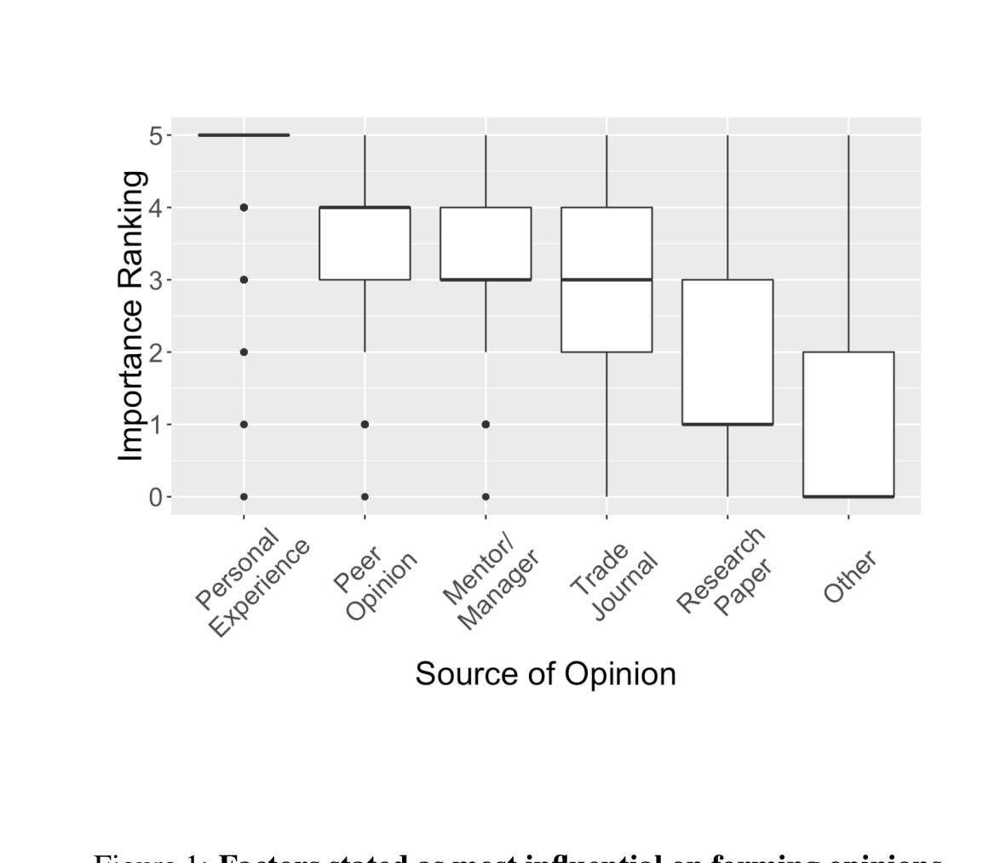

Figure 1: Factors stated as most influential on forming opinions of survey respondents.

For the two beliefs on which each developer expressed the strongest opinions (either agreeing or disagreeing) we asked them to rank possible factors in his/her opinion formation. Thus if the developer said they "Strongly Disagreed" with the claim that programming language choice affects defect occurrence, they would be presented with this answer, and asked:

> What factors played a role in your previous answer?  
> Please choose the relevant factors from the list below, and rank them

They were given a choice of "Personal experience", "What I hear from my peers", "What I hear from my mentors/managers", "Articles in industry magazines", "Research papers", and "Other". We then gathered the ranks given for each of the above factors. Thus, we had for each of the answers (agreement/disagreement with the claims), and each of the possible factors, a collection of ranks. If a particular factor is ranked more frequently, more highly, we would get a higher range of values for that factor. Thus for each factor, we gathered a collection of ranks assigned to that factor. For clarity (so that higher ranks appear higher in the plot, we inverted the rank, so on the plot higher values correspond to higher ranks). The results are in Figure 1.

The highest ranked factor influencing respondents’ opinions on the given claims is Personal experience, which was chosen for ranking 1,033 times. A look at the box plot in Figure 1 shows that it was almost always ranked at the top, and a handful of times at other positions. Next was What I hear from my peers, which was chosen for ranking 674 times, with a median second rank. Next was What I hear from my mentors/managers, chosen 499 times for ranking, and with a median third rank. The lowest ranked was Other, chosen 148 times. Just above that, in fifth position, was Research papers, chosen 257 times for ranking. We take a couple of conclusions from this.

First, the factors affecting opinion are consistent with earlier work in social science—the strength of influence on opinion formation decays with strength of social connection—things we hear from people closer to us matter more than others.4

Brown & Reingen [9], for example, found that stronger social ties are more influential in opinion formation than weaker ones. This provides a reasonable framework to understand why developers give strongest weight to personal experience, and then to peers, and then to managers. Furthermore, developers appear to be influenced by trade journals rather than research papers; this may also be because they view trade journals as closer to their situation than research papers; this requires further study.

Secondly, while this type of opinion formation might be acceptable in ordinary society, this is hardly an ideal way for professionals to form opinions. Personal experience is highly isolated, and doesn’t provide a broad sample of experience. A particular developer’s experience may be based on recollections of his or her own work experience, with his/her code, team, project etc., and have little to do with overall, large-scale trends. Furthermore, what we remember can also be highly influenced by salience rather than frequency. We tend to remember emotionally-laden experiences [10] and don’t necessarily recall more mundane occurrences quite so well. Thus one developer might vividly recall having a very difficult time repairing another person’s low-quality bug fixes, at one time, and then conclude all defect-repairs are risky; she might not recall, or even notice, that most bug-fixes were entirely adequate, and never cause any trouble. She might then strongly argue this view, repeatedly, that repairing bugs is risky; however, if a statistical analysis were done, at large scale, in her project, of the entire population of bug fixes, there might be a very different conclusion to be drawn.

In Medicine, the need to have therapeutic practice based on evidence is well-recognized, and there is a concerted, well-funded, systematic effort to disseminate scientific evidence from research findings to physicians. Indeed, most modern physicians, if asked, would profess to be strongly evidence- and research-based in their practice.

Consider how you would react if your physician said that his or her medical decisions are most strongly based on "personal experience" and much less so on "research"? The current state of evidence-based practice in Medicine offers an inspiring model for a more organized and effective dissemination of research results in Software Engineering.

## 5. EVIDENCE

Of the top 3 most controversial statements, we chose one of them, “Geographically distributed teams produce code whose quality, viz., defect occurrence, is just as good as teams that are not geographically distributed” to examine in more detail: we decided to compare the beliefs of programmers, with evidence from actual project data drawn from two large projects, which we denote as Pr-A and Pr-B. They are both quite large: Pr-A is an operating system, and consists of about 400,000 files, with over 150M SLOC and Pr-B is a web service, and consists of about 430,000 files, with about 85 Million SLOC. Our choice to delve into this particular question, with these two particular projects, was based on a curious phenomenon: statistical analysis revealed Pr-A members tended to be ones who largely disagreed with the above statement, while Pr-B members tended to largely agree with the statement (p < 0.001, using Pearson’s Chi-squared test). This difference in belief is particularly striking, given that projects practice widely distributed development: both Pr-A and Pr-B have around 8,000 developers located in over 100 different buildings, in dozens of cities in about a dozen different countries around the world. In both projects, a non-trivial number of files received commit activity from multiple buildings, cities, regions, and countries (see Table

4 In case they expressed strong (or equally strong) opinions on more than 2 claims, we chose 2 at random.