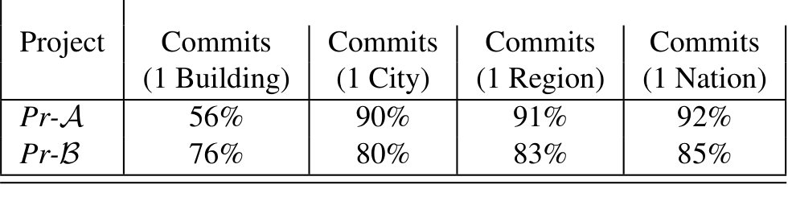

Table 2: Proportion of files in projects with majority (75%) commits from one building, one city, one region, and one nation. Clearly, while Pr-A “lives” in more buildings, Pr-B has substantively more activity outside of a single city, region, and country.

2).

Thus, developers in both countries could be expected to have personal experience with distributed development, and thus would have had the opportunity to form their beliefs based on their experiences. The statistically significant differences that emerge in the survey, therefore, could be presumed to be based on intrinsic, observable differences in the two projects.

Perhaps Pr-A had encountered more quality difficulties in distributed development, and Pr-B had none. Findings on this topic, while by no means uniform [29, 6, 18, 45, 44], tend to lean on the side of agreement with the statement above, particularly with respect to teams at Microsoft [29, 6]. To examine these issues in more detail, we gathered data on development histories (who changed what file, how much, and when), defect repair (commits that marked as defective in the logs, using techniques popularized by Mockus et al [33], and Sliwerski et al [50]), as well as developer locations at the time changes were made (using internal Microsoft databases). Using this gathered data, we used known techniques for studying the effects of geographical distribution, based on measures used in earlier work [29, 6].

Our data was gathered on a per-file basis; Pr-A and Pr-B both had around 400,000 files, and the data comprised millions of changes, performed starting in 2012. We gathered several metrics on these files, described below. Since the goal of this study to gather quantitative, project-specific evidence on software quality, the main phenomenon we were interested reflected the number of bug-fix commits. This, then, is our primary response variable:

**nfix** Number of defect repairs associated to the file. This data was gathered using project-specific conventions on identifying defect repair changes. One project used the convention that all bug-fix logs began with "BUG: ...". The other project had a range of conventions for bug-fix logs. These conventions were known to the authors from prior investigations, and informants in the respective development communities.

Next, since our goal is to attempt to isolate and measure the effect of geographic distribution, it is important to control for known confounds that might affect the nfix outcome. We use 4 different control measures, all chosen from prior work on the determinants of software quality.

- **meansize** Average size of the file, in lines of code. This is a control variable; in general size is expected to be strongly correlated with number of fixes.
- **chgcnt** Number of commits made to the file. Prior work has established that change (churn) is strongly correlated with defects; the more files change, the more likely it is that defects are introduced [35].

- **todc** Total number of distinct developers committing to the file. Prior research as indicated that the number of developers involved in a file influences quality [6, 39, 32], and can be a confounding factor in studies of the effect of distributed development on quality [6].
- **otop** Ownership: percentage of commits made by the most frequent committer to this file. Strong, dominant ownership, i.e., the proportion of commits made by the majority contributor to a file, can influence software quality [39], so we include this as a control.

### Binary indicators of localization level of files

We used 4 binary variables, indicating whether more than 75% of the commits were made within one building (in1b), in one city (in1c), region (in1r), and nation (in1n) respectively. This modeling approach and the threshold levels used were based on prior work by Bird et al [6], and Kocaguneli et al [29]. As Kocaguneli et al justify, these variables “indicate the smallest geographical entity” within which “developers account for 75% of the edits to a file”. The variables capture different degrees to which a file can be distributed: for example distances within a building are walkable; within a city, some transportation, or a phone call may be involved; outside of the same city personal contact is even harder, and once outside a country time-zones complicate personal live communications. As with Kocaguneli et al we performed sensitivity analysis, and got similar results for thresholds ranging from 65% to 85%.

Table 2 shows the level of distributed development activity in both Pr-A and Pr-B, using the binary indicator variables described above. Thus, for Pr-B, 76% of files have 75% or more of their commits from a single city, and 80% of the files have 75% or more of their commits from a single building. As can be seen, there are a non-trivial number of files in both projects that have significant distributed development activity. Thus these projects are both reasonable settings to study the quality effects of distributed development, as well as being settings where developers can be expected to have had reasonable experience with the practice and consequences of distributed development.

We began our data analysis by modeling the nfix variable as a response, against just the controls (meansize, chgcnt, todc and otop). All our models are linear regression models; model diagnostics were performed using recommended criteria: in all cases, the residual distributions (from the linear models) were inspected using the qqnorm plots to ensure acceptable normality; variance inflation was found to be in recommended ranges, and outliers were removed to avoid high-leverage points. The data was reasonably balanced between zeros, and non-zeros, and there was no indication of zero inflation. In addition, since the data were slighly over-dispersed, we compared the linear regression models with count (quasi-poisson) models, and got essentially the same results; for simplicity, we just present the results of linear regression. The model for Pr-A (Model 2) and Pr-B (Model 3) are shown below.

The models show the direction and significance of the effect (T-value magnitude shows significance, the sign shows the direction of the effect); the p-values are all highly significant (and calculable from the T-distribution).

We infer from the models above is that a) all the controls are significant, and b) the effects are in the directions that we might