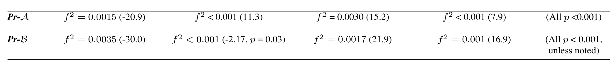
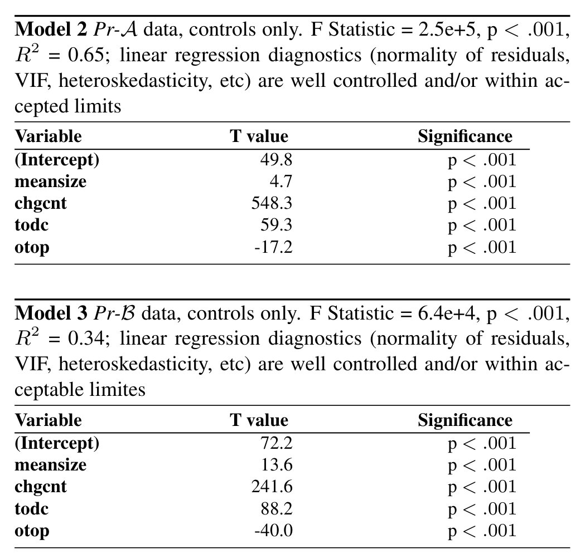

Model 1 Effect on number of repairs, at each level of (non) distribution. We show effect size measured using Cohen’s f2. All effects much lower than the small effect threshold, which is 0.02. All effects, however, are statistically significant (p < 0.001), except for the “same city” effect in Pr-B, thanks to large sample sizes. Linear regression diagnostics (normality of residuals, VIF, heteroskedasticity, etc) are well controlled.

Project Same Building Same City Same Region Same Country Model  
Cohen’s f2 and (T value) Cohen’s f2 and (T value) Cohen’s f2 and (T value) Cohen’s f2 and (T value) F Significance

expect, viz. defects increase significantly with size of files, churn, total number of developers committing to a file; defects decrease with ownership level.

To gauge the effect of the experimental variables, we add the indicator variables for each distribution level as described above, in turn to the above models. In other words, we built 4 successive models for each of the two projects, adding (in turn) the variables in 1b, in1c etc. In total, we have 8 different models, each consisting of the four control variables and one indicator variable. Each model would thus give us an indication of the effect on files which were (mostly) changed within the one geographic location indicated by the operative indicator variable. The results are shown in Model 1.

For each indicator variable, we calculated the percentage difference in annual defect-repair activity corresponding to that level of localization, when controlling for file size, change count, number of developers, and file ownership. All levels of localization had a statistically significant impact on software quality. All indicator variables showed statistically significant effects in the model. Given the large sample sizes (several hundred thousand files), we can expect to be able to measure even small effects.

However, the inclusion of the localization variables didn’t change the explanatory power of the models in any instance: in all cases, the proportionate change in R2 value was less than 5*10^-3 (0.5%). We used the Cohen’s f2 measure to gauge the effect size of these indicator variables. Cohen’s f2 values are computed as (R^2_AB − R^2_A) / (1 − R^2_AB) where the subscript indicates the regressors included in the model;

R^2_AB measures the multiple R^2 while including regressors B as well as regressors A, while R^2_A is the value with just regressors A. This f^2 is a measure of the additional variance explained by the addition of regressor B into the model. In our cases A is just the controls used in Models 1 and 2 above, B is the binary indicator variable for each level of localization.

A threshold value of 0.02 (2%) for f^2 is suggested5 as a minimum value to determine that an effect size is small; in all cases, our computed f^2 values were a lot smaller than even that, leading us to the conclusion: the effect of localization on software quality at all levels, in both Pr-A and Pr-B, when controlling for confounding factors, is minimal. These findings are consistent with earlier findings within the Microsoft setting by Bird et al and Kocaguneli et al. Another noteworthy aspect of the effect of distribution is that it is not always in the same direction. Thus for both Pr-A and Pr-B, it appears clear that it is (very slightly) better to be in the same building (negative t-values, -20.9, and -30.0 respectively), and for Pr-B it is possibly very slightly better (barely significant, t = -2.17, p = 0.03, negligible f^2) to be in the same city. For all other cases, it appears consistently, and statistically significantly, very slightly better to be distributed! Although the f^2 for the effect in the positive direction in these cases is small, the t-values are all quite strongly positive, indicating that files mostly committed in the same geographic area (city, region, nation) are actually very slightly more defect-prone!!!

> Thus, the respondents from Pr-B had formed beliefs that were consistent with the actual evidence from that project, whereas the respondents from Pr-A had formed beliefs that were inconsistent with the actual data from that project.

This case study, in conjunction with the responses to our survey, suggests that developers form opinions subjectively, and anecdotally, based on personal experience. One possible explanation for the difference in beliefs might be confirmation bias6. Pr-A (see Table 2) is less distributed geographically than Pr-B. Pr-A started earlier, with its beginnings in Puget Sound, the long-time headquarters of Microsoft. As a project that was initially developed in just one location, developers from Pr-A may be more familiar, comfortable, and trusting with non-distributed development, whereas Pr-B members may have had richer experience with distributed development, and might have a more realistic view.

Indeed, in the absence of controls, as prior studies have noted, it would appear that distributed files are indeed more defective: Bird5 (See https://en.wikipedia.org/wiki/Effect_size), and the pwr package in R.

6 Confirmation bias is a kind of bias that “connotes the seeking or interpreting of evidence in ways that are partial to existing beliefs, expectations, or a hypothesis in hand” [36]