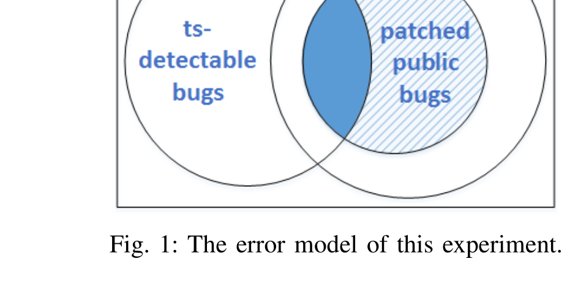
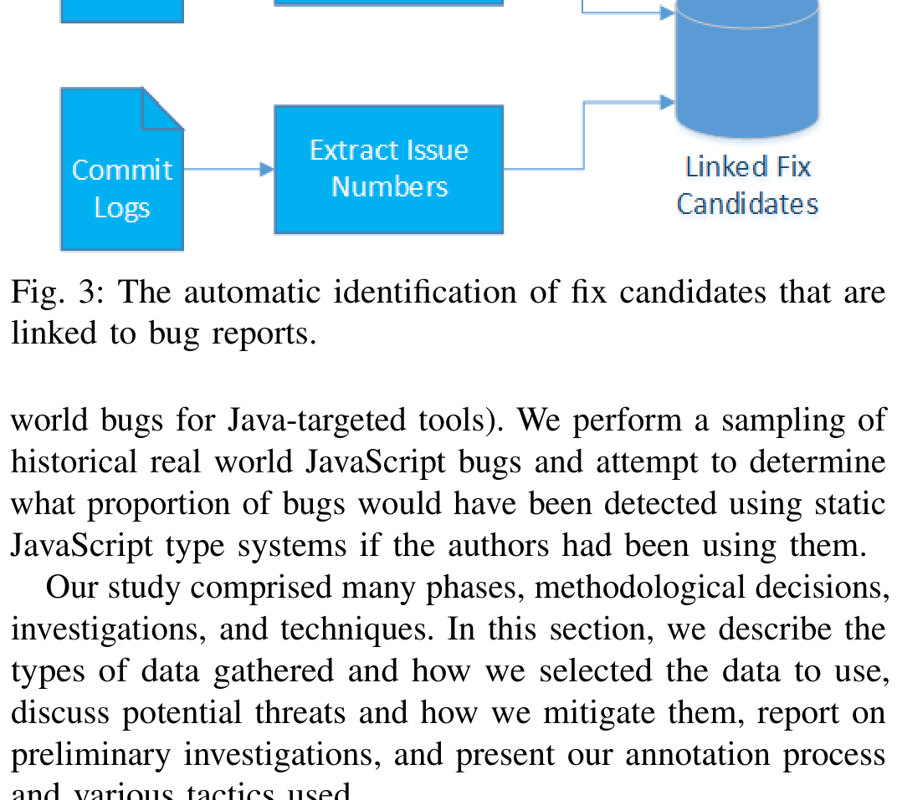

Fig. 1: The error model of this experiment.

```javascript
1 function addNumbers(x, y) {
2   return x + y;
3 }
4 console.log(addNumbers(3, "0"));
```
(a) The buggy program.

```javascript
1 function addNumbers(x, y) {
2   return x + y;
3 }
4 console.log(addNumbers(3, 0));
```
(b) The fixed program.

```javascript
1 function addNumbers(x:number, y:number) {
2   return x + y;
3 }
4 console.log(addNumbers(3, "0"));
```
(c) The annotated, buggy program.

Fig. 2: JavaScript coerces 3 to "3" and prints "30". From the fix, we learn that this behavior was unintended and add annotations that allow Flow and TypeScript to detect it.

accesses. Additionally, both Flow and TypeScript identify undeclared variables.

### C. Example

Assume addNumbers in Figure 2a is intended to add two numbers, but the programmer mistakenly passes in a string "0". Because of coercion, a controversial feature that enriches a language’s expressivity at the cost of undermining type safety and code understandability [10], + in JavaScript can take a pair of number and string values. Thus, Figure 2a converts the number to a string, concatenates the two values, and prints "30". By reading the fixed program in Figure 2b, we infer that both parameters are expected to have type number. We partially annotate the program, shown in Figure 2c, enabling Flow and TypeScript to signal an error on line 4 and detect this bug. If, in addition to this bug, we had shown four other bugs to be undetectable, Equation 1 would evaluate to 1/5.

## III. EXPERIMENTAL SETUP

Our experimental setup is similar to that of Le Goues et al. [11]. They aimed to determine, for a sample of real world historical bugs sampled from GitHub projects, what proportion of bugs would have been fixed through automatic program generation (Defects4J [12] enables similar studies and evaluations on real



Fig. 3: The automatic identification of fix candidates that are linked to bug reports.

We perform a sampling of historical real world JavaScript bugs and attempt to determine what proportion of bugs would have been detected using static JavaScript type systems if the authors had been using them. Our study comprised many phases, methodological decisions, investigations, and techniques. In this section, we describe the types of data gathered and how we selected the data to use, discuss potential threats and how we mitigate them, report on preliminary investigations, and present our annotation process and various tactics used.

### A. Corpus Collection

We seek to construct a corpus of bugs that is representative and sufficiently large to support statistical inference. As always, achieving representativeness is the main difficulty, which we address by uniform sampling. We cannot sample bugs directly, but rather commits that we must classify into fixes and non-fixes. Why fixes? Because a fix is often labelled as such, its parent is almost certainly buggy and it identifies the region in the parent that a developer deemed relevant to the bug. To identify bug-fixing commits, we consider only projects that use issue trackers, then we look for bug report references in commit messages and commit ids (SHAs) in bug reports. This heuristic is not only noisy; it must also contend with bias in project selection and bias introduced by missing links.

#### 1) Missing Links:

A link interconnects a bug report and a commit that attempts to fix that bug in a version control system. Historically, many of these links are missing, especially when the developer must remember to add them, due to inattentiveness, distractions, or fire drills. Naïve solutions to the missing link problem are subject to bias [13]. GitHub provides issue tracking functionality in addition to source code management and provides tight integration to ease linking. In addition, when pull requests or commit messages reference bugs in the issue tracker, GitHub automatically links the source code change to the bug. For these reasons, projects that use pull requests, issue tracking, and source code management suffer far less from the linking problem [14].

To validate this and assess the missing link problem in the context of GitHub ourselves, we collected eight JavaScript projects, using a set of criteria including project size, popularity, number of contributors, and the use of Node.js and jQuery. We manually inspected them and observed that because project