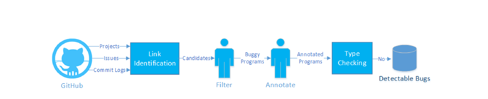
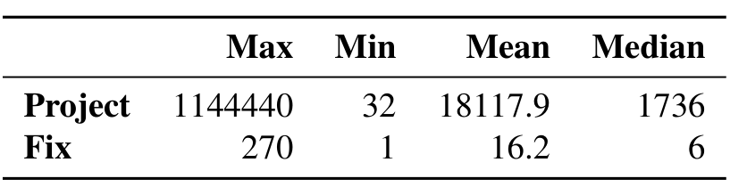

Fig. 4: The workflow of our experiment.

norms dictate that developers refer to bugs in requests and commits to enable GitHub’s automatic linking, the overwhelming majority complied with the practice, thus mitigating the missing link problem.

2) Identifying Candidate Fixes: Figure 3 depicts our procedure for identifying candidates of bug-resolving commits. For a project, we extract all bug ids from the issue tracker, then search for them in a project’s commit log messages; concurrently, we extract all SHAs from the version history, and search for them in the project’s issues. GitHub allows developers to label issues as bug reports, but we choose not to use this functionality and consider all tracked issues, as we were uncertain what bias this labelling could introduce. When we find a match, we have a candidate fix that we store as a triple consisting of the SHA of the candidate, the SHA of its parent, and the bug report ID. We cross-check matches from commit logs against matches from the bug reports. If a fix has more than one parent, the algorithm stores a distinct triple for each parent for later human inspection. For every automatically identified candidate, we manually assess whether it is actually an attempt to resolve a bug, rather than some other class of commit, like a feature enhancement or code refactoring. We also filter bug reports written in a language other than Chinese and English, and fixes that do not modify JavaScript.

The resulting set of bugs is a biased subset of all fixed public bugs. GitHub may not be representative of projects, since proprietary projects tend not to use it. While we have argued the problem is less acute, missing links persist. Finally, we may not correctly identify bug-fixing commits. We contend, however, there is no reason, from first principles, to believe that there is a correlation between the ability of Flow or TypeScript to detect a bug and the existence of a link between that bug and the fixing commit. Thus, any link bias in the subset is unlikely to taint our results.

3) Corpus: To report results that generalize to the population of public bugs, we used the standard sample size computation to determine the number of bugs needed to achieve a specified confidence interval [15]. On 19/08/2015, there were 3,910,969 closed bug reports in JavaScript projects on GitHub. We use this number to approximate the population. We set the confidence level and confidence interval to be 95% and 5%, respectively. The result shows that a sample of 384 bugs is sufficient for the experiment, which we rounded to 400 for convenience. To construct a list of bugs we could uniformly sample, we took a snapshot of all publicly available JavaScript projects on GitHub, with their closed issue reports. We uniformly selected a closed and linked issue, using the procedure described above.

TABLE I: The size statistics in LOC of the projects and fixes in our corpus, which includes 398 projects5.

and stopped sampling when we reached 400 bugs. The resulting corpus contains bugs from 398 projects, because two projects happened to have two bugs included in the corpus.

Table I shows the size statistics of the corpus. The project size varies largely, ranging from 32 to 1,144,440 LOC, with a median of 1,736. The smallest project is dreasgrech/JSStringFormat, a personal project with a single committer. It minimally implements .NET’s String.Format that inserts a string into another based on a specified format. We sampled from GitHub uniformly so our corpus contains such small projects roughly in proportion to their occurrence in GitHub. For a commit, GitHub’s Commits API4 does not return a diff; it returns summary data, notably a pair of numbers, the count of additions and deletions. From this pair, the number of modifications can only be implicitly bounded by min(#adds, #dels). Because developers think in terms of modified lines, not lines of diff, we counted the line in which Git’s word diff reported modifications. Most bug-fixing commits were quite small: approximately 48% of the fixes touched only 5 or fewer LOC, and the median number of changes was 6. We did not explicitly track the number of scopes; that said, most of the fixes modified a single scope. The complete corpus can be downloaded via http://ttendency.cs.ucl.ac.uk/projects/type_study/index.html.

### B. Preliminary Study

To quantify the proportion of public bugs that the two static type systems detect, and could have prevented, our study must 1) find a time bound on per-bug assessment and annotation in order to make our experiment feasible, 2) establish a manual annotation procedure. Additionally, our study also aims to classify ts-undetectable bugs. To speed the main experiment, we wanted to define a closed taxonomy for undetectable bugs. To these ends, we conducted a preliminary study on 78 bugs, sampled from GitHub using the above collection procedure.

A histogram of our assessment times showed that, for 86.67% of the bugs, we reached a conclusion within 10 minutes, despite the fact that we were simultaneously defining our annotation

4 https://developer.github.com/v3/repos/commits
5 Of the 398 projects, only 375 are still available on GitHub.