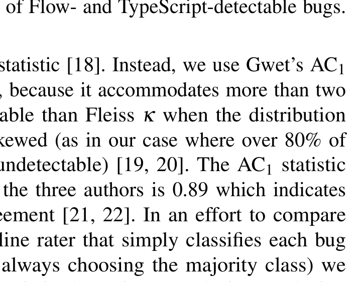

For TypeScript, if we deem a missing module related to the bug and it exists in DefinitelyTyped6, we include it. If the bug stems from a misuse of a library that has an annotated interface in DefinitelyTyped, we reuse DefinitelyTyped’s annotations. For example, deprecated internal data models in ember-cli caused the bug sivakumar-kailasam/broccoli-leasot:55. To solve it, we borrowed DefinitelyTyped’s annotations for ember-cli. If the missing module is related but lacks an interface in DefinitelyTyped or we are using Flow, we construct a type shim for it, manually inferring the types from the module’s documentation or its code base.

### Type Shims

In general, a patched region contains free identifiers that we need to annotate. Introducing casts would increase the annotation tax. Our workaround is to introduce a type shim7, a set of type bindings for the free identifiers. From within the patched region, the rest of the program can be viewed as a module for which we can define a shim as a set of interfaces. We have aimed to construct consistent type shims (Section II); when a shim includes a property or method that is unrelated to the bug, we annotate it with any. For example, by using a shim, the code snippet

```javascript
var t = {x: 0, z: 1};
t.x = t.y; // y does not exist on t
t.x = t.z; // z exists on t, but is unrelated
```

becomes

```typescript
interface T {
  x: number;
  z: any; // z has the type any
}
var t: T = {x: 0, z: 1};
t.x = t.y;
t.x = t.z;
```

## IV. RESULTS

Our main results rest on an assessment of our corpus of 400 buggy versions of JavaScript projects conducted by one of the authors. To help him calibrate, all authors assessed a subset of the bugs. First, we present the inter-rater agreement of that three-way assessment, before presenting our main result: that static type systems find a significant number of public bugs!

### A. Inter-Rater Agreement

To calculate inter-rater agreement, we uniformly selected 20 bugs for calibration, then all authors annotated and classified each bug, using Procedure 1. Once all 20 bugs were processed, the authors collectively resolved each one on which they were not unanimous.

After this calibration step, we uniformly selected an additional subset of 80 buggy versions. Once all authors had independently classified each of the 80 bugs, we calculated the inter-rater agreement. There was full agreement among all authors for 86.4% of the issues, indicating a high level of agreement. Because there were more than two raters, Cohen’s κ is not an appropriate statistic [18]. Instead, we use Gwet’s AC1 agreement coefficient, because it accommodates more than two raters and is more stable than Fleiss κ when the distribution of ratings is highly skewed (as in our case where over 80% of cases were rated as undetectable) [19, 20]. The AC1 statistic for the 80 ratings by the three authors is 0.89 which indicates “almost perfect” agreement [21, 22]. In an effort to compare our ratings to a baseline rater that simply classifies each bug as undetectable (i.e. always choosing the majority class) we calculated the AC1 statistic three times, each time replacing one of the authors with such a baseline rater. The resulting AC1 statistics were statistically lower, 0.82, 0.85, and 0.83.

In discussing unknowns, we learned that each of us independently had categorized a bug as unknown when we thought it was detectable, but could not show it, before we ran out of time. To see the impact of this implicit agreement, we relabelled “unknown” as “detectable” and recomputed AC1: it increased to 0.90; perfect agreement rose to 90%.

Fig. 5: Venn Diagram of Flow- and TypeScript-detectable bugs.



is not an appropriate statistic [18]. Instead, we use Gwet’s AC1 agreement coefficient, because it accommodates more than two raters and is more stable than Fleiss κ when the distribution of ratings is highly skewed (as in our case where over 80% of cases were rated as undetectable) [19, 20]. The AC1 statistic for the 80 ratings by the three authors is 0.89 which indicates “almost perfect” agreement [21, 22]. In an effort to compare our ratings to a baseline rater that simply classifies each bug as undetectable (i.e. always choosing the majority class) we calculated the AC1 statistic three times, each time replacing one of the authors with such a baseline rater. The resulting AC1 statistics were statistically lower, 0.82, 0.85, and 0.83.

### B. Detecting Public Bugs

> Research Question: On what percentage of public bugs does Flow 0.30 or TypeScript 2.0 report errors?

Of the 400 public bugs we assessed, Flow successfully detects 59 of them and TypeScript 58. We, however, could not always decide whether a bug is ts-detectable within 10 minutes, leaving 18 unknown. The main obstacles we encountered during the assessment include complicated module dependencies, the lack of annotated interfaces for some modules, tangled fixes that prevented us from isolating the region of interest, and the general difficulty of program comprehension. For these 18 bugs, we spent as much time as needed to resolve each one. We patiently imported all relevant modules by using interface management tools like Typings8, annotated interfaces as appropriate, and read the code base and official documentation when necessary. We used simple experiments to validate a ts-undetectable assessment, as necessary.

As a result, we successfully labelled all 400 bugs as either detectable or undetectable under Flow and TypeScript. Flow detected one more for a grand total of 60; TypeScript catches two more and also reaches 60. Running the binomial test on the results shows that, at the confidence level of 95%, the true

6 A project from the TypeScript community that provides annotated interfaces for popular JavaScript libraries, at https://goo.gl/xvDaSI

7 We overload shim here, which traditionally means code that normalises the functionality of an existing API across different browsers.

8 https://github.com/typings/typings