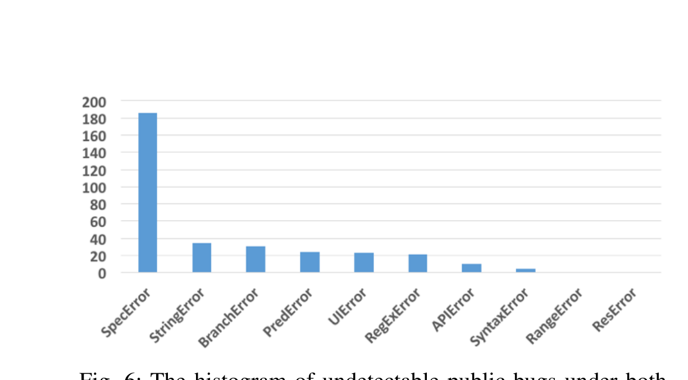

Fig. 6: The histogram of undetectable public bugs under both Flow and TypeScript.

## Measuring TypeScript 2.0 null Handling Improvement

and how to effectively refine it remains challenging, although promising work is emerging in this direction [26].

TypeScript 2.0 was released during this study, giving us the opportunity to measure how effectively it handles null and undefined. Prior to 2.0, all types were nullable in TypeScript [27]. In Flow, all types, except any, void, and null, are non-nullable by default; one prefixes them with ? to make them nullable. This design choice enables Flow to elegantly catch incorrect null / undefined usage. TypeScript 2.0 added the compiler option --strictNullChecks, which, when enabled, makes most types nonnullable, allowing the user to opt to include null in a type annotation to specify nullability. For instance,

```ts
var s: string | null = "foo"
```

defines s to be a nullable string.

We reviewed our corpus and found that 22 bugs, an increase of 58%, are detectable under TypeScript 2.0 but not under TypeScript 1.8. This result decisively and quantitatively demonstrates the value of TypeScript 2.0’s strict null checking.

### Comparing Flow and TypeScript

Though sharing a similar annotation syntax, Flow and TypeScript differ in terms of expressivity and type variance. These dimensions are hard to quantify. Thus, we compare Flow and TypeScript in terms of their ability to detect and potentially prevent public bugs had they been used when those bugs were introduced and the costs of the requisite annotations.

As discussed in Section IV-B, Flow and TypeScript both catch a nontrivial portion of public bugs. In our dataset, the bugs they can detect largely overlap, with 6 exceptions: 3 bugs are only Flow-detectable and 3 only TypeScript-detectable.

All three Flow-detectable bugs share a common feature that reveals a weakness in TypeScript’s recently introduced null handling: TypeScript does not error when concatenating a possibly undefined or null value to another of type string. For example, TypeScript remains silent on the following statement:

```js
var x = " " + null + " ";
```

whereas Flow reports a type error:

```text
' ' + null + ' '
^^^^ null. This type cannot be added to
' ' + null + ' '
^^^^^^^^^^ string
```

Without knowing whether TypeScript intentionally allows this behaviour, we cannot judge this decision, but its cost is substantial: TypeScript could have detected 3 more bugs, which amounts to an increase of around 5%.

Though bug arrowrowe/es6-playground:2 is detectable under both Flow and TypeScript, it is worthy of attention. Originally, we reckoned that it was only Flow-detectable: Flow natively supports Node.js’ require() function, which imports modules, and reports that the module named as an argument of require() does not exist; TypeScript lacks such support. The TypeScript team, however, helped us realize that, by using a TypeScript-specific module-importing syntax we had overlooked,

```ts
import foo = require("foo")
```

this bug is, in fact, TypeScript-detectable. Similarly, we also thought that Flow had support for JavaScript’s native functions, like parseInt() in pupil-monitoring/pupil:14. Here, the TypeScript team brought our attention to the --noImplicitAny option, with which enabled, TypeScript will error when it fails to infer a variable’s type.

Two of the three bugs that are only TypeScript-detectable arise due to Flow’s incomplete support for a popular JavaScript idiom, using a string literal as an index. For example, TypeScript detects the bug conanbatt/OpenKaya:45 when i0 and i1, two variables used as indexes, are annotated with

undefined | string | number;

Flow fails with the same annotation. The remaining bug, sandeepmistry/node-core-bluetooth:1, arises because of Flow’s permissive handling of the window object. Below is its error message:

```text
node-core-bluetooth/lib/central-manager-delegate.js:146
}.bind(mapDelegate(self), mapPeripheral(identifier), error));
^^^^
ReferenceError: self is not defined
```

In JavaScript, self generally refers to the global object, window. This bug is caused by an operating system upgrade, after which the system no longer recognises self and forces the developer to use $self. Therefore, the fix simply replaces self with $self. Both Flow and TypeScript are able to infer that self has type Window. By reading the issue report and the code, we are able to infer that function mapDelegate accepts values of only string or number type. In TypeScript, we add the following annotation to mapDelegate’s definition:

```ts
function mapDelegate(self: string | number) {
```

Upon type checking, TypeScript signals a type error:

```text
central-manager-delegate.ts(146,22): error TS2345: Argument of type 'Window' is not assignable to parameter of type 'string | number'.
```

Flow, on the other hand, even with the same annotation, does not regard self being passed to mapDelegate as a type error.

### The per-Bug Annotation Tax

Everything comes at a price. To enjoy the benefits that a static type system brings, a developer often needs to annotate their program. Directly measuring the effort programmers must expend to annotate their programs for a static type system would require a large-scale, invasive study of two teams of developers, one using static types and the other dynamic types, with all the attendant cost and confounds such a large user study would entail. Thus, we resort to under-approximating the annotation tax with two simple, expedient proxies: token tax, the number of tokens in the added type annotations, and time tax, the time spent adding annotations.