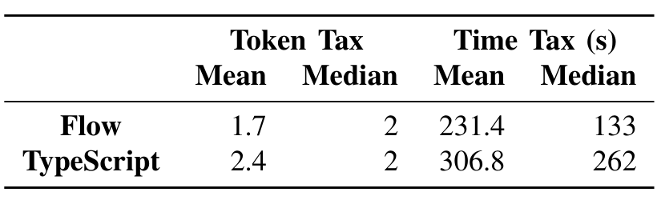

The token tax rests on the intuition that each token must be selected, so this proxy measures the number of decisions a programmer must make when adding type annotations. For a ts-detectable bug, we define the token tax as the number of tokens in the annotation needed to trigger a type error on a line involved in causing the bug. Let ∆ be a function that returns the syntactical difference between two code snippets and ||·|| be a function that calculates the number of tokens in a code snippet. Then, the token tax is ||∆(a(b), b)||. To report the time to annotate, we recorded how long we spent annotating each buggy version in the commit message, creating an electronic laboratory notebook [28].

These measures of the annotation tax are per-bug and underestimate the annotation effort in time and tokens relative to the whole code base, because our experiment leverages the fix to localize our annotation effort, as detailed in Section II-A. With this knowledge, we locally annotate the region aimed at this specific bug, ignoring unrelated type errors. The developers who originally committed the buggy code lacked this knowledge and, in the worst case, may have needed to annotate the entire program. However, under the assumption that the project has fully embraced using a static type checker, the codebase would already be annotated prior to the bug-introducing change. Our annotation tax metric measures just the time and tokens required for the additional annotations at the time the bug-introducing change was made. Thus, our measure captures the case of incrementally adding and annotating patches to an already annotated code base. It is also likely that the project developers will be more knowledgeable about the codebase than the authors of this paper and take even less time to add the needed annotations.

Using this measure, we answer the question “What is the per-bug annotation tax in number of tokens of Flow and TypeScript, without considering the definition of shims?”, finding that on average Flow requires 1.7 tokens to detect a bug and TypeScript 2.4. Two factors contribute to this discrepancy: first, Flow implements stronger type inference, mitigating its reliance on type annotations; second, Flow’s syntax for nullable types is more compact. As discussed previously, to denote a variable is nullable in Flow, one simply needs to add a ? before the type annotation, like ?number, whereas TypeScript requires the use of a union type operator, like number | null | undefined. The benefit of type inference in saving type annotations is also shown in the median values. Table II exhibits a sharper difference in time tax between Flow and TypeScript. Thanks to Flow’s type inference, in many cases, we do not need to read the bug report and the fix in order to devise and add a consistent type annotation, which leads to the noticeable difference in annotation time.

### Cross Pollination

In our experiment and case studies, handling modules was the most time-consuming aspect of annotating buggy versions. Flow has builtin support for popular modules, like Node.js, so when a project used only those modules, Flow worked smoothly. Many projects, however, use unsupported modules. In these cases, we learned to greatly appreciate TypeScript community’s DefinitelyTyped project.

TABLE II: Under-approximation of the annotation tax in tokens and seconds for bugs detected by either Flow or TypeScript.

Flow would benefit from being able to use DefinitelyTyped; TypeScript would benefit from automatically importing popular DefinitelyTyped definitions. Flow would also benefit from supporting the use of string literals as array indices. TypeScript should borrow more null-handling tactics from Flow, as discussed above, like preventing the + operator from simultaneously taking null and string as operands.

## VI. THREATS TO VALIDITY

To address the standard threat to external validity, we uniformly sampled issues from JavaScript projects on GitHub, a vast repository of software project and conservatively identified fixes (Section III). Our experiment rests on public bugs, studies two static type systems for JavaScript, and relies on non-expert humans to annotate programs to determine whether Flow or TypeScript could have detected and prevented them. In each case, we have designed our experiment to under-approximate the effect of static type systems: since we always run the type checker on our annotated version of the buggy (Line 9 of Procedure 1), the only way we can generate a false positive and report a bug detectable when, in fact, it is not is if we fail to write consistent annotations (Definition 2.1). Private bugs occur in a buffer in a developer’s editor, or survive to file saves or to commits to a local branch. Capturing these bugs is intrusive, requiring an instrumented IDE [29], so this work considers only public bugs, not private bugs. Type systems, however, can and do effectively detect and prevent private bugs. Because we have studied only Flow and TypeScript, our experiment reflects their strengths and weaknesses, and under-approximates the benefits of general type systems. We may have incorrectly determined a bug to be undetectable when Flow or TypeScript could have, in fact, reported an error given correct annotations and alerted a developer to prevent the bug. If we could not construct type annotations that caused the type system to report an error, we marked the bug as unknown. For each such bug, we made notes that we hope will be useful for the designers of type systems. While we are not experts in Flow or TypeScript, we have, through working on this project, become informed lay-people and therefore if we labelled a bug as unknown, it is a safe bet that many industrial practitioners would as well. We leveraged fixes to localize our annotation efforts; Section II-A details the attendant threats and limitations.

## VII. RELATED WORK

Being the most successful light-weight verification technique, type systems are always in the spotlight. We are not the first to empirically compare dynamic and static type systems [30, 31, 32, 33, 34, 24, 25]. These studies perform the comparison