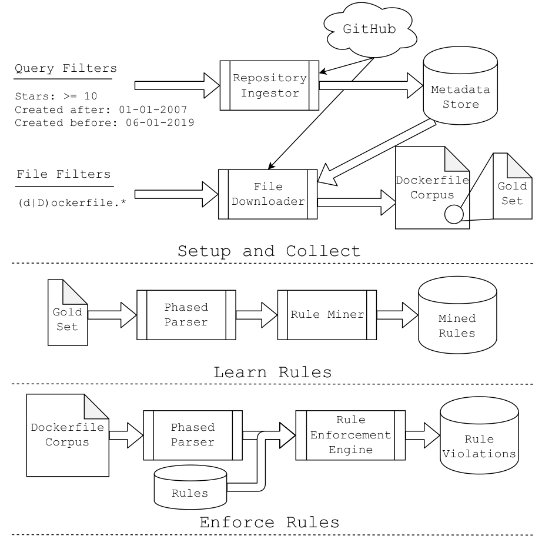

Phillips et al. found that there is little perceived benefit in becoming an expert, because developers working on builds told them “if you are good, no one ever knows about it” [26]. However, there is a strong interest in tools to assist the development of DevOps artifacts: even with its relatively shallow syntactic support, the VS Code Docker extension has over 3.7 million unique installations [24]. Unfortunately, the availability of such a tool has not translated into the adoption of best practices. We find that, on average, Dockerfiles on GitHub have nearly five times as many rule violations as those written by Docker experts. These rule violations, which we describe in more detail in §4, range from true bugs (such as simply forgetting the -y flag when using apt-get install which causes the build to hang) to violations of community-established best practices (such as forgetting to use apk add's --no-cache flag). The goal of our work is as follows:

> We seek to address the need for more effective semantics-aware tooling in the realm of DevOps artifacts, with the ultimate goal of reducing the gap in quality between artifacts written by experts and artifacts found in open-source repositories.

We have observed that best practices for tools like Docker have arisen, but engineers are often unaware of these practices, and therefore unable to follow them. Failing to follow these best practices can cause longer build times and larger Docker images at best, and eventual broken builds at worst. To ameliorate this problem, we introduce binnacle: the first toolset for semantics-aware rule mining from, and rule enforcement in, Dockerfiles. We selected Dockerfiles as the initial type of artifact because it is the most prevalent DevOps artifact in industry (some 79% of IT companies use it [27]), has become the de-facto container technology in OSS [15, 38], and it has a characteristic that we observe in many other types of DevOps artifacts, namely, fragments of shell code are embedded within its declarative structure.

Because many developers are comfortable with the Bash shell in an interactive context, they may be unaware of the differences and assumptions of shell code in the context of DevOps tools. For example, many bash tools use a caching mechanism for efficiency. Relying on and not removing the cache can lead to wasted space, outdated packages or data, and in some cases, broken builds. Consequently, one must always invoke apt-get update before installing packages, and one should also delete the cache after installation. Default options for commands may need to be overridden often in a Docker setting. For instance, users almost always want to install recommended dependencies. However, using recommended dependencies (which may change over time in the external environment of apt package lists) can silently break future Dockerfile builds and, in the near term, create a likely wastage of space, as well as the possibility of implicit dependencies (hence the need to use the --no-recommends option). Thus, a developer who may be considered a Bash or Linux expert can still run afoul of Docker Bash pitfalls.

To create the binnacle toolset, we had to address three challenges associated with DevOps artifacts: (C1) the challenge of nested languages (e.g., arbitrary shell code is embedded in various parts of the artifact), (C2) the challenge of rule encoding and automated rule mining, and (C3) the challenge of static rule enforcement. As

Fig. 1: An overview of the binnacle toolset.

As a prerequisite to our analysis and experimentation, we also collected approximately 900,000 GitHub repositories, and from these repositories, captured approximately 219,000 Dockerfiles (of which 178,000 are unique). Within this large corpus of Dockerfiles, we identified a subset written by Docker experts: this Gold Set is a collection of high-quality Dockerfiles that our techniques use as an oracle for Docker best practices.[1]

To address (C1), we introduced a novel technique for generating structured representations of DevOps artifacts in the presence of nested languages, which we call phased parsing. By observing that there are a relatively small number of commonly used command-line tools—and that each of these tools has easily accessible documentation (via manual/help pages)—we were able to enrich our DevOps ASTs and reduce the percentage of effectively uninterpretable leaves (defined in §3.1) in the ASTs by over 80%.

For the challenge of rule encoding and rule mining (C2), we took a three-pronged approach:

1. We introduced Tree Association Rules (TARs), and created a corpus of Gold Rules manually extracted from changes made to Dockerfiles by Docker experts (§3.2).
2. We built an automated rule miner based on frequent sub-tree mining (§3.4).
3. We performed a study of the quality of the automatically mined rules using the Gold Rules as our ground-truth benchmark (§4.2).

In seminal work by Sidhu et al. [30], they attempted to learn rules to aid developers in creating DevOps artifacts, specifically Travis CI files. They concluded that their “vision of a tool that provides suggestions to build CI specifications based on popular sequences of phases and commands cannot be realized.” In our work, we adopt their vision, and show that it is indeed achievable. There is a simple explanation for why our results differ from theirs. In our work,

1 Data available at: https://github.com/jjhenkel/binnacle-icse2020