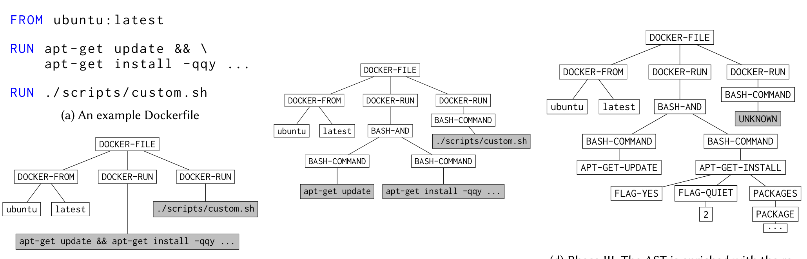

apt-get update && apt-get install -qqy ...
(b) Phase I: Top-level parsing is performed (c) Phase II: Embedded bash is parsed (d) Phase III: The AST is enriched with the results of parsing the top-50 commands. Fig. 2: An example Dockerfile at each of the three phases of our phased-parsing technique (gray nodes are effectively uninterpretable (EU)).

[30], and static rule enforcement). Together, these contributions combine to create the binnacle toolset: the first structure-aware automatic rule miner and enforcement engine for Dockerfiles (and DevOps artifacts, in general).

### 3.1 Phased Parsing

One challenging aspect of DevOps artifacts in general (and Dockerfiles in particular) is the prevalence of nested languages. Many DevOps artifacts have a top-level syntax that is simple and declarative (JSON, Yaml, and XML are popular choices). This top-level syntax, albeit simple, usually allows for some form of embedded scripting. Most commonly, these embedded scripts are bash. Further complicating matters is the fact that bash scripts usually reference common command-line tools, such as apt-get and git. Some popular command-line tools, like python and php, may even allow for further nesting of languages. Other tools, like GNU’s find, allow for more bash to be embedded as an argument to the command. This complex nesting of different languages creates a challenge: how do we represent DevOps artifacts in a structured way?

Previous approaches to understanding and analyzing DevOps artifacts have either ignored the problem of nested languages, or only addressed one level of nesting (the embedded shell within the top-level format) [17, 30]. We address the challenge of structured representations in a new way: we employ phased parsing to progressively enrich the AST created by an initial top-level parse. Fig. 2 gives an example of phased parsing — note how, in Fig. 2(b), we have a shallow representation given to us by a simple top-level parse of the example Dockerfile. After this first phase, almost all of the interesting information is wrapped up in leaf nodes that are string literals. We call such nodes effectively uninterpretable (EU) because we have no way of reasoning about their contents. These literal nodes, which have further interesting structure, are shown in gray.

After the second phase, shown in Fig. 2(c), we have enriched the structured representation from Phase I by parsing the embedded bash. This second phase of parsing further refines the AST constructed for the example, but, somewhat counterintuitively, this refinement also introduces even more literal nodes with undiscovered structure. Finally, the third phase of parsing enriches the AST by parsing the options "languages" of popular command-line tools

(see Fig. 2(d)). By parsing within these command-line languages, we create a representation of DevOps artifacts that contains more structured information than competing approaches.

To create our phased parser we leverage the following observations:

1. There are a small number of commonly used command-line tools. Supporting the top-50 most frequently used tools allows us to cover over 80% of command-line-tool invocations in our corpus.
2. Popular command-line tools have documented options. This documentation is easily accessible via manual pages or some form of embedded help.

Because of observation (1), we can focus our attention on the most popular command-line tools, which makes the problem of phased parsing tractable. Instead of somehow supporting all possible embedded command-line-tool invocations, we can, instead, provide support for the top-N commands (where N is determined by the amount of effort we are willing to expend). To make this process uniform and simple, we created a parser generator that takes, as input, a declarative schema for the options language of the command-line tool of interest. From this schema, the parser generator outputs a parser that can be used to enrich the ASTs during Phase III of parsing. The use of a parser generator was inspired by observation (2): the information available in manual pages and embedded help, although free-form English text, closely corresponds to the schema we provide our parser generator. This correspondence is intentional. To support more command-line tools, one merely needs to identify appropriate documentation and transliterate it into the schema format we support. In practice, creating the schema for a typical command-line tool took us between 15 and 30 minutes. Although the parser generator is an integral and interesting piece of infrastructure, we forego a detailed description of the input schema the generator requires and the process of transliterating manual pages; instead, we now present the rule-encoding scheme that binnacle uses both for rule enforcement and rule mining.

### 3.2 Tree Association Rules (TARs)

The second challenge the binnacle toolset seeks to address (rule encoding) is motivated by the need for both automated rule mining