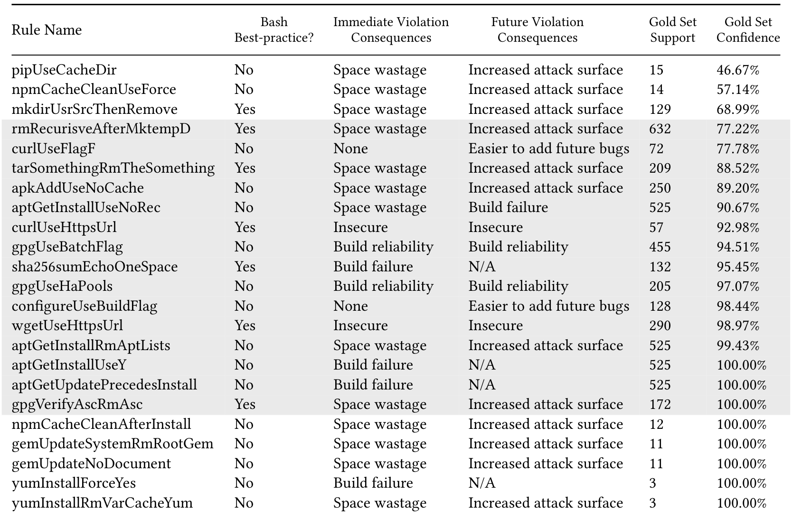
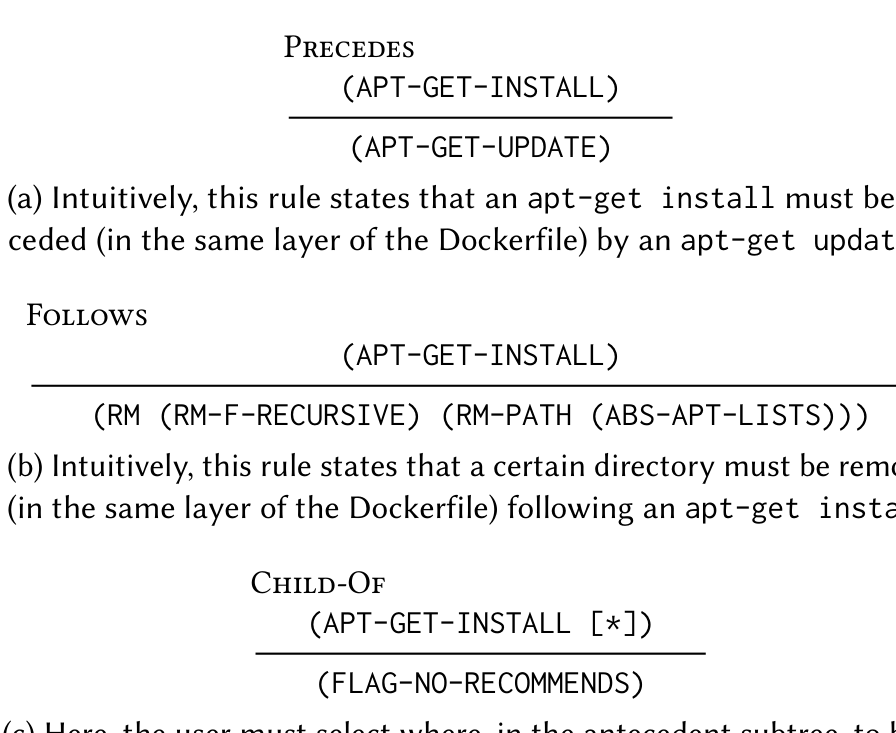

Table 1: Detailed breakdown of the Gold Rules. (All rules are listed; the rules that passed confidence/support filtering, described in §3.5, are shaded.)

Fig. 3: Three example Tree Association Rules (TARs). Each TAR has, above the bar, an antecedent subtree encoded as an S-expression and, below the bar, a consequent subtree encoded in the same way.

> (APT-GET-UPDATE)
>
> (a) Intuitively, this rule states that an apt-get install must be preceded (in the same layer of the Dockerfile) by an apt-get update.
>
> Follows
>
> (APT-GET-INSTALL)
>
> (RM (RM-F-RECURSIVE) (RM-PATH (ABS-APT-LISTS)))
>
> (b) Intuitively, this rule states that a certain directory must be removed (in the same layer of the Dockerfile) following an apt-get install.
>
> Child-Of
>
> (APT-GET-INSTALL [*])
>
> (FLAG-NO-RECOMMENDS)
>
> (c) Here, the user must select where, in the antecedent subtree, to bind a region to search for the consequent. This binding is represented by the [*] marker.

and static rule enforcement. In both applications, there needs to be a consistent and powerful encoding of expressive rules with straightforward syntax and clear semantics. As part of developing this encoding, we curated a set of Gold Rules and wrote a rule-enforcement engine capable of detecting violations of these rules. We describe this enforcement engine in greater detail in §3.5. To create the set of Gold Rules, we returned to the data in our Gold Set of Dockerfiles.

These Dockerfiles were obtained from the docker-library organization on GitHub. We manually reviewed merged pull requests to the repositories in this organization. From the merged pull requests, if we thought that a change was applying a best practice or a fix, we manually formulated, as English prose, a description of the change. This process gave us approximately 50 examples of concrete changes made by Docker experts, paired with descriptions of the general pattern being applied.

From these concrete examples, we devised 23 rules. A summary of these rules is given in Table 1. Most examples that we saw could be framed as association rules of some form. As an example, a rule may dictate that using apt-get install ... requires a preceding apt-get update. Rules of this form can be phrased in terms of an antecedent and consequent. The only wrinkle in this simple approach is that both the antecedent and the consequent are sub-trees of the tree representation of Dockerfiles. To deal with tree-structured data, we specify two pieces of information that help restrict where the consequent can occur in the tree, relative to the antecedent:

1. Its location: the consequent can either (i) precede the antecedent, (ii) follow the antecedent, or (iii) be a child of the antecedent in the tree.

2. Its scope: the consequent can either be (i) in the same piece of embedded shell as the antecedent (intra-directive), or (ii) it can be allowed to exist in a separate piece of embedded shell (inter-directive). Although we can encode and enforce inter-directive rules, our miner is only capable of returning intra-directive rules (as explained in §3.4). Therefore, all of the rules we show have an intra-directive scope.