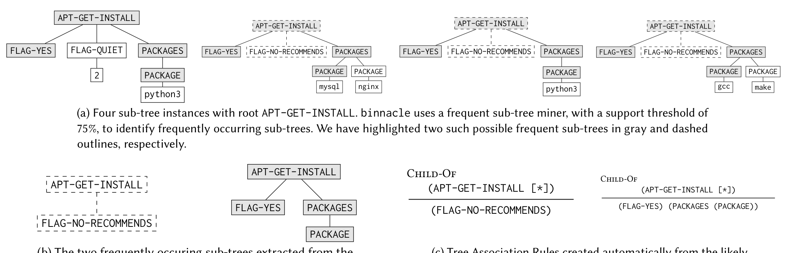
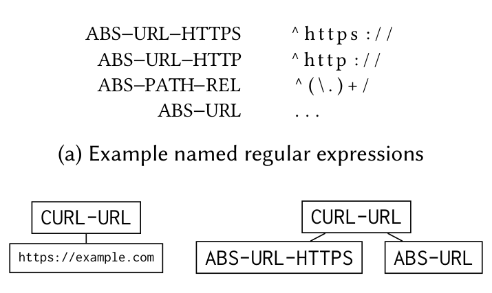

python3

(a) Four sub-tree instances with root APT-GET-INSTALL. binnacle uses a frequent sub-tree miner, with a support threshold of 75%, to identify frequently occurring sub-trees. We have highlighted two such possible frequent sub-trees in gray and dashed outlines, respectively.

APT-GET-INSTALL  Child-Of
APT-GET-INSTALL  (APT-GET-INSTALL [*])  Child-Of  (APT-GET-INSTALL [*])
FLAG-YES  PACKAGES  (FLAG-NO-RECOMMENDS)  (FLAG-YES) (PACKAGES (PACKAGE))
FLAG-NO-RECOMMENDS
PACKAGE

(b) The two frequently occurring sub-trees extracted from the example input corpus in Fig. 4(a); these trees become likely consequents in Fig. 4(b).

(c) Tree Association Rules created automatically from the likely consequents in Fig. 4(b). The antecedent denotes the set of all sub-trees with the indicated root node-type.

Fig. 4: A depiction of rule mining in binnacle via frequent sub-tree mining.

From an antecedent, a consequent, and these two pieces of localizing information, we can form a complete rule against which the enriched ASTs created by the phased parser can be checked. We call these Tree Association Rules (TARs). Three example TARs are given in Fig. 3. We are not the first to propose Tree Association Rules; Mazuran et al. [25] proposed TARs in the context of extracting knowledge from XML documents. The key difference is that their TARs require that the consequent be a child of the antecedent in the tree, while we allow for the consequent to occur outside of the antecedent, either preceding it or succeeding it. Although we allow for this more general definition of TARs, our miner is only capable of mining local TARs — that is, TARs in the style of Mazuran et al. [25]; however, our static rule-enforcement engine has no such limitation.

Rule impacts. For each of the Gold rules, Table 1 provides the consequences of a rule violation and a judgement as to whether a given rule is unique to Dockerfiles or more aligned with general Bash best-practices. In general, we note that rule violations have varying consequences, including space wastage, container bloat (and consequent increased attack surface), and instances of outright build failure. Additionally, two-thirds of the Gold rules are unique to using Bash in the context of a Dockerfile.

### 3.3 Abstraction

binnacle’s rule miner and static rule-enforcement engine both employ an abstraction process. The abstraction process is complementary to phased parsing — there may still be information within literal values even when those literals are not from some well-defined sub-language. During the abstraction process, for each tree in the input corpus, every literal value residing in the tree is removed, fed to an abstraction subroutine, and replaced by either zero, one, or several abstract nodes (these abstract nodes are produced by the abstraction subroutine). The abstraction subroutine simply applies a user-defined list of named regular expressions to the input literal value. For every matched regular expression, the abstraction subroutine returns an abstract node whose type is set to the name of the matched expression. For example, one abstraction we use attempts to detect URLs; another detects if the literal value is a Unix path and, if so, whether it is relative or absolute. The abstraction process is depicted in Fig. 5. The reason for these abstractions is to help both binnacle’s rule-learning and static-rule-enforcement phases by giving these tools the vocabulary necessary to reason about properties of interest.

### 3.4 Rule Mining

The binnacle toolset approaches rule mining by, first, focusing on a specific class of rules that are more amenable to automatic recovery: rules that are local. We define a local Tree Association Rule (TAR) as one in which the consequent sub-tree exists within the antecedent sub-tree. This matches the same definition of TARs introduced by Mazuran et al. [25]. Based on this definition, we note that local TARs must be intra-directive (scope) and must be child-of (location). Three examples of local TARs (each of which our rule miner is able to discover automatically) are given in Figs. 3(c) and 4(c). In general, the task of finding arbitrary TARs from a corpus of hundreds of thousands of trees is computationally infeasible. By focusing on local TARs, the task of automatic mining becomes tractable.

To identify local TARs binnacle collects, for each node type of interest, the set of all sub-trees with roots of the given type (e.g.,

ABS URL ...

(a) Example named regular expressions

CURL-URL  CURL-URL
https://example.com  ABS-URL-HTTPS  ABS-URL

(b) Before abstraction  (c) After abstraction

Fig. 5: An example of the abstraction process.