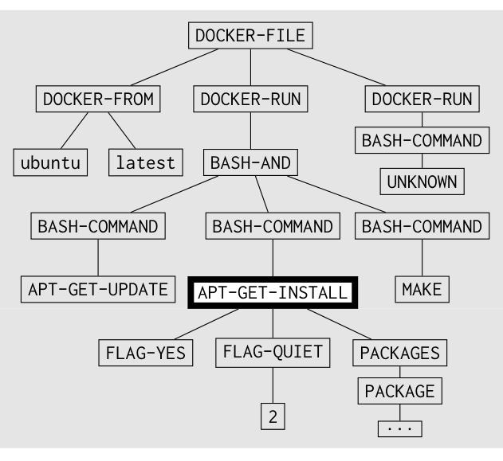
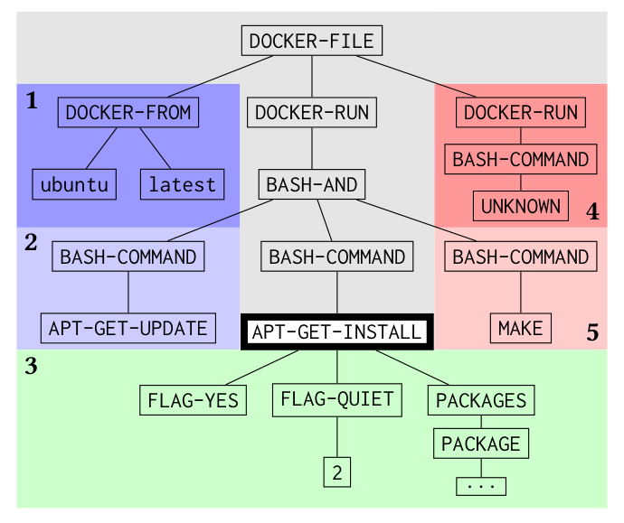
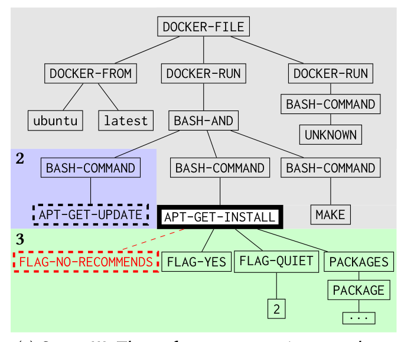

(a) Stage I: The enforcement engine attempts to match the TAR’s antecedent (shown in the outlined box above). A match is found when the subtree in a TAR’s antecedent can be aligned with any subtree in the input tree. All three rules given in Fig. 3 have antecedents that match the above tree.

(b) Stage II: If the enforcement engine matches the TAR’s antecedent, then, depending on the location and scope of the TAR, the enforcement engine will bind one of the five shaded regions above. For the rule given in Fig. 3(a) (intra-directive preceding), region (2) is matched. For the rule in Fig. 3(b) (intra-directive following), region (5) is matched. The darker shaded regions (1, 4) are the inter-directive variants of regions (2, 5).

(c) Stage III: The enforcement engine searches for the consequent in the bound region. For the rule in Fig. 3(a), the blue shaded region is bound and the consequent (shown with a dashed black outline) is matched; therefore, the rule in Fig. 3(a) has been validated. Conversely, for the rule in Fig. 3(c), the green region is bound and there are no matches for the consequent of this rule (represented by the dashed red box); therefore, the rule in Fig. 3(c) has been violated.

Fig. 6: binnacle’s rule engine applied to an example Dockerfile

binnacle employs frequent sub-tree mining [13] to recover a set of likely consequents. Specifically, binnacle uses the CMTreeMiner algorithm [14] to identify frequent maximal, induced, ordered sub-trees. Induced indicates that all “child-of” relationships in the sub-tree exist in the original tree (as opposed to the more permissive “descendent-of” relationship, which defines an embedded sub-tree). Ordered signifies that order of the child nodes in the sub-tree matters (as opposed to unordered sub-trees). A frequent sub-tree is maximal for a given support threshold if there is no super-tree of the sub-tree with occurrence frequency above the support threshold (though there may be sub-trees of the given sub-tree that have a higher occurrence frequency). For more details on frequent sub-trees, see Chi et al. [13].

binnacle returns rules in which the antecedent is the root node of a sub-tree (where the type of the root node matches the input node-type) and the consequent is a sub-tree identified by the frequent sub-tree miner.

An example of the rule-mining process is given in Fig. 4. In the first stage of rule mining, all sub-trees with the same root node-type (APT-GET-INSTALL) are grouped together and collected. For each group of sub-trees with the same root node-type, binnacle employs frequent sub-tree mining to find likely consequents. In our example, two frequently occurring sub-trees (in gray and dashed outlines, respectively) are given in Fig. 4(b). Finally, binnacle creates local TARs by using the root node as the antecedent and each of the frequent sub-trees as a consequent, as shown in Fig. 4(c). One TAR is created for each identified frequent sub-tree.

### 3.5 Static Rule Enforcement

Currently, the state-of-the-art in static Dockerfile support for developers is the VSCode Docker extension [7] and the Hadolint Dockerfile-linting tool [3]. The VSCode extension provides highlighting and basic linting, whereas Hadolint employs a shell parser (ShellCheck [5] — the same shell parser we use) to parse embedded bash, similar to our tool’s second phase of parsing. The capabilities of these tools represent steps in the right direction but, ultimately, they do not offer enough in the way of deep semantic support. Hadolint does not support parsing of the arguments of individual commands as binnacle does in its third phase of parsing. Instead, Hadolint resorts to fuzzy string matching and regular expressions to detect simpler rule violations.

binnacle’s static rule-enforcement engine takes, as input, a Dockerfile and a set of TARs. binnacle’s rule engine runs, for each rule, three stages of processing on the input corpus:

1. Stage I: The Dockerfile is parsed into a tree representation, and the enforcement engine attempts to match the TAR’s antecedent (by aligning it with a sub-tree in the input tree). If no matches are found, the engine continues processing with the next TAR. If a match is found, then the enforcement engine continues to Stage II. This process is depicted in Fig. 6(a).

2. Stage II: Depending on the scope and location of the given TAR, the enforcement engine binds a region of the input tree. This region is where, in Stage III, the enforcement engine will look for a sub-tree with which the consequent can be aligned. Fig. 6(b) depicts this process, and highlights the various possible binding regions in the example input tree.

3. Stage III: Given a TAR with a matched antecedent and a bound region of the input tree, the enforcement engine attempts to align the consequent of the TAR with a sub-tree within the bound region. If the engine is able to find such an alignment, then the rule has been satisfied. If not, the rule has been violated. Fig. 6(c) depicts this process and both possible