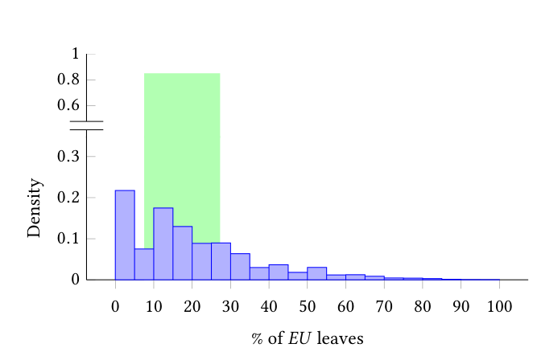
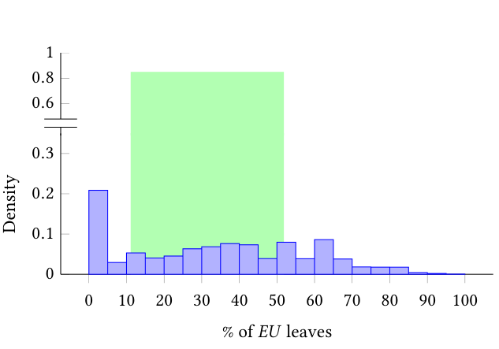
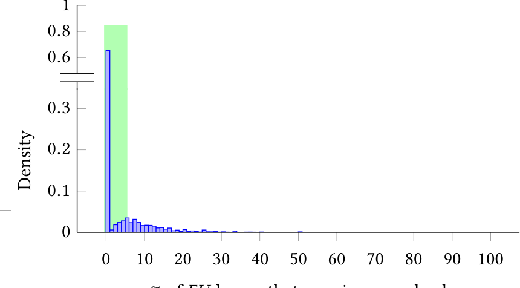

(a) Density histogram of M1 (the fraction of leaves that are EU after the first phase of parsing). On average, 19.3% of leaves (median 16.7%) are EU at this phase.

(b) Density histogram of M2 (the fraction of leaves that are EU after the second phase of parsing). On average, 33.2% of leaves (median 33.3%) are EU at this phase.

(c) Density histogram of M3 (the fraction of leaves that were EU after the second phase of parsing and unresolved in the third phase). On average, just 3.7% of leaves (median 0.0%) remained EU.

Fig. 7: Density histograms showing the distributions of our three metrics (M1, M2, and M3). The green shaded box in each plot highlights the interquartile range for each distribution (the middle 50%).

outcomes: for the rule in Fig. 3(a), the matched antecedent is shown with a thick black outline, the bound region is shown in blue, and the matched consequent is shown with a dashed black outline. In contrast, for the rule in Fig. 3(c), the matched antecedent is the same as above, the bound region is shown in green; however, the tree is missing the consequent, represented by the dashed red sub-tree.

The implementation of binnacle’s enforcement engine utilizes a simple declarative encoding for the TARs. To reduce the bias in the manually extracted Gold Rules (introduced in §3.2), we used binnacle’s static rule-enforcement engine and the Gold Set of Dockerfiles (introduced in §2) to gather statistics that we used to filter the Gold Rules. For each of the 23 rules (encoded as Tree Association Rules), we made the following measurements: (i) the support of the rule, which is the number of times the rule’s antecedent is matched, (ii) the confidence of the rule, which is the percentage of occurrences of the rule’s consequent that match successfully, given that the rule’s antecedent matched successfully, and (iii) the violation rate of the rule, which is the percentage of occurrences of the antecedent where the consequent is not matched. Note that our definitions of support and confidence are the same as that used in traditional association rule mining [10]. We validated our Gold Rules by keeping only those rules with support greater than or equal to 50 and confidence greater than or equal to 75% on the Gold Set. These support and confidence measurements are given in Table 1. By doing this filtering, we increase the selectivity of our Gold Rules set, and reduce the bias of our manual selection process. Of the original 23 rules in our Gold Rules, 16 pass the minimum-support threshold and, of those 16 rules, 15 pass the minimum-confidence threshold. Henceforth, we use the term Gold Rules to refer to the 15 rules that passed quantitative filtering. These 15 rules are highlighted, in gray, in Table 1.

Together, binnacle’s phased parser, rule miner, and static rule-enforcement engine enable both rule learning and the enforcement of learned rules. Fig. 1 depicts how these tools interact to provide the aforementioned features. Taken together, the binnacle toolset fills the need for structure-aware analysis of DevOps artifacts and provides a foundation for continued research into improving the state-of-the-art in learning from, understanding, and analyzing DevOps artifacts.

## 4 EVALUATION

In this section, for each of the three core components of the binnacle toolset’s learning and enforcement tools, we measure and analyze quantitative results relating to the efficacy of the techniques behind these tools. All experiments were performed on a 12-core workstation (with 32GB of RAM) running Windows 10 and a recent version of Docker.

### 4.1 Results: Phased Parsing

To understand the impacts of phased parsing, we need a metric for quantifying the amount of useful information present in our DevOps artifacts (represented as trees) after each stage of parsing. The metric we use is the fraction of leaves in our trees that are effectively uninterpretable (EU). We define a leaf as effectively uninterpretable (EU) if it is, after the current stage of parsing, a string literal that could be further refined by parsing the string with respect to the grammar of an additional embedded language. (We will also count nodes explicitly marked as unknown by our parser as being EU.)

For example, after the first phase of parsing (the top-level parse), a Dockerfile will have nodes in its parse tree that represent embedded bash—these nodes are EU at this stage because they have further structure that can be discovered given a bash parser; however, after the first stage of parsing, these leaves are simply treated as literal values, and therefore marked EU.

We took three measurements over the corpus of 178,000 unique Dockerfiles introduced in §2: (M1) the distribution of the fraction of leaves that are EU after the first phase of parsing, (M2) the distribution of the fraction of leaves that are EU after the second phase of parsing, and (M3) the distribution of the fraction of leaves that are EU after the second phase of parsing and unresolved during the third phase of parsing.4

4 For (M3) we make a relative measurement: the reason for using a different metric is to accommodate the large number of new leaf nodes that the third phase of parsing