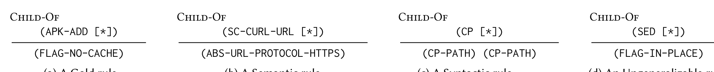

(FLAG-NO-CACHE) (ABS-URL-PROTOCOL-HTTPS) (CP-PATH) (CP-PATH) (FLAG-IN-PLACE)  
(a) A Gold rule (b) A Semantic rule (c) A Syntactic rule (d) An Ungeneralizable rule  
Fig. 8: Four examples of actual rules recovered by binnacle’s automated miner. Through abstraction, interesting semantic rules, such as using HTTPS URLs with curl, are captured.

Density histograms that depict the three distributions are given in Fig. 7. As shown in Fig. 7, after the first phase of parsing, the trees in our corpus have, on average, 19.3% EU leaves. This number quantifies the difficulty of reasoning over DevOps artifacts without more sophisticated parsing. Furthermore, the nodes in the tree most likely to play a role in rules happen to be the EU nodes at this stage. (This aspect is something that our quantitative metric does not take into account and hence over-estimates the utility of the representation available after Phase I and Phase II.)

Counterintuitively, the second phase of parsing makes the situation worse: on average, 33.2% of leaves in second-phase trees are EU. Competing tools, like Hadolint, work over DevOps artifacts with a similar representation. In practice, competing tools must either stay at what we consider a Phase I representation (just a top-level parse) or utilize something similar to our Phase II representations. Such tools are faced with the high fraction of EU leaves present in a Phase II AST. Tools using Phase II representations, like Hadolint, are forced to employ regular expressions or other fuzzy matching techniques as part of their analysis.

Finally, we use our parser generator and the generated parsers for the top-50 commands to perform a third phase of parsing. The plot in Fig. 7(c) shows the M3 distribution obtained after performing the third parsing phase on our corpus of Dockerfiles. At this stage, almost all of the EU nodes are gone—on average, only 3.7% of leaves that were EU at Phase II remain EU in Phase III. In fact, over 65% of trees in Phase II had all EU leaves resolved after the third phase of parsing. These results provide concrete evidence of the efficacy of our phased-parsing technique, and, in contrast to what is possible with existing tools, the Phase III structured representations are easily amenable to static analysis and rule mining.

## 4.2 Results: Rule Mining

We applied binnacle’s rule miner to the Gold Set of Dockerfiles defined in §2. We chose the Gold Set as our corpus for rule learning because it presumably contains Dockerfiles of high quality. As described in §3.4, binnacle’s rule miner takes, as input, a corpus of trees and a set of node types. We chose to mine for patterns using any new node type introduced by the third phase of parsing. We selected these node types because (i) they represent new information gained in the third phase of our phased-parsing process, and (ii) all rules in our manually collected Gold Rules set used nodes created in this phase. Rules involving these new nodes (which come from the most deeply nested languages in our artifacts) were invisible to prior work.

Without this adjustment, one could argue that our measurements are biased because the absolute fraction of EU leaves would be low due to the sheer number of new leaves introduced by the third parsing phase. To avoid this bias, we measure the fraction of previously EU leaves that remain unresolved, as opposed to the absolute fraction of EU leaves that remain after the third phase of parsing (which is quite small due to the large number of new leaves introduced in the third phase).

To evaluate binnacle’s rule miner, we used the Gold Rules (introduced in §3.2). From the original 23 Gold Rules we removed 8 rules that did not pass a set of quantitative filters—this filtering is described more in §3.5. Of the remaining 15 Gold Rules, there are 9 rules that are local (as defined in §3.4). In principal, these 9 rules are all extractable by our rule miner. Furthermore, it is conceivable that there exist interesting and useful rules, outside of the Gold Rules, that did not appear in the dockerfile changes that we examined in our manual extraction process. To assess binnacle’s rule miner we asked the following three questions:

- (Q1) How many rules are we able to extract from the data automatically?
- (Q2) How many of these rules match one of the 9 local Gold Rules? (Equivalently, what is our recall on the set of local Gold Rules?)
- (Q3) How many new rules do we find, and, if we find new rules (outside of our local Gold Rules), what can we say about them (e.g., are the new rules useful, correct, general, etc.)?

For (Q1), we found that binnacle’s automated rule miner returns a total of 26 rules. binnacle’s automated rule miner is selective enough to produce a small number of output rules—this selectivity has the benefit of allowing for easy manual review.

To provide a point of comparison, we also ran a traditional association rule miner over sequences of tokens in our Phase III ASTs (we generated these sequences via a pre-order traversal). The association rule miner returned thousands of possible association rules. The number of rules could be reduced, by setting very high confidence thresholds, but in doing so, interesting rules could be missed.

For (Q2), we found that two thirds (6 of 9) local Gold Rules were recovered by binnacle’s rule miner. Because binnacle’s rule miner is based on frequent sub-tree mining, it is only capable of returning rules that, when checked against the corpus they were mined from, have a minimum confidence equal to the minimum support supplied to the frequent sub-tree miner.

In addition to measuring recall on the local Gold Rules, we also examined the rules encoded in Hadolint to identify all of its rules that were local. Because Hadolint has a weaker representation of Dockerfiles, we are not able to translate many of its rules into local TARs. However, there were three rules that fit the definition of local TARs. Furthermore, binnacle’s automated miner was able to recover each of those three rules (one rule requires the use of apt-get install’s -y flag, another requires the use of apt-get install’s --no-install-recommends flag, and the third requires the use of apk add’s --no-cache flag).

To classify the rules returned by our automated miner, we assigned one of the following four classifications to each of the 26 rules returned: