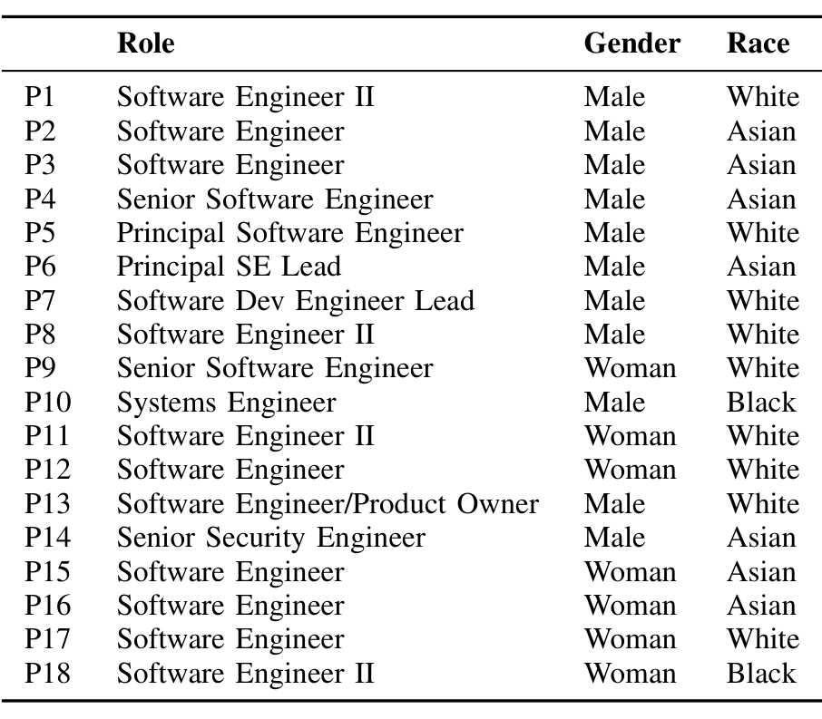

## TABLE I PARTICIPANT DEMOGRAPHICS

Of this study, we define a software tool as any technology that supports software engineering. For example, this can include an integrated development environment (IDE), an issue tracker, or even Notepad.

### B. Interviewees

We recruited software engineers internal and external to Microsoft. To recruit internal engineers, we reached out to individual engineers using Teams. We found engineers to contact on tool distribution lists and in relevant Teams groups. We also got help recruiting interviewees from other engineers who advertised our study in their respective circles. To recruit external engineers, we posted advertisements for our study on Twitter and LinkedIn.

Each potential interviewee was required to provide consent and sign up for an available interview slot via a pre-interview survey. We also used this survey to collect basic demographic information from interviewees. Our recruitment efforts yielded a total of 19 interviewees. We conducted the first interview as a pilot run to test our interview script and catch any issues we may have missed. The results reported in this paper are from the 18 interviews that followed.

Our final set of interviewees is listed in Table I. Our final sample included 12 Microsoft employees and 6 non-Microsoft employees. Eleven of our interviewees identified as male and 7 who identified as female. Most of our interviewees were located in the United States, with the exception of one who was located in the United Kingdom and one located in Canada. Two interviewees self-identified as Black or African American, 7 self-identified as Asians, and the remaining self-identified as White. P12 identified as a White Woman of Hispanic or Latino descent. Most engineers in our sample are software engineers, but we also interviewed security, systems, and lead engineers. Interviewees’ years of professional software development experience range from 1 year to 15 years and of the 18 interviewees included in our final data set, six consider themselves to also be open source developers.

### C. Data Collection

To answer our research question, we conducted semi-structured interviews. The interview was divided into three main portions: background, trust in other engineers, trust in software tools. The interview guide can be found online in the supplemental materials [11].

We designed the background portion of the interview to gather insights on the day-to-day tasks and interactions for each interviewee. This also helped set the stage for the questions to follow on their trust in the individuals and tools they interact with. We asked questions such as “What project or team do you currently work on?” and “What are the typical activities or tasks you typically work on in your current role?”.

We designed the second portion of our interview to gain insights into our interviewees’ thoughts about trust when developing and maintaining software with other engineers. We first asked them to define trust when it comes to collaborators on software projects. To determine if there are nuances to trust in different contexts, we asked a series of follow-up questions on trust when coding with and learning from other engineers.

The third portion of our interview shifted the dialogue from humans to tools. We again asked interviewees to first define trust, but this time in the context of tools they use to develop and maintain software. The follow-up questions in this portion mapped explicitly to tasks developers could use tools for: writing code, generating tests, finding bugs, and fixing bugs. We concluded the third portion of the interview with an opportunity for interviewees to share any ideas they had for creating or improving software tools that aide in the completion of their day to day tasks. Following the third portion of the interview, we opened the floor for interviewees to share any additional insights or thoughts they had on trust in software tools, or specifically AI-assisted software tools.

Each interview lasted approximately 1 hour and took place on Teams. We recorded both audio and the screen for the duration of each session. Following each session, we compensated interviewees with a $50 Amazon.com gift card. Each interview video was transcribed using a transcription company.

### D. Data Analysis

To analyze our data, we conducted a mixed qualitative coding approach led by the first author. Given we conducted this research with a partially distributed research team, all discussions regarding data analysis occurred virtually.

We followed a combination deductive and inductive coding approach, which means that we first created an initial codebook for coding our interviews (deductive) [12]. We derived the categories and code for the initial codebook based on the questions we asked our interviewees and the information we intended to collect from those questions. For example, the first category in our codebook was “Background” given we designed the first portion of our interview to collect background information. Codes in this category include background-project (what project or team the interviewee works on), background-daytoday (typical tasks or activities