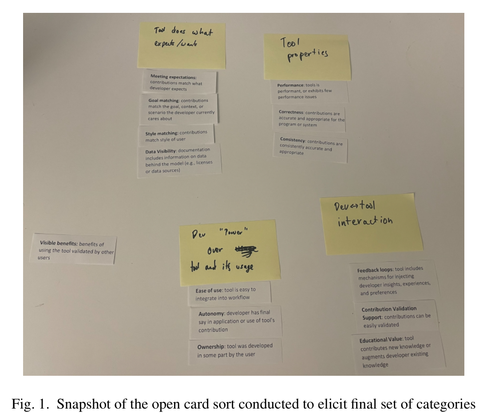

Fig. 1. Snapshot of the open card sort conducted to elicit final set of categories for the PICSE framework.

interviewees complete in their current role), and background-tool use (tools interviewees use in their day to day). Our initial codebook included fourteen codes across the six categories (background, human trust, tool trust, AI tools, tool ideas, and other).

After deriving our initial codebook, we began coding our transcripts using ATLAS.ti [13]. As we came across data that suggested the need for a new code (e.g., a commonly used sub- or follow-up question), we added new codes to our codebook (inductive) [12]. Once the first author finished coding all 18 interviews and refining the codebook, we conducted two validation tasks to improve the trustworthiness of our findings. The first validation task followed guidelines by Lincoln & Guba [14]. We invited an outside auditor to review our methodology and developing codebook. Our external auditor is an empirical researcher that is external to Microsoft, an expert in qualitative work, and has published qualitative work in top tier venues. They have knowledge of the space in which we are collecting data (human factors and software tools).

We provided the auditor with samples of raw, coded data along with the coding process and codebook used. We gave instructions to confirm that the initial codebook was in fact driven by the interview script, the emergent codes were properly documented, and that the inferences from the data made sense. We discussed and revised codes based on this person's feedback, but there were no disagreements in our coding and categorizing the data. Under their advice regarding our code and category descriptions, we updated code and category descriptions, as well as corresponding examples when necessary. Our final codebook, which includes 31 codes across six categories, can be found in the supplemental materials [11].

Once we determined our final set of codes, the final step in our data analysis was to conduct a thematic analysis of the resulting codes and categories [15] to determine the high level themes that eventually form the PICSE framework. This

process was also led by the first author, who started by creating code groups in ATLAS.ti in order to narrow data analysis to quotations that map to trust in software tools.

In the first iteration through the relevant code groups, the first author went through each of the quotations and documented the higher order themes as they emerged across quotations. After going through all the quotations that mapped to trust in tools, the first author made a second pass through the emergent themes to identify any potential overlap across themes. We iteratively discussed as a group each round of themes until we determined a final set of unique themes from our findings (the factors in our framework).

To form the high level categories of the PICSE framework, the second author conducted an open card sort on the final set of unique themes. Figure 1 depicts the initial themes and categories. The second author shared the initial categories with the research team for discussion. This discussion led to the renaming and clarification of some of the themes and categories, resulting in the final categories and themes in Figure 2.

## III. FINDINGS

Our interviews gathered insights on how engineers think about trust in the context of software development. Figure 2 summarizes the various factors that engineers may consider when determining initial trust and working to build, or re-build, trust before and during use.

Based on the interviews we conducted with software engineers, the following categories emerged to form the PICSE framework of trust in software tools:

- Personal: internal, external, and social factors that impact trust
- Interaction: various aspects of engineer's engagement with the tool that impact trust
- Control: factors that impact trust as it pertains to engineers' power and control over the tool and its usage
- System: properties of the tool that impact trust
- Expectations: meeting engineers' expectations that they have built impacts trust

Below we outline each of the categories in the PICSE framework and factors within them. It is important to note that each factor can be impacted by (or have impact on) different users and stakeholders; no one person can make sure all components are considered. We discuss ways in which practitioners can attempt to make use of the PICSE framework in Section V.

### A. Personal Factors

Personal factors in the PICSE framework represent the intrinsic, extrinsic, and social aspects of tool adoption and use that impact trust. Based on our findings, this includes community, source reputation, and clear advantages.