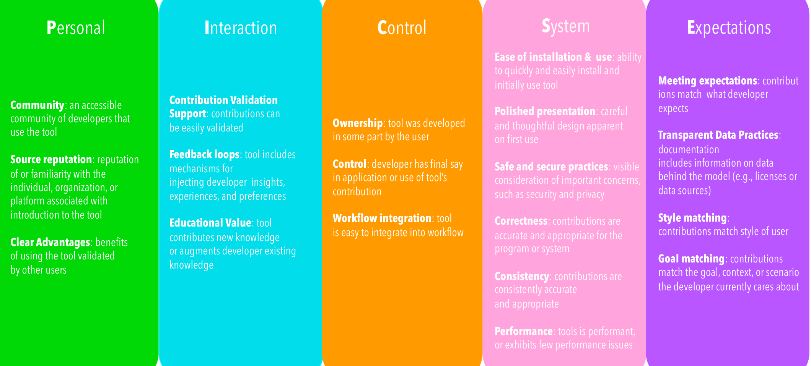

## The PICSE Framework

Fig. 2. The PICSE framework for trust in software tools

### Community

We found that one aspect of a tool that can impact trust is the community of users (or lack there) behind a given tool.

For some, like P5 who polls collaborators and co-workers about tools they should trust, the community of users should be in their own circles. For others, like P7, community can be more broad and a part of that trust is knowing the practice is a preferred practice by others.

> “That’s probably recommended because over the community that’s how it’s preferable. Then you’re leaning towards more into the more community-wide practices.” (P7)

P17 compared tool adoption and use to that of social media platforms, stating:

> “Even if I trust the brand, nobody else is on there... I wouldn’t download the app, the social media. If there is no network, why would I use it?”

Having a community of users publicly available also provides current and potential users with a way to easily ascertain use cases, success stories, failures, and other relevant information regarding the tool. According to P3, “if a lot of people think it’s a good idea, then I would probably follow and assume it may be a good idea... that I should try it out.” He goes on to explain the value of community around tools, noting that he especially relies on the discussions happening around “sketchy” or less than favorable things regarding the tool.

build trust is through the reputation of (or familiarity with) the individual, organization, or platform associated with their introduction to the tool.

The most prominent aspect of this factor among engineers in our study was the individual that they learned about the tool from. This factor can be impacted by users seeking or acquiring insights regarding the tool from others they know. Our findings suggest that for some engineers it is intentional that they seek the input of reputable individuals when looking for or considering using a tool. For others, they do not necessarily seek out reputable sources for recommendations, but their familiarity with and the reputation of the individual(s) they associate with the tool “carries weight”.

While most of our interviewees were in agreement that the reputation of or familiarity with an individual is an influential factor, our data suggests engineers may be split on how much weight other source-related attributes carry, such as brand name or company. For some engineers, like P17, the company or brand name behind the tool has a definite impact on trust.

> “We would still use GitHub because it’s such a massive brand, everybody uses GitHub.” (P17)

For others, like P9, while a tool coming from a “reputable company” can impact trust, it may not weigh in as much as others given the fact that “there’s so many companies that do put out good tools.”

### Clear Advantages

According to our interviews, the ability to clearly see the potential benefits that come with using a