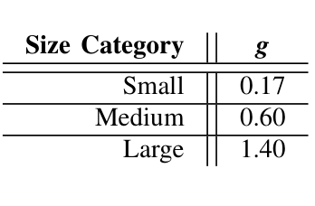
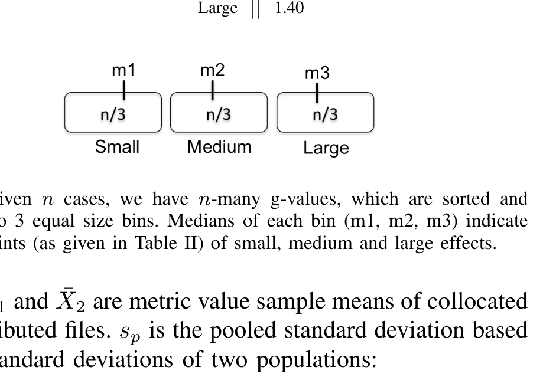

release date of service pack #1 (SP1). Each bug correction activity is associated with a collection of file changes (so called “change-list”). The file and bug information is mined from the change-lists associated with post-release bugs. Bug and the development activity information yields the final form of our data, where for each file we have the distribution, ownership, change and size metrics as well as the bug count information.

### C. Scenarios and Discovering the Effects

For the first part of the analysis, we are interested in discovering the effects between collocated and distributed files, i.e. is there a statistically significant difference? Collocated and distributed file definition can vary according to different scenarios that we are interested in. With the 5 geographical components (building, city, state, country and world), we have 4 scenarios of collocated and distributed files:

| Scenario | Collocated | Distributed |
|---|---|---|
| BLD | OBB files | All except collocated files |
| CTY | OBB and OBCi files | All except collocated files |
| STT | OBB, OBCi and OBS files | All except collocated files |
| CNT | OBB, OBCi, OBS and OBCo files | Only the OBW files |

The scenario names are the first three consonants of the biggest geographical location of the collocated files. In the first scenario the biggest geographical component of the collocated files is building and the scenario is referred as “BLD”. Table I shows the distribution of all files into collocated and distributed file groups according to each different scenario.

TABLE I
THE PERCENTAGE DISTRIBUTION OF FILES IN EACH SCENARIO.

| Scenario | % Collocated | % of Distributed |
|---|---:|---:|
| BLD | 69.8% | 30.2% |
| CTY | 89.2% | 10.8% |
| STT | 93.6% | 6.4% |
| CNT | 96.9% | 3.1% |

### D. Statistical Analysis

For the following analysis, we compared populations using the non-parametric Wilcoxon rank-sum test (a.k.a. Mann-Whitney U test) with 95% confidence for hypothesis testing. The results are presented in terms of the standard p measure; i.e. what is the probability that the conclusion is wrong? The standard rule is to use p < 0.05 since this implies less than a 5% probability of a mistake in that conclusion.

Kampenes et al. note that the conclusions drawn merely from statistical tests and the p values may be erroneous, if statistical test is not complemented with an effect size analysis [15]. They argue that the mere use of p-values is insufficient for decision making. Considering the effect sizes is beneficial not only to report meaningful outcomes of the experiments, but also for comparison purposes [10], [15].

After an extensive literature review, Kampenes et al. endorse the Hedge’s g effect size test. The formula of Hedges’ g is

g = (X̄1 − X̄2) / sp    (1)

TABLE II
THE SIZE CATEGORIES FOR THE EFFECT SIZE OF SE STUDIES AND CORRESPONDING EFFECT SIZE INTERVALS FOR HEDGES’ g. FROM [15].

Fig. 1. Given n cases, we have n-many g-values, which are sorted and divided into 3 equal size bins. Medians of each bin (m1, m2, m3) indicate the mid-points (as given in Table II) of small, medium and large effects.

where X̄1 and X̄2 are metric value sample means of collocated and distributed files. sp is the pooled standard deviation based on the standard deviations of two populations:

sp = sqrt( ((n1 − 1) s1^2 + (n2 − 1) s2^2) / ((n1 − 1) + (n2 − 1)) )    (2)

where n1, n2 are sample sizes and s1, s2 are standard deviations of the first and the second population, respectively.

The g-value can be negative or positive depending on which population is assigned to X̄1 and which one is assigned to X̄2. For uniformity, we always subtracted collocated file population metrics’ mean from that of the distributed file population metrics. This way, for each metric we can see greater or smaller than relationship (if positive, then metric’s value for distributed development is larger) between collocated and distributed files as well as the extent of the relationship (small, medium or large).

Kampenes et al. review 92 manuscripts to derive standardized effect sizes and divide the sorted effect size values into equal size bins, which are used to derive the midpoints of small, medium and large effect sizes. The g-value standard conventions as given by Kampenes et al. for SE are presented in Table II. Assuming that we have n cases (in Kampenes et al.’s case n = 92) to calculate the effect sizes, then we would have n-many g-values. These values are ordered in ascending order and divided into 3 equal size bins, see Figure 1. The median values m1, m2 and m3 of Figure 1 indicate the mid points of small, medium and large effect sizes, respectively.

Kampenes et al. note the importance of contextual effect sizes and that a “ritualized interpretation” should be avoided [15]. In the ideal case, when there are enough contextual samples, one may choose to calculate the context specific g-values. Since this study uses a single product, we will make use of the effect size values from the close context of SE, derived from 92 SE studies [15].

V. RESULTS

Recall from the above that related work suggests we should reject the five hypotheses defined in this study. In summary, that did not happen: