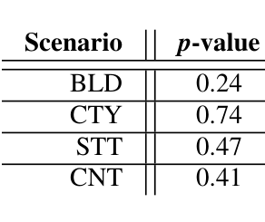
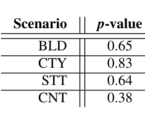
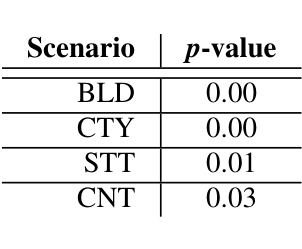
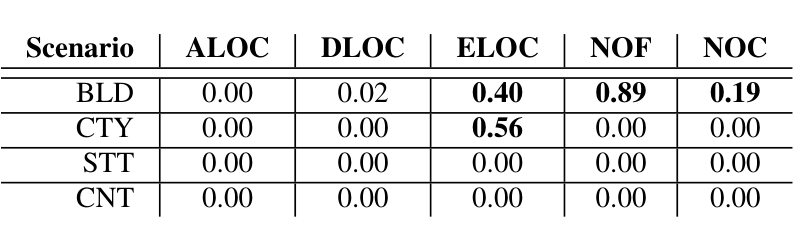
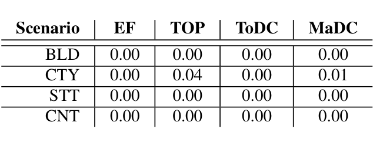

- H1 and H2 both failed to be rejected.
- Initially, our statistical hypothesis tests rejected H3, H4, H5, but the Hedges test showed that the size of these effects was negligible. Therefore we had to accept these three hypotheses.

That is, for the software explored here, none of the following results call into question the value of distributed development.

### A. Hypothesis Testing Results

For completeness sake, we first present the hypothesis testing results. Then, we show that the somewhat arcane mathematics of hypothesis testing actually confuse a very simple result for practitioners: i.e. the size of the effect between collocated and distributed software is negligibly small.

Hypothesis testing failed to reject H1: Collocated and distributed files associated with major developers (MaDC > 0) have similar post-release quality. Before the comparison of files to test H1, we identified the collocated and distributed files for which there is a major developer (i.e. MaDC > 0). Then, in a similar fashion, we identified the ones without a major developer (i.e. MaDC = 0). Testing H1 requires the comparison of the post-release bug counts associated with the collocated and distributed files for which MaDC > 0. The p-values of this comparison for all 4 scenarios are given in Table III. Note that all the p-values are greater than 0.05, i.e. collocated and distributed files with a major developer do not have statistically significantly different bug counts.

Also, hypothesis testing failed to reject H2: Collocated and distributed files without any major developers (i.e. MaDC = 0) have similar post-release quality. To see this, note that testing H2 requires the comparison of the bug counts of files without a major developer, i.e. the collocated and distributed files for which MaDC = 0. The p-values of this comparison for 4 different scenarios are provided in Table IV. In all the comparisons the p-values are much bigger than 0.05.

Hypothesis testing rejected H3: Collocated & distributed files are equally failure prone. To see this, for each of the 4 scenarios (defined in Section IV-C), we compared the bug numbers of collocated and distributed files. The corresponding p-values of the comparisons are given in Table V. Note that in all of the scenarios the bug counts of collocated and distributed files are significantly different.

The files without a bug (i.e. files with a bug count of zero) are a big majority for Office 2010. Since such a distribution might influence the result of the statistical test, we performed the same statistical test on collocated and distributed files (whose bug counts are greater than zero). The results were the same: all p-values very close to zero. Our analysis showed that for multiple scenarios, distributed and collocated files have significantly different post-release bug counts.

Similarly, hypothesis testing rejected H4: Distributed and collocated files have similar change and size metrics. To see this, we compared the change and size metrics of distributed and collocated files for 4 different scenarios. The resulting

### TABLE III
ABOUT H1: THE p-VALUES OF POST-RELEASE BUG COUNT COMPARISON BETWEEN COLLOCATED AND DISTRIBUTED FILES, FOR WHICH MaDC > 0.

### TABLE IV
ABOUT H2: THE p-VALUES OF POST-RELEASE BUG COUNT COMPARISON BETWEEN COLLOCATED AND DISTRIBUTED FILES, FOR WHICH MaDC = 0.

### TABLE V
ABOUT H3: THE COMPARISON OF COLLOCATED AND DISTRIBUTED FILE BUG COUNTS.

### TABLE VI
ABOUT H4: THE p-VALUES OF COMPARING THE CHANGE AND SIZE METRICS OF COLLOCATED AND DISTRIBUTED FILES.

### TABLE VII
ABOUT H5: THE p-VALUES OF COMPARING THE OWNERSHIP METRICS OF COLLOCATED AND DISTRIBUTED FILES.

The resulting p-values for each scenario can be seen in Table VI. The p-values of Table VI show that collocated and distributed files are different to one another in terms of every size and change metric, with the exception of the 4 bold-face cells. For most of our comparisons the collocated and distributed files do not have similar change and size metrics.

Lastly, hypothesis testing rejected H5: Distributed and collocated files have similar ownership characteristics. As evidence for this, consider the p-values associated with the comparison of collocated and distributed files in terms of ownership metrics (in Table VII). For 4 different scenarios and 4 metrics, there is no p-value that is greater than 0.05, i.e. for all the comparisons, the collocated and distributed files have significantly different metric values.