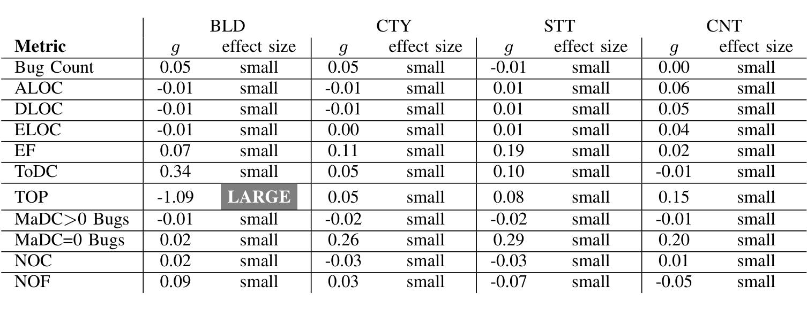
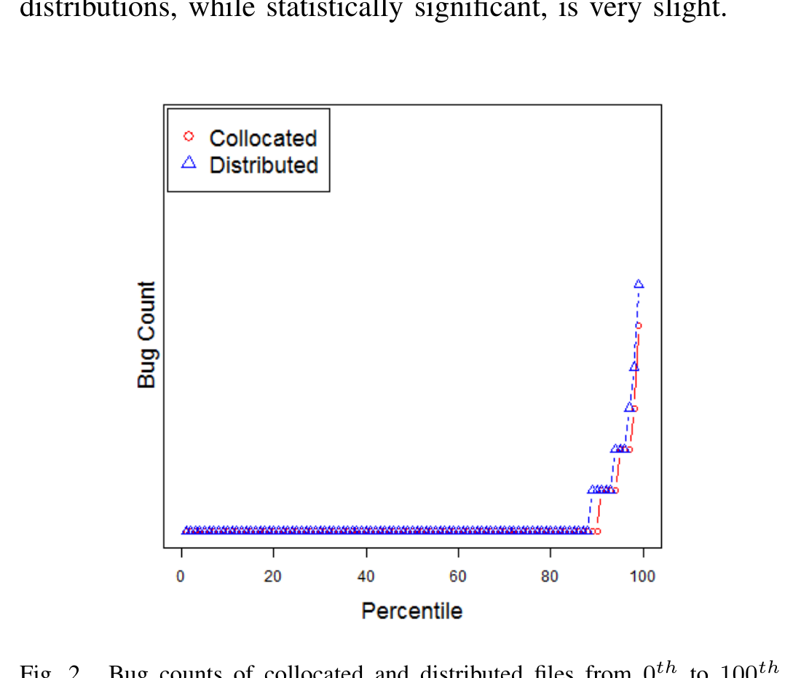

## TABLE VIII

The effect sizes of the difference between collocated and distributed files in terms of Hedges' g and the corresponding size category [15]. g is calculated from Equation 1 and the effect size is calculated from Table II.

A factor that may influence ownership metrics is the number of developers working on files. For some files, it is possible that all the edits to a file come from a single developer. That is not necessarily a problem; after all one developer may be the sole owner of a file; however, all such files would be owned at the building level and never have the possibility of being a distributed file. We repeated the ownership metrics analysis on the files with at least 2 developers (i.e., any file could be collocated or distributed). The results were the same: the p-value tests showed that collocated and distributed files were significantly different from one another in all cases.

### B. Effect Size Results

The rejection of H3, H4, H5 is consistent with much of the prior literature on code ownership, distributed development, and code quality. However, a closer reflection over the data shows that the rejection was premature. Figure 2 shows the bug counts of collocated and distributed files (in BLD scenario) from 0th to 100th percentile, with increments of 1. Note that the difference between the distributed and collocated distributions, while statistically significant, is very slight.

Fig. 2. Bug counts of collocated and distributed files from 0th to 100th percentile with increments of 1.

The Hedges test confirms our visual impression of Figure 2; i.e., the differences in the bug counts are very slight. The first line of Table VIII reports the results of the Equation 1 calculation for the bug count. The other lines of that table show a similar calculation for our source code measures. Note that the standardized mean difference effect sizes are mostly categorized as small. The only counter example is the TOP metric comparison for BLD scenario, where the effect size is categorized as LARGE.

Therefore, even though statistical hypothesis testing rejected three of our hypotheses, we must conclude that these effects are small and negligible.

That is, for this sample of proprietary Microsoft software, issues of code ownership and distributed development do not impact:
- Code quality (measured in number of defects);
- The kinds of code developed (measured in terms of the static code measures shown above).

In summary, we can find no evidence that distributed development is harmful in this code since there is practically no difference between software developed by collocated and distributed software teams working on Microsoft Office 2010.

## VI. THREATS TO VALIDITY

The metrics used in this research are collected through automated SE tools that are used in production. Hence, we do not see considerable construct validity issues concerning huge errors in measurement.

Internal validity assures that the variations in the dependent variable can be attributed to the independent variables [23]. Wright et al. report that confounding factors and selection bias are among the fundamental threats to internal validity of SE studies [34]. This is particularly true for analyses performed on large software products. Because all the confounding factors may not be known in advance and the selection of metrics is biased by the availability of the metrics. Our research is no exception. For example, the selection of the metrics was limited by the availability of these metrics for Office 2010 (e.g. no test coverage or dependency metrics). Also, in this study we were interested in the raw EF values.