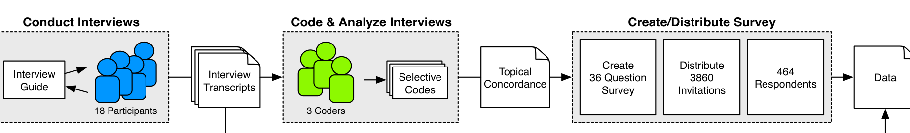
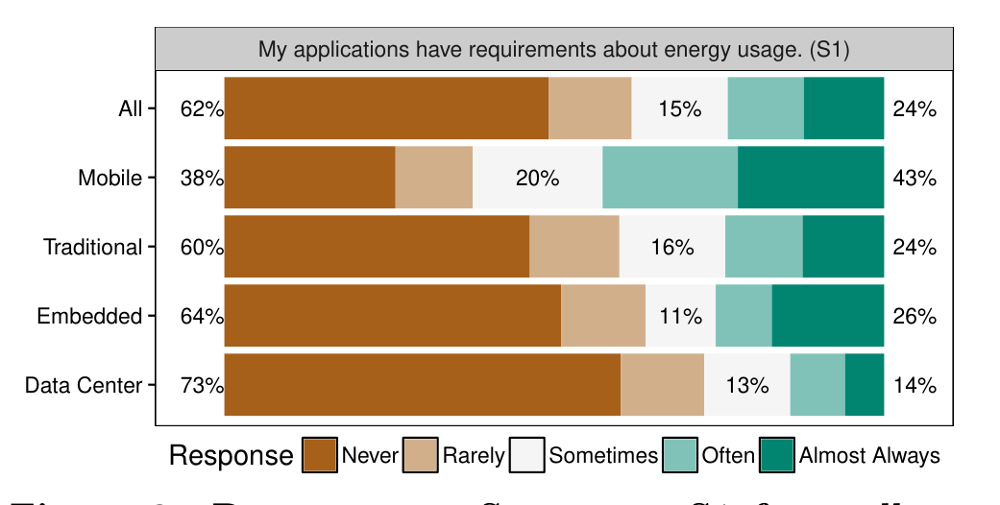
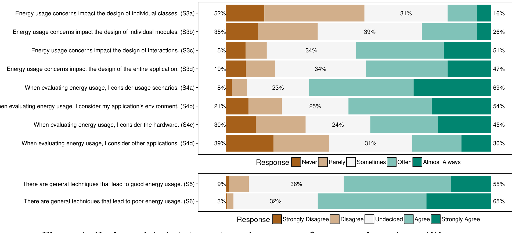
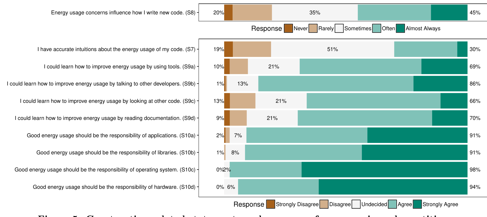
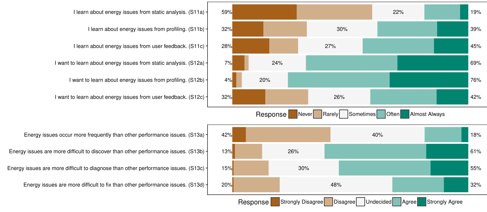
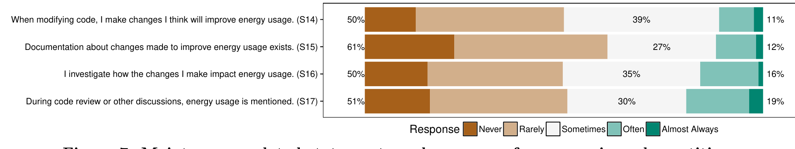

## An Empirical Study of Practitioners’ Perspectives on Green Software Engineering

Irene Manotas α · Christian Bird β · Rui Zhang γ · David Shepherd δ  
Ciera Jaspan ε · Caitlin Sadowski ε · Lori Pollock α · James Clause α

α University of Delaware, Newark, DE, USA. {imanotas,pollock,clause}@udel.edu  
β Microsoft Research, Redmond, WA, USA. christian.bird@microsoft.com  
γ IBM Research — Almaden, San Jose, CA, USA. ruiz@us.ibm.com  
δ ABB Corporate Research, Raleigh, NC, USA. {david.shepherd,will.snipes}@us.abb.com  
ε Google, Inc., Mountain View, CA, USA. {ciera,supertri}@google.com

### ABSTRACT

The energy consumption of software is an increasing concern as the use of mobile applications, embedded systems, and data center-based services expands. While research in green software engineering is correspondingly increasing, little is known about the current practices and perspectives of software engineers in the field. This paper describes the first empirical study of how practitioners think about energy when they write requirements, design, construct, test, and maintain their software. We report findings from a quantitative, targeted survey of 464 practitioners from ABB, Google, IBM, and Microsoft, which was motivated by and supported with qualitative data from 18 in-depth interviews with Microsoft employees. The major findings and implications from the collected data contextualize existing green software engineering research and suggest directions for researchers aiming to develop strategies and tools to help practitioners improve the energy usage of their applications.

#### Categories and Subject Descriptors

D.2.0 [Software Engineering]: General

#### General Terms

Human Factors, Management

#### Keywords

Green Software Engineering; Empirical Study, Survey

### 1. INTRODUCTION

The past decade has seen a dramatic shift in the type of computing devices used by consumers and enterprises. Whereas in 2010, traditional personal computer (PC) sales (desktops and laptops) outnumbered other computing platforms, in 2013, roughly 317 million PCs were sold compared to 206 million tablets and 1.2 billion smartphones [14]. This shift has not only necessitated the development of applications that run on mobile and embedded platforms, but also the development of the data center-based services on which these mobile applications often depend. As the use of these applications and services has expanded, so too have concerns about the amount of energy that they consume.

The research community has not been blind to these changes and, as a result, green software engineering — the process of helping practitioners (architects, developers, testers, managers, etc.) write more energy efficient applications — is increasingly targeted as an important problem area by software engineering researchers. The growing number of publications in events such as the International Workshop on Green and Sustainable Software (GREENS) [16], International Workshop on Measurement and Metrics for Green and Sustainable Software (MEGSUS) [37], and the Energy Aware Software-Engineering and Development Workshop (EASED) [11] as well as tracks at conferences such as the International Conference on Software Engineering (ICSE) [23] and the International Conference on Software Maintenance and Evolution (ICSME) [24], are examples of the growing and widespread interest in this research area.

Despite its increasing popularity as a research topic, little is known about practitioners’ perspectives on green software engineering. Even basic questions such as “What types of software commonly have requirements about energy usage?”, “How does the importance of reducing energy usage compare to other requirements?”, and “How do developers find and correct energy usage issues?” do not have clear answers. Without understanding practitioners' needs, researchers may find themselves in a situation where, despite the investment of significant amounts of time and effort, tools and techniques designed to make practitioners’ lives easier are underused in practice (e.g., [3, 25]).

To help inform research in green software engineering, we have conducted both in-depth interviews of 18 Microsoft practitioners from a wide range of application domains and a quantitative, targeted survey of 464 ABB, Google, IBM, and Microsoft developers and testers. To the best of our knowledge, the interviews and survey compose the first broad-based empirical study of practitioners’ perspectives on green software engineering — how they think about battery life/

---

> **Image description:** A left-to-right process diagram showing the study’s three main phases. The first phase, “Conduct Interviews,” depicts an interview guide used with 18 participants to produce interview transcripts. The second phase, “Code & Analyze Interviews,” shows 3 coders converting transcripts into selective codes and a topical concordance. The third phase, “Create/Distribute Survey,” shows those outputs used to create a 36-question survey that was sent as 3,860 invitations and yielded 464 respondents, culminating in the collected data for analysis.

Figure 1: The applied research methodology.

energy usage when they write requirements, design, construct, test, and maintain their software.

The contributions of this paper are:
- Interviews of 18 professional practitioners from Microsoft that provide in-depth, qualitative information about the green software engineering state of practice.
- A survey of 464 developers and testers from ABB, Google, IBM, and Microsoft that quantitatively assesses the themes and insights of the interviewees.
- An analysis of the collected data that identifies practitioners’ perspectives on green software engineering throughout the software development process.
- A discussion that (1) contextualizes the state-of-the-art in green software engineering research with respect to the study’s findings, and (2) suggests, for each stage of the software development process, directions for future green software engineering research.

## 2. METHODOLOGY

Figure 1 depicts our research methodology. At a high-level, it has two main components: interviews and a survey. Individually, each of these approaches has strengths and limitations; combining them leverages their individual strengths and reduces their individual weaknesses. Interviews are useful for gathering a wide range of qualitative observations and insights and for gaining an understanding of the broad context and environment that the interviewees operate in. In addition, their interactive nature allows for collecting in-depth information about participants’ thoughts and opinions. However, their high costs restrict the number that can be performed. Conversely, surveys allow for collecting only a limited amount of data from each respondent. However, their low costs allow for reaching a large number of respondents which provides generalizability. Conducting a survey after performing interviews enables us to quantify and generalize the results obtained from the interviews over a larger population and to quantitatively assess themes that were implied by the interview participants.

### 2.1 Interviews

The first step in our methodology was to interview practitioners at Microsoft. These interviews were purely exploratory and were not intended to provide generalizability. Rather the goal of this step was to learn about how the participants think about energy usage in the context of software development from a variety of perspectives and domains.

#### 2.1.1 Protocol

We used semi-structured, in-depth interviews based on an interview guide to enable a detailed exploration of the participants’ views and experiences using a flexible and responsive approach [22]. Interviews were audio-recorded at each participant’s office, with participant permission, and lasted between 30 to 60 minutes each.

At a high level, the interviews had four main parts. First, the participant was asked some general demographic questions. Second, the interviewers asked about the participant’s views on energy usage. This positioned the participant on the spectrum of energy usage and allowed the participant to speak openly about their experiences and opinions about energy usage while limiting bias from the interviewers. Third, the interviewers began to converse with the participant by asking open-ended and clarification questions based on the second part of the interview. The interactive nature of the conversations allowed the interviewers to gather detailed information about the participant’s experiences with techniques, policies, specifications, patterns, contexts, failed and successful attempts, etc. For example, questions like “Do you have a baseline platform that you use?” and “What have you seen teams do today to determine if there are energy issues with their applications?” were posed to several participants. Finally, the interviewers thanked the participant, explained how their responses would be used, and asked whether there was anything else they wanted to mention that was not previously covered.

### 2.1.2 Participants

We identified an initial group of practitioners through multiple means including using mailing lists related to energy use, querying the employee database with energy-related keywords, and communicating with product group managers to find employees that deal with energy. We included practitioners who appeared to have experience with green software engineering from areas such as mobile application development and server-side infrastructure. Because our goal was to learn about as many perspectives as possible, we ensured that the participants came from a range of projects and platforms and had various roles and levels of seniority. Such a selection strategy is called Maximum Variation Sampling [45] and is appropriate, as in this case, when a sample may be limited and “the goal is not to build a random and generalizable sample, but rather to try to represent a range of experiences related to what one is studying.”

The initial group of participants was expanded using the snowball process—participants were added based on recommendations from current participants—until the data saturation point was reached [4]. That is, once new interviews yield no additional information, further interviews will yield only marginal (if any) value [17]. Using the snowball process allowed us to access the hidden population of experienced green software practitioners—practitioners who we would otherwise be unable to identify—without incurring prohibitive costs. In total, we interviewed 18 participants, a number similar to those used in related work (e.g., [25, 28]).

#### 2.1.3 Data Analysis

We used open, axial, and selective coding to qualitatively analyze the data obtained from the interviews [15, 55]. A professional transcription service transcribed the audio recordings and divided them into 355 segments based on distinct

---

## 2.2 Survey

The second step in our methodology was to survey practitioners. While the interviews were exploratory, the goal of this step was to quantitatively assess, over a large and representative population, the qualitative information that we learned from the interviewees.

### 2.2.1 Protocol

We used Kitchenham and Pfleeger's guidelines for personal opinion surveys [27] and the results from coding the interviews to write 155 candidate statements. Each statement asks the survey respondent to either (1) rate their agreement with the statement on a 5-point Likert scale from Strongly Disagree to Strongly Agree, or (2) indicate, on a 5-point Likert scale from Never to Almost Always, how frequently the event described by the statement occurs. We then condensed the initial set of statements by removing statements that were redundant, ambiguous, or difficult for respondents to self-assess while ensuring that statements derived from each selective code were represented in the final list. This process reduced the set of candidate statements to 36 final statements, which we believed would keep the survey under our target of 15 minutes. Abbreviated versions of the final 36 statements are shown in Figures 2 to 7 and a complete copy is available online.1 In addition, we asked free response follow up questions for areas of particular interest when the response to a question indicated the respondent may have insight or evidence to share. For example, if a respondent indicated that their applications have energy usage goals or requirements, we asked them to provide an example.

### 2.2.2 Participants

We primarily recruited developers and testers as survey respondents because the statements we created reflected practices and concerns related to their work. Within each company, we recruited developers and testers who worked on applications for either mobile devices, data centers, embedded systems, or traditional PCs. To reach these groups, we selected employees based on their position in their company's organizational chart. In total, we sent invitations to 3,860 employees, 700 from ABB, 1,500 from Google, 160 from IBM, and 1,500 from Microsoft. The survey was anonymous, though we did ask respondents to provide their contact information if they were willing to let us follow up with them. At Microsoft, we offered a drawing for two $50 gift cards as this has been shown to improve participation at Microsoft in the past [54]. The overall response rate is 12% (464 responses) with per-company rates of 9% for ABB (62 responses), 9% for Google (134 responses), 13% for IBM (21 responses), and 16% for Microsoft (247 responses). Other online surveys in software engineering research have reported similar rates [47].

1 https://surveys.research.microsoft.com/s3/DeveloperEnergySurvey

## 2.3 Threats to Validity

In our interviews and survey, we avoided practitioners with no interest in energy. Thus, we may be overestimating the importance of the area as a whole. However, we were not interested in contrasting experienced and inexperienced practitioners; instead we preferred to gain insights from experienced green software engineering practitioners.

Due to the costs of interviewing practitioners, we contacted potential interviewees and provided them with a brief outline of the goals of our study. Knowing the high-level goals of the study allowed practitioners to assess whether they can provide useful information. However, because they were aware of the goals of the study, they may have provided information based on what they thought we wanted to know (hypothesis guessing) or they may have withheld information or opinions that they thought would be unpopular (evaluation apprehension) [57]. We reduced these threats by guiding the interview process and assuring the participants that their answers would be anonymized.

The fact that one of the interviewers was not a Microsoft employee may have led to participants withholding information. We addressed this threat by ensuring that at least one interviewer was employed by Microsoft and clearly stating that all relevant non-disclosure agreements had been signed.

Our interview participants were partially identified using the snowball process. One potential disadvantage of this recruitment strategy is that it may suffer from community bias (the potential for the first participants to impact the sample) [2]. The best defense against this is to begin with a group that is as diverse as possible [38]. Because we contacted our initial group of participants through multiple means (see Section 2.1.2), they show diversity by spanning organizational, product, and physical boundaries.

Our survey participants are drawn wholly from the populations of ABB, Google, IBM, and Microsoft. As a result, our findings may not be representative of the opinions and experiences of all practitioners. However, each of these companies is diverse and develops a myriad of products in various domains that run on a spectrum of platforms. In addition, we purposely targeted respondents from different areas and teams to increase heterogeneity and maximize generalizability.

We took care when creating our survey to address well-known design pitfalls [27]. In addition, we piloted the survey with a small initial set of practitioners and solicited suggestions on how to improve the survey. Based on their answers, we improved the survey before it was distributed, for example, by removing potential sources of ambiguity.

When conducting surveys through invitation, avoiding the self-selection principle is difficult [53]. Consequently, practitioners with responsibilities related to energy usage may see more benefit from contributing than others. Since we are primarily concerned with the perspectives of green software engineers, this is unlikely to represent a threat.

---

> **Image description:** A horizontal stacked-bar chart summarizes responses to S1 (“My applications have requirements about energy usage”) for All respondents and for those experienced in Mobile, Traditional, Embedded, and Data Center domains. Each bar is aggregated into Never/Rarely (left), Sometimes (center), and Often/Almost Always (right); the figure reports: All — 62% / 15% / 24%; Mobile — 38% / 20% / 43% (63% at least sometimes); Traditional — 60% / 16% / 24%; Embedded — 64% / 11% / 26%; Data Center — 73% / 13% / 14%. Interpretation consistent with the paper: mobile practitioners most often have energy requirements, data-center and embedded practitioners least often, and the higher-than-expected Traditional value likely reflects overlap with mobile development experience.

Response Never Rarely Sometimes Often Almost Always

Figure 2: Responses to Statement S1 from all respondents and respondents who indicated that they are experienced in each domain.

## 3. FINDINGS

This section presents our findings from analyzing the data collected from both the interviews and the survey. Due to confidentiality requirements, we present only anonymized, aggregate information. At a high-level, we are interested in answering two main research questions. First, in what domains is energy usage of concern to practitioners? Second, when energy usage is of concern, what are experienced practitioners’ perspectives on green software engineering?

To answer the first question, we considered the responses of all survey respondents. To answer the second research question, we focused on the responses of experienced practitioners, the 176 survey respondents (40%) who indicated that their projects have energy usage requirements: Sometimes, Often, or Almost Always (see Section 3.1). Because we are interested in the perspectives of practitioners who have experience in green software engineering, including the responses of practitioners who are inexperienced would obscure the data of interest. The quotations presented in this section are taken from both interview transcripts and survey responses.

### 3.1 Where is Energy Usage a Concern?

To understand in what domains energy usage is of concern to practitioners, we first asked respondents how frequently they write code for applications that run on mobile devices, traditional PCs, data centers, and embedded platforms. Based on their responses, we consider a participant to be experienced in a domain if they write code for that domain Sometimes, Often, or Almost Always.

Next we asked respondents how frequently their applications have requirements about energy usage. Figure 2 shows a summary of the responses we received. The top of the figure shows the statement that was presented to participants followed by a label that we use to refer to the statement. The left-hand side of the figure shows different groups: All contains the responses of all 464 respondents; Mobile contains the responses of the 241 experienced mobile respondents; Traditional contains the responses of the 328 experienced traditional respondents; Embedded contains the responses of the 47 experienced embedded systems respondents; and Data Center contains the responses of the 255 experienced data center respondents. The body shows stacked bar charts summarizing the proportion of respondents that chose, from left to right, Never, Rarely, Sometimes, Often, and Almost Always. The numeric percentages in the figure indicate the percentage of respondents that chose Never or Rarely (left), Sometimes (center), and Often or Almost Always (right).

For example, for the All group 62% of respondents answered either Never or Rarely, 15% answered Sometimes, and 24% answered Often or Almost Always.

Based on our interviews, we initially theorized that practitioners with experience in mobile ("battery life is very important, especially in mobile devices"), data center ("any watt that we can save is either a watt we don't have to pay for, or it's a watt that we can send to another server"), and embedded ("maximum power usage is limited so energy has a big influence on not only hardware but also software") would more often have requirements or goals about energy usage than traditional practitioners ("we always have access to power, so energy isn't the highest priority"). However, the results from the survey only partially support this belief.

**Experienced mobile practitioners frequently have requirements or goals about energy usage.** As Figure 2 shows, our belief that mobile practitioners have goals or requirements about energy usage most often was confirmed by the survey: 63% of experienced mobile practitioners responded that they have such requirements Sometimes, Often, or Almost Always.

**Experienced traditional practitioners have requirements or goals about energy usage more often than expected.** While we thought that Traditional projects would be by far the least likely to have energy requirements or goals, 40% of experienced traditional practitioners indicated that they have energy requirements or goals Sometimes, Often, or Almost Always. One possible explanation for this finding is that there is overlap between experienced mobile developers and experienced traditional developers. More specifically, 58% of the respondents in the Traditional group (189 out of 328) have experience writing code for mobile devices (i.e., they indicated that they write code for mobile devices Sometimes, Often, or Almost Always). Because we asked about the frequency of energy requirements or goals for the respondent’s applications in general, rather than for each domain, this level of mobile experience is likely shifting the range of responses to the more-frequent end of the spectrum. In future work, we plan to revisit this question by collecting more targeted data. Another possible explanation is that some traditional products also run on devices where battery-life is a concern (e.g., laptops).

**Experienced embedded and experienced data center practitioners rarely have requirements or goals about energy usage.** While we expected embedded and data center products to frequently have goals or requirements about energy usage, only 37% of embedded respondents and 27% of data center respondents indicated that they have such requirements more frequently than Rarely. Moreover these responses are also likely shifted towards the more-frequent end of the spectrum: 52% of embedded respondents (25 out of 48) and 37% of data center respondents (95 out of 255) indicated that they also write code for mobile devices Sometimes, Often, or Almost Always.

For the data center group, the survey responses do not necessarily contradict our interview participants. Our interview participants were primarily responsible for the physical aspects of the data centers (e.g., computers, routers, power, cooling, etc.) while our survey primarily targeted the employees who are responsible for the services that run on the data centers. This difference suggests that while there are power and energy usage concerns at the lower levels, these

---

> **Image description:** Horizontal stacked bar chart of experienced practitioners’ responses to Statement S2: “I’m willing to sacrifice performance, usability, etc. for reduced energy usage.” The bar is partitioned into Never/Rarely (20%), Sometimes (47%), and Often/Almost Always (33%), so 80% of respondents report at least some willingness to make tradeoffs for energy savings. This demonstrates a strong tendency among experienced practitioners to accept reductions in other quality attributes to improve energy usage, with only a small minority (the paper notes five respondents) answering Never.

Response: Never, Rarely, Sometimes, Often, Almost Always

Figure 3: Requirements-related statement and responses from experienced practitioners.

concerns are not influencing the requirements and goals of the applications and services that run on the data centers. Both sides seem to agree on the cause of this disparity. One program manager summarized it as follows:

> Our main concern is marketshare and that means user experience is a priority. We can be more efficient to try to cut costs, but since we don’t charge by energy used this doesn’t make us more attractive to users. So we tend to focus on other things like performance or reliability.

For the embedded group, we found several reasons why practitioners do not have requirements or goals about energy usage. First, many embedded products are not battery-powered (e.g., “In our embedded systems, we always have access to power so energy is not a concern.”). Second, many practitioners are concerned with the overall energy usage of their systems but rely on the hardware, not the software, to reduce energy usage. Finally, satisfying other metrics is more important than reducing energy usage (e.g., “Ensuring the deterministic, real-time behaviour of our embedded device is more important than saving energy.”).

### 3.2 Perspectives on Requirements

Our survey statements concerning requirements focused on whether practitioners have experience with energy usage requirements (see Section 3.1), what typical energy usage requirements look like, and how often practitioners make tradeoffs between other features and energy usage.

Energy requirements are more often desires rather than specific targets. In addition to their Likert responses to Statement S1, we also asked experienced practitioners to provide an example of an energy requirement or goal. The majority of the provided examples are what we consider desires rather than detailed requirements. For example, one respondent said that they have “no specific goals for energy usage, just ‘don’t be bad’.” Another respondent indicated that “considerations on background tasks as well as things that use the radios in phones are always in the back of my mind” and a third stated that, “the goal is to accomplish something without making the user annoyed about battery drain.” Although desires are more common, detailed requirements do exist in some cases. An interesting example is: “turn-by-turn guided navigation should not drain more battery than a car can charge.” In addition, a few respondents indicated that they have had requirements similar to “perform[ing] [user scenario] should not use more than X mA” or “under normal usage, a device with an X Wh battery should last for Y hours.”

Energy-usage requirements are often stated in terms other than energy usage. It is also interesting to note that many of the example goals and requirements are expressed in terms of things other than battery life or energy usage. We believe that this is likely due to the lack of tool support for measuring energy usage (see Section 3.5). As a result, requirements are often written in terms of more easily captured metrics that practitioners believe correlate with energy usage. In some cases, these are traditional performance metrics. As one respondent stated:

> I don’t usually think about battery life directly. Often I consider running time [...] and that ‘seems’ to suggest battery life.

In other cases, they are countable events (e.g., “We tried to optimize for when/how often we wake up the radio.”). It is interesting to note that some practitioners are aware that such proxy measures may not be accurate:

> Most people think power savings = CPU reduction.  
> This is somewhat true in a broad sense, but is only a small part of the picture. The problem is that it’s easy to measure CPU utilization (and hence reduction), but it’s very hard to translate any of this to actual power savings. Many people have spent a lot of time that ultimately had no benefit.

Unfortunately, this misconception is common and is an example of the levels of uncertainty that even experienced practitioners have (see Sections 3.3 and 3.4). Finally, there are requirements and goals that are defined in terms of previous or alternate versions, or as one respondent expressed it, “‘not worse than’ kinds of requirements” (e.g., “New feature additions or architecture changes shouldn’t regress battery life.” and “I had a requirement that energy usage in our primary scenario be comparable to the legacy solution.”).

Energy-usage requirements focus on “idle time.” A common theme in our interviews and survey responses was the importance of reducing energy usage when a user is not interacting with their device. As one participant stated:

> We’re trying to prioritize idle battery consumption down to zero. Being active is going to drain the battery. But the thing that’s going to piss people off, is if I wasn’t using it and my battery is dead so that’s where we want to focus our efforts.

In fact, one participant was so focused on idle time that they were surprised by the suggestion that non-idle time portions of an execution should also be optimized: “I haven’t thought about that, actually, when an app is in the foreground and we’re trying to still save battery in some way.”

Practitioners are often willing to sacrifice other requirements for reduced energy usage. Figure 3 shows, in the same format as Figure 2, a summary of experienced practitioners’ responses when asked how frequently they are willing to make tradeoffs between other requirements and energy usage. As the figure shows, respondents are overwhelmingly willing to make sacrifices to improve energy usage (80% of respondents answered Sometimes, Often, or Almost Always). As several respondents stated: “There is always a tradeoff between battery life vs performance/feature” and “the entire experience was a series of compromises between what designers wanted and [...] battery concerns.” In fact, only 5 respondents answered that they Never make such compromises.

### 3.3 Perspectives on Design

Our survey statements concerning design focused on how energy concerns impact different aspects of the design process, including the contexts that practitioners consider when assessing energy usage and the extent to which they believe there exist general patterns that lead to reduced energy usage and anti-patterns that lead to increased energy usage.

---

> **Image description:** Stacked-bar responses from experienced practitioners to design-related statements (S3a–S3d, S4a–S4d) show that energy concerns influence high-level design far more than low-level code: 85% and 81% of respondents said concerns impact interactions and entire applications Sometimes/Often/Almost Always, whereas only 47% and 65% said the same for individual classes and modules, respectively (52% reported Never/Rarely for class-level impact). When evaluating energy usage, practitioners most often consider usage scenarios (92% Sometimes/Often/Almost Always), followed by application environment (79%) and hardware (69%), while other applications are considered least often (61% Sometimes/Often/Almost Always; 39% Never/Rarely). Finally, a majority agree that general techniques exist that lead to good (55% Agree/Strongly Agree) and poor (65% Agree/Strongly Agree) energy usage, but a substantial fraction remain undecided (36% and 32%), indicating notable uncertainty about specific (anti-)patterns.

Response Strongly Disagree Disagree Undecided Agree Strongly Agree  
Figure 4: Design-related statements and responses from experienced practitioners.

> **Image description:** A horizontal stacked-bar chart (Figure 5) shows experienced practitioners’ responses to construction-related statements using a five-point scale from Strongly Disagree to Strongly Agree. Key takeaways visible in the chart and supported by the paper: 80% of respondents report that energy concerns influence how they write new code, but only 30% say they have accurate intuitions about their code’s energy usage (51% are undecided, 19% disagree). Practitioners are eager to learn: 86% agree/strongly agree they could learn from other developers, and roughly two-thirds agree they could learn from tools (69%), reading documentation (70%), or looking at other code (66%). Finally, respondents overwhelmingly view energy efficiency as a shared responsibility: 91% agree apps and libraries should be responsible, 98% for operating systems, and 94% for hardware.

Response Strongly Disagree Disagree Undecided Agree Strongly Agree  
Figure 5: Construction-related statements and responses from experienced practitioners.

Figure 4 shows the results we collected for these statements using the same stacked bar format as earlier figures.

Concerns about energy usage impact how applications are designed. Based on our interviews, we believed that application design would be heavily influenced by energy concerns. As one participant stated: “It’s not a bug fix to get power efficiency. It’s a design change.” The data for Statements S3a–S3d indicate that this sentiment is widely held; energy usage concerns frequently impact the design of individual classes, individual modules, interactions, and entire applications. Moreover, with the exception of individual classes, more than 50% of respondents indicated that such impacts occur Sometimes, Often, or Almost Always. Interestingly, although individual classes are impacted less often, many practitioners believe that efficient algorithms, which are presumably implemented in a single class, are an effective way to reduce energy usage (see the discussion of patterns and anti-patterns below).

High-level designs are impacted by energy usage concerns more frequently than low-level designs. The responses for Statements S3a–S3d also show that 85% and 81% of respondents indicated that Sometimes, Often, or Almost Always, concerns about energy usage impact the design of interactions and entire applications, respectively. Conversely, only 47% and 65% of respondents indicated that concerns about energy usage impact the design of classes and modules Sometimes, Often, or Almost Always, respectively.

Practitioners consider usage scenarios most often when evaluating energy usage. The responses for Statements S4a–S4d show that 92% of respondents consider usage scenarios when evaluating energy usage Sometimes, Often, or Almost Always. Moreover, only 4 respondents indicated that they Never consider user scenarios when evaluating energy usage. The application’s environment is the next most frequently considered context (79% of respondents answered Sometimes, Often, or Almost Always), with hardware close behind (69% of respondents answered Sometimes, Often, or Almost Always). These responses agree with our interviews. As one participant indicated, they have “started looking at telemetry more” in order to “figure out more realistic goals.”

---

and that "there's a lot of other situations where we've tweaked little things here and there based on telemetry."

Practitioners consider other applications least often when evaluating energy usage. Unlike for Statements S4a–S4c, in response to Statement S4d, more respondents indicated that they considered other applications Never or Rarely (39%) than Often or Almost Always (30%). In total, 61% of respondents indicated that, when evaluating energy usage, they consider other applications Sometimes, Often, or Almost Always. This suggests that practitioners may believe that interactions between applications are unlikely to impact energy usage or that such interactions are too numerous or difficult to consider.

Practitioners believe general patterns that lead to good or bad energy usage exist. The majority of respondents agree that there are general techniques that both lead to good energy usage (Statement S5, 55% of respondents Agree or Strongly Agree while only 9% Strongly Disagree or Disagree) and bad energy usage (Statement S6, 65% of respondents Agree or Strongly Agree while only 3% Strongly Disagree or Disagree). However, it is interesting to note that in both cases, there is a relatively large proportion of respondents who are Undecided (36% and 32%, respectively), which indicates that even experienced practitioners are unsure about whether such patterns exist.

To gain more information about the kinds of (anti-)patterns that practitioners believe exist, we asked respondents who responded with Agree or Strongly Agree to provide an example of such patterns. In general, each list of answers is the inverse of the other (e.g., for good energy usage do X; not doing X leads to poor energy usage). However, their responses show the complex tradeoffs that practitioners must make. For example, one participant stated that "offloading computation to the cloud", which requires using the radio to send and receive messages, is an effective method for reducing energy usage, while other participants noted that "decreased radio use increases battery life." These tradeoffs mean that practitioners cannot blindly adhere to a set of rules, but must deeply understand the tradeoffs of the operations they are performing. Overall, the most frequently mentioned techniques for improving energy usage are: using an event-driven architecture instead of polling, coalescing timers, and using efficient algorithms. All of these techniques allow applications to achieve longer periods of inactivity, which matches the requirements-level focus on optimizing idle time energy usage and the design-level focus on optimizing interactions and entire applications.

### 3.4 Perspectives on Construction

Our survey statements concerning construction focused on learning whether energy concerns influence how new code is written, if practitioners believe that they have accurate intuitions about energy usage, how they would like to learn how to improve energy usage, and who they feel should be responsible for energy usage. Figure 5 shows the results we collected for these statements using the same stacked bar format as earlier figures.

Energy concerns influence how practitioners write new code. The responses for Statement S8 show that 80% of respondents consider energy concerns when they write new code Sometimes, Often, or Almost Always. This result is the opposite of what we expected from our interviews where one participant said that "Only when meeting performance goals becomes egregious in terms of power, then we negotiate a compromise that balances [...] performance and power consumption." Practitioners seem to take energy requirements and goals into consideration immediately, rather than waiting until energy issues are identified.

Practitioners believe that they do not have accurate intuitions about the energy usage of their code. The responses for Statement S7 indicate that, while 30% of respondents believe that they have accurate intuitions about the energy efficiency of their code, the majority either disagree (19%) or are undecided (51%). This result matches our interview data. As one participant stated: "I care about memory usage, CPU usage, like I understand those. [...] I don't have the same intuition about energy." This result also further enforces our overall perception that, while practitioners have energy requirements, they lack the same level of expertise that they have with other types of requirements.

Practitioners believe that they could learn how to improve energy efficiency in many ways. The responses for Statements S9a–S9d show that practitioners are eager to learn how to improve the energy efficiency of their code in any way that they can. As one participant stated: "I would love to have more education [...] for designing and investigating battery lifetime! Anything to help raise awareness and break through attitude barriers." Among the options that we specifically asked about, participants state they could learn from other developers (86% of respondents answered Agree or Strongly Agree while only 1% answered Strongly Disagree or Disagree) and feel that using tools, looking at other code, and reading documentation would be roughly equivalent in effectiveness (66% to 70% of respondents answered Agree or Strongly Agree for each option while 9% to 13% answered Strongly Disagree or Disagree).

Energy usage should be a shared responsibility. The responses for our final four statements, Statements S10a–S10d, show that respondents strongly believe that energy usage is a responsibility that is shared among applications, libraries, operating systems, and hardware. As one respondent stated: "we are all in the same boat." Only 2% of respondents Strongly Disagree or Disagree that applications have a responsibility for good battery life, and the percentage of respondents that Strongly Disagree or Disagree for the other elements is even lower. In fact, zero respondents Strongly Disagree or Disagree that operating systems and hardware should be responsible for good battery life.

### 3.5 Perspectives on Finding and Fixing Issues

Our survey statements concerning finding and fixing energy issues focused on learning how practitioners currently learn about energy usage issues (problems or defects related to energy use), how they would prefer to learn about those issues, how frequently energy issues are to occur, and how difficult energy issues are to discover, diagnose, and fix. Figure 6 shows the results we collected for these statements using the same stacked bar format as earlier figures.

Practitioners currently learn about energy issues primarily from profiling and user feedback. The responses for Statements S11a–S11b show that practitioners currently learn about energy issues in their applications in a variety of ways. With 72% of respondents answering Sometimes, Often, or Almost Always, the most common way they learn

---

> **Image description:** Two stacked-bar panels summarize experienced practitioners’ responses about finding/fixing energy issues. The top panel (S11a–S12c) shows how respondents currently learn about energy problems (S11): 59% report Never learning from static analysis, while profiling and user feedback are used far more often (profiling shows a much smaller Never segment and large Often/Almost Always segments; user feedback likewise has sizable Often/Almost Always response). The same panel also shows desire for these approaches (S12): a large majority want profiling and static analysis to be effective (the rightmost, green segments dominate S12b and S12a respectively). The bottom panel (S13a–S13d) reports perceptions of frequency and difficulty: 42% disagree that energy issues occur more frequently than other performance issues (40% are undecided), but clear majorities agree that energy issues are harder to discover (61% Agree/Strongly Agree) and harder to diagnose (55% Agree/Strongly Agree), while respondents are largely undecided about whether they are harder to fix (48% Undecided, 32% Agree/Strongly Agree).

Response Strongly Disagree Disagree Undecided Agree Strongly Agree

Figure 6: Finding and fixing issues-related statements and responses from experienced practitioners.

> **Image description:** Horizontal stacked bars show responses to four maintenance statements (S14–S17) about making energy‑improving changes, documenting them, investigating their impact, and mentioning energy in code reviews. For each statement the left segment (Never/Rarely) is the largest group: S14 50% Never/Rarely, S15 61%, S16 50%, S17 51%. The middle segment (Sometimes) ranges from 27%–39% (S15=27%, S14=39%, S16=35%, S17=30%), and the right segments (Often + Almost Always) are small (S14=11%, S15=12%, S16=16%, S17=19%). The color legend (brown Rare/Never, tan Rarely, white Sometimes, light teal Often, dark teal Almost Always) highlights that a majority of respondents report seldom addressing energy during maintenance activities.

Response Never Rarely Sometimes Often Almost Always

Figure 7: Maintenance-related statements and responses from experienced practitioners.

about such issues is by profiling performance metrics and counters (e.g., CPU usage). User feedback is a close second with 69% of respondents answering Sometimes, Often, or Almost Always. While the frequency that practitioners learn about energy issues from profiling and user feedback was expected, the high number of respondents (41%) that indicated that they learn about energy issues from static analysis Sometimes, Often, or Almost Always was surprising. In our interviews, few participants were aware of static analysis tools for detecting energy issues.

To learn more about the static analysis tools that these practitioners are using, we emailed the respondents who answered Sometimes, Often, or Almost Always to Statement S11a. We found that practitioners were using static analysis tools that do not identify energy issues directly, but rather look for code patterns (e.g., spawning lots of threads, polling frequently, bad data structures) that lead to bad CPU performance. Here the practitioners are proceeding under the assumption that such metrics correlate with energy usage that we reported when discussing practitioners’ perspectives on requirements (see Section 3.2).

Practitioners want to learn about energy issues most frequently from profiling and static analysis. While static analysis is currently the least used technique for learning about energy usage issues, 93% of respondents indicated that they would Sometimes, Often, or Almost Always like it to be effective (Statement S12a). However, although many respondents are enthusiastic—"Having static analysis to point out deficiencies of efficiency would be awesome"—some are skeptical about its feasibility—"Good luck getting static analysis to work on this." The ability to detect energy issues via profiling is also highly desired with 96% of respondents indicating that they would Sometimes, Often, or Almost Always like it to be effective (Statement S12b). Finally, despite the fact that user feedback is currently one of the most commonly used approaches, practitioners are least enthusiastic about it. Although they would rather learn about issues than have them go undetected (68% of respondents answered Sometimes, Often, or Almost Always), it appears they would prefer to learn about such issues earlier in the development process, before users are impacted.

Practitioners are unsure, but suspect that energy issues do not occur more frequently than other performance issues. The responses for Statement S13a indicate that, while 42% of respondents Strongly Disagree or Disagree with the statement, nearly as many (40%) are Undecided about whether energy issues occur more frequently than other types of performance issues. It is possible that this perception is true, however it may also be a reflection of the fact that there are few tools capable of detecting such issues and only the most egregious problems are reported by users.

Practitioners believe that energy issues are more difficult to discover and diagnose than other performance issues. The responses to Statements S13b and S13c indicate that respondents believe that energy issues are more difficult to discover than performance issues (61% of respondents answered Agree or Strongly Agree) and more difficult to diagnose than performance issues (55% of respondents answered Agree or Strongly Agree). When asked to explain why they have these beliefs, respondents provided a wide range of answers. Many of them feel that energy issues are more difficult to discover because "current test suites are not equipped for them," they are "not sure what tools exist to discover such issues," and "performance issues are very

---

obvious—the application is slow, frozen, etc.—but battery drain is a slower change and is not as immediately noticeable.” Similarly, many respondents felt that energy issues are difficult to diagnose because there are “too many variables that affect power”, “the [observable] problem is far removed from the source”, and energy issues “are most often emergent behaviors arising from complex interactions between many subsystems rather than found in one subsystem.”

Practitioners are undecided about whether energy issues are more difficult to fix than performance issues. The responses for Statement S13d indicate that the majority of respondents (48%) are Undecided about whether energy issues are more difficult to fix than performance issues. Again this might be true, or it might be because practitioners have not fixed enough energy issues to form an overall impression of their difficulty. The respondents who agreed that energy issues are more difficult to fix primarily felt this way because if “it was not considered from the start, improving battery life or energy usage could require large changes” or could “require some high level re-design.” These reasons match our observations in Section 3.3 that energy concerns most often impact high-level designs. Respondents also felt that in many cases fixes are difficult because the problem is outside of their control (e.g., “Dependencies on libraries [...] that are inherently inefficient can make battery life issues hard to improve.” and “Problems don’t always reside in the app code. The hardware often doesn’t support polling, idle, or other modern commands to minimize energy usage.”).

### 3.6 Perspectives on Maintenance

Our survey statements concerning maintenance focused on learning how practitioners take energy concerns into consideration when making changes, and documenting and reviewing code. Figure 7 shows the results we collected for these statements using the same stacked bar format as earlier figures.

Energy concerns are largely ignored during maintenance. The responses for Statements S14–S17 indicate that participants are the least concerned with energy when performing maintenance activities. For each statement, the largest number of respondents answered Never or Rarely. The lack of tool support that we identified in Section 3.5 likely explains why respondents do not investigate the impacts of the changes that they make. It is less clear however, why respondents are not creating documentation or discussing energy with other developers, when they feel that these would be effective ways of learning how to improve the energy efficiency of their code (see Section 3.4).

## 4. RELATED WORK

Pang et al. have also studied green software engineering practitioners perspectives on Construction [43]. Compared to their work, our study is broader in several ways: (1) We considered four additional phases of the development cycle that led to unique observations for the Requirements, Design, Finding and Fixing Issues and Maintenance phases, (2) The participants of our study include data center and embedded practitioners in addition to mobile and desktop practitioners, and (3) We interviewed more practitioners and collected a larger number of survey responses. As a result, our data reflects the perspectives of a larger group and provides more evidence that the results are representative.

Beyond studying green software engineering practitioners directly, there is work that shares our desire to understand practitioners’ perspectives on various aspects of the software development process and suggest areas for future research. One set of work examines the adoption of tools for specific development tasks. For example, Johnson et al. analyzed the reasons why software engineers do not use static analysis tools for automatic code inspections [25]; and Cherubini et al. investigated how developers use drawings to represent code [8]. Other researchers have examined particular development activities. For example, de Souza and Redmiles proposed an analytical framework about developers’ strategies to handle the effect of software dependencies and changes [10]; Dagenais et al. studied and characterized project landscapes for newcomer developers [9]; and Murphy-Hill et al. analyzed the differences between video game development and other software development [39].

In the area of green software engineering, empirical studies about the causes of energy usage have been performed for mobile (e.g., [29, 32, 44, 46]), desktop (e.g., [20, 26, 49–51]) and server applications (e.g., [7, 35]). There is also research focused on both developing tools to help developers examine/improve the energy usage of their applications (e.g., [5, 18, 19, 21, 36, 56]), and on models to support the green software development process [1, 41]. Additional information about such existing work is provided in Section 5 where we discuss state-of-the-art green software engineering research in the context of our study’s findings.

## 5. CONCLUSIONS AND IMPLICATIONS

Based on our findings, our overall conclusions are that green software engineering practitioners care and think about energy when they build applications; however, they are not as successful as they could be because they lack the necessary information and support infrastructure. In the remainder of this section we (1) contextualize the state-of-the-art in green software engineering research with respect to the study’s findings, and (2) suggest directions for researchers aiming to develop strategies and tools to help practitioners improve the energy usage of their applications by addressing practitioners’ lack of information and support infrastructure.

### 5.1 Implications for Requirements

The findings that “energy-usage requirements are often stated in terms other than energy usage” and “energy usage requirements are more often desires rather than specific targets” suggests that energy requirements are difficult to specify directly. Existing work on eliciting quality or “just in time” requirements (e.g., [12, 13]) may serve as a starting point. A potential hurdle to extending such work is the lack of an easily understood energy metric. Providing easy to use energy measurement tools may help in this situation, but the concept of a joule is likely to remain too abstract. An approach proposed by Zhang et al. supports “not worse than” requirements by advocating the use of benchmark scenarios to compare energy usage between alternatives. A strength of this approach is its focus on scenarios, which practitioners are already considering (see Section 3.3). However, it requires portable benchmarks and alternative implementations, which may be unavailable. Requirements elicitation strategies would be more useful if they helped practitioners

---

Users easily understand and express how much energy usage is reasonable for a given task.

The finding that "experienced practitioners are often willing to sacrifice other requirements for reduced energy usage" motivates the development of techniques and tools for exploring potential tradeoffs between energy usage and other non-functional requirements. Again, existing work in the area of trade-off analysis may provide a starting point [58], but no one has investigated whether such approaches are suitable for energy usage requirements. Techniques for quantifying how changes in energy usage impact other quality requirements such as performance would help practitioners make intelligent trade-off decisions.

## 5.2 Implications for Design

The finding that "practitioners consider usage scenarios most often when evaluating energy usage" is promising. It suggests that the large body of scenario-based research (e.g., [40, 48]) is applicable when designing energy-efficient software. The focus on scenarios also suggests that some scenarios are more sensitive to energy efficiency than others. Tools and techniques will be more valuable to practitioners if they are scenario-aware.

The findings that "practitioners believe general patterns that lead to good or bad energy usage exist" and "high-level designs are impacted by energy usage concerns more frequently than low-level designs" motivates empirical studies of the impacts of such patterns. While there has been a significant amount of work in understanding how changes made by developers impact energy usage (e.g., [29, 32, 35, 44, 46, 50, 51]), the considered changes have been at a lower level than the (anti-)patterns suggested by the practitioners. The few studies that have considered higher-level decisions (e.g., design patterns [49], web servers [35]) are preliminary and limited in scope. Studies that evaluate whether practitioners’ beliefs are correct and provide context to help decision making can have an impact on design.

## 5.3 Implications for Construction

The finding that "energy concerns influence how practitioners write new code" suggests that new programming languages or language features could help developers during the development of energy-efficient applications. Existing work in the area of energy-aware programming (e.g., [42, 60]) matches practitioners’ focus on idle time by allowing computation to be degraded or delayed to save energy. However, to use such features effectively, practitioners must understand the energy impacts of their code, which given their lack of intuition (see Section 3.4), may be infeasible. Practitioners’ focus on idle time motivates additional investigation into new programming paradigms for delaying computation and bundling work as well as automated transformations for improving energy usage.

The finding that "practitioners believe that they do not have accurate intuitions about energy usage" motivates the creation of energy profiling tools that can help them understand the energy usage of their applications. Researchers have proposed several such tools (e.g., [19, 21, 52]), but most of these approaches are coarse-grained, which may limit their usefulness. One exception is work by Li et al. which attempts to calculate source line level energy information [30]. In general, fine-grained energy profiling is difficult for many reasons including high clock rates and tail energy. Tail energy is particularly challenging since it means that software energy usage can depend on other applications, the factor least considered by practitioners (see Section 3.3). Fine-grained tools supporting whole system analysis would help practitioners understand their code and the energy impacts of interactions among applications.

The finding that "practitioners believe that they could learn how to improve energy efficiency in many ways" suggests that they lack the necessary knowledge, expertise, and intuition about how to construct energy-efficient software. The desire to learn is evident in their responses, which indicate that they would use all forms of help that we asked about (other developers, tools, profiling, example code, documentation, etc.). Education mechanisms in any and all forms would likely be received well by practitioners.

## 5.4 Implications for Finding and Fixing Issues

The finding that "practitioners believe that energy issues are more difficult to discover than other performance issues" motivates techniques for detecting energy issues. Existing static analysis-based work (e.g., [44]) is comparable to the tools currently used by practitioners (see Section 3.5) because they look for patterns that may lead to energy issues (e.g., forgetting to close a resource). Existing testing or dynamic analysis-based work (e.g., [5, 31–34, 56]) attempts to locate energy issues directly, but is limited by imprecise oracles. Practitioners would like oracles that can (1) detect energy issues as they occur, rather than waiting for battery drain to become evident, and (2) determine whether the amount of energy being consumed is reasonable given the work being performed.

The finding that "practitioners believe that energy issues are more difficult to diagnose than other performance issues" motivates the need for new techniques for debugging energy issues. To the best of our knowledge, no one has yet investigated such approaches. Debugging techniques should take into consideration the large distances between when and where faulty behaviors are discovered and the root causes of such issues.

## 5.5 Implications for Maintenance

The finding that "energy concerns are largely ignored during maintenance" demonstrates the importance of focusing on energy use in earlier phases of the development life cycle. Presumably, once an application enters maintenance, it is either too difficult or not important enough to change energy usage. The lack of documentation regarding energy usage and the low number of respondents who investigate how their changes impact energy usage may point to a need for improved practices and tooling, but further study is needed to understand why energy appears to be ignored during maintenance and what tooling or practices can help. To the best of our knowledge, no one has investigated what roles energy usage concerns play during maintenance. Additional surveys and interviews may help uncover why energy concerns are ignored during maintenance.

## 6. ACKNOWLEDGMENTS

This work is supported in part by NSF Grant No. 1216488. Thanks to: Alberto Bacchelli for help with interviewing; Aditi Garg and Ningjing Tian for coding; Hyrum Wright and Will Snipes for facilitating with Google and ABB; and the interviewees and survey respondents participating.

---

## 7. REFERENCES

[1] L. Ardito and M. Morisio. Green IT — available data and guidelines for reducing energy consumption in IT systems. Sustainable Computing: Informatics and Systems, 4(1):24–32, 2014.

[2] R. Atkinson and J. Flint. Snowball sampling. In The Sage Encyclopedia of Social Science Research Methods, pages 1044–1045. Sage Publications, 2004.

[3] N. Ayewah, D. Hovemeyer, J. Morgenthaler, J. Penix, and W. Pugh. Using static analysis to find bugs. IEEE Software, 25(5):22–29, 2008.

[4] E. Babbie. The Practice of Social Research. Cengage Learning, 13th edition, 2012.

[5] A. Banerjee, L. K. Chong, S. Chattopadhyay, and A. Roychoudhury. Detecting energy bugs and hotspots in mobile apps. In Proceedings of the 22nd ACM SIGSOFT International Symposium on Foundations of Software Engineering, pages 588–598, 2014.

[6] P. Bourque and R. Fairley, editors. Guide to the Software Engineering Body of Knowledge, Version 3.0. IEEE Computer Society, 2014. www.swebok.org.

[7] E. Capra, C. Francalanci, and S. A. Slaughter. Measuring application software energy efficiency. IT Professional, 14(2):54–61, 2012.

[8] M. Cherubini, G. Venolia, R. DeLine, and A. J. Ko. Let’s go to the whiteboard: How and why software developers use drawings. In Proceedings of the SIGCHI Conference on Human Factors in Computing Systems, pages 557–566, 2007.

[9] B. Dagenais, H. Ossher, R. K. E. Bellamy, M. P. Robillard, and J. P. de Vries. Moving into a new software project landscape. In Proceedings of the 32nd ACM/IEEE International Conference on Software Engineering, pages 275–284, 2010.

[10] C. de Souza and D. Redmiles. An empirical study of software developers’ management of dependencies and changes. In Proceedings of the ACM/IEEE 30th International Conference on Software Engineering, pages 241–250, 2008.

[11] EASED. Energy aware software-engineering and development workshop. http://www.enviroinfo2014.org/index.php/energy-aware-software-engineering-and-development.

[12] N. Ernst and G. Murphy. Case studies in just-in-time requirements analysis. In Proceedings of the IEEE 2nd International Workshop on Empirical Requirements Engineering, pages 25–32, 2012.

[13] F. Fotrousi, S. Fricker, and M. Fiedler. Quality requirements elicitation based on inquiry of quality-impact relationships. In Proceedings of the IEEE 22nd International Requirements Engineering Conference, pages 303–312, 2014.

[14] Gartner. Gartner says worldwide traditional PC, tablet, ultramobile and mobile phone shipments to grow 4.2 percent in 2014. http://www.gartner.com/newsroom/id/2791017.

[15] B. Glaser and A. Strauss. The discovery of grounded theory: Strategies for qualitative research. Aldin Publishing Co., 1967.

[16] GREENS. International workshop on green and sustainable software. http://greens.cs.vu.nl.

[17] G. Guest, A. Bunce, and L. Johnson. How many interviews are enough? An experiment with data saturation and variability. Field Methods, 18(1):59–82, 2006.

[18] A. Gupta, T. Zimmermann, C. Bird, N. Nagappan, T. Bhat, and S. Emran. Mining energy traces to aid in software development: An empirical case study. In Proceedings of the 8th International Symposium on Empirical Software Engineering and Measurement, 2014.

[19] S. Hao, D. Li, W. G. J. Halfond, and R. Govindan. Estimating mobile application energy consumption using program analysis. In Proceedings of the International Conference on Software Engineering, pages 92–101, 2013.

[20] A. Hindle. Green mining: A methodology of relating software change to power consumption. In Proceedings of the 9th IEEE Working Conference on Mining Software Repositories, pages 78–87, 2012.

[21] A. Hindle, A. Wilson, K. Rasmussen, E. J. Barlow, J. C. Campbell, and S. Romansky. Greenminer: A hardware-based mining software repositories software energy consumption framework. In Proceedings of the 11th Working Conference on Mining Software Repositories, pages 12–21, 2014.

[22] S. Hove and B. Anda. Experiences from conducting semi-structured interviews in empirical software engineering research. In Proceedings of the 11th IEEE International Symposium Software Metrics, pages 23–33, 2005.

[23] ICSE. International conference on software engineering. http://icse-conferences.org.

[24] ICSME. International conference on software maintenance and evolution. http://www.icsme.org.

[25] B. Johnson, Y. Song, E. Murphy-Hill, and R. Bowdidge. Why don’t software developers use static analysis tools to find bugs? In Proceedings of the International Conference on Software Engineering, pages 672–681, 2013.

[26] E. Kern, M. Dick, T. Johann, and S. Naumann. Green software and green IT: An end users perspective. In Information Technologies in Environmental Engineering, volume 3, pages 199–211. Springer, 2011.

[27] B. A. Kitchenham and S. L. Pfleeger. Personal opinion surveys. In Guide to Advanced Empirical Software Engineering, pages 63–92. Springer, 2008.

[28] L. Layman, L. Williams, and R. Amant. Toward reducing fault fix time: Understanding developer behavior for the design of automated fault detection tools. In Proceedings of the 1st International Symposium on Empirical Software Engineering and Measurement, pages 176–185, 2007.

[29] D. Li and W. G. J. Halfond. An investigation into energy-saving programming practices for Android smartphone app development. In Proceedings of the 3rd International Workshop on Green and Sustainable Software, pages 46–53, 2014.

[30] D. Li, S. Hao, W. G. J. Halfond, and R. Govindan. Calculating source line level energy information for Android applications. In Proceedings of the 2013 International Symposium on Software Testing and Analysis, pages 78–89, 2013.

[31] D. Li, A. H. Tran, and W. G. J. Halfond. Making web applications more energy efficient for OLED smartphones. In Proceedings of the 36th International Conference on Software Engineering, pages 527–538, 2014.

[32] M. Linares-Vásquez, G. Bavota, C. Bernal-Cárdenas, R. Oliveto, M. Di Penta, and D. Poshyvanyk. Mining energy-greedy API usage patterns in Android apps: An empirical study. In Proceedings of the 11th Working

---

Conference on Mining Software Repositories, pages 2–11, 2014.

[33] Y. Liu, C. Xu, S. Cheung, and J. Lu. Greendroid: Automated diagnosis of energy inefficiency for smartphone applications. IEEE Transactions on Software Engineering, 40(9):911–940, 2014.

[34] Y. Liu, C. Xu, and S.-C. Cheung. Characterizing and detecting performance bugs for smartphone applications. In Proceedings of the 36th International Conference on Software Engineering, pages 1013–1024, 2014.

[35] I. Manotas, C. Sahin, J. Clause, L. Pollock, and K. Winbladh. Investigating the impacts of web servers on web application energy usage. In Proceedings of the 2nd International Workshop on Green and Sustainable Software, pages 16–23, 2013.

[36] I. Manotas, L. Pollock, and J. Clause. Seeds: A software engineer’s energy-optimization decision support framework. In Proceedings of the 36th International Conference on Software Engineering, pages 503–514, 2014.

[37] MEGSUS. International workshop on measurement and metrics for green and sustainable software. http://www.iwsm-mensura.org/2015/megsus.

[38] D. Morgan. Snowball sampling. In L. M. Given, editor, The Sage encyclopedia of qualitative research methods, pages 816–817. Sage Publications, 2008.

[39] E. Murphy-Hill, T. Zimmermann, and N. Nagappan. Cowboys, ankle sprains, and keepers of quality: How is video game development different from software development? In Proceedings of the 36th International Conference on Software Engineering, pages 1–11, 2014.

[40] J. D. Musa. Operational profiles in software-reliability engineering. IEEE Software, 10(2):14–32, Mar. 1993.

[41] S. Naumann, M. Dick, E. Kern, and T. Johann. The greensoft model: A reference model for green and sustainable software and its engineering. Sustainable Computing: Informatics and Systems, 1(4):294–304, 2011.

[42] N. Nikzad, O. Chipara, and W. G. Griswold. APE: An annotation language and middleware for energy-efficient mobile application development. In Proceedings of the 36th International Conference on Software Engineering, pages 515–526, 2014.

[43] C. Pang, A. Hindle, B. Adams, and A. Hassan. What do programmers know about software energy consumption? Software, IEEE, 2015.

[44] A. Pathak, Y. C. Hu, and M. Zhang. Bootstrapping energy debugging on smartphones: A first look at energy bugs in mobile devices. In Proceedings of the 10th ACM Workshop on Hot Topics in Networks, pages 5:1–5:6, 2011.

[45] M. Q. Patton. Qualitative evaluation and research methods. SAGE Publications, Inc., 1990.

[46] G. Pinto, F. Castor, and Y. D. Liu. Mining questions about software energy consumption. In Proceedings of the 11th Working Conference on Mining Software Repositories, pages 22–31, 2014.

[47] T. Punter, M. Ciolkowski, B. Freimut, and I. John. Conducting on-line surveys in software engineering. In Proceedings of the 2003 International Symposium on Empirical Software Engineering, pages 80–88, 2003.

[48] G. N. Rodrigues, D. S. Rosenblum, and S. Uchitel. Sensitivity analysis for a scenario-based reliability prediction model. In Proceedings of the 2005 Workshop on Architecting Dependable Systems, pages 1–5, 2005.

[49] C. Sahin, F. Cayci, I. L. M. Gutiérrez, J. Clause, F. E. Kiamilev, L. L. Pollock, and K. Winbladh. Initial explorations on design pattern energy usage. In Proceedings of the 1st International Workshop on Green and Sustainable Software, pages 55–61, 2012.

[50] C. Sahin, L. Pollock, and J. Clause. How do code refactorings affect energy usage? In Proceedings of the 8th International Symposium on Empirical Software Engineering and Measurement, pages 36:1–36:10, 2014.

[51] C. Sahin, P. Tornquist, R. Mckenna, Z. Pearson, and J. Clause. How does code obfuscation impact energy usage? In Proceedings of the 2014 IEEE International Conference on Software Maintenance and Evolution, pages 131–140, 2014.

[52] M. Schirmer, S. Bertel, and J. Penke. Contexto: Leveraging energy awareness in the development of context-aware applications. In 4th Workshop on Energy Aware Software-Engineering and Development, pages 131–140, 2014.

[53] J. A. Singer and N. G. Vinson. Ethical issues in empirical studies of software engineering. IEEE Transactions on Software Engineering, 28:1171–1180, 2002.

[54] E. Smith, R. Loftin, E. Murphy-Hill, C. Bird, and T. Zimmermann. Improving developer participation rates in surveys. In Proceedings of the 6th International Workshop on Cooperative and Human Aspects of Software Engineering, pages 89–92, 2013.

[55] A. Strauss and J. Corbin. Basics of Qualitative Research: Techniques and Procedures for Developing Grounded Theory. SAGE Publications, Inc., 1998.

[56] M. Wan, Y. Jin, D. Li, and W. G. J. Halfond. Detecting display energy hotspots in Android apps. In Proceedings of the 8th IEEE International Conference on Software Testing, Verification and Validation, pages 1–10, 2015.

[57] C. Wohlin, P. Runeson, M. Höst, M. C. Ohlsson, B. Regnell, and A. Wesslén. Experimentation in Software Engineering: An Introduction. Kluwer Academic Publishers, 2000.

[58] C. Wohlin, L. Lundberg, and M. Mattsson. Special issue: Trade-off analysis of software quality attributes. Software Quality Journal, 13(4), 2005.

[59] C. Zhang, A. Hindle, and D. German. The impact of user choice on energy consumption. IEEE Software, 31(3):69–75, 2014.

[60] H. S. Zhu, C. Lin, and Y. D. Liu. A programming model for sustainable software. In Proceedings of the 37th International Conference on Software Engineering, 2015.