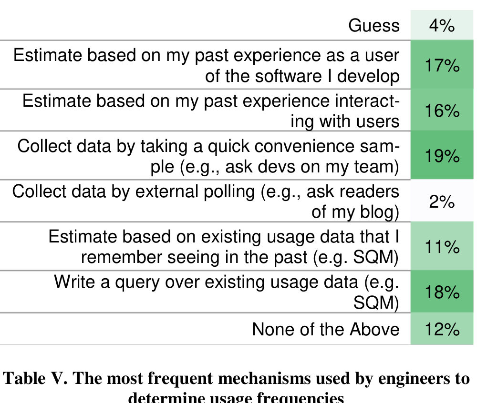
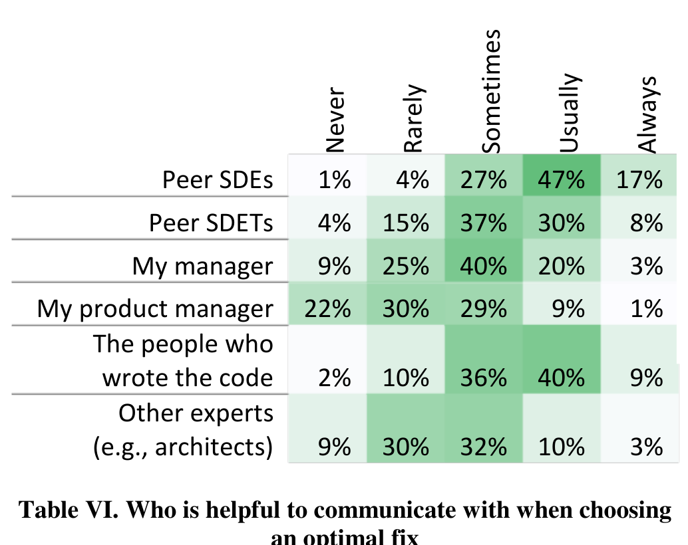
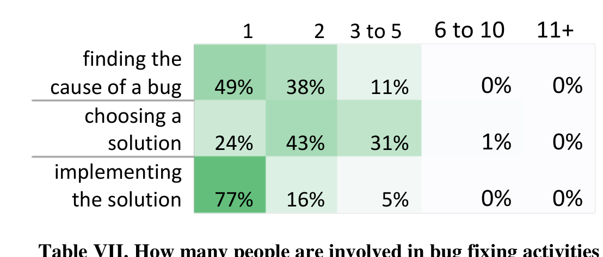

# The Design of Bug Fixes

Emerson Murphy-Hill  
Department of Computer Science  
North Carolina State University  
Raleigh, North Carolina, USA  
emerson@csc.ncsu.edu

Thomas Zimmermann, Christian Bird, Nachiappan Nagappan, and Michael Barnett  
Microsoft Research  
Redmond, Washington, USA  
{tzimmer,cbird,nachin,mbarnett}@microsoft.com

Keywords—component; bugs, faults, empirical study, design

## I. INTRODUCTION

As the software systems we create and maintain continue to grow in capability and complexity, software engineers must ensure that these systems work as intended. When systems do not, software engineers fix the “bugs” that cause this unintended behavior.

Traditionally, researchers and practitioners have assumed that where in the software an engineer fixes a bug is where an error was made [1]. For example, Endres [2] makes such an assumption in a study, but cautions the reader that,

> There is, of course, the initial question of how we can determine what the error really was. To dispose of this question immediately, we will say right away that, in the material described here, normally the actual error was equated to the correction made. This is not always quite accurate, because sometimes the real error lies too deep, thus the expenditure in time is too great, and the risk of introducing new errors is too high to attempt to solve the real error. In these cases the correction made has probably only remedied a consequence of the error or circumvented the problem. To obtain greater accuracy in the analysis, we really should, instead of considering the corrections made, make a comparison between the originally intended implementation and the implementation actually carried out. For this, however, we usually have neither the means nor the base material.

> **Image description:** A schematic split into two panels: the left panel titled “Design Space” maps eight technical dimensions radiating from a central hub (Data Propagation, Internal Vs External, Accuracy, Hardcoding, Refactoring, Functionality Removal, Behavioral Alternatives, and Error Surfacing). The right panel titled “Navigating Design Space” shows the external/social factors that guide which point in that space engineers choose (Social Factors, Risk Management, Cause Understanding, User Behaviour, Consistency, and Interface Breakage). A top banner summarizes the study evidence supporting the model: “Methodology: 40 interviews, 5 triage meetings, 326 survey responses,” indicating the diagram synthesizes empirical findings about what fixes are possible (left) and what influences fix selection (right).

Figure 1: Characterizing the design of bug Fixes

Although the software engineering community has suspected that this assumption is sometimes false, there exists little evidence to help us understand under what circumstances it is false. The consequences of this lack of understanding are manifold. Let us provide several examples. For researchers studying bug prediction [3] and bug localization [4], models of how developers have fixed bugs in the past may not capture the true cause of failures, but may instead only capture workarounds. For practitioners, when a software engineer is evaluated based on how many bugs are fixed, the evaluation may not accurately reflect that engineer’s effect on software quality. For educators, without teaching future engineers the contextual factors that go into deciding which fix to apply, as engineers they may choose inappropriate fixes.

However, to our knowledge, there has been no empirical research into how bug fixes are designed. In this paper, we seek to understand the design of bug fixes. When we say that bug fixes are “designed,” we mean that there are a number of potential fixes for a single bug, and choosing between those fixes is a matter of human judgment. As with any software change, an engineer must deal with a number of competing forces when choosing exactly what change to make. The task is not always straightforward. To fill this gap, we seek to answer two research questions:

RQ1: What are the different ways that bugs can be fixed?

---

RQ2: What factors influence which fix an engineer chooses?

This paper’s primary contribution: The first systematic characterization of the design of bug fixes. It analyzes the design space of bug fixes and describes how developers navigate that design space, to understand the decisions that go into choosing a bug fix (see Figure 1).

## II. RELATED WORK

Several researchers have investigated bug fixes. Perhaps the most relevant is Leszak, Perry, and Stoll’s [5] study of the causes of defects, where the authors classified bug reports by ‘real defect location’:

> ‘Real’ location characterizes the fact that… some defects are not fixed by correcting the ‘real’ error-causing component, but rather by a… ‘work-around’ somewhere else.

While the authors collected real defect locations, the data was not analyzed or reported. Our work explains why one fix would be selected over another; or in other words, why an engineer would choose a workaround instead of a fix at a “real location.”

Ko and Chilana studied 100 contentious open-source bug reports to investigate how engineers make decisions about bugs [6]. While this paper did investigate “design dimensions” during bug fixing, by “design” they meant the design of software (for example, whether a fix makes the software more usable), rather than “design” in the sense we mean it, which is the design of the fix itself. Our study also complements this study by improving our understanding of the decision making process when fixing bugs, specifically for commercial software and for decisions that get made outside of the bug report itself.

Breu and colleagues observed in a study of 600 bug reports that 25.3% of discussions in bug reports are spent on the correction itself, discussions involving suggestions, feedback requests, and understanding files [7]. Our study complements this work by exploring the design space of bug fixes.

Several other researchers have investigated bug fixing. In a manual inspection of bug fixes, Lucia and colleagues found that some fixes are spread over many lines of code [4]. Bird and colleagues found that bug fixes reported in bug databases have different characteristics than fixes not reported in databases [8]. Yin and colleagues investigated why bugs are fixed incorrectly, that is, require a later bug fix to the source code changed by the original fix [9]. Aranda and Venolia investigated 10 closed bugs and surveyed 110 engineers about bug coordination patterns at Microsoft [10]. Spinellis and colleagues attempted to correlate code metrics, such as number of bugs fixed, to evaluate the quality of open source software [11]. Storey and colleagues investigated the interaction of bugs and code annotations [12]. Anvik and colleagues investigated which engineers get assigned to fix bugs [13]. In contrast to these papers, our paper seeks to understand in what way bug fixes differ, and why one fix is chosen over another.

## III. METHODOLOGY

To answer our two research questions, we conducted a mixed-method study. We used several research methods, rather than a single one, both to study our research questions in as broad a way as possible and to triangulate the answers to improve their accuracy [14]. While we feel that our methods are thorough and rigorous, some threats still exist as we discuss in Section V. We now discuss our four research methods: opportunistic interviews, firehouse interviews, triage meeting observations, and surveying. For each method, we discuss the goal of using that method, how we recruited participants, the protocol we used, how we analyzed data, and a brief summary of the shape of the data we collected.

### A. Opportunistic Interviews

With our first method, we randomly asked engineers about a recent bug they had been involved in fixing.

**Goal.** Our goal in performing opportunistic interviews was to rapidly obtain qualitative answers to our research questions in a way that was minimally obtrusive to interviewees.

**Protocol.** We conducted these interviews by having the first author go to a building that housed a particular product group. Armed with a list of office numbers for software engineers, the interviewer walked to each engineer’s office. If the engineer’s door was closed, was wearing headphones, or was talking to someone else, the interviewer went to the next office. Otherwise, the interviewer introduced himself, said that he was doing a study, and asked if the interviewee had 10 to 15 minutes to talk. If the engineer consented, the interviewer asked a series of semi-structured questions [14] regarding the last bug that the engineer was involved in fixing. Although interviewees were not offered an incentive, before the interviewer left, interviewees were compensated with a $10 gift card for lunch.

We performed pilot interviews to identify potential problems and rectify them prior to the main study. In doing so, we noticed that pilot interviewees could remember the fix they made, but had difficulty recalling the alternative fixes they did not make. Some pilot interviewees stated that they fixed the bug the only way that it could have been fixed, even though there clearly were other fixes, even from our perspective as outsiders. We sought to reduce this ‘hindsight bias’ [15] in our interviews using two different techniques. For every odd-numbered interview (the first, the third, and so on), we gave the interviewee an example of three bugs and multiple ways of fixing each bug. For the other half of the interviewees, we presented a small program containing a simple bug, and then asked the interviewee to talk us through how she might fix the bug; interviewees typically mentioned several alternative fixes. Comparing the results obtained after starting interviews with these two methods, we noticed no qualitative differences in the responses received, suggesting that both methods were about equally effective. Comparing pilot interview results against real interview results, we feel that this technique significantly helped interviewees think broadly about the design space.

After this introductory exercise, the interviewer asked the interviewee about the most recent bug that they fixed. The interviewer asked about the software that the bug appeared in, the

---

symptoms, the causes, and whether they considered more than one way to fix the bug. If an interviewee did consider multiple fixes, we asked her to briefly explain each one, and justify their final choice. The full interview guide can be found online.1

### Participants

To sample a wide variety of engineers, we recruited interviewees using a stratified sampling technique, sampling across several dimensions of the products that engineers create. We first postulated what factors might influence how engineers design fixes; we list those factors in Table I.

> **Image description:** A two-column table titled with header columns “Factor” and “Values” enumerating the criteria the authors used to choose product teams for interviews. Rows list: Domain (Desktop, web application, enterprise/backend, embedded); Product Type (Boxed, service); Bug fix types (Pre-release, post-release); Number of versions shipped (0 to continuous release); and Phase (Planning and milestone quality, main development, stabilization, and maintenance). In the paper these factor–value combinations were used to select a cross-section of Microsoft products (four product teams) so the sample spanned the listed values.

Table I. Factors for selecting product groups.

Using these factors, we selected a cross section of Microsoft products that spanned those factors. We chose four products from which to recruit engineers, because we estimated that four products would balance two competing requirements; that we sample enough engineers from each product team to get a good feeling for what bug fixing is like within that team, and to sample enough product teams that we could have reasonable generalizability. The four product teams that we selected spanned each of the values in the Table. For example, one team we talked to worked on desktop software, one web applications, another enterprise/backend, and the last embedded systems.

Within each product team, we aimed to talk to a total of 8 software engineers: six were what Microsoft calls “Software Development Engineers” (developers for short) and two were “Software Development Engineers in Test” (testers for short). We interviewed more developers, as developers spend more time fixing bugs than testers. Once we reached our quota of engineers in a team, we moved on to the next product team. In total, we completed 32 opportunistic interviews with engineers.

### Data Analysis

We prepared the interviews for analysis by transcribing them. We then coded the transcripts [16] using the ATLAS.ti2 software. Before beginning coding, we defined several base codes, including codes to identify symptoms, the fix that was applied, alternative fixes, and reasons for discriminating between fixes. The first author did the coding. Additionally, our research group, consisting of 7 full time researchers and 7 interns, analyzed the coded transcripts again, to determine if any other notable themes emerged. Each person in the group analyzed 2 to 4 transcripts over ½ hour. We regard the first

author’s coding as methodical and thorough, while the team’s analysis was brief and serendipitous. We derived most of the results described in this paper from the first author’s coding. We use the codes about fixes to describe the design space (Section IV.A) and codes about discriminating between fixes to describe how engineers navigate that space (Section IV.B).

### Data Characterization

Overall, we found software engineers very willing to be interviewed. To obtain 32 interviews, we visited 152 engineers’ offices. Most offices were empty or the engineers appeared busy. In only a few cases, engineers explicitly declined to be interviewed, largely because the engineer was too busy. Interviews lasted between 4 and 30 minutes. In this paper, we refer to participants as P1 through P32.

Most participants reported multiple possible fixes for the bug that they discussed. In a few cases, participants were unable to think of alternate solutions; however, the interviewer, despite being unfamiliar with the bug, was able to suggest an alternative fix. In these cases, the engineer agreed that the fix was possible, but never consciously considered the alternative fix, due to external project constraints.

Interestingly, this opportunistic methodology allowed us to interview three engineers who were in the middle of considering multiple fixes for a bug.

### B. Firehouse Interviews

Using the firehouse research method [17], we interviewed engineers immediately after they fixed a bug. Firehouse research is so called because of the unpredictable nature of the events under study; if one wants to study social dynamics of victims during and immediately after a fire, one has to literally live in the firehouse, waiting for fires to occur. Alternatively, one can purposefully set fires, although this research methodology is generally discouraged. In our case, we do not know exactly when an engineer is considering a fix, but we can observe a just-completed fix in a bug tracker and “rush to the scene” so that the event is fresh in the engineer’s mind.

### Goal

Our goal was to obtain qualitative answers to our research questions in a way that maximized the probability that engineers could accurately recall their bug fix design decisions.

### Protocol

We first picked one product group at Microsoft, went into the building where most development for that product takes place, and monitored that group’s bug tracker, watching for bugs an engineer marked as “fixed” within the last ten minutes. If the engineer was not located in the building, we moved on to the next most recently closed bug. Otherwise, the interviewer went immediately to the engineer’s office.

When approaching engineers for this study, we were slightly more aggressive than in the opportunistic interviews; if the engineer’s door was closed, we knocked on the door. If the engineer was not in her office by the time we arrived, we waited a few minutes. These interviews were the same as the opportunistic interviews, except that the interviewer insisted that the engineer focused on the bug that they had just closed.

### Participants

Our options for choosing a product group to study was fairly limited, because we had to have a personal contact within that team that was willing to allow us to have live, read-only access to their bug tracker. We chose one product

1 http://people.engr.ncsu.edu/ermurph3/experiments/BugFixDesignInterview.pdf
2 http://atlasti.com/

---

product, which will remain anonymous; the product group was different from any of those chosen in the opportunistic interviews.

We aimed to talk to 8 software engineers in total for these interviews. While we interviewed fewer people than with the opportunistic interviews, these firehouse interviews tended to take much longer to orchestrate, mostly because we had specific people that we wanted to talk to. In retrospect, we did not notice any qualitative differences in engineers’ responses to the two interview types, so for the remainder of the paper, we do not distinguish between these two groups of participants. Nonetheless, you may do so if you wish; participants of the firehouse interviews are labeled P33 through P40.

**Data Analysis.** We analyzed data in the same way as with the opportunistic interviews.

**Data Characteristics.** We also found engineers to be receptive to being interviewed, although they were usually surprised we asked about a bug they had just fixed. We reassured them that we are from Microsoft Research, and are there to help.

In total, we went to 16 offices, and were able to interview 10 engineers. Two of these we mistakenly interviewed, one because his officemate actually closed the bug, and one because the interviewer misread the bug report. We compensated these engineers for their time, but we exclude them from analysis.

### C. Triage Meetings

We hypothesized that not only do individual engineers make decisions about the design of bug fixes, but perhaps that bug fix designs happen during bug triage meetings as well.

**Goal.** Our goal was to obtain qualitative answers to our research questions with respect to how engineers work together to find good bug fix designs.

**Protocol and Participants.** We attended six bug triage meetings across four product groups. Five of these groups were the same groups that we did interviews with. To ensure engineers were comfortable, we did not record these meetings; rather, we took notes and observed in silence.

**Data Analysis and Data Characteristics.** It became clear that there was very little data we could gather in these triage meetings, for two reasons. The first is that participants rarely discussed how to fix a bug beyond whether to fix it and when to do so. Second, when participants did discuss how to fix bugs, the team was so tightly knit that very little explanation was needed; this terseness made bug fix decisions basically impossible for us to understand without the context that the team members had. As a result, we were able to glean few insights from the meetings. For the few observations that we could make, we label these meetings as T1 to T6. Because there was little usable data from these meetings, we did not perform any data analysis beyond reading through our notes.

### D. Survey

**Goal.** Our goal was to quantify our observations made during the interviews and triage meetings.

**Protocol.** After we performed the interviews and triage meetings, we sent a survey to software engineers at Microsoft. As in the interviews, the survey started by giving examples of bugs that could be fixed using different techniques, where the examples were drawn from real bugs described by interviewees. As suggested by Kitchenham and Pfleeger [17], we constructed the survey to use formal notations and limit responses to multiple-choice, Likert scales, and short, free-form answers.

At the beginning of the survey, we suggested that the respondent browse bugs that they had recently closed to ground their answers. In Section IV, we discuss these questions, intermixed with engineers’ responses. After piloting the survey, we estimate that it took respondents about 15–20 minutes to fill out the survey. The full text of this survey can be found online.3

**Participants.** We sent the survey to 2000 participants by selecting employees of Microsoft who had “development” in their job title, and were not interns or contractors. This followed Kitchenham and Pfleeger’s advice to understand whether respondents had enough knowledge to answer the questions appropriately [17]. We incentivized participation by giving $50 Amazon.com gift certificates to two respondents at random.

**Data Analysis.** We analyzed our data with descriptive statistics (for example, the median), where appropriate. We did not perform inferential statistics (for example, the t-test) because our research questions do not necessitate them. When reporting survey data, we omit “Not Applicable” question responses, so percentages may not add up to 100%.

**Data Characteristics.** 324 engineers completed the survey, a response rate of about 16%, within the range of other software engineering surveys [18]. Respondents were from all eight divisions of Microsoft. Respondents reported between 0.08 and 39 years of experience in the software industry (median = 9.5), with a median of 5 years of experience at Microsoft. 65% reported being developers, while 34% reported being testers. One respondent reported being a product manager.

## IV. RESULTS

We next characterize the design options that engineers have when selecting a bug fix (Section IV.A), and then describe how engineers choose which fix to implement (Section IV.B).

### A. Description of the Design Space

In our interviews, we asked participants to estimate what percentage of their bugs for which there were multiple possible solutions. The median was 52%, with a wide range of variance, with individual responses ranging from 0% to 100%. This suggests that many bugs can be fixed in multiple ways, although this number should be interpreted as a rough estimate.

With respect to the dimensions of the design space, we obtained answers to this research question by asking interviewees to explain the different fixes that they considered when fixing a single bug. In bold below, we present several dimensions on which bugs may be fixed, a description of each dimension, and an example from our interviews. Note that a single fix can be considered a point in this design space; for example, a fix may have low error surfacing and high refactoring, and simulta-

3 http://people.engr.ncsu.edu/ermurph3/experiments/BugFixDesignSurvey.pdf

---

### Data Propagation Across Components

This dimension captures how far information is allowed to propagate across a piece of software, where the engineer has the option of fixing the bug by intercepting the data in any of the components. At one end of the dimension, data is corrected at its source.

As an example, P25 worked on software with a layered architecture, with at least four layers, the topmost being the user interface. The bug was that the user interface was reporting disk space sizes far too large, and the engineer found that the problem could be traced back to the lowest-level layer, which was reporting values in kilobytes when the user interface was expecting values in megabytes. The interviewee had the option of fixing the bug by correcting the calculation in the lowest layer, or by transforming the data (multiplying by a thousand) as it is passed through any of the intermediate layers.

### Error Surfacing

This dimension describes how much information is revealed to users, whether that information is for end users or other engineers. At one end of the dimension, the user is made aware of detailed error information; at the other, the existence of an error is not revealed.

P28 described a bug where the software he was developing crashed when the user deleted a file. When fixing the bug, the engineer decided to catch the exception to prevent the crash, but also was considering whether or not the user should be notified that an exceptional situation had occurred.

As another example, P6 described a bug where she was calling an API that returned an empty collection, where she expected a non-empty collection. The problem was that she passed an incorrect argument to the API, and the empty collection signified an error. However, an empty collection could also signify “no results.” As part of the fix, the engineer considered changing the API so that it threw an error when an unexpected argument was passed to the API. She anticipated that this would have helped future engineers avoid similar bugs.

### Behavioral Alternatives

This dimension relates to whether a fix is perceptible to the user. At one end of the dimension, the fix does not require the user to do anything differently; at the other end, she must significantly modify her behavior.

One example is P11, who described a bug where the back button in a mobile application was occasionally not working.

As part of the fix, he made the back button work, but had to simultaneously disable another feature when the application first loads. P11 stated that having both the back button and the other feature working at the same time was simply not possible; he had to choose which one should be enabled initially.

### Functionality Removal

This dimension relates to how much of a feature is removed during a bug fix. At one end of the dimension, the whole software product is eliminated; at the other, no code is removed at all.

As an example, P18 described a bug in which a crash occurred. Rather than fixing the bug, P18 considered removing the feature that the bug was in altogether. We were initially quite surprised when we heard this story, because the notion that an engineer would remove a feature just to fix a bug seems quite extreme. However, removal of features was mentioned repeatedly as a fix for bugs during our interviews.

To quantify functionality removal, we asked survey respondents to estimate how often they remove or disable features, rather than alleviating a symptom of a bug. About 75% of respondents said they had removed features from their software to fix bugs in the past.

### Refactoring

This dimension expresses the degree to which code is restructured in the process of fixing a bug, while preserving its behavior. A bug may be fixed with a simple one-line change, or it may entail significant code restructuring.

As an example, P5 considered refactoring to remove some copy-and-paste duplication, so “you're not only fixing the bug, but you also are kind of improv[ing it].”

In our survey, we asked respondents to report on refactoring frequency when fixing bugs, as shown in Table II. In the table, “Should be refactored” indicates how often participants “notice code that should be refactored when fixing bugs.” For example, 29% of respondents indicated that they usually notice code that should be refactored. The “Is refactored” row indicates how often participants “refactor this code that should be refactored”. For example, 26% reported rarely refactoring code that should be refactored. These results suggest that, although engineers appear to regularly encounter code that should be refactored, much of this code remains unchanged.

### Internal vs External

This dimension relates to how much internal code is changed versus external code is changed as part of a fix. On one end of this dimension, the engineer makes all of her changes to internal code, that is code for which the engineer has a strong sense of ownership. On the other end, the bug is fixed by changing only code that is external, that is, code for which the engineer has no ownership.

One example is P33, who maintained a testing framework for devices used by several other teams. The bug was that many devices were not reporting data in a preferred manner, causing undesirable behavior in P33’s framework. Part of the fix was immediate and internal (changing the testing framework), but part of it was deferred and external (changing each of the other teams’ device code).

> **Image description:** A two-row table showing survey responses about refactoring during bug fixes. For “Should be refactored” respondents: 1% never, 7% rarely, 56% sometimes, 29% usually, and 5% always (most responses concentrated on “sometimes”). For “Is refactored” respondents: 4% never, 26% rarely, 44% sometimes, 21% usually, and 3% always (peak at “sometimes” but fewer in the “usually/always” columns). The figure highlights a gap: while about 90% of engineers report at least sometimes noticing code that should be refactored, only about 24% usually or always perform the refactoring when fixing bugs, indicating many refactoring opportunities are deferred.

Is refactored 4% 26% 44% 21% 3%  
Table II. Survey respondents’ refactoring behavior

---

> **Image description:** A green-shaded heatmap showing how often various factors influence which bug fix engineers choose (columns: Never, Rarely, Sometimes, Usually, Always). Panel A lists implementation constraints — ‘‘Phase of the release cycle’’ (2%, 6%, 17%, 35%, 37%) and factors that reduce disruption (changing few lines, low test effort, short implementation time) are frequently rated ‘‘Usually’’ or ‘‘Always.’’ Panel B shows ‘‘Doesn't change interfaces or break backwards compatibility’’ is the most decisive factor (0%, 2%, 8%, 36%, 53%), and Panel C shows strong emphasis on preserving original design integrity (1%, 5%, 16%, 50%, 28%). Panel D indicates usage frequency plays a moderate role (2%, 17%, 39%, 33%, 8%), so engineers often consider how commonly a situation occurs but prioritize compatibility, consistency, and low-risk fixes.

Table III. Factors that influence engineers’ bug fix design

### Accuracy
This dimension captures the degree to which a fix utilizes accurate information. On one end of this dimension, the engineer uses highly accurate information, and on the other, he uses heuristics or guesses.

An example is P29, who was working on a bug where web browser printing was not working well. An accurate fix would be one where his print driver retrieves the available fonts from the printer, then modifies the browser’s output based on the available fonts. A less accurate fix was to use a heuristic that produces better, but not optimal, print output.

### Hardcoding
This dimension captures to what degree a fix hardcodes data. On one end of the dimension, data is specified explicitly, and on the other, data is generated dynamically.

One example of fixes on this dimension is P24, who was writing a test harness for a system that received database queries. The bug was that some queries that his harness was generating were malformed. He considered a completely hardcoded solution to the problem, removing the query generator and using a fixed set of queries instead. A more dynamic solution he considered was to modify the generator itself to either filter out malformed queries, or not to generate them at all.

> **Image description:** A two-row summary of survey responses across the five frequency categories (Never, Rarely, Sometimes, Usually, Always). For how often suboptimal fixes should be reconsidered respondents answered: 1% Never, 17% Rarely, 38% Sometimes, 29% Usually, and 14% Always. For how often those bugs actually are fixed optimally later respondents answered: 4% Never, 40% Rarely, 38% Sometimes, 13% Usually, and 1% Always. The table highlights a gap between what engineers think should happen (most say Sometimes/Usually/Always) and what actually happens (many report Rarely or only Sometimes).

Actually are fixed optimally 4% 40% 38% 13% 1%

Table IV. Survey respondents’ optimal fix

## B. Navigating the Design Space
While the previous section described the design space of bug fixes, it said nothing about why engineers implement particular fixes within that design space. For instance, when would an engineer refactor while fixing a bug, and when would she avoid refactoring? In an ideal world, we would like to think that engineers make decisions based completely on technical factors, but realistically, a variety of external factors come into play as engineers navigate this bug fixing design space. In this section, we describe those external factors.

### Risk Management by Development Phase
A common way that interviewees said that they choose how to design a bug fix is by considering the development phase of the project. Specifically, participants noted that as software approaches release, their changes become more conservative. Conversely, participants reported taking more risks in earlier phases, so that if a risk materializes, they would have a longer period to compensate. Two commonly mentioned risks were the risk that new bugs would be introduced and the risk that spending significant time fixing one bug comes at the expense of fixing other bugs.

P12 provided an example of taking a more conservative approach, when he had to fix a bug by either fixing an existing implementation of the double-checked locking pattern, or replace the pattern with a simpler synchronization mechanism. He eventually chose to correct the pattern, even though he thought the use of the pattern was questionable, because it was the “least disruptive” way to fix the bug. He noted that if he had fixed the bug at the beginning of the development cycle, he would have removed the pattern altogether.

In our survey, we asked engineers several questions relating to risk and development phase, as shown in Table IIIA. Here we asked engineers “How often do the following factors influence which fix you choose?”, where each factor is listed at left. The table lists the percentage of respondents who choose that frequency level. Note that the factors are not necessarily linked; for instance, an engineer could choose to change very few lines of code for a reason other than the product is late in development. However, our qualitative interviews suggested that these factors are typically linked together, and thus we feel justified in presenting these four factors as a whole. These results suggest that, for most respondents, risk mitigation usually plays an important role in choosing how to fix a bug.

---

One of the findings that emerged from our interviews is that if engineers are frequently making conservative changes, then they may be incurring technical debt. As P15 put it,

> I wish to do it better, but I'm doing it this way because blah, blah, blah. But then I don't know if we ever go back and kind of “Oh, okay, we had to do this, now we can change it.” And I feel that code never goes away, right?

We verified this statement by asking survey respondents how often they think bugs that are initially fixed “suboptimally” should be reconsidered for a more optimal fix in the future. We asked how many of these bugs actually are fixed optimally after the initial fix. Table IV displays the results. These results suggest that engineers often feel that optimal fixes should be reconsidered in the future, but that those bugs rarely get fixed optimally. As one respondent noted, “although we talk about the correct fix in the next version, it never happens.”

### Interface Breakage.

Another factor that participants said influenced their bug fixes is to what degree a fix breaks existing interfaces. If a fix breaks an interface that is used by external clients, then an engineer may be less inclined to implement that fix because it entails changes in those external clients.

One example comes from P16, who was working on a bug related to playing music and voice over Bluetooth devices. He said that a better fix for the problem would be to change the Bluetooth standard, but too many clients already depend on it.

We also asked survey respondents how often the following factor influences which fix they choose: “Doesn’t change external interfaces or breaks backwards compatibility.” 72% reported that “usually” or “always,” suggesting that changing external interfaces is a significant determinant in choosing which bug fix to implement (Table IIIB).

### Consistency.

This factor describes to what degree a fix will be consistent with the existing software or existing practices. A fix that is not consistent with the existing code may compromise the design integrity of that code, leading to code rot.

One example is P10, who fixed a performance bug in his build system. P10 fixed the bug by using the build system in a way consistent with how it was being used by other teams. However, he felt that a change that was inconsistent with the way the build system currently worked would have produced better build performance, at least for his product. Table IIIC lists survey respondents’ attitudes towards the importance of maintaining design consistency when fixing bugs.

### User Behavior.

This factor describes the effect of how users of the software behave on the fix. If users have strong opinions about the software, or use a certain part of the software heavily, engineers may choose a fix that suits the user better.

One example is from T1, where the team discussed bugs in a code analysis tool. The team wondered how often a certain code pattern was used in practice. They acknowledged that their analysis did not work when the pattern was used, but how they fixed the bug depended on how often users actually wrote code in that pattern. They judged, apparently based either on intuition or experience, that several of these bugs were so unlikely to arise in practice that the effort to implement a comprehensive fix for the problem was not justified.

> **Image description:** A ranked list of mechanisms engineers report using to determine how often a situation occurs, with percentages and green shading indicating frequency. The most common responses were: “Collect data by taking a quick convenience sample (e.g., ask devs on my team)” (19%), “Write a query over existing usage data (e.g., SQM)” (18%), “Estimate based on my past experience as a user of the software I develop” (17%), and “Estimate based on my past experience interacting with users” (16%). Less common approaches were recalling existing usage data (11%), selecting “None of the Above” (12%), guessing (4%), and external polling (2%). (SQM in the paper denotes Microsoft’s usage-data collector.)

Table V. The most frequent mechanisms used by engineers to determine usage frequencies

After hearing about T1 and some interviewees talk about frequency of user behavior, we became interested in how engineers know what users actually do. Thus, we asked two questions in the survey. In the first we asked how often fixes depended on usage frequency (Table IIID). These results suggest that how frequently a situation occurs in practice sometimes influences how engineers design fixes. The second question was a multiple-choice question about how engineers most often determine frequency (Table V). In this table, SQM refers to a usage data collector used in a variety of Microsoft products. The most common “None of the Above” answer was asking the product manager. In Table V, we were somewhat surprised to find that so many engineers write queries over usage data. However, it still appears that many engineers use ad-hoc methods for estimating user behavior, including convenience sampling, estimation, and guessing.

### Cause Understanding.

This factor describes how thoroughly an engineer understands why a particular bug occurs. In interviews, we were surprised how often engineers fixed bugs without understanding why those bugs occurred. Without thoroughly understanding a bug, the bug may re-appear at some point in the future. On the other hand, complete understanding of why a bug is occurring can be an extremely time-intensive task.

P3 provided an example of fixing a bug without a full understanding of the problem. The symptom of his bug was that occasionally an error message appeared to the user whenever his software submitted a particular job. Rather than understanding why the error was occurring, he fixed the job by simply resubmitting the job, which usually completed without error. Rather than understanding the problem, as he explained it, “my time is better spent fixing the other ten bugs that I had.”

We asked survey respondents why they do not always make an optimal fix for a bug; 18% indicated that they have not had “time to figure out why the bug occurred.” This suggests that lack of cause understanding is sometimes a problem.

---

> **Image description:** Heatmap table (Table VI) reports survey percentages for how helpful different roles are when choosing an optimal fix, with response columns Never / Rarely / Sometimes / Usually / Always. Peer SDEs were rated most helpful (47% usually, 17% always; only 1% never), and the people who originally wrote the code were also highly helpful (40% usually, 9% always). Peer SDETs are helpful often (30% usually, 8% always) while managers and product managers are rated less helpful (my manager: 20% usually, 3% always, with 9% never; my product manager: 9% usually, 1% always, with 22% never). Other experts (e.g., architects) are moderately helpful (32% sometimes, 10% usually, 3% always).

Table VI. Who is helpful to communicate with when choosing an optimal fix

### Social Factors.

A variety of social factors appear to play a role in how bugs are fixed, including mandates from supervisors, ability to find knowledgeable people, and code ownership.

One example of this was P22, who was fixing a bug in a database system where records were not sorting in memory, causing reduced performance. The engineer proposed a fix based on “one week of discussions and bringing new ideas, [and] discussing [it with my] manager.” Other interviewees discussed their bugs with mentors (P28), peer engineers (P28), testers (P39), and development leads (P34).

In the survey we asked how communication with people helps inform the bug fix design (Table VI). The results suggest that peer software development engineers (SDEs) and the people who originally wrote the code related to where the fix might be applied tend to play the most important role in deciding how a bug gets fixed. We also asked survey participants about who decides on which bug fix design to implement. Most participants said they themselves usually decide, while others said it was sometimes a group decision. Only 6% said their manager usually or always decides.

We also asked survey respondents how they communicate with others about bug design. Respondents indicated that they most often communicate by email (44%), in unplanned meetings (38%), planned meetings (7%), and in the bug report itself (6%). A few respondents also indicated that they discussed design during online code review and with instant messaging. However, in a study run in parallel with this one, we inspected 200 online code review threads at Microsoft, but found no substantial discussions of bug fix design [19]. We postulate that, by the time a fix is reviewed, engineers have already discussed and agreed upon the basic design of that fix.

We asked survey respondents how many people, including themselves, were typically involved in the bug fixing process. Table VII shows the results. These results suggest that while finding the cause of a bug and implementing a solution are generally 1- or 2-person activities, choosing a solution tends more often to be a collaborative activity.

> **Image description:** A three-row heatmap-style table reporting what fraction of bugs involve a given number of people for three activities: ‘finding the cause of a bug,’ ‘choosing a solution,’ and ‘implementing the solution.’ Columns show group sizes: 1, 2, 3–5, 6–10, and 11+. For finding the cause, 49% report a single person, 38% two people, and 11% three–five people (virtually none above five). For choosing a solution the work is more collaborative: 24% one person, 43% two people, and 31% three–five people (1% for 6–10). For implementing the solution most often one person does the work (77%), with 16% two people and 5% three–five people, and no substantial involvement of larger groups. This supports the paper’s claim that cause-finding and implementation are typically small-team activities, while solution selection is more often a collaborative decision.

Table VII. How many people are involved in bug fixing activities

One of the more surprising things we heard from some interviewees was that when they made sub-optimal changes, they were sometimes hesitant to file new bug reports so that the optimal changes were reconsidered in the future. The rationale for not doing so seemed to be at least partly social – respondents were not sure whether other engineers would find a more optimal fix useful to them as well. For instance, P2 said the optimal fix to his bug would be a change to the way mobile applications are built in the build system, but he wasn’t sure that he would advocate for this change unless other teams would find it useful as well. Ideally, this is what “feature enhancement” bug reports with engineer voting should help with. However, P2 didn’t fill out a bug report for this enhancement at all, because he judged the time he spent filling out the report would be wasted if other engineers didn’t need it. As he put it,

> If I had more data… that other teams did it,… if I could … eyeball it quickly… then I'd [say], “Hey, you know, other teams are doing this. Clearly, it's a [useful] scenario.”

This led us to become curious why engineers avoid filing bug reports, so we asked survey respondents to estimate the frequency of several possible rationales that we heard about during the interviews (Table VIII). These results suggest that survey respondents rarely avoid filing bugs for reasons that the interviewees discussed. We view these somewhat contradictory findings as inconclusive; more study, likely using a different study methodology, is necessary to better understand how often and why engineers do not file bug reports.

## V. LIMITATIONS

Although our study provides a unique look at how engineers fix bugs, several limitations of our study must be considered when interpreting our results.

An important limitation is that of generalizability beyond the population we studied (external validity). While our results may represent the practices and attitudes at Microsoft, it seems unlikely that they are completely representative of software development practices and attitudes in general. However, because Microsoft makes a wide variety of software products, uses many development methods, and employs an international workforce, we believe that our random and stratified sampling techniques improved generalizability significantly.

Giving interviewees’ and survey respondents’ example bugs and multiple-fix examples may have biased participants towards providing answers that aligned with those examples, a form of expectancy bias (internal validity). However, we judged the threat of participants unable to recall implicit or

---

> **Image description:** A heatmap-style table showing how often survey respondents avoid filing bug reports for specific reasons, with columns for Never, Rarely, Sometimes, Usually, and Always. Example values: "The bug is unlikely to ever be fixed" (30% Never, 31% Rarely, 30% Sometimes, 7% Usually, 1% Always), "I don’t know who to file the bug or who to report it to" (52% Never, 27% Rarely, 13% Sometimes, 6% Usually, 0% Always). Most reasons have large Never percentages (as high as 80% for “software is of poor quality or that the team is behind”), indicating respondents generally do not refrain from filing bugs for these social or workload-related rationales, though a notable minority sometimes avoid filing when they believe a bug won’t be fixed. This table supports the paper’s observation that survey results show respondents rarely avoid filing bugs for the reasons interviewees mentioned, making the findings somewhat inconclusive.

like the software is of poor quality or that the team is behind 80% 12% 5% 1% 0%

Table VIII. Frequency of reasons for not filing bugs

Explicit design decisions outweighed this threat. Future researchers may be able to confirm or refute our results by using a research method that is more robust to expectancy bias.

Still, some interviewees struggled with remembering the design decisions they made, and were generally unable to articulate implicit decisions. This type of memory bias is inherent in most retrospective research methods. However, we attempted to control memory bias by asking opportunistic interviewees to recall their most recently fixed bugs, asking firehouse interviewees to discuss a bug they just fixed, and asking survey respondents to look at bugs they had recently fixed.

To meet our goal of not significantly interrupting participants' workdays, we kept our interview and survey short, which means we were unable to collect contextual information that may have helped us better explain the results. For example, in the interviews, we did not ask questions about the gender or team structure, which may have some effect on bug fix designs.

Similarly, a consequence of keeping the survey short is that participants may have misunderstood our questions. For example, in our survey, we asked engineers whether they ever avoided filing a bug report; this question could be interpreted conservatively to mean, "when do you not report software failures?", when our intent was for "bug reports" to be interpreted broadly to include enhancements. While we tried to minimize this threat by piloting our survey, as with all surveys [14], we may still have miscommunicated with our respondents.

## VI. IMPLICATIONS

The findings we present in this paper have several implications, a handful of which we discuss in this section.

### Additional Factors in Bug Prediction and Localization.

Previous research has investigated several approaches to predicting future bugs based on previous bugs [20] [21], including our own [3]. The intuition behind these approaches appears reasonable: how engineers have fixed bugs in the past is a good predictor of how they should fix bugs in the future. However, the empirical results we present in this paper suggest a host of factors can cause a bug to be fixed in one way at one point in time, but in a completely different way at another. For example, a bug fixed just before release is likely to be fixed differently than a bug fixed during the planning phase. As a result, future research in prediction and localization may find it useful to incorporate, when possible, these factors into their models.

### Limits of Bug Prediction and Localization.

Although incorporating some factors, such as development phase, into historical bug prediction may improve the accuracy of these models, some factors appear practically outside the reach of what automated predictors can consider. For example, when analyzing past bugs, it seems unlikely that an automated predictor can know whether or not a past fix was made with an engineer’s full knowledge of why the bug occurred.

### Refactoring while Fixing Bugs.

The results of our study suggest that engineers frequently see code that should be refactored, yet still avoid refactoring. One way that this problem could be alleviated is through wider spread use of refactoring tools, which should help engineers refactor without spending excessive time doing so and at minimal risk of introducing new bugs. At the same time, such tools remain buggy [22] and difficult to use [23], so more research in that area is necessary.

### Usage Analytics.

In our study, it appeared that engineers often made decisions about how to fix bugs without a data-driven understanding of how real users use their software. While a better understanding would clearly be beneficial, gathering and querying that data appears to be time consuming. Microsoft, like many companies, has been gathering software usage data for some time, but querying that data requires engineers to be able to find and combine the right data sources, and write complex SQL queries. We envision a future where engineers, while deciding the design of a bug fix, can quickly query existing usage data with an easy-to-use tool. To build such a tool, research is first needed to discover what kinds of questions engineers ask about their usage data, beyond existing "questions engineers ask" studies [24].

### Fix Reconsideration.

Engineers in our study reported needing to reconsider bug fixes in the future, but sometimes used ad-hoc mechanisms for doing so, such as writing TODOs in code. Some of these mechanisms may be difficult to keep track of; for example, which TODOs should be considered sooner rather than later. Engineers need a better mechanism to reconsider fixes in the future, as well the time to do so.

---

## VII. CONCLUSION

In this paper, we have described a study that combined opportunistic interviews, firehouse interviews, meeting observation, and a survey. Our results describe a multi-dimensional design space for bug fixes, a space that engineers navigate by, for example, selecting a fix that is least disruptive whenever a release looms near. While our study has not investigated a new practice, we have taken the critical first step towards understanding a practice that engineers have always engaged in, an understanding that will enable researchers, practitioners, and educators to better understand and improve bug fixes.

### ACKNOWLEDGMENT

Emerson Murphy-Hill was a Visiting Researcher at Microsoft when this work was carried out. Thanks to all participants in our study, as well as Alberto Bacchelli, Andy Begel, Nicolas Bettenburg, Rob DeLine, Jeff Huang, Ekrem Kocaguneli, Tamara Lopez, Patrick Morrison, Shawn Phillips, Juliana Saraiva, and Jonathan Sillito.

## VIII. BIBLIOGRAPHY

[1] Andreas Zeller, "Causes and Effects in Computer Programs," in Fifth Intl. Workshop on Automated and Algorithmic Debugging, Sept. 2003.

[2] Albert Endes, "An analysis of errors and their causes in system programs," in International Conference on Reliable Software, 1975, pp. 327-336.

[3] Sunghun Kim, Thomas Zimmermann, Whitehead, James Jr., and Andreas Zeller, "Predicting Faults from Cached History," in Proceedings of ICSE, 2007, pp. 489--498.

[4] Lucia, F. Thung, D. Lo, and Lingxiao Jiang, "Are faults localizable?," in Working Conference on Mining Software Repositories, June 2012, pp. 74--77.

[5] M. Leszak, D.E. Perry, and D. Stoll, "A case study in root cause defect analysis," in Proceedings of ICSE, 2000, pp. 428--437.

[6] Andrew J. Ko and Parmit K. Chilana, "Design, discussion, and dissent in open bug reports," in Proceedings of iConference, 2011, pp. 106--113.

[7] Silvia Breu, Rahul Premraj, Jonathan Sillito, and Thomas Zimmermann, "Information needs in bug reports: improving cooperation between developers and users," in Proceedings of the Conference on Computer Supported Cooperative Work, 2010, pp. 301-310.

[8] Christian Bird et al., "Fair and balanced?: bias in bug-fix datasets," in Proceedings of ESEC/FSE, 2009, pp. 121--130.

[9] Zuoning Yin, Ding Yuan, Yuanyuan Zhou, Shankar Pasupathy, and Lakshmi Bairavasundaram, "How do fixes become bugs?," in Proceedings of FSE, 2011, pp. 26--36.

[10] Jorge Aranda and Gina Venolia, "The secret life of bugs: Going past the errors and omissions in software repositories," in Proceedings of ICSE, 2009, pp. 298--308.

[11] Diomidis Spinellis et al., "Evaluating the Quality of Open Source Software," Electronic Notes on Theoretical Computer Science, vol. 233, pp. 5--28, Mar. 2009.

[12] M.A. Storey, J. Ryall, R.I. Bull, D. Myers, and J. Singer, "TODO or to bug," in Proceedings of ICSE, May 2008, pp. 251--260.

[13] John Anvik, Lyndon Hiew, and Gail C. Murphy, "Who should fix this bug?," in Proceedings of ICSE, 2006, pp. 361--370.

[14] Forrest Shull, Janice Singer, and Dag I.K. Sjoberg, Guide to Advanced Empirical Software Engineering. Springer-Verlag New York, Inc., 2007.

[15] Baruch Fischhoff and Ruth Beyth, "'I knew it would happen': Remembered probabilities of once-future things," Organizational Behavior & Human Performance, vol. 13, pp. 1--16, Feb. 1975.

[16] C.B. Seaman, "Qualitative methods in empirical studies of software engineering," IEEE Transactions on Software Engineering, vol. 25, pp. 557--572, Jul./Aug. 1999.

[17] Everett M. Rogers, Diffusion of Innovations, 5th Edition, 5th ed.: Free Press, Aug. 2003.

[18] T. Punter, M. Ciolkowski, B. Freimut, and I. John, "Conducting on-line surveys in software engineering," in Proceedings of Empirical Software Engineering, Sept.-Oct. 2003, pp. 80--88.

[19] Alberto Bacchelli and Christian Bird, "Expectations, Outcomes, and Challenges of Modern Code Review," Microsoft Research, MSR-TR-2012-85, 2012.

[20] T.J. Ostrand, E.J. Weyuker, and R.M. Bell, "Predicting the location and number of faults in large software systems," IEEE Transactions on Software Engineering, vol. 31, pp. 340--355, Apr. 2005.

[21] Ahmed E. Hassan and Richard C. Holt, "The Top Ten List: Dynamic Fault Prediction," in Proceedings of the International Conference on Software Maintenance, 2005, pp. 263--272.

[22] G. Soares, R. Gheyi, and T. Massoni, "Automated Behavioral Testing of Refactoring Engines," IEEE Transactions on Software Engineering, 2012.

[23] Emerson Murphy-Hill, Chris Parnin, and Andrew P. Black, "How we refactor, and how we know it," in Proceedings of ICSE, 2009, pp. 287--297.

[24] Thomas Fritz and Gail C. Murphy, "Using information fragments to answer the questions developers ask," in Proceedings of ICSE, 2010, pp. 175--184.