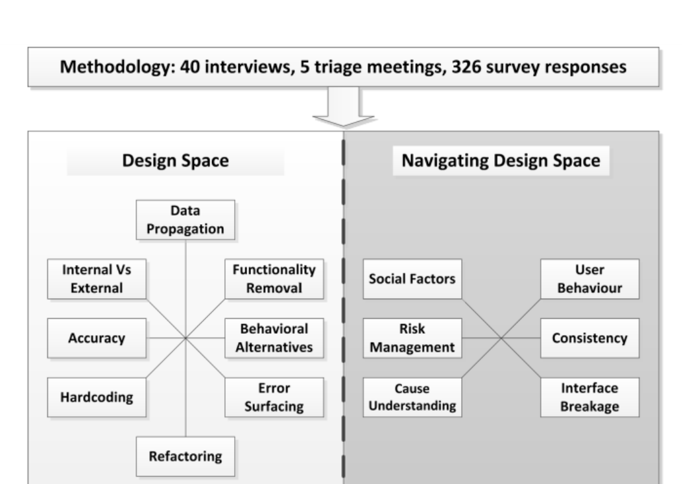

# The Design of Bug Fixes

Emerson Murphy-Hill  
Department of Computer Science  
North Carolina State University  
Raleigh, North Carolina, USA  
emerson@csc.ncsu.edu

Thomas Zimmermann, Christian Bird, Nachiappan Nagappan, and Michael Barnett  
Microsoft Research  
Redmond, Washington, USA  
{tzimmer,cbird,nachin,mbarnett}@microsoft.com

Keywords—component; bugs, faults, empirical study, design

## I. INTRODUCTION

As the software systems we create and maintain continue to grow in capability and complexity, software engineers must ensure that these systems work as intended. When systems do not, software engineers fix the “bugs” that cause this unintended behavior.

Traditionally, researchers and practitioners have assumed that where in the software an engineer fixes a bug is where an error was made [1]. For example, Endres [2] makes such an assumption in a study, but cautions the reader that,

> There is, of course, the initial question of how we can determine what the error really was. To dispose of this question immediately, we will say right away that, in the material described here, normally the actual error was equated to the correction made. This is not always quite accurate, because sometimes the real error lies too deep, thus the expenditure in time is too great, and the risk of introducing new errors is too high to attempt to solve the real error. In these cases the correction made has probably only remedied a consequence of the error or circumvented the problem. To obtain greater accuracy in the analysis, we really should, instead of considering the corrections made, make a comparison between the originally intended implementation and the implementation actually carried out. For this, however, we usually have neither the means nor the base material.

Figure 1: Characterizing the design of bug Fixes

Although the software engineering community has suspected that this assumption is sometimes false, there exists little evidence to help us understand under what circumstances it is false. The consequences of this lack of understanding are manifold. Let us provide several examples. For researchers studying bug prediction [3] and bug localization [4], models of how developers have fixed bugs in the past may not capture the true cause of failures, but may instead only capture workarounds. For practitioners, when a software engineer is evaluated based on how many bugs are fixed, the evaluation may not accurately reflect that engineer’s effect on software quality. For educators, without teaching future engineers the contextual factors that go into deciding which fix to apply, as engineers they may choose inappropriate fixes.

However, to our knowledge, there has been no empirical research into how bug fixes are designed. In this paper, we seek to understand the design of bug fixes. When we say that bug fixes are “designed,” we mean that there are a number of potential fixes for a single bug, and choosing between those fixes is a matter of human judgment. As with any software change, an engineer must deal with a number of competing forces when choosing exactly what change to make. The task is not always straightforward. To fill this gap, we seek to answer two research questions:

RQ1: What are the different ways that bugs can be fixed?