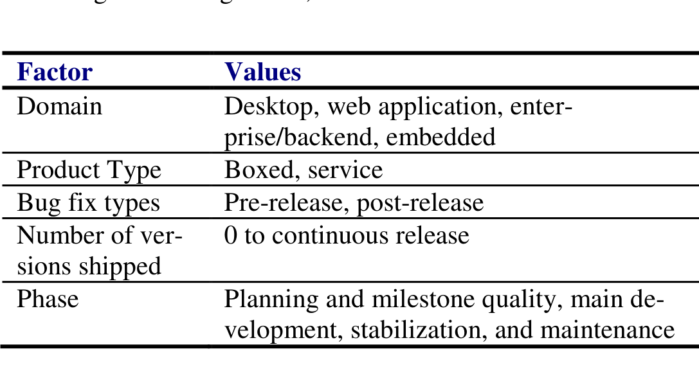

symptoms, the causes, and whether they considered more than one way to fix the bug. If an interviewee did consider multiple fixes, we asked her to briefly explain each one, and justify their final choice. The full interview guide can be found online.1

### Participants

To sample a wide variety of engineers, we recruited interviewees using a stratified sampling technique, sampling across several dimensions of the products that engineers create. We first postulated what factors might influence how engineers design fixes; we list those factors in Table I.

Table I. Factors for selecting product groups.

Using these factors, we selected a cross section of Microsoft products that spanned those factors. We chose four products from which to recruit engineers, because we estimated that four products would balance two competing requirements; that we sample enough engineers from each product team to get a good feeling for what bug fixing is like within that team, and to sample enough product teams that we could have reasonable generalizability. The four product teams that we selected spanned each of the values in the Table. For example, one team we talked to worked on desktop software, one web applications, another enterprise/backend, and the last embedded systems.

Within each product team, we aimed to talk to a total of 8 software engineers: six were what Microsoft calls “Software Development Engineers” (developers for short) and two were “Software Development Engineers in Test” (testers for short). We interviewed more developers, as developers spend more time fixing bugs than testers. Once we reached our quota of engineers in a team, we moved on to the next product team. In total, we completed 32 opportunistic interviews with engineers.

### Data Analysis

We prepared the interviews for analysis by transcribing them. We then coded the transcripts [16] using the ATLAS.ti2 software. Before beginning coding, we defined several base codes, including codes to identify symptoms, the fix that was applied, alternative fixes, and reasons for discriminating between fixes. The first author did the coding. Additionally, our research group, consisting of 7 full time researchers and 7 interns, analyzed the coded transcripts again, to determine if any other notable themes emerged. Each person in the group analyzed 2 to 4 transcripts over ½ hour. We regard the first

author’s coding as methodical and thorough, while the team’s analysis was brief and serendipitous. We derived most of the results described in this paper from the first author’s coding. We use the codes about fixes to describe the design space (Section IV.A) and codes about discriminating between fixes to describe how engineers navigate that space (Section IV.B).

### Data Characterization

Overall, we found software engineers very willing to be interviewed. To obtain 32 interviews, we visited 152 engineers’ offices. Most offices were empty or the engineers appeared busy. In only a few cases, engineers explicitly declined to be interviewed, largely because the engineer was too busy. Interviews lasted between 4 and 30 minutes. In this paper, we refer to participants as P1 through P32.

Most participants reported multiple possible fixes for the bug that they discussed. In a few cases, participants were unable to think of alternate solutions; however, the interviewer, despite being unfamiliar with the bug, was able to suggest an alternative fix. In these cases, the engineer agreed that the fix was possible, but never consciously considered the alternative fix, due to external project constraints.

Interestingly, this opportunistic methodology allowed us to interview three engineers who were in the middle of considering multiple fixes for a bug.

### B. Firehouse Interviews

Using the firehouse research method [17], we interviewed engineers immediately after they fixed a bug. Firehouse research is so called because of the unpredictable nature of the events under study; if one wants to study social dynamics of victims during and immediately after a fire, one has to literally live in the firehouse, waiting for fires to occur. Alternatively, one can purposefully set fires, although this research methodology is generally discouraged. In our case, we do not know exactly when an engineer is considering a fix, but we can observe a just-completed fix in a bug tracker and “rush to the scene” so that the event is fresh in the engineer’s mind.

### Goal

Our goal was to obtain qualitative answers to our research questions in a way that maximized the probability that engineers could accurately recall their bug fix design decisions.

### Protocol

We first picked one product group at Microsoft, went into the building where most development for that product takes place, and monitored that group’s bug tracker, watching for bugs an engineer marked as “fixed” within the last ten minutes. If the engineer was not located in the building, we moved on to the next most recently closed bug. Otherwise, the interviewer went immediately to the engineer’s office.

When approaching engineers for this study, we were slightly more aggressive than in the opportunistic interviews; if the engineer’s door was closed, we knocked on the door. If the engineer was not in her office by the time we arrived, we waited a few minutes. These interviews were the same as the opportunistic interviews, except that the interviewer insisted that the engineer focused on the bug that they had just closed.

### Participants

Our options for choosing a product group to study was fairly limited, because we had to have a personal contact within that team that was willing to allow us to have live, read-only access to their bug tracker. We chose one product

1 http://people.engr.ncsu.edu/ermurph3/experiments/BugFixDesignInterview.pdf
2 http://atlasti.com/