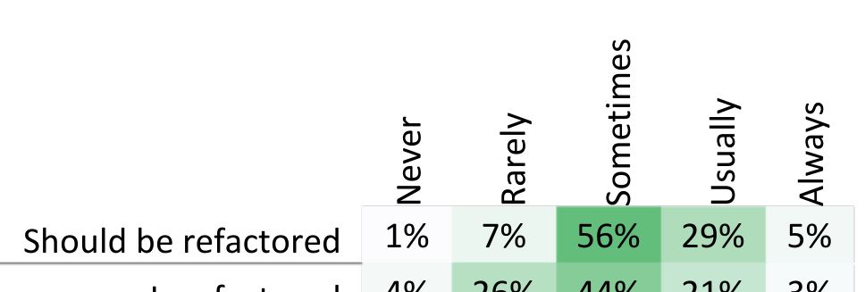

### Data Propagation Across Components

This dimension captures how far information is allowed to propagate across a piece of software, where the engineer has the option of fixing the bug by intercepting the data in any of the components. At one end of the dimension, data is corrected at its source.

As an example, P25 worked on software with a layered architecture, with at least four layers, the topmost being the user interface. The bug was that the user interface was reporting disk space sizes far too large, and the engineer found that the problem could be traced back to the lowest-level layer, which was reporting values in kilobytes when the user interface was expecting values in megabytes. The interviewee had the option of fixing the bug by correcting the calculation in the lowest layer, or by transforming the data (multiplying by a thousand) as it is passed through any of the intermediate layers.

### Error Surfacing

This dimension describes how much information is revealed to users, whether that information is for end users or other engineers. At one end of the dimension, the user is made aware of detailed error information; at the other, the existence of an error is not revealed.

P28 described a bug where the software he was developing crashed when the user deleted a file. When fixing the bug, the engineer decided to catch the exception to prevent the crash, but also was considering whether or not the user should be notified that an exceptional situation had occurred.

As another example, P6 described a bug where she was calling an API that returned an empty collection, where she expected a non-empty collection. The problem was that she passed an incorrect argument to the API, and the empty collection signified an error. However, an empty collection could also signify “no results.” As part of the fix, the engineer considered changing the API so that it threw an error when an unexpected argument was passed to the API. She anticipated that this would have helped future engineers avoid similar bugs.

### Behavioral Alternatives

This dimension relates to whether a fix is perceptible to the user. At one end of the dimension, the fix does not require the user to do anything differently; at the other end, she must significantly modify her behavior.

One example is P11, who described a bug where the back button in a mobile application was occasionally not working.

As part of the fix, he made the back button work, but had to simultaneously disable another feature when the application first loads. P11 stated that having both the back button and the other feature working at the same time was simply not possible; he had to choose which one should be enabled initially.

### Functionality Removal

This dimension relates to how much of a feature is removed during a bug fix. At one end of the dimension, the whole software product is eliminated; at the other, no code is removed at all.

As an example, P18 described a bug in which a crash occurred. Rather than fixing the bug, P18 considered removing the feature that the bug was in altogether. We were initially quite surprised when we heard this story, because the notion that an engineer would remove a feature just to fix a bug seems quite extreme. However, removal of features was mentioned repeatedly as a fix for bugs during our interviews.

To quantify functionality removal, we asked survey respondents to estimate how often they remove or disable features, rather than alleviating a symptom of a bug. About 75% of respondents said they had removed features from their software to fix bugs in the past.

### Refactoring

This dimension expresses the degree to which code is restructured in the process of fixing a bug, while preserving its behavior. A bug may be fixed with a simple one-line change, or it may entail significant code restructuring.

As an example, P5 considered refactoring to remove some copy-and-paste duplication, so “you're not only fixing the bug, but you also are kind of improv[ing it].”

In our survey, we asked respondents to report on refactoring frequency when fixing bugs, as shown in Table II. In the table, “Should be refactored” indicates how often participants “notice code that should be refactored when fixing bugs.” For example, 29% of respondents indicated that they usually notice code that should be refactored. The “Is refactored” row indicates how often participants “refactor this code that should be refactored”. For example, 26% reported rarely refactoring code that should be refactored. These results suggest that, although engineers appear to regularly encounter code that should be refactored, much of this code remains unchanged.

### Internal vs External

This dimension relates to how much internal code is changed versus external code is changed as part of a fix. On one end of this dimension, the engineer makes all of her changes to internal code, that is code for which the engineer has a strong sense of ownership. On the other end, the bug is fixed by changing only code that is external, that is, code for which the engineer has no ownership.

One example is P33, who maintained a testing framework for devices used by several other teams. The bug was that many devices were not reporting data in a preferred manner, causing undesirable behavior in P33’s framework. Part of the fix was immediate and internal (changing the testing framework), but part of it was deferred and external (changing each of the other teams’ device code).

Is refactored 4% 26% 44% 21% 3%  
Table II. Survey respondents’ refactoring behavior