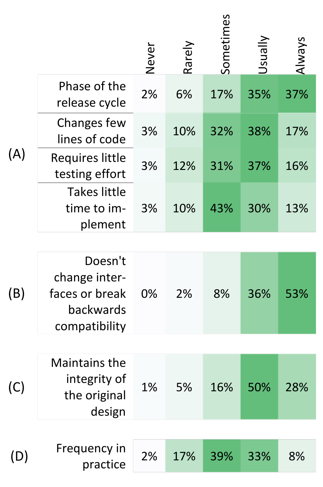
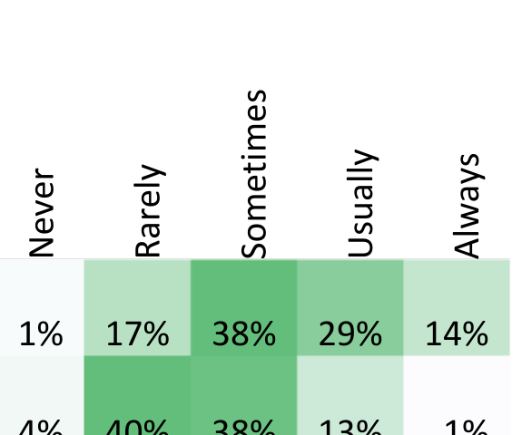

Table III. Factors that influence engineers’ bug fix design

### Accuracy
This dimension captures the degree to which a fix utilizes accurate information. On one end of this dimension, the engineer uses highly accurate information, and on the other, he uses heuristics or guesses.

An example is P29, who was working on a bug where web browser printing was not working well. An accurate fix would be one where his print driver retrieves the available fonts from the printer, then modifies the browser’s output based on the available fonts. A less accurate fix was to use a heuristic that produces better, but not optimal, print output.

### Hardcoding
This dimension captures to what degree a fix hardcodes data. On one end of the dimension, data is specified explicitly, and on the other, data is generated dynamically.

One example of fixes on this dimension is P24, who was writing a test harness for a system that received database queries. The bug was that some queries that his harness was generating were malformed. He considered a completely hardcoded solution to the problem, removing the query generator and using a fixed set of queries instead. A more dynamic solution he considered was to modify the generator itself to either filter out malformed queries, or not to generate them at all.

Actually are fixed optimally 4% 40% 38% 13% 1%

Table IV. Survey respondents’ optimal fix

## B. Navigating the Design Space
While the previous section described the design space of bug fixes, it said nothing about why engineers implement particular fixes within that design space. For instance, when would an engineer refactor while fixing a bug, and when would she avoid refactoring? In an ideal world, we would like to think that engineers make decisions based completely on technical factors, but realistically, a variety of external factors come into play as engineers navigate this bug fixing design space. In this section, we describe those external factors.

### Risk Management by Development Phase
A common way that interviewees said that they choose how to design a bug fix is by considering the development phase of the project. Specifically, participants noted that as software approaches release, their changes become more conservative. Conversely, participants reported taking more risks in earlier phases, so that if a risk materializes, they would have a longer period to compensate. Two commonly mentioned risks were the risk that new bugs would be introduced and the risk that spending significant time fixing one bug comes at the expense of fixing other bugs.

P12 provided an example of taking a more conservative approach, when he had to fix a bug by either fixing an existing implementation of the double-checked locking pattern, or replace the pattern with a simpler synchronization mechanism. He eventually chose to correct the pattern, even though he thought the use of the pattern was questionable, because it was the “least disruptive” way to fix the bug. He noted that if he had fixed the bug at the beginning of the development cycle, he would have removed the pattern altogether.

In our survey, we asked engineers several questions relating to risk and development phase, as shown in Table IIIA. Here we asked engineers “How often do the following factors influence which fix you choose?”, where each factor is listed at left. The table lists the percentage of respondents who choose that frequency level. Note that the factors are not necessarily linked; for instance, an engineer could choose to change very few lines of code for a reason other than the product is late in development. However, our qualitative interviews suggested that these factors are typically linked together, and thus we feel justified in presenting these four factors as a whole. These results suggest that, for most respondents, risk mitigation usually plays an important role in choosing how to fix a bug.