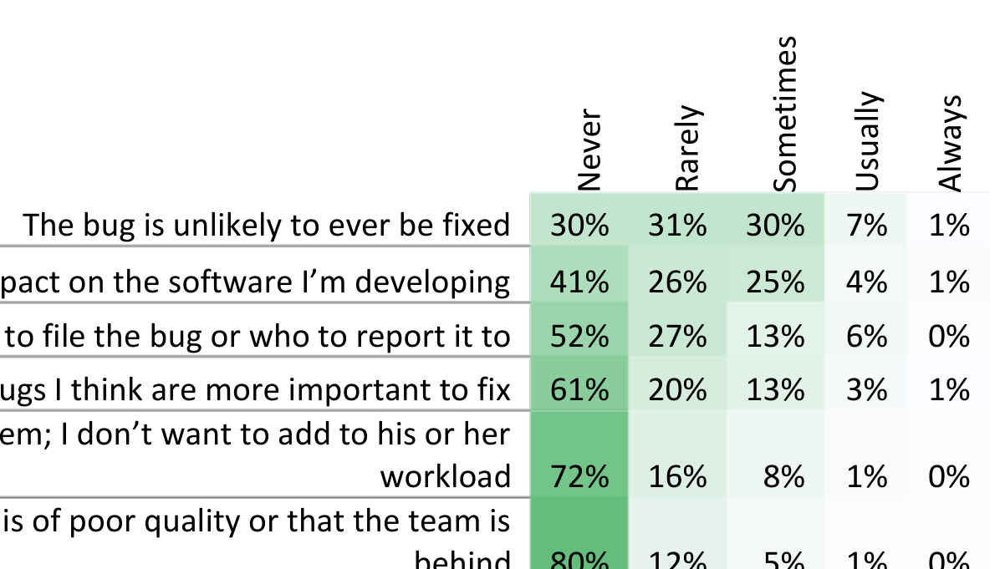

like the software is of poor quality or that the team is behind 80% 12% 5% 1% 0%

Table VIII. Frequency of reasons for not filing bugs

Explicit design decisions outweighed this threat. Future researchers may be able to confirm or refute our results by using a research method that is more robust to expectancy bias.

Still, some interviewees struggled with remembering the design decisions they made, and were generally unable to articulate implicit decisions. This type of memory bias is inherent in most retrospective research methods. However, we attempted to control memory bias by asking opportunistic interviewees to recall their most recently fixed bugs, asking firehouse interviewees to discuss a bug they just fixed, and asking survey respondents to look at bugs they had recently fixed.

To meet our goal of not significantly interrupting participants' workdays, we kept our interview and survey short, which means we were unable to collect contextual information that may have helped us better explain the results. For example, in the interviews, we did not ask questions about the gender or team structure, which may have some effect on bug fix designs.

Similarly, a consequence of keeping the survey short is that participants may have misunderstood our questions. For example, in our survey, we asked engineers whether they ever avoided filing a bug report; this question could be interpreted conservatively to mean, "when do you not report software failures?", when our intent was for "bug reports" to be interpreted broadly to include enhancements. While we tried to minimize this threat by piloting our survey, as with all surveys [14], we may still have miscommunicated with our respondents.

## VI. IMPLICATIONS

The findings we present in this paper have several implications, a handful of which we discuss in this section.

### Additional Factors in Bug Prediction and Localization.

Previous research has investigated several approaches to predicting future bugs based on previous bugs [20] [21], including our own [3]. The intuition behind these approaches appears reasonable: how engineers have fixed bugs in the past is a good predictor of how they should fix bugs in the future. However, the empirical results we present in this paper suggest a host of factors can cause a bug to be fixed in one way at one point in time, but in a completely different way at another. For example, a bug fixed just before release is likely to be fixed differently than a bug fixed during the planning phase. As a result, future research in prediction and localization may find it useful to incorporate, when possible, these factors into their models.

### Limits of Bug Prediction and Localization.

Although incorporating some factors, such as development phase, into historical bug prediction may improve the accuracy of these models, some factors appear practically outside the reach of what automated predictors can consider. For example, when analyzing past bugs, it seems unlikely that an automated predictor can know whether or not a past fix was made with an engineer’s full knowledge of why the bug occurred.

### Refactoring while Fixing Bugs.

The results of our study suggest that engineers frequently see code that should be refactored, yet still avoid refactoring. One way that this problem could be alleviated is through wider spread use of refactoring tools, which should help engineers refactor without spending excessive time doing so and at minimal risk of introducing new bugs. At the same time, such tools remain buggy [22] and difficult to use [23], so more research in that area is necessary.

### Usage Analytics.

In our study, it appeared that engineers often made decisions about how to fix bugs without a data-driven understanding of how real users use their software. While a better understanding would clearly be beneficial, gathering and querying that data appears to be time consuming. Microsoft, like many companies, has been gathering software usage data for some time, but querying that data requires engineers to be able to find and combine the right data sources, and write complex SQL queries. We envision a future where engineers, while deciding the design of a bug fix, can quickly query existing usage data with an easy-to-use tool. To build such a tool, research is first needed to discover what kinds of questions engineers ask about their usage data, beyond existing "questions engineers ask" studies [24].

### Fix Reconsideration.

Engineers in our study reported needing to reconsider bug fixes in the future, but sometimes used ad-hoc mechanisms for doing so, such as writing TODOs in code. Some of these mechanisms may be difficult to keep track of; for example, which TODOs should be considered sooner rather than later. Engineers need a better mechanism to reconsider fixes in the future, as well the time to do so.