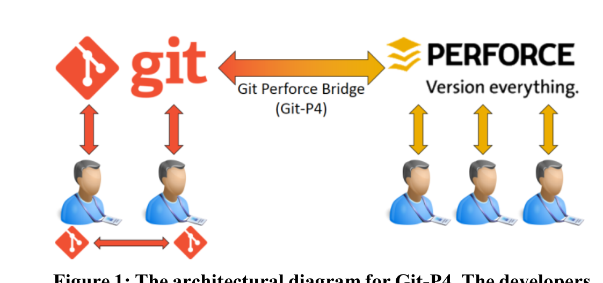
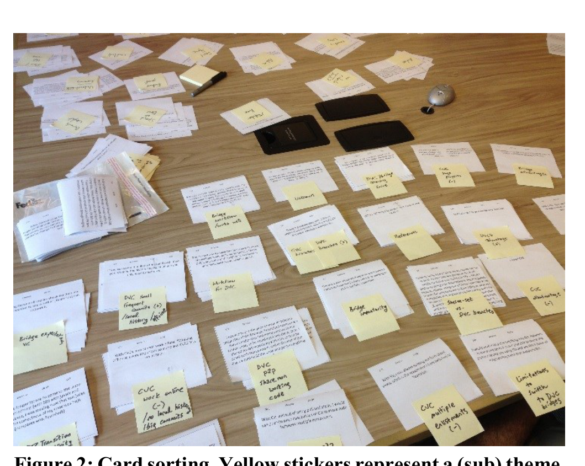
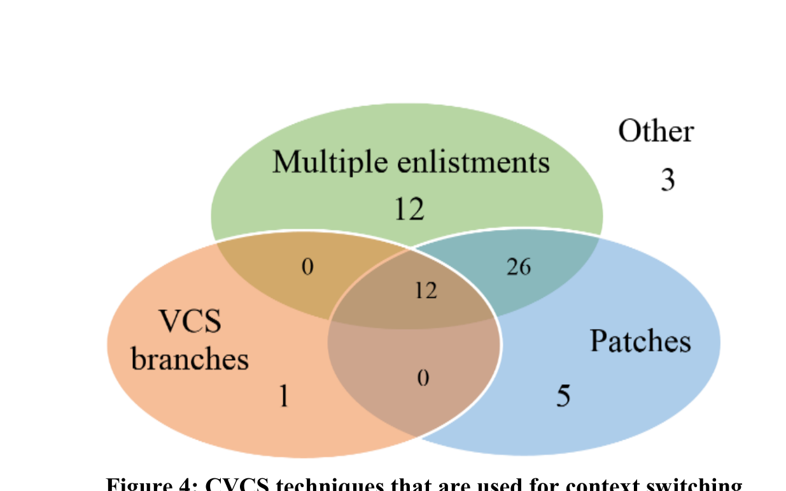
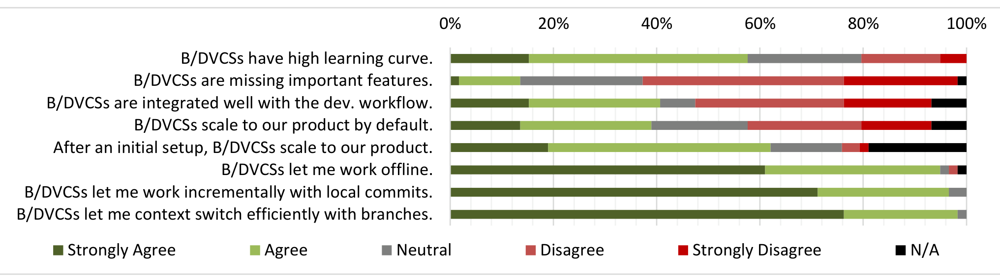
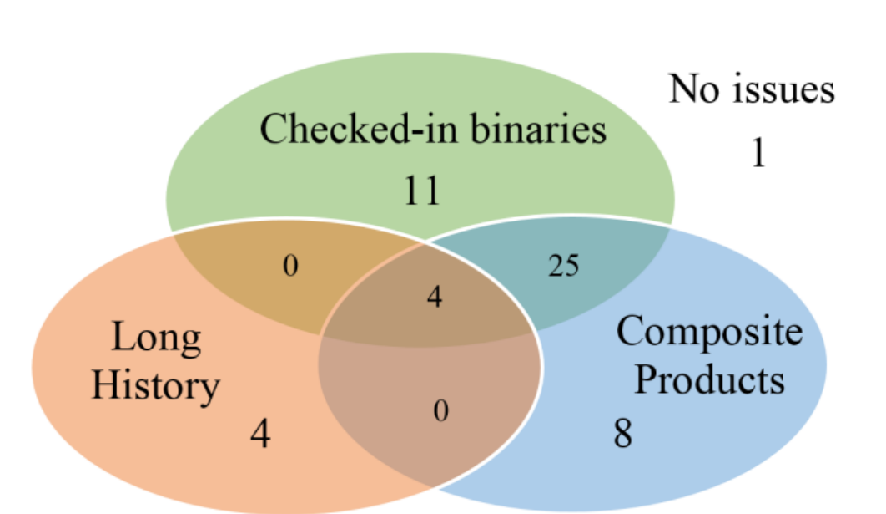
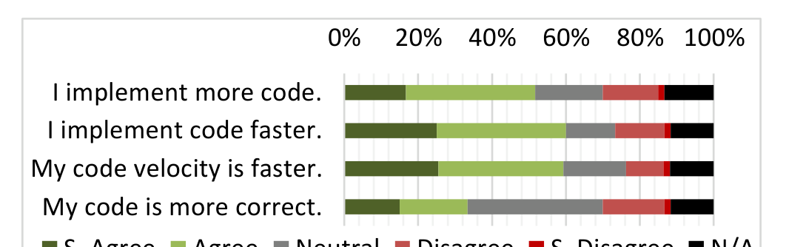
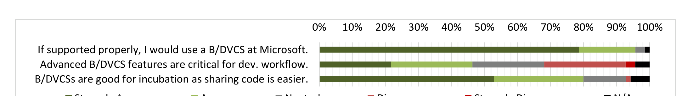
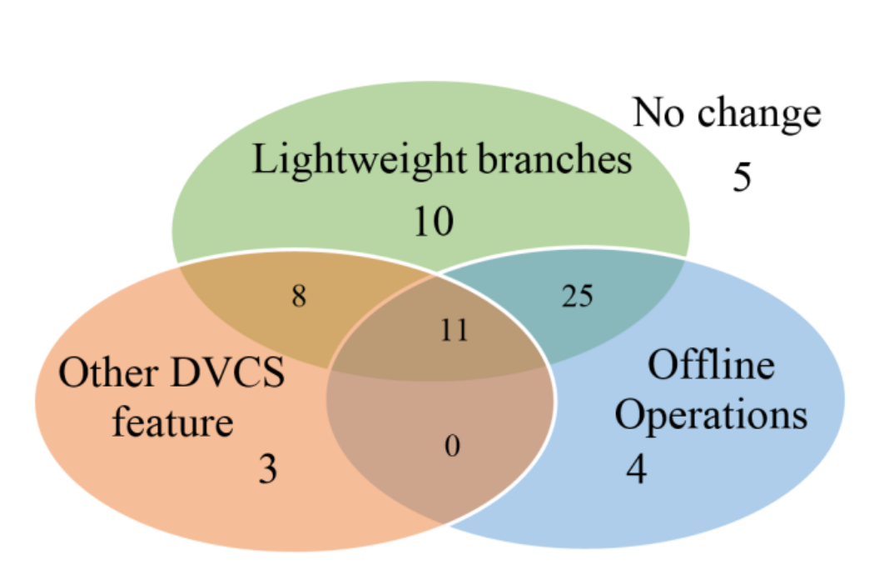

# Transition from Centralized to Distributed VCS:  
A Microsoft Case Study on Reasons, Barriers, and Outcomes

Kıvanç Muşlu  
University of Washington, Seattle, WA, USA  
kivanc@cs.washington.edu

Christian Bird, Nachiappan Nagappan  
Microsoft Research, Redmond, WA, USA  
{cbird, nachin}@microsoft.com

Jacek Czerwonka  
Microsoft, Redmond, WA, USA  
jacekcz@microsoft.com

## ABSTRACT
In recent years, software development has started to transition from centralized version control systems (CVCSs) to decentralized (DVCSs) version control systems. Although CVCSs and DVCSs have been studied extensively, there has been very little research on the transition across these systems.

This paper investigates the transition process, from the developer’s point of view, in a large company. The paper captures the transition reasons, barriers, and results through ten developer interviews, and investigates these findings through a survey, participated by 70 developers. We found that the majority of the developers need incremental, small commits, and lightweight branches to work efficiently. DVCSs fulfill these developer needs; however the transition comes with a cost depending on the previous development workflow. The paper discusses the transition reasons, transition barriers and outcomes, and provides recommendations for teams planning such a transition. Our analysis showed that lightweight branches and local, incremental commits were the main reasons for developers wanting to move to a DVCS. Further, the main problems with the transition process were identified as: steep DVCS learning curve; tool immaturity; and DVCS scaling issues.

de Alwis and Sillito [1] investigated the transition process, challenges, and anticipated benefits for OSS. To our best knowledge, there is no study that investigates the transition process from the developer’s view in a large commercial company. This paper aims to understand transition reasons, barriers, and outcomes from a qualitative perspective to expand the scientific knowledge for the whole transition process. To identify the transition reasons, barriers, and outcomes, this paper uses interviews of developers who transitioned from a CVCS to a DVCS within the same project. The paper also investigates and quantifies the findings from the interviews by presenting the results of a comprehensive survey, participated by 70 developers. The paper identified that, at Microsoft, DVCSs are preferred for some simple but key operations, such as incremental workflow through small and local commits, and efficient context switching through lightweight branches. This raises the question whether all DVCS features — and specifically being distributed — are essential for large, commercial companies. Section 7 discusses this question in-depth.

The paper makes the following contributions:
- A novel, qualitative study with professional developers who transitioned from a CVCS to a DVCS within the same project (Section 3).
- Identification of the key concepts for transition reasons, barriers, and outcomes, and quantification of these findings through a comprehensive survey, participated by 70 developers (Sections 4, 5, and 6).
- In-depth discussion of the DVCS features that are favored by the developers to understand whether these features are essential to DVCSs. This discussion concludes with guidelines to people who consider transitioning (Section 7).

The remainder of the paper is organized as follows: Section 2 defines VCS terminology. Section 3 explains the methodology. Sections 4, 5, and 6 explain transition reasons, barriers, and outcomes, respectively. Section 7 discusses some of our findings in-depth and provides guidance to people who consider transitioning. Section 8 discusses threats to validity in the findings. Section 9 puts the paper in the context of the related work. Section 10 concludes.

## Categories and Subject Descriptors
D.2.7 [Software Engineering]: Distribution, Maintenance, and Enhancement — version control

## General Terms
Measurement, Human Factors.

## Keywords
Version control system, DVCS, CVCS, distributed, centralized, productivity, barriers, empirical.

## 1. INTRODUCTION
Version control systems (VCSs) help developers to implement and maintain large systems by letting them collaborate and work on the same product at the same time. A centralized VCS (CVCS) keeps all development history in a central server whereas a decentralized VCS (DVCS) keeps the development history on each development machine locally. Historically, DVCSs came later than CVCSs, trying to address the limitations of CVCSs, such as enabling lightweight branching, local VCS operations, and easier collaboration between developers [1].

Although CVCSs and DVCSs have been available for quite a while, to the best of our knowledge, there is little research on why developers transition from a CVCS to a DVCS. For a developer, who is already proficient with a CVCS, transitioning to an unknown DVCS would require considerable effort, which would only make sense if the benefits of using the DVCS would eventually outweigh this transition effort. Barr et al. [2] investigated how the transition affects the project branching structure and the way the developers use branches in open-source software (OSS). de Alwis and Sillito [1] investigated the transition process, challenges, and anticipated

The remainder of the paper is organized as follows: Section 2 defines VCS terminology. Section 3 explains the methodology. Sections 4, 5, and 6 explain transition reasons, barriers, and outcomes, respectively. Section 7 discusses some of our findings in-depth and provides guidance to people who consider transitioning. Section 8 discusses threats to validity in the findings. Section 9 puts the paper in the context of the related work. Section 10 concludes.

## 2. DEFINITIONS
This section defines VCS terminology used throughout the paper.

A version control system (VCS) is a tool that helps the developers manage the source code and the development history of a product with the following core functionality: (1) backing up the source code seamlessly, and (2) letting multiple developers collaborate efficiently.

A repository is the combination of the source code and metadata — including all previous versions — stored in a VCS. To work on the source code, the developer checks out a version of the history from a repository to a local workspace. The developer makes changes to the workspace and checks in these changes to the VCS to make the changes accessible to other developers. During a check-in, the developer’s changes might conflict with changes checked in by other developers. All VCSs provide a textual merge algorithm that finds

---

> **Image description:** A schematic showing a bridged VCS setup where Git users on the left and Perforce users on the right coexist. On the left are two developer icons beneath a large Git logo; arrows indicate each developer can synchronize with the master Git repository or with peers (small Git icons) via peer-to-peer pushes/pulls (horizontal double arrow). On the right are three developer icons that each interact only with a single Perforce master (Perforce logo and tagline), and a central bi-directional arrow labeled “Git Perforce Bridge (Git‑P4)” indicates the master Git and master Perforce repositories are synchronized in both directions. The figure conveys that Git-P4 provides bidirectional mirroring between a DVCS (Git) and a CVCS (Perforce), enabling local Git workflows alongside a centralized Perforce server.

Figure 1: The architectural diagram for Git-P4. The developers on the left use Git. They synchronize with either the ‘master’ Git repository (Git logo at the top left) or their peer’s private Git repositories (small Git logo at the bottom left). The developers on the right use Perforce and only interact with the ‘master’ Perforce repository. Git-P4 synchronizes the master Git repository and the master Perforce repository in both directions.

the closest common ancestor for conflicting changes and shows the conflicts as a 3-way diff. A VCS branch is a systematic way to provide isolation by diverging from the development history at a specific point. By default, the development in a VCS starts in a branch called ‘master’. Later, the developers can create other branches from existing branches. 1

A centralized VCS (CVCS) (e.g., CVS [3], SVN [4]) is a VCS that stores the development history in a central server. Most CVCSs only store one snapshot (typically the latest) of the repository locally at any given time. Consequently, CVCSs scale well regardless of the development history. However, VCS operations that need access to history that is not available locally, such as merge, must execute on the server.

A distributed VCS (DVCS) (e.g., Mercurial [5], Git [6]) is a VCS that stores the whole development history on each development machine. Consequently, most VCS operations – except synchronization with another repository – execute locally.

A bridge is some tooling between a CVCS and a DVCS that lets the developers use the DVCS, but stores the history in the CVCS. The bridge offers bidirectional synchronization between the CVCS and the DVCS. Figure 1 depicts the architectural diagram of a bridged VCS (BVCS), which consists of one CVCS, one DVCS, and a bridge implementation. This paper uses the terms bridge and BVCS interchangeably. The term ‘B/DVCS’ stands for BVCS or DVCS. The term ‘transition’ stands for the transition from a CVCS to a B/DVCS, for the rest of the paper.

### 3. METHODOLOGY

To understand the transition reasons, barriers, and outcomes, we have conducted ten semi-structured developer interviews and a survey participated by 70 developers. This section explains the methodology for the interviews, and the survey. The results are presented in Sections 4, 5, and 6.

For the interviews, we selected developers who transitioned within the same project, as they have a better chance to compare a CVCS to a B/DVCS. We sent a preliminary survey to two internal B/DVCS mailing lists to find such developers. Depending on the survey results, we sent individual e-mails to recruit developers.

> **Image description:** A photograph of a card-sorting session: dozens of printed interview-summary cards are laid out in grouped stacks across a wooden table, each group annotated with a yellow sticky note naming an emergent theme or sub-theme. A marker and a computer mouse sit near the top of the table, indicating an active, manual sorting process. This visual documents the authors’ qualitative step (they produced 378 cards from recorded interviews) used to cluster developer comments into themes such as DVCS/CVCS workflows, transition reasons, barriers, and outcomes that underpin the paper’s findings.

Figure 2: Card sorting. Yellow stickers represent a (sub) theme. Each developer went through a semi-structured interview where the interviewer had several questions that tried to capture the developer’s familiarity and workflow patterns with different VCSs, and the transition reasons, barriers, and outcomes. The questions were general to prevent introducing bias as much as possible. For example, instead of asking whether the developer likes lightweight DVCS branches, we asked which DVCS aspects the developers likes and dislikes. The developers were encouraged to talk in detail for any question, or any part of the transition that the questions did not cover. Each interview lasted about an hour and was recorded.

After the last interview was completed, we coded the recordings. For each coded interview, we then generated 25 to 55 cards containing the key points. At the end, we printed a total of 378 cards. Then, we sorted these cards to categorize the responses for thematic similarity (as illustrated in LaToza et al.’s study [7]). These themes that emerged during the sort were not chosen beforehand. Finally, we went over each theme and categorized the cards in that theme into sub-themes. Figure 2 shows the cards – with themes and sub-themes written on yellow stickers.

Kitchenham and Pfleeger [8] discuss the design and construction of personal opinion surveys using the following steps: searching the relevant literature; construct an instrument; evaluate the instrument; document the instrument. In our survey, as suggested by Kitchenham and Pfleeger, we use formal notations, limit our respondents’ responses to numerical, Yes/No type, Likert-scale, and short free form answers. Respondents were anonymous. We followed Kitchenham and Pfleeger’s advice [8] on the need to understand whether the respondents had enough knowledge to answer the questions in an appropriate manner. For this, we restricted the people invited to participate in the survey to people who had registered in the B/DVCS mailing lists. Second, even if the developers had never used a CVCS or a B/DVCS, they could skip the related parts of the survey and still be included in the drawing, ensuring that no one felt compelled to take the survey for the chance to win the gift.

At the end, 70 developers (out of 150 possible candidates) took and completed the survey. 57 participants (81%) used a B/DVCS and all participants used a CVCS at Microsoft, respectively. 47 participants (82%) continue using a B/DVCS. Table 1 summarizes the remaining demographical properties for the survey participants.

1 The paper uses the terms ‘check-in’ and ‘check-out’ instead of ‘commit’ and ‘clone’, which have different meaning for DVCSs and CVCSs.

2 Survey respondents could e-mail us separately outside of their survey responses to enter a drawing for four $10 rewards.

---

> **Image description:** A horizontal stacked–bar Likert chart summarizing developers’ agreement with six statements about centralized VCS (CVCS) limitations and desired DVCS features. Each row corresponds to a statement (e.g., “CVCS workflow is non-optimal as I have to be online,” “CVCS workflow is non-optimal as context switching is hard,” “I prefer frequent and small check‑ins…,” “At Microsoft, creating a branch is an organizational decision,” and “I would prefer using VCS branches for context switching”) and bars are colored by response: Strongly Agree (dark green), Agree (light green), Neutral (gray), Disagree (pink), Strongly Disagree (red), and N/A (black). The figure shows strong consensus for small, frequent commits (97% of respondents support incremental commits) and widespread preference for using branches for context switching (nearly all agreed), 81% agree branch creation is an organizational decision, a majority report being constrained by needing to be online (≈56% agree) and by difficult context switching (~76% agree), while responses are mixed on whether slow quality‑gate tooling negatively affects workflow (about 46% agree vs. 28% disagree). The caption notes that two questions were answered by smaller qualifying subsets (36 and 54 respondents).

Strongly Agree Agree Neutral Disagree Strongly Disagree N/A

Figure 3: Survey results related to transition reasons (colored). The second and last questions are answered by 36 and 54 qualifying developers. More than 50% of the developers agree that they cannot work efficiently with the current CVCSs at Microsoft because they have to be online and cannot context switch easily. Most developers prefer to work with small, incremental commits and use VCS branches for context switching. 81% of the developers agree that creating and deleting branches is an organizational decision at Microsoft. Finally, the developers have mixed feelings (46% agree vs. 28% disagree) on whether quality gates affect their development workflow negatively.

## 4. TRANSITION REASONS

This section focuses on the following four main transition reasons: the ability to (1) work offline, (2) work incrementally, (3) context switch efficiently, and (4) do exploratory coding efficiently. Figure 3 summarizes the related survey results.

**(i) The ability to work offline:** All developers we interviewed focus on the importance of being able to work offline. The majority of the survey participants (56% vs. 34%) agree with this observation. Some CVCSs force the developers to check-out a file before editing. 3 Consequently, if the developer is not connected to the server, s/he cannot work easily. The manual workarounds are tedious. For example, the developer could check-out the files s/he wants to edit with a special flag, do some changes, and attempt to check-in when s/he is connected to the server again. At this point, the CVCS would attempt to replay developer’s steps. If any step fails due to other check-ins, developer’s check-in fails. Similarly, developers cannot work easily when the central server is down or having bandwidth problems.

The developers believe that with a B/DVCS they can work offline. When using a B/DVCS, the developers need to interact with the central server only when they need to check-in their changes to or check-out new changes from the server.

**(ii) The ability to work incrementally:** In our interviews, all developers except one focus on the importance of incremental and frequent local commits. 97% of the survey participants support this observation by favoring small, frequent commits to one large check-in. CVCSs do not support local commits. The moment the developers commit, the commit is checked-in to the server and is accessible to everyone. Some development practices suggest that the developers should check-in complete and working code, which makes it more difficult for the developers to create checkpoints for their current work. These checkpoints are useful for understanding how a recent code has evolved in time and returning back to a previous version quickly.

Table 1: Survey demographics

| Demographic Property | Average Value |
| --- | --- |
| Development experience | 11.0 years |
| Experience at Microsoft | 6.2 years |
| Experience with CVCSs at Microsoft | 5.9 years |
| Experience with DVCSs at Microsoft | 1.5 years |

3 Some CVCSs like SVN, do support offline commits.

Microsoft products use continuous integration: checked-in changes go through ‘quality gates’ where they are built and tested. Before checking-in, most developers also go through a simplified quality gate, called Check-in Wizard, which builds and tests the modified components locally to get an early assessment of software quality. One execution of the Check-in Wizard can occasionally take a long time, which discourages the developers to do frequent check-ins. The survey participants have mixed feelings (46% agree vs. 28% disagree) on whether the quality gates affect the development workflow negatively or not. Nonetheless, the developers believe that local commits in DVCSs would let them work incrementally and go through the Check-in Wizard less frequently.

**(iii) The ability to context switch efficiently:** All developers we interviewed focus on the fact that CVCSs make it very difficult to work on multiple tasks simultaneously. Working on multiple tasks, such as developing a new feature and fixing a bug, is quite common for the developers. Figure 4 summarizes the most popular CVCS techniques for context switching. Top two of these techniques is to check-out the code multiple times on different file system locations (multiple enlistments) and create a delta for each different change and manually manage these deltas (patches). Multiple enlistments increase the storage space needed for development linearly. More importantly, each time the developer does an update, every enlistment needs to be built even if the enlistments are mostly the same. When using patches, the developer needs to create and manually maintain these patches. One developer mentions:

> I use other tools, beside [VCS], to save bits and pieces of my work. Using one of these [tools], I can take a snapshot of [my changes] … I try naming [the snapshot] meaningfully, e.g., bugid_1, bugid_2, but I don't do a good job.

76% of the survey participants agree that CVCSs they use do not provide efficient ways to context switch. The fact that all of the survey participants, except one, do not use private branches as a standalone technique was surprising for us. However, at Microsoft, the branches for a product is often an organizational decision. 81% of the survey participants agree with this observation. All check-ins need to go through quality gates, which means that all branches need infrastructure support, such as build and test labs. Therefore, it is not easy for a developer to create and delete private branches as s/he sees fit. On the other hand, with DVCSs, a developer could create a private branch, do changes, commit locally, merge her/his branch to one of the organizational branches, and check-in the changes on the organizational branch. For other developers, and for

---

> **Image description:** Three-set Venn diagram showing how developers handle context switching with centralized VCSs. Sets are Multiple enlistments (green), Patches (blue), and VCS branches (orange), with counts: 12 developers used only multiple enlistments, 5 used only patches, and 1 used only VCS branches; 26 used both enlistments and patches, 12 used all three techniques, and 3 used ‘other’ methods. The chart highlights that most respondents rely on combinations of manual techniques (multiple enlistments and patches) rather than standalone VCS branches, consistent with the paper’s finding that private branches are rarely used independently at Microsoft.

Figure 4: CVCS techniques that are used for context switching (colored). Most of the ‘other’ techniques boil down to careful management of multiple changes manually.

With the central server, it is as if the private branch never existed. Therefore, the developers believe that they can context switch efficiently using DVCS branches.

(iv) The ability to do exploratory coding efficiently: Half of the developers we interviewed mentioned that CVCSs limit their ability to do exploratory coding. Exploratory coding is basically when developers pursue a new feature/prototype development to explore its feasibility without complete knowledge of its ability to be successful or not. Exploratory coding can be seen as a task that requires a new context, however differs from the usual context switches in two aspects: (1) exploratory coding might take a long time before it becomes a prototype that can be checked-in, and (2) some exploratory coding never makes it to the product. Therefore, exploratory coding might be viewed as a longer and potentially disposable context switch. With strict and pre-defined branches, the developer has to manually manage any exploratory coding, which makes it more difficult and not worthwhile. The developers believe that DVCS branches will let them do exploratory coding efficiently.

This section identified four important CVCS drawbacks. We discuss how a DVCS can remove these drawbacks in Section 6.1.

## 5. TRANSITION BARRIERS

This section focuses on three major problems faced by the developers during the transition. Section 5.1 discusses the learning curve, Section 5.2 discusses problems caused by tool immaturity, and Section 5.3 discusses the DVCS scaling issues with huge products with long histories. Figure 5 summarizes the survey results.

### 5.1 LEARNING CURVE

Most DVCSs have higher learning curves compared to CVCSs because of two reasons: (1) the centralized model — where all development goes through a central repository — is easier conceptually, and (2) DVCSs have more advanced concepts, such as rebasing [9] and transplanting [10], which have no CVCS correspondence. 58% of the survey participants agree with the higher learning curve.

With CVCSs, the developers interact with one repository: the central master. All developers synchronize through this master. On the other hand, in DVCSs, developers have local repositories. The developers commit their changes to their local repositories first, and then check-in to a master repository. The content in the master repositories can be different than the content in the developers’ local repositories, which can be different than the content in the developers’ workspaces. Although not frequently used in big projects [2], the developers can directly synchronize through another developer’s local repository. With increased number of repositories and multiplied possibilities for sharing code, DVCSs are harder to reason about.

CVCSs do not let developers modify the development history easily. Once a change is checked-in to the central server, it is remembered indefinitely. DVCSs give more control to the developers in terms of history management. However, with great power comes great responsibility: a developer can easily modify the development history in an irrevocable way using the advanced DVCS commands. A developer mentions:

> Git is so open ended … If people do whatever they want, [they] can irrevocably lose data.

Another difficulty in learning a DVCS — for a developer who already knows a CVCS — is the conflicting terminology. DVCSs have some commands that have the same name as a CVCS command, but have a different meaning. For example, in CVCSs when a developer commits, her/his changes are checked-in to the central repository. However, in DVCSs, when a developer commits, her/his changes are only stored in her/his private local repository. Unless the developer shares her/his local repository with other developers, these changes are not accessible until the developer pushes them. We would like to note that the learning curve due to conflicting terminology is bidirectional; the developers who learn a DVCS first might also experience similar problems. For the same example, the developer who started using CVCS later would be surprised when her/his changes are immediately accessible to other developers the moment s/he commits.

In addition to the higher DVCS learning curve, three developers we interviewed mentioned that the BVCS increases the learning curve since the developers need to additionally understand how the bridge interacts with both VCSs and learn bridge-specific commands. The transition process requires the developers to change their perception of how VCSs work, learn a new VCS and learn any bridge tooling around the DVCS, which comes with a learning curve. However, three developers we interviewed mentioned that there is a tremendous amount of documentation for the popular DVCSs on the web, which might mitigate the learning curve. One developer notes:

> Another thing I like about Git is there is so much documentation available online.

### 5.2 TOOL IMMATURITY

The developers might not fully appreciate the B/DVCS features due to two major reasons: (1) incomplete bridge implementation, and (2) missing tooling around the B/DVCSs. This section focuses on the bridge (BVCS) between Git and the CVCSs in Microsoft, and discusses these problems in detail. Although 61% of the survey participants do not think that B/DVCSs are missing important features, the participants have mixed feelings (41% agree, 46% disagree) on whether B/DVCSs are integrated with the remaining of the development workflow.

Some BVCSs at Microsoft do not support all features available in the surrounding VCSs they bridge. A developer states:

> Git and [CVCS] have power individually, however these powers are not exposed by [the BVCS].

A particular BVCS uses the same file system location as a Git and a CVCS repository at the same time, which causes interaction problems between VCSs. A developer mentions:

> [BVCS] looked was something between two worlds. Some tools would think that there was a [CVCS] enlistment in the workspace, sometimes Git operations would not work.

---

> **Image description:** A horizontal stacked-bar chart (N=57 B/DVCS users) shows respondent agreement with eight statements about bridged/distributed VCSs. Colors encode Strongly Agree → Strongly Disagree and N/A; each row is a statement (e.g., context switching, incremental commits, offline work, scaling, integration, learning curve, missing features). Key findings visible: overwhelming agreement that B/DVCSs enable efficient context switching (~98%), local incremental commits (~97%), and offline work (~95%); only 39% agree their product scales to B/DVCSs by default (rising to ~62% after an initial setup); opinions are split on integration with the development workflow (≈46% agree vs ≈41% disagree); and a majority do not report missing critical features (≈61% disagree), while ~58% note a higher learning curve.

Figure 5: Survey results related to transition barriers and outcomes (colored). These questions were answered by 57 participants, who have used a B/DVCS at Microsoft. 58% of the participants note the learning curve with B/DVCSs. 61% of the participants do not believe that B/DVCSs are missing important features. Participants have mixed feelings (46% agree, 41% disagree) on whether B/DVCSs are not integrated well with the development workflow. Only 39% of the participants agree that their product scales to B/DVCSs by default whereas the agreement increases to 62% if the participants are permitted to do an initial setup. More than 95% of the participants agree that B/DVCSs let them work more efficiently using local commits and lightweight branches.

For developers in large companies, every step of development is important until the code is shipped in a product. The actual development benefits a lot from a VCS, however there are other important stages, too. For example, the developers need to test the implementation, do code reviews, and interact with other developers before the code is shipped. Some of these steps require additional tooling, such as VCS integration with quality gates or code reviews.

CVCSs at Microsoft are integrated very tightly and seamlessly with the whole development process – from implementation to shipping. There are teams whose main responsibility is to create and maintain CVCS integration tools. When a developer uses a CVCS, all stages of the development workflow just work. However, the same cannot be said for some BVCSs, yet. Some BVCSs are maintained only by a sub-team and are integrated to the particular development flow of that sub-team, which might be different from the other teams. Therefore, if a developer from another team wants to use this BVCS, they might need to sacrifice existing tooling for the integration of the remaining development workflow, and might be forced to do these steps manually. For example, some BVCSs are not integrated with the Check-in Wizard. For some teams, it is required to commit the code through the Check-in Wizard, which means that the developers who use such BVCSs cannot commit their changes directly from the BVCSs. Consequently, these developers create a patch for the changes so far, apply this patch to and check-in from another CVCS repository. In other words, the development is done on Git, however the code is checked-in through CVCS manually.

> I cannot use [BVCS] to check-in changes to [the CVCS],  
> because we use Check-in Wizard, and [BVCS] does not  
> support it. I create [a patch] and apply it on a [CVCS]  
> repository to check-in.

Using existing mature open-source BVCSs does not solve the tooling problem. The open-source BVCSs have no knowledge of the internal development workflows and additional tools used by Microsoft. The BVCSs have a huge potential for bringing DVCS concepts to developers without changing the product development workflow drastically. However, to accomplish this task, we believe that BVCSs need to be integrated not only to the underlying VCSs they bridge together, but also to the surrounding tools that are required in other stages of the development process. All developers we interviewed felt that the BVCSs in Microsoft were missing important features and external tool support, which makes it too early to suggest for a team wise adoption.

## 5.3 SCALING

At Microsoft, there are products with large codebases that have been developed for more than a decade. DVCSs check-out the complete history – all source code and every change that has happened – to every development machine by default. For a product that is tens of GBs in size and has been developed for many years, using a DVCS can cause scaling problems. This section focuses on three main causes of the scaling problems: (1) checked-in, large binaries, (2) composite products, and (3) long development history. Only 39% of the survey participants agree that their product scales to B/DVCSs by default whereas the agreement increases to 62% after an initial setup (see Figure 5).

### (i) Checked-in large binaries

One of the major causes of the scaling problem is the large binaries checked-in to the VCS. Ten survey participants believe that DVCS scaling can be achieved if the binary dependencies were not checked-in to the VCS. VCSs only record the change with respect to the latest version in the history. Therefore, for text files, the overhead for recording these deltas is very low. However, when developers check-in large binary files, and update these files with the new versions, the VCS has to record multiple versions of that binary. Deleting the previous versions does not help since the VCS has to keep the previous versions just in case the developer needs to access the previous versions in the future. For CVCSs, where each developer only checks-out the latest version, large binaries do not cause a scaling issue from the developer’s perspective. However, for DVCSs, developers need to check-out the whole history, which might cause the developers to experience the overhead.

At Microsoft, developers check-in binaries to the VCS so that the product contains all external dependencies – from the compiler the product uses to the external libraries the product depends on – for builds and tests, immediately after a developer checks-out the product. This workflow is convenient for the developers as they do not do any product-specific setup. A developer confirms this observation, but questions whether the binaries really belong in the VCS:

> At Microsoft, the entire tool chain [is] in the repository.  
> This is very useful because [the developer] has all de-  
> pendencies. However, I wonder if [those dependencies]  
> really belong to the VCS? It might be better to configure  
> and version the dependency without checking it in.

### (ii) Composite products

Another cause for DVCS scaling problem is large composite products. Seven survey participants agree

---

> **Image description:** Three overlapping ovals label the survey-reported causes of DVCS scaling problems: “Checked-in binaries” (11), “Composite Products” (8), and “Long History” (4). The diagram shows counts for overlaps: 25 respondents selected both Checked‑in binaries and Composite Products, 4 respondents selected all three causes, and the pairwise overlaps involving Long History are zero in the two‑way regions (but 4 in the central triple overlap). A separate label “No issues” is shown with a count of 1. The plot emphasizes that many developers see combinations of causes—particularly checked‑in binaries together with composite products—as the dominant contributors to scaling problems (the survey also reported 4 responses under “Other reasons” and 0 under “Impossible to scale”).

Figure 6: Major reasons for DVCS scaling issues for Microsoft products (colored). ‘No issues’ represents the case where DVCS scales by default. The survey also had options ‘Other reasons’ and ‘Impossible to scale’ which are selected by 4 and 0 participants, respectively.

That composite products affect DVCS scaling negatively. Some Microsoft products contain multiple sub-products. For example, Microsoft Office contains Microsoft Word, Excel, PowerPoint, and OneNote in all versions. Storing all these products inside one VCS repository makes it easier to share code and dependencies between these products. On the downside, the repository contains the development history for four products instead of one, which causes a scaling problem when DVCSs attempt to check-out the whole history locally. CVCSs do not suffer from the same overhead as whole history is stored on the server only, which scales better than development machines.

(iii) Long development history: The final scaling problem is due to the long development history for the products. Four survey participants believe that scaling can be achieved by limiting the history checked-out from the VCS. Some Microsoft products have active development history longer than a decade. It is very rare that a developer needs the history from a decade back to understand or resolve a problem. Most of the time, the developers use very recent history – maybe from a milestone back. However, DVCSs check-out the whole development history by default, which increases the initial check-out time. In general, developers seem to start experiencing scaling issues when the repository is larger than a few GBs and has a history longer than several years. Considering that this is a one-time cost, the developers generally tolerate it as long as the process completes overnight. A developer states:

"In my case [the initial check-out] was ten hours with one interruption and that was okay for me."

This section discussed the scaling issues that developers face during the transition. Figure 6 shows that 53 (88%) survey participants believe that DVCS scaling can be achieved for Microsoft products by solving a combination of these issues. Section 7.2 will discuss alternative workflows and advanced DVCS operations that can mitigate these issues.

## 6. TRANSITION OUTCOMES

This section discusses the transition outcomes. Section 6.1 revisits the transition expectations and problems with CVCSs and discusses how DVCSs meet these expectations. Section 6.2 discusses the transition’s effect on developers’ perception for productivity. For the survey (Figure 5), we asked the developers to limit their answer only to their experience at Microsoft.

### 6.1 REALITY MEETS EXPECTATIONS

This section revisits the transition expectations described in Section 4 and discusses which DVCS features are used to meet these expectations.

> Ability to work offline: DVCSs check-out the whole history. Consequently, all operations except synchronization with another repository can be done offline, using the local information. The developers can checkpoint their work with local commits, create a private local branch for another task, or learn who changed some file recently. As shown in Figure 5, 95% of the survey participants agree that B/DVCSs let them work offline.
> 
> Incremental workflow: Figure 5 shows that 97% of the survey participants agree that using B/DVCSs let them work incrementally through local commits. With each local commit, the developer checkpoints the work, so that s/he can revert back to a recent version when there is a problem with some recent change. The ability to put checkpoints within a task makes debugging the problems along the way easier. For example, a developer states:
> 
> "Frequent[ly], you want to see your recent [changes] … With Git, it is very likely that I had several commits in the morning and I can go back to see what is just broken."
> 
> Incremental workflow with frequent commits raises a debate on whether the developer should check-in the local commits directly or transform these commits into a few logical and larger commits first, and check-in these logical commits. Most DVCSs, including Git, provide advanced commands, such as rebasing [9], to squash multiple commits into one. One developer states:
> 
> "I use rebase often. I think the history is a code deliverable."
> 
> Some developers we interviewed felt that changing history is wrong. However, most of the times, the developers change history to replace many small commits with one larger, cohesive logical commit. One alternative approach to this workflow would be abstracting the development history rather than re-writing it. Another developer agrees with this observation:
> 
> "Rebasing should not be used for making [the history] more readable. The VCS should know about the deltas, the [readability] is just a representation problem."
> 
> Fast and easy context switches: Figure 5 shows that 98% of the survey participants agree that B/DVCSs let them efficiently context switch using lightweight branches. Unlike most CVCSs, DVCS branches record deltas with respect to an ancestor in the history. So, switching to a branch brn requires the DVCS to check-out the ancestor of brn and apply the deltas. When the developer completes the task, s/he can merge brn to a master branch and check-in the changes from the master branch. For other developers, brn never existed; it is as if the developer worked on the master branch the whole time.
> 
> All developers we interviewed, except one, confirmed that Git branches provide fast and easy context switching in large products at Microsoft. One developer points the following quirk:
> 
> "Benefit of using multiple branches were detrimental because of the long build times between branch switching."
> 
> This developer points out the following problem: when a developer switches to a branch, the codebase changes and needs to be rebuilt. For incremental builds, assuming that the difference between two branches is not very large, this is not an issue. However, if the build is not incremental and assuming a full build requires several minutes, then the developer cannot switch branches very frequently. In such cases, having one repository for each task and manually managing these repositories might be more efficient.
> 
> Fast and easy exploratory coding: Similar to context switching, the developers can do exploratory coding efficiently using DVCS branches. When the developer has an idea, s/he creates a private ...

---

> **Image description:** A horizontal stacked–bar chart showing survey responses to four statements: “I implement more code,” “I implement code faster,” “My code velocity is faster,” and “My code is more correct.” Each bar is divided by response categories (Strongly Agree, Agree, Neutral, Disagree, Strongly Disagree, N/A). Roughly half to three‑fifths of respondents agree that they produce more code (≈52%), implement faster (≈60%), and have faster code velocity (≈59%) after the transition, while responses about code correctness are mixed: about one third agree (33%) and roughly 19% disagree, with a large neutral portion for correctness. The figure supports the paper’s conclusion that developers perceive increased output and speed after moving to a B/DVCS, but see little consensus that correctness improves.

My code is more correct.

S. Agree Agree Neutral Disagree S. Disagree N/A

Figure 7: Transition’s effect on developer’s perception of code quality (colored). Half of the developers agree that, after the transition, they implement more code faster and their code had higher velocity. However, for code correctness, the developers have mixed feelings (33% agree vs. 19% disagree).

branch, exp, and commits a few changes. Then, the developer switches back to other branches to work on other issues and forgets exp. If the work in exp becomes important later on, the developer switches back to exp, updates it, and continues the implementation from where s/he left. DVCS branches encourage the developers to try out difficult and complex tasks that might not ship immediately without the fear of failure. A developer confirms this observation:

> Logistics of doing [exploratory coding] was effortless. I create a branch … I can make changes without worrying.

A B/DVCS can improve a developer’s workflow with local history and lightweight branching. However, these advantages will be useful only if the developer’s project scales to the B/DVCS and the developer can still use the existing external tools in her/his workflow. If the obstacles outweigh the benefits, it is less likely that the developer will be willing to change her/his current workflow. The survey shows that out of 59 participants who transitioned, 12 of them are no longer using a B/DVCS. The most popular reasons for returning back to CVCSs are: (1) limited integration with the remaining of the development workflow, (2) scaling issues, and (3) the fact that the remaining of the team still uses a CVCS.

## 6.2 PERCEPTION FOR PRODUCTIVITY

During developer interviews, we specifically asked the developers whether their perception for the following productivity metrics have changed after the transition: (1) code volume produced daily, (2) implementation speed, (3) code velocity, and (4) code correctness. This section discusses our findings on transition’s effect on developers’ perception for these productivity metrics. Figure 7 summarizes the survey results.

**Code volume:** Half of the developers we interviewed and 52% of the survey participants felt producing more code after the transition whereas the other half felt no difference in terms of the code volume produced daily (Our question on code volume had no implications on developer productivity and was just used as a measure to identify developers’ perceptions towards code volume). The most popular explanation for the increase in volume is local commits in B/DVCSs. The developers could produce more code because they were able to work more (offline) and they could commit frequently without worrying about going through quality gates each time.

**Implementation speed:** Six developers we interviewed and 60% of the survey participants felt faster after the transition whereas four developers we interviewed and 13% of the survey participants felt no difference in terms of implementation speed. The most popular explanation for the increase in implementation speed is using lightweight B/DVCS branches for context switching. The developers spent less time on manually managing the context for each task, which lets them do the same work faster.

**Code velocity:** Code velocity is defined as how fast a check-in reaches one of the release branches. Although the developers we interviewed felt no difference, 59% of the survey participants felt that their code velocity has increased after the transition. Most developers we interviewed made a transition to a DVCS. Therefore, once the developers synchronize with the CVCS, their check-ins would still go through the same integration process to reach a release branch. A developer states:

[Shipping code] is a team process, it does not change with the VCS you use.

**Code correctness:** All developers we interviewed, except one, felt no difference in terms of code correctness after the transition. Similarly, only 33% of the survey participants agreed that their code correctness increased after the transition. Similar to code velocity, the developers seem to believe that the code correctness depends on personal practices and the quality gates used by the team, rather than the VCS used during the development.

Regardless of the VCS used to store the product, using a DVCS seems to make the developers write more code, faster without reducing the quality of the code or deployment speed. The developers get more productive because the DVCSs support some important development workflows, such as frequent, incremental check-ins, and efficient context switching, which leaves the developers more time to work on the actual implementation.

## 7. DISCUSSION

This section discusses the findings in-depth. Section 7.1 tries to identify whether the benefits provided by the DVCSs are essential. Section 7.2 revisits the DVCS scaling issues and presents alternative workflows and advanced DVCS features to mitigate these issues. Section 7.3 discusses the importance of a fine-grained security model for commercial companies. Section 7.4 discusses a B/DVCS workflow for incubation projects that can be immediately adopted by existing CVCS products. Finally, Section 7.5 concludes the discussion with some recommendations for the people who consider transitioning. Figure 8 presents the related survey results.

### 7.1 ESSENTIAL VERSUS NON-ESSENTIAL

Section 6.1 identified two major DVCS features that let the developers meet the expectations outlined in Section 4: (1) offline commits that enable incremental workflow, and (2) lightweight branches that enable efficient context switching and exploratory coding.

DVCSs offer offline commits with ease because each developer’s private repository contains the whole development history, which makes it seamless to record all required information, such as the parent of the commit and the branch the commit has happened in, to check-in this commit to the master (or another developer’s) repository. We believe that CVCSs could offer ad-hoc offline commits where the developers can only commit on top of the existing checked-out versions (most of the time only the latest version). However, we believe that the CVCSs are built on the philosophy where whenever a developer commits, this commit is immediately recorded on the server and available to other developers. Therefore, we believe offline commits and incremental workflow are essential to DVCSs.

Most CVCSs use file-system based heavyweight branches compared to pointer-based lightweight DVCS branches. For example, when a new branch is created, Perforce creates a symbolic link from each file in the new branch to the actual files [11]. Using symbolic links is quite efficient in general since Perforce only needs to materialize the files that are modified in the new branch. However, if a product has a very large number of files, creating lots of symbolic links might take considerable amount of time and introduce sub-

---

> **Image description:** A horizontal stacked‑bar chart reporting Likert responses to three statements about bridged/distributed VCS (B/DVCS) use at Microsoft. Each bar (100%) is divided into Strongly Agree → Strongly Disagree plus N/A with percentage ticks across the top. The top statement, “If supported properly, I would use a B/DVCS at Microsoft,” shows overwhelming agreement (about 96% agree/strongly agree). The middle statement, “Advanced B/DVCS features are critical for dev. workflow,” is split — developers show mixed feelings (the paper reports roughly 28% agreeing that advanced features are non‑critical, 23% neutral and 46% disagreeing with that characterization), indicating ambivalence about whether advanced DVCS features are essential. The bottom statement, “B/DVCSs are good for incubation as sharing code is easier,” also shows strong agreement (around 80% agree/strongly agree).

B/DVCSs are good for incubation as sharing code is easier.  
Strongly Agree Agree Neutral Disagree Strongly Disagree N/A

Figure 8: Remaining survey results (colored). 96% of the developers agree that they would prefer to use a B/DVCS at Microsoft if it was fully supported. 80% of the developers agree that B/DVCSs are good for incubation since they make sharing code between developers easier. Developers have mixed feelings (28% agree, 23% neutral, 46% disagree) whether advanced DVCS features are non-critical for their workflow at Microsoft or not.

Substantial overhead to the server, where all metadata is stored. Conversely, Git branches are just pointers to specific points in the development history, which makes branch creation instant. Although the developers would need to be connected to the server, we believe that Perforce branch creation, deletion, and switching would have been equivalently efficient if Perforce used Git’s branching representation. Consequently, we believe that lightweight branching is non-essential for DVCSs.

## 7.2 REVISITING DVCS SCALING ISSUES

Section 5.3 explained three major causes for DVCS scaling issues that the developers face. This section discusses alternative workflows and DVCS operations that can mitigate these issues.

**Checked-in binary dependencies:** One way to resolve DVCS scaling issues due to checked-in binary dependencies is to use a project manager, similar to Maven [12]. With Maven, the developers can specify the product dependencies using a declarative XML-based language. To use a dependency manager like Maven, Microsoft would set up an internal Maven server that contains and serves product dependencies. Now, the developers update the product specification instead of checking in the dependent binaries. When a developer checks out the product, s/he will not immediately have all the dependencies to build and test the product. However, Maven integrates with the build and test systems seamlessly, so the moment the developer wants to build the product, Maven would download (or update) all dependencies, and then build the product. Therefore, we believe that by using a project manager, the products can be purged from large checked-in binaries without changing the development workflow.

**Composite products:** To resolve the composite products problem, the product needs to be re-architected, which requires a considerable amount of work. DVCSs encourage the developers to store each product — even each module — in a separate repository and share code between these repositories. For example, Git provides Submodules [13]: a systematic way to create a dependency to a particular point in another Git repository’s history. Using Submodules, the developers could re-architect the product so that the common code is stored in one Git repository and the top-level products are stored in other Git repositories. Each top-level product would then check out the common repository as a Submodule. After this re-architecting step, a developer who needs to work on one product checks out the complete history for that product, which contains only one version of the common repository. Consequently, decomposition solves the scaling issues due to composite products.

**Long development history:** DVCS scaling problems for products with very long histories can be mitigated by checking out the history partially. For example, Git allows shallow clones [14], where the developer limits the number of versions checked out by a depth. One big disadvantage with shallow clones is that they do not guarantee that the developer can check in her/his changes back to the central repository. Check-in from a shallow clone repository works in most common cases; however, since the shallow clone repository does not have the complete history, check-in might fail for complex scenarios. In this case, the developer might try to check out more of the history and retry; however, this process becomes manual and tedious. Thus, checking out the history partially is not ideal and we do not recommend it unless the scaling issue becomes unbearable.

It is possible to solve most of the scaling problems by following some popular DVCS workflows and using advanced DVCS operations. However, applying these solutions takes time and lengthens the transition period, depending on the previous development workflow. Therefore, we suggest the people to consider the changes that need to be done for mitigating the scaling problems and account for this cost before the transition.

## 7.3 CVCS: FINE-GRAINED SECURITY

Four developers we interviewed mentioned for large commercial companies, it is mandatory for the VCS to provide a finer-grained security model. Currently, DVCSs provide security at the repository level only. If a developer has access to a repository, then s/he can access all files in that repository. However, commercial software companies sometimes have sensitive features in their products where only a limited number of developers should have access to. These features are generally stored inside an existing product repository, where other developers have access to. CVCSs let the administrators update the access rules at file-level granularity, so that the files related to the sensitive feature are only accessible by the developers who are working on that feature.

Providing the same finer-grained security model in a DVCS is more difficult as DVCSs check out the whole development history. To provide the finer-grained security model, the DVCSs should strip a portion of the history — depending on the access rights of the developer — before checking out. Stripping the history, similar to shallow clones, might create problems with some of the operations. Alternatively, the finer-grained security model would also work with DVCSs if the sensitive feature could be stored in a new repository, which would include the main product as a Submodule. The repository for the sensitive feature would be accessible by the developers working on that feature only, making sure that other developers do not have access to it.

## 7.4 INCUBATION WITH B/DVCS

Four developers we interviewed suggested that a B/DVCS can be used immediately for incubation in an existing product that uses a CVCS. 80% of the survey participants agree with this suggestion. During the incubation of a new feature, several developers work in an agile fashion to quickly prototype and test the new feature. DVCS workflow practices, such as small and frequent commits, and lightweight branches, work well with agile development. Using a B/DVCS helps these developers implement the prototype quickly and go through the quality gates only once at the end, when the prototype is complete. Eventually, the feature is integrated into the

---

> **Image description:** Survey Venn showing which features would make a transition to a B/DVCS unnecessary: the three sets are Lightweight branches (green), Offline operations (blue), and Other DVCS feature (orange); a separate label 'No change' (5) appears outside. Counts from the diagram: 25 respondents selected both Lightweight branches and Offline operations, 11 selected all three features, 10 selected Lightweight branches only, 4 selected Offline only, 3 selected Other-only, 8 selected Lightweight+Other, and the Other+Offline overlap shows 0. In short, most respondents indicated that a combination of lightweight branching and offline operations (alone or with other features) would remove the need to transition. 

Figure 9: Survey results for the question: “Which of the following would make the transition unnecessary for your work at Microsoft?” (colored). ‘No change’ is the developers who are already satisfied with CVCS for their work at Microsoft.

product’s CVCS repository, either through BVCS mirroring or by manually transferring the DVCS history.

One particular aspect that DVCSs shine for incubation is the ability to share code between developers’ private local repositories. While developing a new feature in an agile fashion, most of the time, the developer’s changes are not ready to be checked in to the master repository. However, the developers might need some changes made by another developer. Sharing these incomplete changes through the master repository would pollute the development history with incomplete — and possibly non-building — versions. Therefore, the developers use peer-to-peer sharing capabilities and synchronize with another developer’s private repository directly, rather than synchronizing through the master repository. Seven developers we interviewed confirmed that DVCS’s peer-to-peer sharing works seamlessly and efficiently for sharing non-building and incomplete changes between developers.

### 7.5 RECOMMENDATIONS

We conclude the section by providing some recommendations for the developers, teams, and managers who consider transitioning.

Identify the product and developer needs carefully: For large products in large companies, it is rare to use advanced DVCS operations, such as modifying a published history, transplanting a portion of the history from one branch to another. Almost all developers mentioned that DVCSs provide advanced operations and give a lot more power to the developer compared to CVCSs; however, during the interviews, only a few developers stressed that these advanced operations are critical for their workflow. Figure 9 summarizes the related survey results. 55 (77%) survey participants confirmed that extending the existing CVCSs with some offline operations and lightweight branches would make the transition for their workflow at Microsoft unnecessary.

If most developers are only interested in lightweight branches, the CVCSs might be modified to provide lightweight branches. If the developers are interested in the offline commits, then maybe a BVCS is as good as a DVCS. As most of the products are already stored in a CVCS, transitioning to a BVCS should be less expensive than transitioning to a DVCS. If the developers want to use agile programming for a particular feature, then using B/DVCS temporarily for the development of this feature might be easier than the transition. We would like to remind the reader that we are not suggesting that the transition is unnecessary; rather we stress that the transition comes with a cost. Thus, we hope that the benefits of DVCSs, alternative solutions, and the transition cost are weighed correctly and in-depth before the transition.

#### Consider the tooling around VCS carefully

Section 5.2 identified incomplete bridge implementations as one of the biggest barriers for the transition. Software in large companies is not limited to programming. The development process contains external tools for code reviews, quality controls, and packaging before a piece of code gets shipped in a product. Considering the external tools’ integration with the new DVCS and making sure that the new DVCS can interact with the existing tools in a similar fashion the old CVCS did, will increase the chance of the transition by reducing the problems faced by the developers during the transition.

#### Transition on a team basis

When transitioning to a new tool for an existing product, it is generally a good idea to let a few developers — early adopters — do this transition first, to make sure that the existing development workflow does not change considerably with the new tool. Teams and managers could have the same intuition for the transition to a DVCS where only a few developers use the DVCS in the team whereas the remaining developers continue to use the existing CVCS. Although the intuition is right, this strategy creates an unseen barrier for the early adopters. The developers within the same team share code and interact with each other frequently. For early adopters, it becomes even more difficult to interact and share code with the remaining of the team. Consequently, the early adopters might perceive the transition negatively. Therefore, we suggest the teams to make the transition all together whenever possible. A developer confirms this observation:

> While using [a BVCS], I still need to use [CVCS] because I have to apply other developers’ [patches], which cannot be done with [the BVCS].

## 8. THREATS TO VALIDITY

This section outlines the internal and external threats to validity in the study and discusses how these threats might affect the findings and their generalizability.

### Internal validity

This study conducted a semi-structured interview with the developers. The interview questions could have biased the developers to focus on some topics more than the others. We tried our best to make the interview questions as general as possible, hoping that the developers would focus on the parts that they cared most. Since the interviews were recorded, the developers might have behaved differently. However, we tried to reduce this behavioral change by making the recording optional (no one declined). Finally, the card contents were created from our notes and recordings, which might be subjective. To address this for the card sort, we used non-authors in addition to ensure that we were not biasing our results in one way.

### External validity

This study summarizes the findings at Microsoft using 80 developers (across interviews and surveys). Our findings might not generalize outside of Microsoft. However, during the interviews, we realized that the developers were focusing on the same high-level topics and had very similar concerns and comments. Therefore, we believe that our findings should generalize to other developers and products at Microsoft. To mitigate the low number of interviews, we have conducted a web survey to a larger developer audience to quantify our findings from the interviews.

This paper focuses on the developers and products at Microsoft. The developers were selected from multiple teams and had varying levels of familiarity with CVCSs and DVCSs. Therefore, we believe that our findings will generalize to the developers and products in large companies similar to Microsoft. That being said, the findings might not generalize to open-source software, start-ups, or

---

smaller products. It is future work to expand our study to other development settings to generalize the findings. We plan to use the diversity metrics introduced by Nagappan et al. [15] to expand the results as much as possible. In general, for empirical studies, it is necessary to build an empirical body of knowledge [16]. Towards this end, we hope that our study helps to contribute to this body of knowledge on VCSs.

## 9. RELATED WORK

To the best of our knowledge, the closest work that compares CVCSs and DVCSs is Barr et al.’s [2] investigation on how the use of branches and development history changed after the transition of large open source software (OSS). They combine the interviews with the lead developers in OSS projects with mined data from 60 OSS projects and find that the developers started using VCS branches more frequently and effectively after the transition to DVCS, specifically for collaborating on the same task. Similarly, de Alwis and Sillito [1] summarized the transition challenges and anticipated benefits for four OSS projects using the developer notes and documentation related to the transition. Our work focuses on the transition process at a large commercial company, from the developer’s point of view and tries to identify the transition reasons, barriers, and outcomes.

VCSs, the idea to store the development history in a structured way for future access and creating back-ups, have been used for a long time. Rochkind proposed Source Code Control System (SCCS) as one of the earliest VCSs [17]. Initial VCSs, including SCCS, Revision Control System [18] and ClearCase [19], versioned each file separately rather than bundling all developer changes into an atomic entity. Concurrent Version System (CVS) was one of the first CVCS to introduce the notion of change-sets, atomic entities for bundling changes on multiple files [3]. Consecutive CVCSs, such as Subversion [4], including the commercial ones, such as Perforce [20] and Team Foundation Server [21], continued using the change-set notion.

BitKeeper [22] and Bazaar [23] started a new era for VCSs by introducing the DVCSs. DVCSs, including Git [6] and Mercurial [5], aimed to improve the limited branching and merging capabilities offered by CVCSs and offer an easier development workflow for collaboration, especially in OSS projects, where developers join to and leave from periodically. Existing research investigated the effects of branching [24] and merging [25] on software development. This paper investigates the importance of the new features added by DVCSs in large commercial products that have been using CVCSs for a long time.

Previous research showed that by mining software repositories and VCS history, it is possible to improve software quality by predicting files that have higher chance of generating defects [26, 27]. Our study aims to understand transition reasons, barriers, and outcomes.

## 10. CONCLUSIONS

This paper is one of the first attempts to understand the transition costs and benefits to a DVCS in a large company. This paper presents a study investigating such a transition based on qualitative interviews and survey data. In this study, we identified offline operations, local and incremental commits, and lightweight branches as the major transition reasons. Additionally, lightweight branches and offline commits satisfy two popular developer needs: efficient context switching and offline, incremental workflow. Using the interviews and survey results, this work identifies that the developers might face problems, during the transition, due to steep DVCS learning curve, limited DVCS integration with the remaining of the development workflow, and DVCS scaling issues. This study focuses on DVCS scaling issues and identifies checked-in binary dependencies, composite products, and long development history as the major reasons, and discusses how these scaling issues can be mitigated with alternative development workflows and advanced DVCS commands.

We conclude this discussion by providing some guidelines for the developers, teams, and managers who consider transitioning. We hope that our findings and guidelines will help these people to make a better decision, and if they decide to transition, plan for the transition better and go through the transition with fewer number of problems. In future, we plan to perform controlled studies where a reasonably sized project is developed concurrently using DVCS and CVCS in order to compare and contrast productivity and quality metrics in a comparable experimental scenario.

## ACKNOWLEDGEMENTS

We would like to thank the developers at Microsoft for their interest, input, and help with the study. Thomas Zimmermann helped us with the design, distribution and the analysis of the survey. Emerson Murphy-Hill, Thomas Zimmermann, Gifford Cheung, and Thomas Debeauvais helped during the card sorting. Emerson Murphy-Hill provided insight for Section 7.

## REFERENCES

[1] B. de Alwis and J. Sillito, "Why Are Software Projects Moving From Centralized to Decentralized Version Control Systems?," in International Conference on Software Engineering Workshop on Cooperative and Human Aspects on Software Engineering, Vancouver, BC, Canada, 2009.

[2] E. T. Barr, C. Bird, P. C. Rigby, A. Hindle, D. M. German and D. Premkumar, "Cohesive and Isolated Development with Branches," in International Conference on Fundamental Approaches to Software Engineering, Tallinn, Estonia, 2012.

[3] D. Grune, "Concurrent Versions System, a Method for Independent Cooperation," Vrije Universiteit, Amsterdam, The Netherlands, 1986.

[4] B. Collins-Sussman, "The Subversion Project: Building a Better CVS," Linux Journal, no. 94, p. 3, February 2002.

[5] "Mercurial," [Online]. Available: http://mercurial.selenic.com. [Accessed 13 September 2013].

[6] "Git," [Online]. Available: http://git-scm.com. [Accessed 13 September 2013].

[7] T. D. LaToza, G. Venolia and R. DeLine, "Maintaining Mental Models: A Study of Developer Work Habits," in the 28th International Conference on Software Engineering, Shanghai, China, 2006.

[8] F. Shull, J. Singer and D. I. K. Sjøberg (Editors), Guide to Advanced Empirical Software Engineering, 2008.

[9] "Git Branching - Rebasing," [Online]. Available: http://git-scm.com/book/en/Git-Branching-Rebasing. [Accessed 13 September 2013].

[10] "Mercurial: Transplant Extension," [Online]. Available: http://mercurial.selenic.com/wiki/TransplantExtension. [Accessed 13 September 2013].

---

[11] R. Cowsam, "Introduction to Branching in Perforce," [Online]. Available: http://www.vaccaperna.co.uk/scm/branching.html. [Accessed 13 September 2013].

[12] "Maven," 2002. [Online]. Available: http://maven.apache.org. [Accessed 13 September 2003].

[13] "Git Tools - Submodules," [Online]. Available: http://git-scm.com/book/en/Git-Tools-Submodules. [Accessed 13 September 2013].

[14] "Git: Clone," [Online]. Available: http://git-scm.com/docs/git-clone. [Accessed 13 September 2013].

[15] M. Nagappan, T. Zimmermann and C. Bird, "Diversity in Software Engineering Research," in the 9th Joint Meeting of the European Software Engineering Conference and the ACM SIGSOFT Symposium on the Foundations of Software Engineering, Saint Petersburg, Russia, 2013.

[16] V. R. Basili, F. Shull and F. Lanubile, "Building Knowledge through Families of Experiments," Transactions on Software Engineering, vol. 25, no. 4, pp. 456-473, 1999.

[17] M. J. Rochkind, "The Source Code Control System," Transactions on Software Engineering, vol. 1, no. 4, pp. 364-370, December 1975.

[18] W. F. Tichy, "RCS - a System for Version Control," Software: Practice and Experience, vol. 15, no. 7, pp. 637-654, July 1985.

[19] "Rational ClearCase," [Online]. Available: http://www-03.ibm.com/software/products/us/en/clearcase. [Accessed 13 September 2013].

[20] "Perforce," [Online]. Available: http://www.perforce.com. [Accessed 13 September 2013].

[21] "Team Foundation Service," [Online]. Available: http://tfs.visualstudio.com. [Accessed 13 September 2013].

[22] "BitKeeper," [Online]. Available: http://www.bitkeeper.com. [Accessed 13 September 2013].

[23] "Bazaar," [Online]. Available: http://bazaar.canonical.com. [Accessed 13 September 2013].

[24] C. Walrad and D. Strom, "The Importance of Branching Models in SCM," Computer, vol. 35, no. 9, pp. 31-38, September 2002.

[25] T. Mens, "A State-of-the-Art Survey on Software Merging," Transactions on Software Engineering, vol. 28, no. 5, pp. 449-462, May 2002.

[26] N. Nagappan, A. Zeller, T. Zimmermann, K. Herzig and B. Murphy, "Change Bursts as Defect Predictors," in 21st International Symposium on Software Reliability Engineering, San Jose, CA, USA, 2010.

[27] E. Shihab, A. Mockus, Y. Kamei, B. Adams and A. E. Hassan, "High-Impact Defects: A Study of Breakage and Surprise Defects," in the 7th joint meeting of the European Software Engineering Conference and the ACM SIGSOFT Symposium on the Foundations of Software Engineering, Szeged, Hungary, 2011.