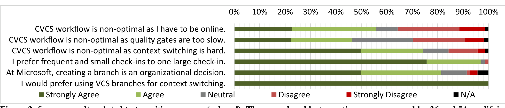

Strongly Agree Agree Neutral Disagree Strongly Disagree N/A

Figure 3: Survey results related to transition reasons (colored). The second and last questions are answered by 36 and 54 qualifying developers. More than 50% of the developers agree that they cannot work efficiently with the current CVCSs at Microsoft because they have to be online and cannot context switch easily. Most developers prefer to work with small, incremental commits and use VCS branches for context switching. 81% of the developers agree that creating and deleting branches is an organizational decision at Microsoft. Finally, the developers have mixed feelings (46% agree vs. 28% disagree) on whether quality gates affect their development workflow negatively.

## 4. TRANSITION REASONS

This section focuses on the following four main transition reasons: the ability to (1) work offline, (2) work incrementally, (3) context switch efficiently, and (4) do exploratory coding efficiently. Figure 3 summarizes the related survey results.

**(i) The ability to work offline:** All developers we interviewed focus on the importance of being able to work offline. The majority of the survey participants (56% vs. 34%) agree with this observation. Some CVCSs force the developers to check-out a file before editing. 3 Consequently, if the developer is not connected to the server, s/he cannot work easily. The manual workarounds are tedious. For example, the developer could check-out the files s/he wants to edit with a special flag, do some changes, and attempt to check-in when s/he is connected to the server again. At this point, the CVCS would attempt to replay developer’s steps. If any step fails due to other check-ins, developer’s check-in fails. Similarly, developers cannot work easily when the central server is down or having bandwidth problems.

The developers believe that with a B/DVCS they can work offline. When using a B/DVCS, the developers need to interact with the central server only when they need to check-in their changes to or check-out new changes from the server.

**(ii) The ability to work incrementally:** In our interviews, all developers except one focus on the importance of incremental and frequent local commits. 97% of the survey participants support this observation by favoring small, frequent commits to one large check-in. CVCSs do not support local commits. The moment the developers commit, the commit is checked-in to the server and is accessible to everyone. Some development practices suggest that the developers should check-in complete and working code, which makes it more difficult for the developers to create checkpoints for their current work. These checkpoints are useful for understanding how a recent code has evolved in time and returning back to a previous version quickly.

Table 1: Survey demographics

| Demographic Property | Average Value |
| --- | --- |
| Development experience | 11.0 years |
| Experience at Microsoft | 6.2 years |
| Experience with CVCSs at Microsoft | 5.9 years |
| Experience with DVCSs at Microsoft | 1.5 years |

3 Some CVCSs like SVN, do support offline commits.

Microsoft products use continuous integration: checked-in changes go through ‘quality gates’ where they are built and tested. Before checking-in, most developers also go through a simplified quality gate, called Check-in Wizard, which builds and tests the modified components locally to get an early assessment of software quality. One execution of the Check-in Wizard can occasionally take a long time, which discourages the developers to do frequent check-ins. The survey participants have mixed feelings (46% agree vs. 28% disagree) on whether the quality gates affect the development workflow negatively or not. Nonetheless, the developers believe that local commits in DVCSs would let them work incrementally and go through the Check-in Wizard less frequently.

**(iii) The ability to context switch efficiently:** All developers we interviewed focus on the fact that CVCSs make it very difficult to work on multiple tasks simultaneously. Working on multiple tasks, such as developing a new feature and fixing a bug, is quite common for the developers. Figure 4 summarizes the most popular CVCS techniques for context switching. Top two of these techniques is to check-out the code multiple times on different file system locations (multiple enlistments) and create a delta for each different change and manually manage these deltas (patches). Multiple enlistments increase the storage space needed for development linearly. More importantly, each time the developer does an update, every enlistment needs to be built even if the enlistments are mostly the same. When using patches, the developer needs to create and manually maintain these patches. One developer mentions:

> I use other tools, beside [VCS], to save bits and pieces of my work. Using one of these [tools], I can take a snapshot of [my changes] … I try naming [the snapshot] meaningfully, e.g., bugid_1, bugid_2, but I don't do a good job.

76% of the survey participants agree that CVCSs they use do not provide efficient ways to context switch. The fact that all of the survey participants, except one, do not use private branches as a standalone technique was surprising for us. However, at Microsoft, the branches for a product is often an organizational decision. 81% of the survey participants agree with this observation. All check-ins need to go through quality gates, which means that all branches need infrastructure support, such as build and test labs. Therefore, it is not easy for a developer to create and delete private branches as s/he sees fit. On the other hand, with DVCSs, a developer could create a private branch, do changes, commit locally, merge her/his branch to one of the organizational branches, and check-in the changes on the organizational branch. For other developers, and for