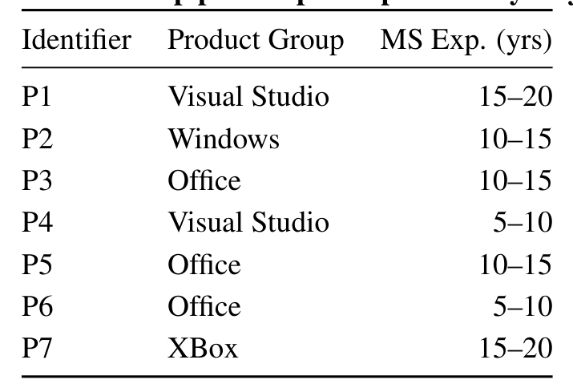
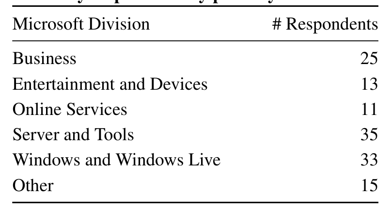

We integrate findings from these studies into our analysis to help prevent the conflicts that can occur between builders and developers.

## 3. METHODOLOGY

This paper reports on three studies into build team effectiveness: interview, survey, and focus group. The studies were conducted sequentially at the Microsoft Redmond campus.

The first study, builder interviews, derived its structure from Cohen and Bailey’s effectiveness framework [7]. The second study, a survey of the Microsoft build population, explored key themes discovered in the interviews. The third study, a focus group, refined and evaluated our proposed tools and practices that were designed using the analysis of the two preceding studies. A companion Tech Report [35] contains additional information such as the complete survey, interview guide, codes and categories used in analysis, etc.

### 3.1 Interviews

Seven engineers (P1...P7), with build engineering experience at Microsoft ranging from 8 to 16 years, participated in our interview study. Participants were recruited through contacts in the Microsoft Office, Windows, Visual Studio, and Xbox product groups, each of which have build teams of non-trivial size. Our intent was to capture a diverse set of experiences as these groups develop very different products and employ their own, often differing, engineering practices and policies. Moreover, four of the participants have also worked as developers, giving them a dual perspective. Table 1 shows the current product group and Microsoft build experience of the participants.

Table 1: Interview participant demographics. Experience is measured in the number of years on build teams at Microsoft. Ranges are used to help protect participant anonymity.
Identifier Product Group MS Exp. (yrs)

The interviews were semi-structured, audio-recorded, and 1–2 hours in length. The questions were designed to be consistent with the characteristics from Cohen and Bailey’s often-referenced effectiveness framework, which allows our findings to be comparable to other team effectiveness studies in management science. The first author’s three years of enterprise build experience helped ensure the questions were phrased appropriately.

The exploratory nature of this study prompted the use of grounded theory as the methodological approach [8]. The interviews were transcribed verbatim and open-coded to identify key concepts of build team effectiveness; 50 codes were organized into 12 categories, and the categories into four themes:

- Role ambiguity: diverse builder tasks and responsibilities and the impact on performance evaluation.
- Knowledge sharing: the transfer of information and experience within build teams and to development teams.
- Intergroup dynamics: communication, trust, and conflict between build and development teams.
- Build failure management: investigating build failures and the decisions around resolving the failures.

The themes are discussed at-depth in Section 4. The exception is build failure management, which has a large amount of data on build-specific tooling (e.g., source control tools) and is somewhat disparate from the human-aspects of build engineering epitomized by the other themes. Thus, we intend to present our findings on build failure management in a separate paper.

### 3.2 Survey

Themes from the interview study raised several questions that required a broader set of data to answer:

- What activities are builders involved in?
- What information do builders need to share?
- What problems are perceived to be in the build process?

The first and second questions were intended to complement and refine the themes of role ambiguity and knowledge sharing, respectively. The two questions had both scaled (with predefined lists generated from the interviews) and open-ended components. The third question, which was solely open-ended, was used to verify that the interviews captured the major build-related concerns. To collect this data, we engaged the build population at Microsoft through an online survey study.

Recruitment emails were sent to the 367 employees who work, in some capacity, in the build-space at Microsoft; 132 responses were received (S1...S132), a 36% response rate. Our results are thus generally representative of those working in the build-space at Microsoft, and quantitative results are accurate within ±5.2% with 95% confidence (computed by way of a binomial confidence interval). Table 2 illustrates the distribution of respondents by primary working division.

Table 2: Survey respondents by primary Microsoft division.
Microsoft Division # Respondents

Responses to the “build problems” question were coded in the same manner as the interview transcripts. No additional codes were identified, increasing our confidence that the interviews identified the significant build issues. The results from the survey are reported alongside the interview findings, either in tabular form or as supporting quotations, in the Section 4.

### 3.3 Focus Group

We synthesized the findings from the interviews and survey to suggest preliminary design tools and practices that can be used to improve build team effectiveness. A focus group study enabled us to refine and gather feedback on the ideas in a time-efficient manner.