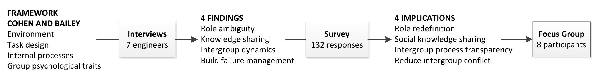
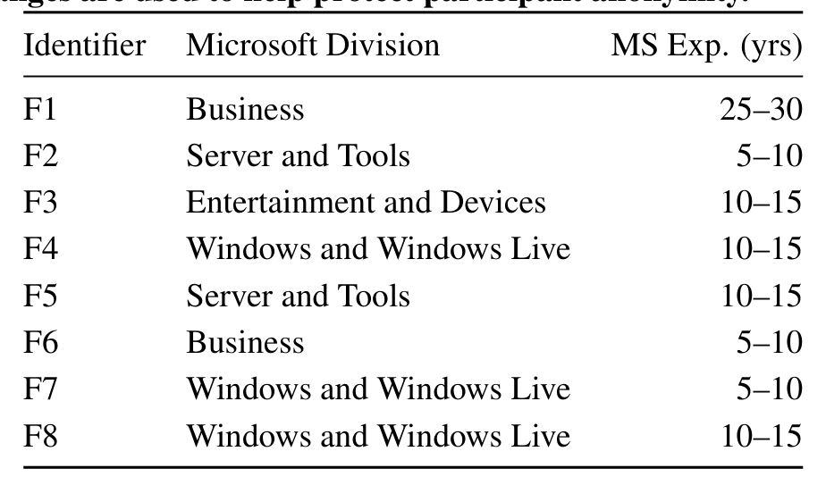

Figure 1: Summary of our research process.

The focus group was intended to be analytical, to gather practitioner feedback and test initial feasibility, and evaluative, to support our interpretation of the findings [24]. The study design was based on recommended practices in sociology [25], namely, we had 8 participants, used audio-recording devices, had two researchers present (moderator and note-taker), and used short, clear, and conversational questions.

The focus group participants were selected from a pool of 64 Microsoft employees that was created from an opt-in at the end of the survey. We reduced the candidate pool to 20 by examining their responses to the open-ended survey questions, and selecting those who provided insightful answers. In an effort to obtain feedback from a diverse sample of builders [32], we then selected 8 participants (F1...F8) under the criteria of representing several divisions at Microsoft, having both build and development experience, and having worked for various amounts of time at Microsoft. Table 3 depicts the participant demographics.

Table 3: Focus group participant demographics. Experience is measured by the number of years working at Microsoft. Ranges are used to help protect participant anonymity.

Identifier   Microsoft Division   MS Exp. (yrs)

The focus group was conducted as follows: present a challenge identified in the earlier studies along with some supporting data (usually quotations from the interviews or survey); facilitate a discussion on the problem; present our potential solution to the problem through a mock-up or descriptive slide; and then continue the discussion with an emphasis on refining and evaluating the idea. The proposed tools and practices, and the results from the focus group, are discussed in Section 5.

### 3.4 Limitations and Threats

Efforts were made to increase the validity of our findings in the broader scope of “team effectiveness” by shaping the interviews with an established and well-accepted framework. Additionally, our studies captured the experiences of a diverse set of participants from a variety of product groups; however, the participants are still bound by the same overarching Microsoft organizational culture.

While focus groups provide several advantages, such as the ability to get feedback quickly on proposed ideas, the opportunity for deep interaction, and the ability to pick up on non-verbal cues, limitations also exist. Respondents can feel pressure to give similar answers as the others. We attempted to mitigate this by limiting the size of the group.

As noted in previous research (e.g., [3, 4]), there is a great amount of functional diversity between Microsoft product groups, for example, in their size, engineering practices, and release processes, which mitigates some of the bias associated with conducting research at a single company. Nevertheless, there is a possibility that the challenges faced by build teams at Microsoft do not occur in other organizations, or do not occur to the same degree.

## 4. FINDINGS

In this section, our findings are partitioned by the themes identified in the interview study: role ambiguity, knowledge sharing, and intergroup dynamics. The themes represent factors that can influence the effectiveness of build teams. We use these findings to inform the design of tools and practices in the following section.

### 4.1 Role Ambiguity

Build teams “generally grow organically” (P6) in response to organizational growth, either in the number of developers or the size of the codebase, and evolving build requirements, such as supporting additional languages, hardware architectures, platforms, or SKUs. In group dynamics, build teams are classified as emergent [12] as they are a reaction to a changing environment and not pre-planned for a fixed amount of work, as are many development teams.

Emergence can cause each builder to “have a different shape” (P6)—their roles are molded to fit the changing needs of their organization. All of the interview participants noted this diversity, calling builders “generalists” (P1) or “jack-of-all-trades” (P2). For example, we found that some builders write and maintain build verification tests, while others do no testing at all.

Thus, the role “builder” has different definitions in different organizations. Furthermore, there is uncertainty around whether builders should be evaluated as “developers, testers, or project managers” (P2). For example, coordinating code flow (i.e., source code integrations) between teams is a project management task; maintaining a build system a development task; and testing falls in the domain of quality assurance.

To more broadly understand and quantify the builder role, we asked the survey respondents what frequency they perform the tasks mentioned during the interviews. The task descriptions and proportion of respondents that frequently perform the tasks, derived from response dichotomization [23], are listed in Table 4. Our results confirm that builders perform as testers, and more frequently, as developers and project managers.

A particular concern among interview participants was “unrealistic expectations” (P4). Builders may be involved in different types of tasks, but will likely not perform as well as a specialist in those tasks. Moreover, we found that “the jack-of-all-trades mentality can be abused, especially on smaller teams” (P2), where builders will likely do a variety of tasks outside of the build-space.