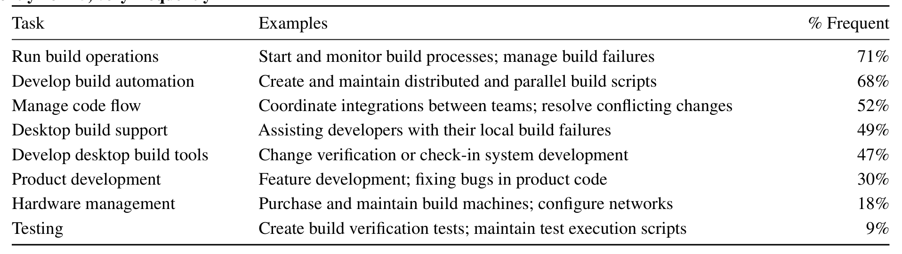

Table 4: Survey results of builder task frequency. The questions were scaled from 1–5 (a response of 1 was “never” and 5 was “very frequently”). Responses were dichotomized and the frequency percentage is the proportion of respondents that answered “4, frequently” or “5, very frequently.”

Thus, the “builder” role is somewhat ambiguous, both in job responsibility and evaluation. Prior research has shown that role ambiguity is negatively correlated with job satisfaction and performance [1, 41], although weakly in the latter case. We found similar results; there was no indication of decreased job performance, but there were concerns about retention. Several participants noted that dissatisfaction with “how to quantify their contributions” (P1) has led some builders to move to purely development or project management roles.

### 4.2 Knowledge Sharing

Build teams are not “tied to a specific feature [under development]” (P4) and thus have a “200 ft. view” of the project (P1). This view gives them a broad perspective on the different development teams’ current tasks, schedules, and challenges. This perspective is unique because builders are also deeply involved with the codebase and can still “pick out all the low-level details” (P1).

The build team’s perspective makes them particularly well-suited to coordinating code flow between teams and to performing the actual source code integrations. Indeed, as shown in Table 4, managing code flow is a task likely to fall under the scope of build team responsibilities.

Working with development teams across their organization, coupled with their build expertise, gives build teams context on project-wide best practices for building. For example, how to avoid changes that cause “build problems that can be routed back to some decision that looked like a good idea to a particular team in isolation” (P1). The interviews highlighted the importance of sharing this knowledge both intragroup, within build teams, and intergroup, to the development teams.

### 4.3 Intragroup Knowledge Sharing

Concerns about intragroup knowledge sharing tended to involve branching and the speed at which knowledge is transferred. Branching is a common engineering practice [34] where development teams use “copies” of the codebase until they are ready to integrate their work. Nondeterministic build problems can propagate between branches during integrations before being identified and fixed. However, “duplicate investigations” (S27) may occur in different branches until it is discovered that certain problems have the same root cause, which may not be readily apparent.

To better understand what information builders are using during these failure investigations, we asked survey respondents how useful, and how frequently they accessed, different information sources that were discussed in the interviews. The results are displayed in Table 5.

So-called “tribal knowledge” (P3), i.e., undocumented build experiences, was indicated as one of the most useful and frequently accessed information sources. Thus, because internalized information is important to builders when managing failures, team effectiveness is influenced by how well senior builders communicate their experiences with new team members. As one survey respondent described how build automation created by senior builders, intended to simplify the build process, can be a barrier to this information flow:

> “As awesome as automation is, it isolates the builder from the easy tasks that help them understand the build process... when the senior builder moves on and the difficult tasks break, the rookie is at a huge disadvantage while they try to gain tribal knowledge.” (S28)

### 4.4 Intergroup Knowledge Sharing

When sharing knowledge across group boundaries, a major challenge is the large amount of build information to communicate:

> “If I was to put together a document that described every do and do-not of [building] source code across a 40GB codebase, you would never find the pebble of information that is pertinent to what you are trying to do at this moment.” (P4)

There were no reported problems with incentives [39] for intergroup knowledge sharing; on the contrary, the interview participants spoke of how preventing bad practices as far “upstream” (P6) as possible, e.g., on the developer desktop, greatly reduced their workload. Rather, the concern was how to make the best practices easily discoverable.

Wikis were described as a common approach to knowledge sharing with developers; however, the general attitude was that, as noted above, there is a large amount of information and “developers were expected to pull that information” (P4) without knowing what was applicable to their current task. The lack of perceived benefit has led to the abandonment of many build wikis, a situation similar to what has been reported in earlier research [14].

An alternative to wikis is to “have information pushed to developers” (P4), where they do not have to actively seek details on best practices. Push approaches have had mixed success:

> “You need somebody saying that ‘this is a best practice.’ But I tried telling people about them, I tried yelling, I tried emailing... the only thing that has made a difference was putting a warning when they compile.” (P1)