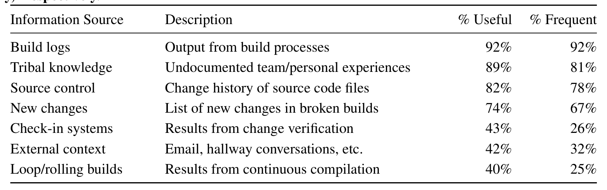

Table 5: Survey results on the usefulness and access frequency of information sources when investigating build failures. The questions were scaled from 1–5 (e.g., a response of 5 was “very useful” or “very frequently”). Responses were dichotomized and the usefulness and frequency percentages are the proportion of respondents that answered “4, useful” or “5, very useful,” and “4, frequently” or “5, very frequently,” respectively.
Information Source Description % Useful % Frequent

The participant’s successful experience involved writing rules into a desktop build tool that displays warnings when a developer compiles non-conforming code. The goal is to push targeted information from the build team at relevant times. It was noted that the warning does not necessarily have to explain how to implement the best practice, it can be sufficient to simply initiate a conversation, “that is the biggest thing” (P1).

### 4.5 Intergroup Dynamics

How an emerged build team fits socially within its organization, and in particular, how it relates with development teams, will influence how well it operates. The term “organic” (P6) was often used to describe how these relationships formed, and there was little mention of any explicit actions to guide their growth. Our findings from both the interviews and survey, presented in this section, reveal much about the nature of the intergroup builder/developer relationship as well as the areas that can be improved to promote team effectiveness.

### 4.6 Communication

The “email culture” [42] that exists within Microsoft makes computer-mediated interactions the norm. We found this culture accentuated in build teams. All interview participants preferred to communicate with developers through email, even when co-located. Many build tasks are managed entirely in a virtual space: from the “you have broken the build” (P6) messages to the end-of-day summary and status updates, “it is all kept track in emails” (P3). Many products developed at Microsoft have globally distributed development teams—an increasingly common industry practice [16]. These global development environments have made computer-mediated communication even more likely between builders and developers.

Most of our participants had experienced difficulties using these computer-mediated, global communication channels [17, 5], such as accommodating cultural and language differences through text. One participant discussed how they accounted for these differences by “send[ing] emails that have been worded by project managers” so that they “are very gentle” when giving negative feedback (P6).

### 4.7 Conflict and Trust

A frequent point of discussion in the conducted interviews was the builder/developer relationship. In many cases, build problems were attributed to the dynamics of the two groups: their perceptions, motivations, and interactions. The notions of trust and conflict tend to be central to these discussions.

The emergence of a build team promotes organizational efficiency by abstracting the complexity of the build process. In other words, to present what is a very complicated system (P2) in a simplified manner. This simplification, somewhat ironically, was often perceived to be a significant problem. Of the 97 responses to the open-ended survey question on “build problems,” 27 included some variation of “developer misunderstanding of overall build engineering” (S30). As stated by an interview participant:

> “Developers have their own opinion of what build is; ‘you compile and copy, that is all you do’...they do not see the whole picture.” (P7)

Conflict can occur when developers fail to understand that their desktop build experience is different than the build team’s experience. Builders view the codebase holistically and build for all supported platforms, hardware architectures, SKUs, and languages. This type of misunderstanding can erode trust and cause a “suspicion that builders are breaking your build” (P6) because “it worked on my machine” (S19).

There are situations, however, where conflict is not rooted in process misunderstanding, but in competing motivations. Intuitively, build and development teams are working towards the same goal—the release of their software product. While this goal is superordinate, the individual group motivations can differ; for example:

> “Developers get forced into the position where they feel they need to cut corners or cheat to avoid processes that are there for a good reason.” (P4)

> “Some teams are behind so they feel a sense of urgency and cut corners...but they are taking a huge risk and can introduce a failure rate that slows everyone down.” (P3)

These experiences describe situations where developers, due to time constraints, attempt to have a greater code velocity at the expense of confidence that the build will not fail—the overhead of fully vetting changes for build-stability “outweighs the perceived benefit” (P4). In these situations, developers believe that it will take less time to fix the build if it happens to break, than to go through a full change verification prior to submitting their changes. However, a build team is likely more concerned with build reliability for the entire organization, and when it feels a subset of the organization is not appropriately verifying its changes, it can be a source of frustration. The problem is not with developers needing more agility, but builders feeling not “in the loop” (P7) when the requirements change and are not communicated.