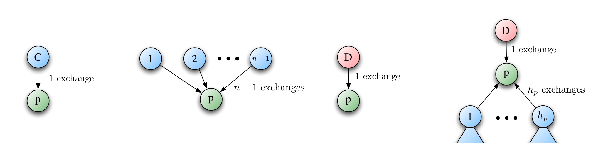
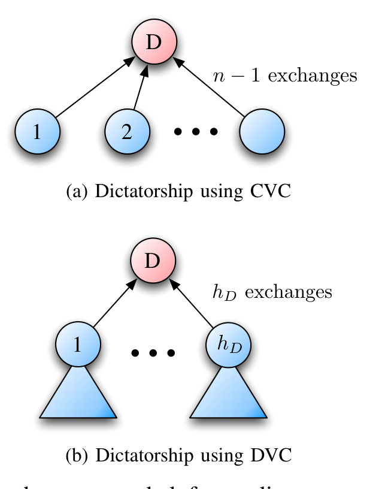
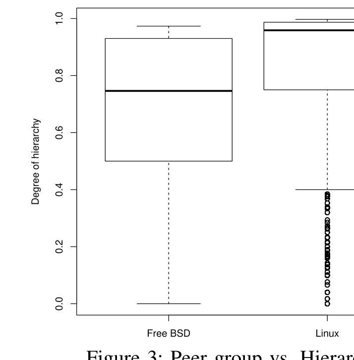
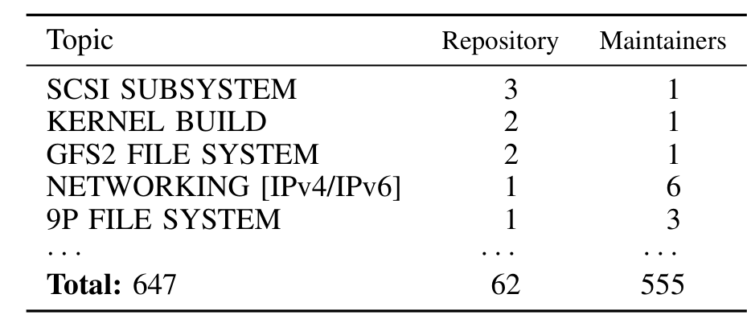

# What Effect does Distributed Version Control have on OSS Project Organization?

Peter C. Rigby∗, Earl T. Barr†, Christian Bird‡, Prem Devanbu§, Daniel M. German¶  
∗Concordia University, Montreal, Canada  
†University College London, London, UK  
§University of California, Davis, USA  
‡Microsoft Research, Redmond, USA  
¶University of Victoria, Canada  
peter.rigby@concordia.ca, etbarr@ucl.uk, cbird@microsoft.com, ptdevanbu@ucdavis.edu, dmg@cs.uvic.ca

> **Abstract—** Many Open Source Software (OSS) projects are moving from Centralized Version Control (CVC) to Distributed Version Control (DVC). The effect of this shift on project organization and developer collaboration is not well understood. In this paper, we use a theoretical argument to evaluate the appropriateness of using DVC in the context of two very common organization forms in OSS: a dictatorship and a peer group. We find that DVC facilitates large hierarchical communities as well as smaller groups of developers, while CVC allows for consensus-building by a peer group. We also find that the flexibility of DVC systems allows for diverse styles of developer collaboration. With CVC, changes flow up and down (and publicly) via a central repository. In contrast, DVC facilitates collaboration in which work output can flow sideways (and privately) between collaborators, with no repository being inherently more important or central. These sideways flows are a relatively new concept. Developers on the Linux project, who tend to be experienced DVC users, cluster around “sandboxes:” repositories where developers can work together on a particular topic, isolating their changes from other developers. In this work, we focus on two large, mature OSS projects to illustrate these findings. However, we suggest that social media sites like GitHub may engender other original styles of collaboration that deserve further study.

## I. INTRODUCTION

Large, complex software systems must be modularized to allow for effective collaboration among developers working on related areas and to isolate developers from changes that are unrelated to their work [1]. Version control (VC) complements this modularity by allowing developers to work independently and then merge their changes with other developers’ changes [2]. The traditional, Centralized VC (CVC) model is simple: developers work on a change and then commit it to a central repository, merging and resolving any conflicting changes. This centrality forces developers to constantly deal with changes from a diverse set of developers and limits the ability of developers to isolate their work and collaborate with others. In contrast, with Distributed VC (DVC), there is no inherently central repository. Each developer has a full copy of the entire history of the system, and developers are free to share changes between any repository, provided that at some point the repositories had

a common ancestor [3]. However, certain repositories can become organizationally important within the development community. With this flexibility comes complex interactions that have not been adequately studied by the software engineering community. In this paper, we examine the styles of project governance that DVC can support as well as the ways in which small groups of developers cooperate on topic specific (i.e., “sandbox”) repositories. The paper is organized around two research questions:

### Q1: How well does DVC support the two common styles of OSS project governance?
Most large, successful OSS projects are structured around a single developer or integrator (a “dictator”) or a group of trusted peers (an oligarchy) [4]. Using these two governance models, we compare DVC to CVC in terms of the number of exchanges a developer must make to acquire the current version of the system. We develop a hypothesis and test it in a case study comparing Linux to FreeBSD.

### Q2: What impact does DVC have on the way individual developers and small subgroups collaborate?
With a central repository developers must discuss and reach a consensus on which changes to include. In contrast, with DVC, each developer has the final say in what makes it into his or her personal repository. Like-minded developers can come together to work on a particular topic in relative isolation. They collaborate in a development sandbox, a set of branches that represents a project fork that can be used by other developers or incorporated into the repository from which “official” releases are made. We illustrate the concept of sandboxes with examples from Linux.

## II. METHOD AND PROJECTS

We use Linux to evaluate hypotheses and questions regarding advanced DVC usage because the Linux kernel project has never used a CVC and its developers are generally very experienced with the DVC git. As a contrast to Linux, we select FreeBSD, which at the time of our analysis used CVS and has now transitioned to SVN, both CVCs. While both projects are UNIX kernels, we do not compare these projects technically or in terms of productivity, since

---

such comparisons are fraught with confounds. Instead, we use them to provide preliminary answers to our research questions. We analyzed version control data across a 3.5 year period starting in 2005 for Linux and 2003 for FreeBSD.

The Linux kernel is organized as a hierarchy or chain-of-trust. At the top of the chain, the “benevolent” dictator, Torvalds, ultimately controls what is put into an “official” release. Beneath Torvalds are a small number of his “lieutenants” whom he trusts. Each lieutenant is responsible for a section of the project (e.g. Miller maintains the networking aspects of Linux) or a previous release of Linux. In turn, these lieutenants trust a small group of individuals. Code flows from less well-known individuals through a series of progressively more trusted individuals. As the code moves up through the chain-of-trust, each individual vets and signs off on it1.

The FreeBSD project is organized as a foundation or group of peers [5]. Developers who have demonstrated their aptitude can be voted into the foundation and receive commit access to the central VC repository. Within the foundation, consensus and voting determine policy and resolve controversial decisions. Developers, who do not have commit access, must convince at least one of the core developers to commit their code. In effect, FreeBSD is an oligarchy in which core developers have a vote, while developers outside of the core group can only voice their opinion.

## III. GOVERNANCE: CENTRALIZATION VS. DISTRIBUTION

We argue the following conjectures regarding VC and project governance:

1) DVC better serves a centralized (dictatorship) social structure.  
2) CVC better serves a decentralized (community of peers) social structure.

In this discussion, n is the number of programmers actively working on a project. A pull occurs anytime a programmer requests and merges another programmer’s changes into his or her working copy or repository. A push occurs when a programmer adds changes to a repository they do not own. An exchange is a push or a pull. In Figure 1, we examine the number of exchanges required for a programmer to obtain the most recent changes under different combinations of VC and governance.

In Figure 1a, a programmer needs only pull once to get the most recent code base when using CVC. Figure 1b examines the use of DVC in a peer setting. Since every programmer has their own copy of the project, in the worst case (i.e., when every programmer makes changes) a programmer must make n - 1 exchanges to acquire the most recent code base. The number of pulls in a peer group using DVC grows with the number of programmers. For a small group, n - 1 pulls may not be prohibitive, but once the group grows too large, the effort required to stay up to date will become unmanageable or, at best, tedious and time-consuming.

The exploding pull problem disappears in a project with a strong hierarchy, centered on a dictator who is a star programmer or integrator, as Figure 1d depicts. We use h_p to denote the “lieutenants” of the programmer p in the hierarchy shown in Figure 1d (i.e. the developers immediately below p in the hierarchy). This hierarchical social structure restricts the number of other programmers with whom p makes exchanges. Thus, p only needs to pull changes from each of his lieutenants and from the dictator D, resulting in h_p + 1 exchanges. By definition, the dictator has the most recent changes published outside of p’s hierarchy. Hierarchies form to keep the number of individuals one has to deal with on a human level [6]. Furthermore, a strict hierarchy is a tree, which by definition does not have any redundant edges. In practice, as a project grows, h remains much smaller than the fully connected graph — h + 1 << n - 1.

The number of exchanges differs for the dictator. In Figure 2a, the dictator obtains and reviews changes from all other programmers, yielding n - 1 exchanges to ensure that his repository is up-to-date when using CVC. Like the peer scenario using DVC (Figure 1b), this does not scale well. In contrast, a dictator needs only pull and review changes from those immediately beneath him, h_D, in the hierarchy when utilizing DVC, depicted in Figure 2b. This structure relies on a chain-of-trust in the hierarchy, such that the dictator’s lieutenants are trusted to review and make decisions about changes that flow through them to the dictator (as occurs in the Linux kernel). This means the number of exchanges the dictator requires to obtain the most recent changes remains constant as the community of programmers grows.

### A. Case Study

Perhaps it is not surprising that OSS developers are taking to DVC with such enthusiasm [3]; most projects have a very small number of developers and usually one developer does most of the coding [7], a natural dictatorship. Here, we examine our conjectures in the context of Linux and FreeBSD, two large, successful, mature projects. Given the descriptions of these projects (See Section II), we hypothesize that Linux, which uses a DVC, is organized in a more hierarchical manner than FreeBSD, which uses CVC.

To quantitatively test this hypothesis, we use Krackhardt’s [8] measure of graph hierarchy and modify it to take the magnitude of the relationship into account. Our data source is the VC commit logs where we use “sign-off” or “reviewed by” tags as evidence of a hierarchical relationship. For any pair of developers, let x be the number of times developer X has signed off on or reviewed developer Y, and let y be the number of times developer Y has signed off on or reviewed developer X. For every pair of developers where x > 0 or y > 0, the following defines the degree of

1. Email exchange, 2004, http://lkml.org/lkml/2004/5/23/10.

---

> **Image description:** Four schematic panels compare how many repository exchanges a programmer p must make to obtain the latest code under centralized (CVC) and distributed (DVC) version control in peer and dictatorship governance. (a) Peers using CVC: a single central repository C (blue) supplies p (green) with one exchange (labelled “1 exchange”). (b) Peers using DVC: in the worst case p must pull from every other peer (1, 2, …, n−1), yielding n−1 exchanges (labelled “n−1 exchanges”), so work scales with team size. (c) Dictatorship using CVC: the dictator D (red) supplies p with one exchange. (d) Dictatorship using DVC: p receives one exchange from D plus hp exchanges from their lieutenants (labelled “hp exchanges”), illustrating that a hierarchical DVC workflow limits the number of exchanges to h_p+1 and avoids the n−1 “exploding pull” problem.

(a) Peers using CVC (b) Peers using DVC (c) Dictatorship using CVC (d) Dictatorship using DVC  
Figure 1: Exchanges required for the programmer p to obtain the most recent changes in a peer group or dictatorship for both CVC and DVC.

> **Image description:** Two stacked diagrams compare how many exchanges the project integrator (node D, pink) needs to update under centralized (CVC) and distributed (DVC) version control. In the top panel (a) several individual contributors (blue nodes labeled 1, 2, …) each have arrows into D and the annotation “n − 1 exchanges,” indicating the dictator must pull from every other developer to obtain the latest code under CVC. In the bottom panel (b) only a small set of immediate lieutenants (blue nodes, one through h_D, shown with triangular groups beneath them) send changes to D, annotated “h_D exchanges,” showing that with DVC the dictator need only pull from these lieutenants rather than from all n − 1 contributors. The figure thus illustrates the paper’s point that DVC allows the dictator to rely on a chain-of-trust (h_D) so the number of required exchanges does not grow with the total number of contributors.

(b) Dictatorship using DVC  
Figure 2: Exchanges needed for a dictator to update his repository from the rest of the development team using CVC and DVC.

hierarchy:  
h = |x − y| / (x + y). (1)

For a pure hierarchy, h = 1 and for a pure peer group h = 0. In a pure hierarchy, no individual will review or sign-off on any individual above them in the hierarchy. If Linux is a pure hierarchy, nobody would ever sign off Torvalds' work. In contrast, in a peer group, a pair of individuals would sign off on each other's work. On the continuum from pure hierarchies and pure peer groups, the metric examines the degree to which relationships between pairs of developers are hierarchical.

Results: We now employ the hierarchy metric h to evaluate, in the context of this case study, whether our hypothesis holds.

The number of purely hierarchical pairs of developers (i.e. h = 1) dominates both distributions: 73% for FreeBSD and 94% for Linux. However it is clear that FreeBSD has far fewer purely hierarchical developer pairs.

Although OSS projects typically have a small number of core developers that do most of the work, there is a much larger group of developers that submit a small number of contributions. These developers do not have the authority to sign off on code in either Linux or FreeBSD [5].

We examine pairs of developers who have reviewed each other at least once (i.e. have a reciprocal relationship). Figure 3 shows that, conditioned on reciprocal relationships, FreeBSD, whose median is h = 0.75, is again less hierarchical than Linux at h = 0.96. A Wilcoxon test indicates that this result is statistically significant at p < .001.

In light of these findings, we revise our hypothesis.

1) Hierarchical relationships dominate OSS projects. Large OSS projects are oligarchies or dictatorships that have a large number of external developers who do not have sign-off authority. This hypothesis is supported by previous literature on project structure [5], [9].

2) Socially central projects using DVC (Linux) are organized in a more hierarchical manner than socially distributed projects using CVC (FreeBSD).

Our conjectures compare pure DVC to pure CVC. However, on all projects there is a need for individual collaboration as well as some form of centralization from which official product releases can be made. Most DVC systems, like git or Hg, can be set up so that a publicly shared central repository can be pushed to by each developer’s personal repository. We suspect that the choice of version control system will not cause a project to change its governance structure. Future work is necessary to understand the value of this mixed VC configuration.

## IV. DEVELOPMENT SANDBOXES

Fogel, a prominent Subversion developer, states that DVC is much more difficult for people to grasp than CVC2. We believe that this is because changes to a CVC always move through the central repository (i.e. ‘up’ and ‘down’), while on a DVC changes can move between individual developers or between a repository shared by a group of developers.

2 Email, 2006, http://svn.haxx.se/dev/archive-2007-06/0780.shtml.

---

> **Image description:** Boxplots compare the pairwise hierarchy metric h = |x−y|/(x+y) (0 = mutual/peer, 1 = pure hierarchy) for reciprocal reviewer/sign‑off relationships in FreeBSD and Linux. FreeBSD shows a broader distribution (median ≈ 0.75, IQR roughly 0.5–0.95) with the lower whisker near 0, indicating a substantial number of more peer-like reciprocal pairs. Linux is concentrated very near the top (median ≈ 0.96, IQR roughly 0.9–1.0) but displays a long lower tail of outliers down toward ~0–0.4, meaning most reciprocal reviewer pairs are highly hierarchical while a minority are reciprocal peers. The paper notes this difference is statistically significant (Wilcoxon p < .001) and that purely hierarchical pairs occur much more often in Linux (≈94%) than in FreeBSD (≈73%).

Figure 3: Peer group vs. Hierarchy.

These “sideways” exchanges represent collaboration between small, task-focused groups of developers. In previous work, Bird et al. [10] found that OSS developers naturally group themselves into task-based groups who disband after the task is completed. However, they did not find evidence that these developers, who use CVS, created branches to work on these tasks. Instead, developers working in similar areas of the system collaborated via related threads on the developer mailing lists. The FreeBSD project uses this style of collaboration with all committers working together on a single repository [5].

In contrast, experienced users of DVC on the Linux project create separate repositories through which they can work on a particular topic and later have the code promoted to a release branch when it is finished. The "MAINTAINERS" file for Linux contains 62 official, public git repositories that cover 647 specific topics related to kernel development. 555 individuals maintain these topics. Many of these repositories represent long-lived development priorities (see Table I for example topics). These repositories are typically maintained by a single individual; however, they represent only a small number of the available Linux repositories. For example, on the social media based GitHub site we see that there are 416 separate forks of Torvalds' Linux repository. A further 3400 individuals are registered to receive updates when his repository changes.

Linux is modularized in two ways. Like FreeBSD the system is modularized in the directory hierarchy [1]. Unlike FreeBSD, Linux also isolates development into sandboxes: repositories dedicated to a particular topic.

> **Image description:** A three‑column table listing example kernel topics with the number of repositories and maintainers for each. Sample rows show: SCSI SUBSYSTEM (3 repositories, 1 maintainer), KERNEL BUILD (2, 1), GFS2 FILE SYSTEM (2, 1), NETWORKING [IPv4/IPv6] (1, 6), and 9P FILE SYSTEM (1, 3). The bottom line reports totals: 647 topics covered, 62 official repositories, and 555 maintainers. The data illustrate that many distinct topics are mapped to a much smaller set of repositories and that the number of maintainers per topic/repository varies (some topics span multiple repositories, and some repositories have multiple maintainers).

Table I: A sample of topics and sandboxes in Linux.

## V. CONCLUSIONS AND FUTURE WORK

We reported preliminary results relating to DVC’s effect on project governance and collaboration among developers. Our conjectures and case study suggest that strongly hierarchical projects benefit from DVC, while peer groups tend to need a central repository to reach consensual decisions. However, most projects will lie somewhere on the continuum between the pure hierarchy and the pure peer group. Within this larger governance structure, DVC allow specialized subgroups to collaborate in a distributed manner on specific problems (i.e., in a sandbox), while still maintaining a repository that is used for integration and releases.

DVC has the potential to make releasing, developing, and coordinating large software projects much less rigid than its exclusively centralized predecessor. Future work is necessary to understand GitHub and other online social media environments that provide a simple and integrated way to fork repositories allowing individuals and projects of any size to collaborate in innovative ways.

## REFERENCES

[1] I. T. Bowman, R. C. Holt, and N. V. Brewster, “Linux as a case study: Its extracted software architecture,” in 21st ICSE, 1999, pp. 555–563.

[2] A. Sarma, Z. Noroozi, and A. Van der Hoek, “Palantír: raising awareness among configuration management workspaces,” in 25th ICSE, 2003, pp. 444–454.

[3] C. Bird, P. C. Rigby, E. T. Barr, D. J. Hamilton, D. M. German, and P. Devanbu, “The promises and perils of mining git,” in 6th Conf on Mining Software Repositories, 2009.

[4] J. Berkus, “The 5 types of open source projects,” 2007, http://www.powerpostgresql.com/5_types.

[5] T. Dinh-Trong and J. Bieman, “The FreeBSD Project: A Replication Case Study of Open Source Development,” IEEE ToSEM, vol. 31, no. 6, pp. 481–494, 2005.

[6] H. Simon, Administrative behavior: A study of decision-making processes in administrative organizations. Free Press, 1997.

[7] S. Krishnamurthy, “Cave or Community? An Empirical Examination of 100 Mature Open Source Projects,” First Monday, vol. 7, no. 6-3, 2002.

[8] D. Krackhardt, “Graph theoretical dimensions of informal organizations,” pp. 89–111, 1994.

[9] K. Crowston, J. Howison, K. Crowston, and J. Howison, “Hierarchy and centralization in free and open source software team communications,” Knowledge, Technology, and Policy, vol. 18, no. 4, pp. 65–85, 2006.

[10] C. Bird, D. Pattison, R. D’Souza, V. Filkov, and P. Devanbu, “Latent social structure in open source projects,” in 16th FSE. ACM, 2008, pp. 24–35.