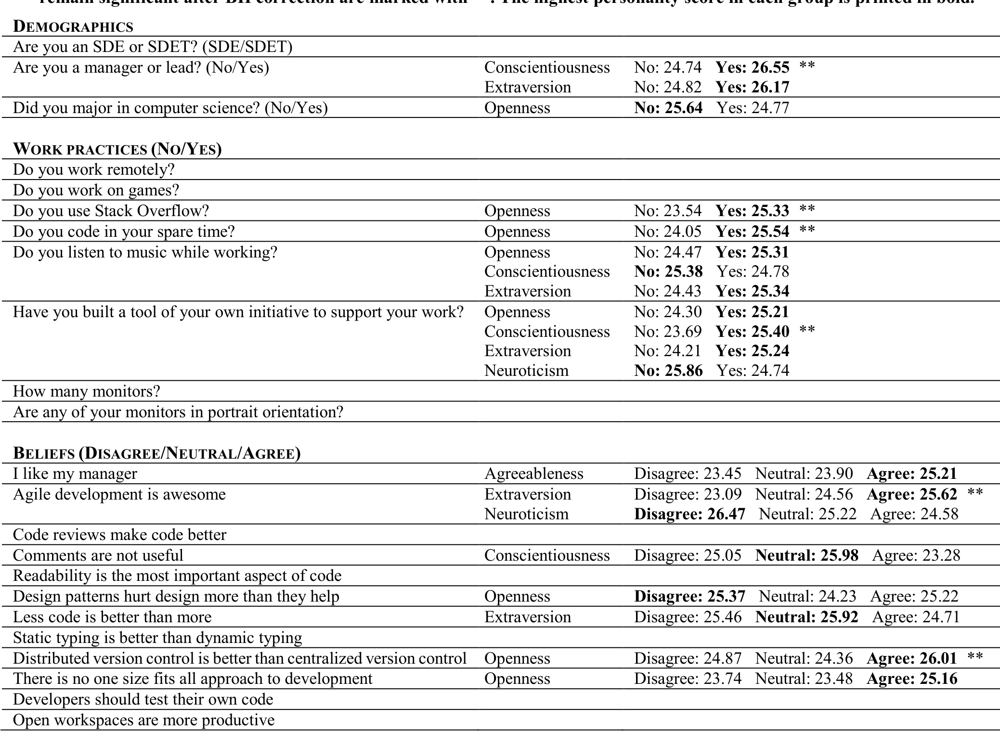

## Beliefs, Practices, and Personalities of Software Engineers: A Survey in a Large Software Company

Edward K. Smith  
School of Computer Science  
University of Massachusetts Amherst, Massachusetts, USA  
tedks@cs.umass.edu

Christian Bird  
Microsoft Research  
Redmond, Washington, USA  
cbird@microsoft.com

Thomas Zimmermann  
Microsoft Research  
Redmond, Washington, USA  
tzimmer@microsoft.com

## ABSTRACT

In this paper we present the results from a survey about the beliefs, practices, and personalities of software engineers in a large software company. The survey received 797 responses. We report statistics about beliefs of software engineers, their work practices, as well as differences in those with respect to personality traits. For example, we observed no personality differences between developers and testers; managers were conscientious and more extraverted. We observed several differences for engineers who are listening to music and for engineers who have built a tool. We also observed that engineers who agree with the statement “Agile development is awesome” were more extroverted and less neurotic.

### CCS Concepts

- Software and its engineering → Software development methods  
- Software and its engineering → Software development techniques

## 1. INTRODUCTION

There has been an increasing interest in what makes great software engineers [1] as well as in the personality of software engineers [2]. It is widely believed that personality traits contribute to the success of software professionals [3] [4] and software projects [5].

In this paper we present an exploratory study on the work practices, beliefs, and personality traits in a large software company. We sent out an electronic survey to 3,000 Microsoft employees of which 797 responded. We first asked participants to complete a personality test in the survey. We then asked questions about work practices and beliefs of software engineers. In the analysis of the survey we then related work personality traits to work practices and beliefs.

The results indicate that there are some differences: Managers were more conscientious and more extraverted. Engineers who listened to music were more open and extraverted and less conscientious. Developers who chose to build tools [6] were more open, conscientious, extraverted, and less neurotic. The survey also revealed differences with respect to beliefs about software, e.g., engineers who agreed with the statement “Agile development is awesome” were more extroverted and less neurotic.

Permission to make digital or hard copies of all or part of this work for personal or classroom use is granted without fee provided that copies are not made or distributed for profit or commercial advantage and that copies bear this notice and the full citation on the first page. Copyrights for components of this work owned by others than ACM must be honored. Abstracting with credit is permitted. To copy otherwise, or republish, to post on servers or to redistribute to lists, requires prior specific permission and/or a fee. Request permissions from Permissions@acm.org. CHASE'16, May 16 2016, Austin, TX, USA © 2016 ACM. ISBN 978-1-4503-4155-4/16/05…$15.00 DOI: http://dx.doi.org/10.1145/2897586.2897596

> While we found some differences in personality, we did not observe any differences for some groups, e.g., in our survey there were no personality differences between developers and testers, even though previous research observed differences [4].

## 2. RELATED WORK

There is a long history of investigating personality types in software engineering research, for example, to relate personality of software engineers to job satisfaction and software quality [7], build effective software project teams [8], relate personality to effective code reviews [9], provide personality profiles of software engineers [3], examine personality traits in pair programming [10] [11], or increase the chances of project success by assigning engineers to the stages of the software life cycle best suited for their traits [5].

For an excellent discussion of empirical studies on personality in software engineering we refer to work by Kanij et al. [4] and the mapping study by Cruz et al. [2]. In this paper, we contribute an analysis of how personality relates to beliefs about controversial software engineering practices. This project is part of our efforts to better understand how software professionals form their beliefs based on empirical data [12].

## 3. METHODOLOGY

### 3.1 Survey Design

In order to investigate the correlation between developer personality characteristics and beliefs and work practices, we conducted a survey. Several personality inventories exist in the psychometric research community; the two commonly used in software engineering research are the Myers-Briggs Type Indicator or MBTI [13], and the Five Factor or “Big Five” model [14]. We selected the Big Five model due to its stronger theoretical and empirical basis, as well as its higher test-retest reliability [15].

The Five-Factor Model: This model refers to five personality domains, called the OCEAN domains by their initials:

- Openness to experience, which measures an individual’s creativity, mental flexibility, cultural aptitude, and intelligence;
- Conscientiousness, which measures an individual’s will to achieve, responsibility, and follow-through of plans;
- Extraversion, the degree to which an individual seeks out social contact;
- Agreeableness, the degree to which an individual is friendly and altruistic;
- Neuroticism, the degree to which an individual is affected by negative emotional states and moods.

Over the past few decades, the personality psychology research community has converged on the five-factor model [16] as the standard for assessing human personality traits.

---

Figure 1 – Distributions of answers to survey questions about demographics and work practices.

Figure 2 – Distributions of answers to survey questions about developers’ beliefs

### Survey Device:
To assess the personality traits of engineers, we used the International Personality Item Pool (IPIP) [17], a repository of survey questions used to measure Five-Factor Model personality. When translated into local languages, the Five-Factor model performs well on international populations [18]. However, since we decided to only use the English version, we distributed the survey only to engineers based in the United States to control for any language and cultural barriers. When piloting an earlier version of the survey, non-native English speakers working outside the United States had trouble understanding the question “How often do you feel blue?” because the term “blue” has different connotations in different cultures, meaning sad in the United States, but intoxicated in some European countries.

The online survey contained first the 50-item IPIP personality inventory and then on a second page a series of 23 questions related to demographics (3 questions), beliefs (8 questions), and work practices (12 questions). Table 1 shows each of these later questions, which we refer to as the non-personality questions. Questions about beliefs were drawn selectively from a list of controversial programming questions on Stack Overflow (http://stackoverflow.com/questions/406760/whats-your-most-controversial-programming-opinion) that we hypothesized would be related to personality. Questions about demographics and work practices came from discussions with and observations of developers.

All non-personality questions were multiple choice. Questions about demographics contained questions with “yes” and “no” as the possible answer (e.g., “Were you a computer science major” and “Are you a manager”). Questions about beliefs each contained a statement, such as “Readability is the most important aspect of code” and respondents could indicate if they agreed, disagreed, or were neutral. Questions about work practices had “yes” or “no” as possible answers with a few exceptions (as shown in Table 1).

We sent the survey to 3,000 developers. We followed a number of protocols that have been shown to increase survey participation [19]; the invitation was personalized, the survey was completely anonymous and participants could choose to email us to enter a drawing for two $50 Amazon.com gift cards. Participants could choose a handle to preserve anonymity and later access their personality scores after the survey period had ended. We received 797 responses (26% response rate).

### 3.2 Data Analysis
We conducted two forms of data analysis on the survey responses. First, we examined the distributions of responses to each of the non-personality questions in an effort to build a broad view of each question. We present these distributions in bar chart form in Section 4.1. This analysis serves to help us understand the general demographics, the uniformity in work practices, and the diversity of beliefs in the surveyed sample.

We followed a common practice to normalize the mean and standard deviation of personality scores [20]. This facilitates comparison across different populations and groups. We normalized the mean to 25 and the standard deviation to 5. Higher scores for a dimension mean that a person exhibits that personality trait more.

In the second analysis, to examine the relationship between personality traits and beliefs and work practices of engineers, we used Kruskal-Wallis rank sum tests to check for statistically significant differences in any of the personality traits with regard to different answers to each question. We used Kruskal-Wallis because some questions had more than two levels to compare (e.g., Disagree/Neutral/Agree). For each of the 23 non-personality questions we examined differences for five personality traits, for a total of 115 Kruskal-Wallis tests. We identified 20 statistically significant differences at the 0.05 level.

We also used Benjamini-Hochberg p-value correction for multiple hypothesis testing [21] to prevent false discovery, a phenomenon in which null hypotheses are falsely rejected due to the large number of evaluated null hypotheses. After p-value adjustment, only 6 differences remained statistically significant at the 0.05 level.

Correcting for multiple hypothesis testing is a trade-off between being too cautious and preserving information: based on the 0.05 significance level, only 1 of the 20 differences is expected to be a false discovery, yet the p-value adjustment removes 14 of the 20 differences. Because of this trade-off, in Section 4.1 we report the results before and after p-value adjustment and let the reader decide which to trust.

## 4. RESULTS
We now discuss the results of our survey. We first present an analysis of the non-personality questions individually and then examine the relationship between these responses and personality traits.

### 4.1 Work Practices and Beliefs
Figure 1 shows the distributions of answers for questions related to demographics of the respondents and their work practices.

- Our coverage of roles is not uniform, but is fairly in line with the general distribution of roles within Microsoft. 29% of the respondents are working as testers (SDET) as opposed to those working on implementing code. 15% of the respondents are

---

Table 1. Statistically significant differences in personality traits for the survey questions (significant at p<0.05). Differences that remain significant after BH correction are marked with **. The highest personality score in each group is printed in bold.

leads or managers (both roles have a team of developers reporting to them). Few developers work remotely (7%) and only a small proportion work on games (7%).

The distributions of the developers’ answers to the belief questions are shown in Figure 2. We make the following observations:

- Over half of the beliefs questions had broad agreement. Developers think they should test their own code, code reviews and comments within code are useful, and less code is better than more. Over half of the developers agreed that readability is the most important aspect of code (only 15% disagreed).
- A few questions showed lack of consensus. With regard to the value of static versus dynamic typing, no response category had a majority, with almost 50% of respondents answering “Neutral”. A similar situation exists for the choice between distributed (e.g. git) centralized (e.g., TFS or Subversion) version control.
- The value of open workspaces was the most controversial. Over half of the developers do not believe that open workspaces are more productive while almost a quarter do.

### 4.2 Personality Differences

Table 1 shows for which demographics, work practices and beliefs (Column 1), the analysis identified personality traits (Column 2) that have statistically significant differences at p<0.05 (Column 3).

Observations that remain statistically significant after Benjamini-Hochberg (BH) correction are marked with asterisks (**).

We can make the following observations:

- We could not observe any significant differences between developers (SDE) and testers (SDET). This finding is in contrast to the study by Kanij et al. [4] who observed that testers had higher scores for conscientiousness factor.
- Managers are more conscientious and more extraverted.
- There were several personality differences for engineers who are listening to music (more open, less conscientious, and more extraverted) and for engineers who have built a tool out of their own initiative (more open, conscientious, extraverted, and less neurotic). In a separate project, we further characterized this “homegrown” tool culture [6].
- We observed several personality differences for beliefs; most notably for the statement “Agile development is awesome”. Engineers who agreed were more extroverted and engineers who disagreed were more neurotic.
- Lastly, we were surprised by the absence of personality differences for some groups. Specifically, we would have expected personality differences for engineers who work remotely, work on games, or for engineers who considered open workspace to be more productive.

---

### 4.3 Threats to Validity
This study was conducted only in one company and therefore we cannot make any overbroad conclusions. However, Microsoft is a large company with a great degree of internal diversity with respect to software engineering practices, and its employees come from a wide array of backgrounds. That being said, our findings are likely not reflective of typical open source projects or smaller companies.

Our survey was advertised as a “Developer Personality Survey” and therefore could have been subject to self-selection bias, e.g., developers with an interest in personality traits might have been more likely to participate.

## 5. CONCLUSION AND CONSEQUENCES
In this paper we presented an exploratory study of personality differences among software engineers with respect to work practices and beliefs. To facilitate replication of our work the full survey with aggregated results is available as a technical report [22].

We found only few significant differences in personality traits. This might indicate that the role of personality testing in hiring is insignificant but more work is required for a conclusive answer, especially with respect to social dynamics of engineers.

The absence of certain differences is also a surprising result. For example, we would have expected personality differences for working remotely vs locally, working on games, or the beliefs that open workspaces are more productive or that static typing is better than dynamic typing.

We believe that there are many opportunities for future work on personality in software engineering teams. In addition, we feel that there are more opportunities for research on polling engineers about their workplace and environment. This paper provides first statistics in this direction.

### ACKNOWLEDGEMENTS
We thank everyone who participated in the survey. We thank the reviewers for very valuable and useful feedback on earlier versions of this paper.

### REFERENCES
[1] P. L. Li, A. J. Ko and J. Zhu, "What Makes a Great Software Engineer?," in ICSE'15: Proceedings of Intl. Conference on Software Engineering, 2015.

[2] S. S. J. O. Cruz, F. Q. B. d. Silva and L. F. Capretz, "Forty years of research on personality in software engineering: A mapping study," Computers in Human Behavior, vol. 46, pp. 94-113, 2015.

[3] L. F. Capretz, "Personality types in software engineering," International Journal of Human-Computer Studies, vol. 58, no. 2, p. 207–214, 2003.

[4] T. Kanij, R. Merkel and J. Grundy, "An Empirical Investigation of Personality Traits of Software Testers," in CHASE'15: Proceedings of the 8th International Workshop on Cooperative and Human Aspects of Software Engineering, 2015.

[5] L. Capretz and F. Ahmed, "Making sense of software development and personality types," IT Professional, vol. 12, no. 1, pp. 6-13, 2010.

[6] E. K. Smith, C. Bird and T. Zimmermann, "Build it yourself! Homegrown Tools in a Large Software Company," in ICSE'15: Proceedings of the 37th International Conference on Software Engineering, 2015.

[7] S. T. Acuña, M. Gómez and N. Juristo, "How do personality, team processes and task characteristics relate to job satisfaction and software quality?," Information and Software Technology, vol. 51, no. 3, pp. 627-639, 2009.

[8] N. Gorla and Y. W. Lam, "Who should work with whom?: building effective software project teams," Communications of the ACM, vol. 47, no. 6, pp. 79-82, 2004.

[9] A. D. D. Cunha and D. Greathead, "Does personality matter? An analysis of code-review ability," Communications of the ACM, vol. 50, no. 5, pp. 109-112, 2007.

[10] N. Salleh, E. Mendes, J. Grundy and G. S. J. Burch, "An Empirical Study of the Effects of Conscientiousness in Pair Programming using the Five-Factor Personality Model," in International Conference on Software Engineering, Cape Town, South Africa, 2010.

[11] N. Salleh, E. Mendes, J. Grundy and G. S. J. Burch, "The effects of neuroticism on pair programming: an empirical study in the higher education context," in Proceedings of the 2010 ACM-IEEE International Symposium on Empirical Software Engineering and Measurement, 2010.

[12] P. Devanbu, T. Zimmermann and C. Bird, "Belief & Evidence in Empirical Software Engineering," in ICSE'16: Proceedings of the International Conference on Software Engineering, 2016.

[13] I. Myers and P. B. Myers, "Gifts differing: Understanding personality type," Consulting Psychologist’s Press, 1980.

[14] P. T. Costa and R. R. MacCrae, Revised NEO Personality Inventory (NEO PI-R) and NEO Five-Factor Inventory (NEO FFI): Professional Manual, Psychological Assessment Resources, 1992.

[15] D. J. Pittenger, "Measuring the MBTI… and coming up short," Journal of Career Planning and Employment, vol. 54, pp. 48–52, 1993.

[16] J. M. Digman, "Personality structure: Emergence of the five-factor model," Annual review of psychology, vol. 41, no. 1, pp. 417-440, 1990.

[17] L. R. Goldberg, J. A. Johnson, H. W. Eber, R. Hogan, M. C. Ashton, C. R. Cloninger and H. C. Gough, "The International Personality Item Pool and the future of public-domain personality measures," Journal of Research in Personality, vol. 40, pp. 84-96, 2006.

[18] R. R. McCrae and P. T. Jr., "Personality trait structure as a human universal.," American psychologist, vol. 52, p. 509, 1997.

[19] E. Smith, R. Loftin, E. Murphy-Hill, C. Bird and T. Zimmermann, "Improving Developer Participation Rates in Surveys," in Proceedings of the International Workshop on Cooperative and Human Aspects of Software Engineering, 2013.

[20] D. P. Schmitt, J. Allik, R. R. McCrae and V. Benet-Martínez, "The Geographic Distribution of Big Five Personality Traits," Journal of Cross-Cultural Psychology, vol. 38, no. 2, pp. 173-212, 2007.

[21] Y. Benjamini and Y. Hochberg, "Controlling the false discovery rate: a practical and powerful approach to multiple testing," Journal of the Royal Statistical Society. Series B (Methodological), pp. 289–300, 1995.

[22] E. K. Smith, C. Bird and T. Zimmermann, "Appendix to Beliefs, Practices and Personalities of Software Engineers," Microsoft Research. Technical Report MSR-TR-2015-44. http://research.microsoft.com/apps/pubs/?id=246855, 2015.