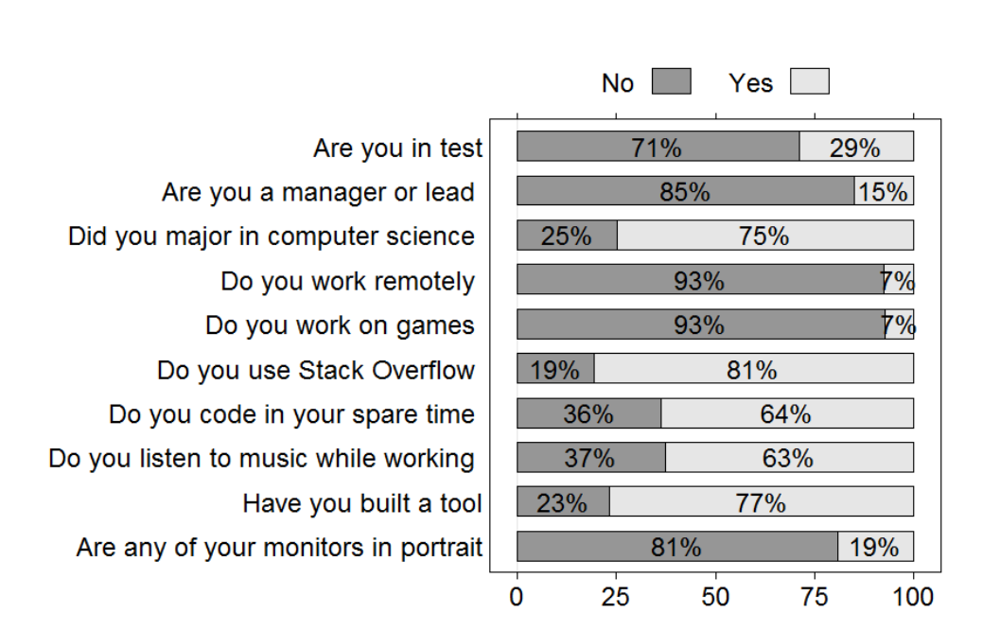
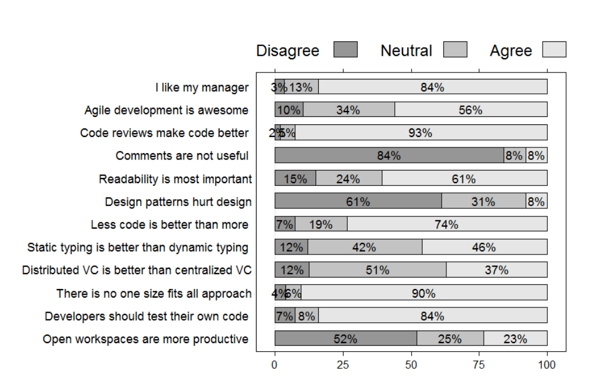

Figure 1 – Distributions of answers to survey questions about demographics and work practices.

Figure 2 – Distributions of answers to survey questions about developers’ beliefs

### Survey Device:
To assess the personality traits of engineers, we used the International Personality Item Pool (IPIP) [17], a repository of survey questions used to measure Five-Factor Model personality. When translated into local languages, the Five-Factor model performs well on international populations [18]. However, since we decided to only use the English version, we distributed the survey only to engineers based in the United States to control for any language and cultural barriers. When piloting an earlier version of the survey, non-native English speakers working outside the United States had trouble understanding the question “How often do you feel blue?” because the term “blue” has different connotations in different cultures, meaning sad in the United States, but intoxicated in some European countries.

The online survey contained first the 50-item IPIP personality inventory and then on a second page a series of 23 questions related to demographics (3 questions), beliefs (8 questions), and work practices (12 questions). Table 1 shows each of these later questions, which we refer to as the non-personality questions. Questions about beliefs were drawn selectively from a list of controversial programming questions on Stack Overflow (http://stackoverflow.com/questions/406760/whats-your-most-controversial-programming-opinion) that we hypothesized would be related to personality. Questions about demographics and work practices came from discussions with and observations of developers.

All non-personality questions were multiple choice. Questions about demographics contained questions with “yes” and “no” as the possible answer (e.g., “Were you a computer science major” and “Are you a manager”). Questions about beliefs each contained a statement, such as “Readability is the most important aspect of code” and respondents could indicate if they agreed, disagreed, or were neutral. Questions about work practices had “yes” or “no” as possible answers with a few exceptions (as shown in Table 1).

We sent the survey to 3,000 developers. We followed a number of protocols that have been shown to increase survey participation [19]; the invitation was personalized, the survey was completely anonymous and participants could choose to email us to enter a drawing for two $50 Amazon.com gift cards. Participants could choose a handle to preserve anonymity and later access their personality scores after the survey period had ended. We received 797 responses (26% response rate).

### 3.2 Data Analysis
We conducted two forms of data analysis on the survey responses. First, we examined the distributions of responses to each of the non-personality questions in an effort to build a broad view of each question. We present these distributions in bar chart form in Section 4.1. This analysis serves to help us understand the general demographics, the uniformity in work practices, and the diversity of beliefs in the surveyed sample.

We followed a common practice to normalize the mean and standard deviation of personality scores [20]. This facilitates comparison across different populations and groups. We normalized the mean to 25 and the standard deviation to 5. Higher scores for a dimension mean that a person exhibits that personality trait more.

In the second analysis, to examine the relationship between personality traits and beliefs and work practices of engineers, we used Kruskal-Wallis rank sum tests to check for statistically significant differences in any of the personality traits with regard to different answers to each question. We used Kruskal-Wallis because some questions had more than two levels to compare (e.g., Disagree/Neutral/Agree). For each of the 23 non-personality questions we examined differences for five personality traits, for a total of 115 Kruskal-Wallis tests. We identified 20 statistically significant differences at the 0.05 level.

We also used Benjamini-Hochberg p-value correction for multiple hypothesis testing [21] to prevent false discovery, a phenomenon in which null hypotheses are falsely rejected due to the large number of evaluated null hypotheses. After p-value adjustment, only 6 differences remained statistically significant at the 0.05 level.

Correcting for multiple hypothesis testing is a trade-off between being too cautious and preserving information: based on the 0.05 significance level, only 1 of the 20 differences is expected to be a false discovery, yet the p-value adjustment removes 14 of the 20 differences. Because of this trade-off, in Section 4.1 we report the results before and after p-value adjustment and let the reader decide which to trust.

## 4. RESULTS
We now discuss the results of our survey. We first present an analysis of the non-personality questions individually and then examine the relationship between these responses and personality traits.

### 4.1 Work Practices and Beliefs
Figure 1 shows the distributions of answers for questions related to demographics of the respondents and their work practices.

- Our coverage of roles is not uniform, but is fairly in line with the general distribution of roles within Microsoft. 29% of the respondents are working as testers (SDET) as opposed to those working on implementing code. 15% of the respondents are