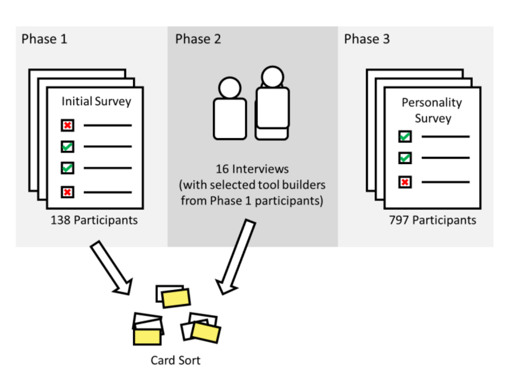

Fig. 1. Experimental methodology diagram. The Phase I survey leads to Phase II interviews. These insights lead to a quantitative personality survey (center left), and open card sorting (center right). These were distilled into a finished research product which you are currently consuming.

little investigation of these tools that result from developers’ own volition. In this paper, we mount an investigation into homegrown tools in an effort to provide answers to the following questions:

### Who are homegrown toolbuilders?
Understanding the scope, motivations, and extent of toolbuilding begins with understanding toolbuilders themselves. Most initiatives aimed at increasing toolbuilding would be useless if only a subpopulation of developers built tools. Even if toolbuilding is universal, studying the personal factors that contribute to it completes our understanding of the holistic process.

### What kinds of tools do homegrown toolbuilders build?
Investigating the types of homegrown tools that toolbuilders build provides insight into gaps in tooling and the challenges that developers face. They may also highlight inefficiencies in current processes and provide avenues for improvement.

### Why and when do homegrown toolbuilders build tools?
Exploring the motivations and conditions that lead toolbuilders to build their own tools can enable management and teams to foster environments where developers are more likely to develop beneficial tools. It may also uncover systemic problems that can be addressed (for example, one challenge we observed was tool discoverability within the company).

### How do homegrown tools spread?
Understanding how tools spread enables us to maximize spread for most benefit and enhance those channels that work best. Also, understanding how and why tools might not spread enables us to understand the reasons behind proliferation of similar tools.

We present a descriptive, exploratory study of homegrown tools at Microsoft. We used surveys and semi-structured interviews to answer basic questions about homegrown tools. In particular, we examined the types of tools that exist; characteristics of the people who build them; what events and conditions cause tools to be built; how tools spread inside organizations; and the impact that tools have.

## II. RESEARCH METHODOLOGY
We collected the data for this study in three phases. In Phase I, we deployed a survey to Microsoft developers to discover baseline information about tools. In Phase II, we followed up with a representative cross-section of toolbuilders and conducted semi-structured interviews in order to find out more about the impact tools have, how tools spread within and between teams, and what attitudes organizations have about tools. In Phase III, we deployed a second survey designed to explore the link between a developer’s personality and their tool-building behavior. We present data only from complete survey responses.

### A. Phase I: Open-Ended Survey
We conducted a survey of 138 developers and testers at Microsoft to assess baseline levels of toolbuilding. This survey was composed of open-ended questions related to the tools developers had used, grassroots tools they had written, and how they found out about those tools. We used this data to build up our initial ideas about grassroots tools, determine the frequency of toolbuilding, and determine the typical level of sophistication of a tool. The full text of this survey is available for interested readers as a technical report [2] at http://research.microsoft.com/apps/pubs/default.aspx?id=227190.

We sent personalized invitation emails written to 1,000 Microsoft employees with roles related to writing code. We selected the employees at random from the Microsoft organizational database. We have found that personalization and incentives increase participation [3], so we offered participants the option to enter into a raffle for two $50 Amazon.com gift cards. We received 123 responses from our initial population. Since one of the questions in our survey asked if the participant knew any other employees that had written a tool, we sent a second wave of invitations to those engineers and received 15 more responses. Since we intended to use this survey to build a sample for the next phase of our study, this survey was not anonymous.

### B. Phase II: Toolbuilder Interviews
After receiving responses from our initial survey, we asked several tool authors from our pool of survey respondents to sit for a semi-structured interview [4] about their tools. Our interview participants included developers, testers, and managers, drawn from the Bing, Office, Windows, and other organizations within Microsoft. We conducted 16 interviews about 12 tools. These interviews ranged between 20–60 minutes in length. We coded transcripts without selecting any a priori codes or categories.

### C. Phase III: Toolbuilder Personality Survey
In order to further assess the characteristics of toolbuilders responsible for tool building, we decided to conduct a survey of personality data. We decided to conduct this survey because our early interviews yielded less information about the personalities of tool builders than we had hoped, primarily because of participants’ hesitancy to talk about more personal topics. Several personality inventories exist in the psychometric research community; the two commonly used in software engineering research are the Myers-Briggs Type Indicator or MBTI [5], and the Five Factor or “Big Five” model [6]. We selected the Big Five model due to its