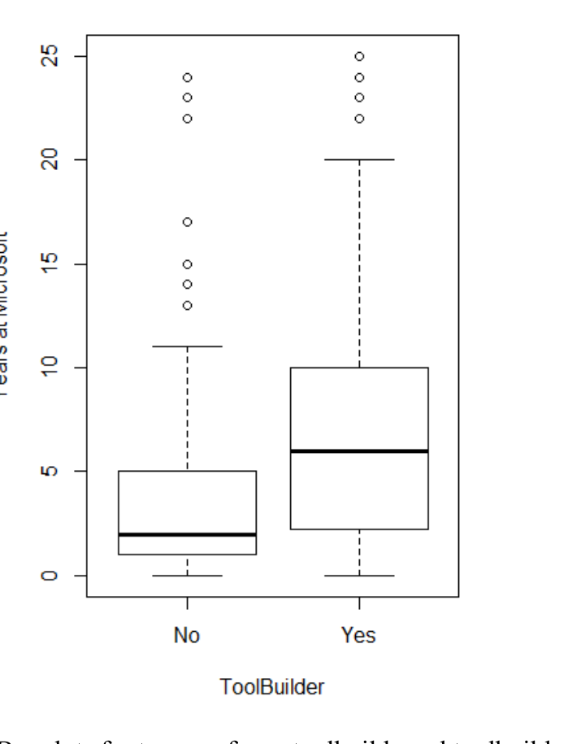

stronger theoretical and empirical basis, as well as its higher test-retest reliability [7].

### The Five-Factor Model
The five-factor personality model refers to five personality domains, called the OCEAN domains by their initials: openness, conscientiousness, extraversion, agreeableness, and neuroticism. Over the past few decades, the personality psychology research community has converged on the five-factor model [8] as the standard for assessing human personality traits, and prior research in software engineering that examined personality traits has found success using this model [9][10]. The five-factor model decomposes personality into five dimensions:

- Openness to experience, which measures an individual’s creativity, mental flexibility, cultural aptitude, and correlates to intelligence;
- Conscientiousness, or will, which measures an individual’s will to achieve, responsibility, and follow-through of plans;
- Extraversion, the degree to which an individual seeks out social contact;
- Agreeableness, the degree to which an individual is friendly and altruistic;
- Neuroticism, the degree to which an individual is affected by negative emotional states and moods.

### Survey Device
To assess the personality traits of toolbuilders, we used the International Personality Item Pool [11] to construct a 50-item inventory to measure personality according to the Five-Factor model. We sent this survey to 3,000 developers and received 797 responses for a 26% response rate. Since this survey was markedly more personal, this survey was completely anonymous. Participants could choose to email us to enter a drawing for two $50 Amazon.com gift cards. This survey was also longer than the first, containing first the 50-item IPIP personality inventory and later, to justify the effort of the personality inventory, a series of demographic, behavioral, and opinion items totaling 25 questions. This study only reports the findings related to the questions about toolbuilding and their relationship to personality scores and demographics (whether the participant was a developer, tester, or neither at the time, and how long they had been employed at Microsoft).

While the five-factor model performs well on international populations [12], concerns related to the cultural localization of IPIP items led us to distribute this survey only to engineers based in the United States. When piloting the survey, non-native English speakers working outside the United States had trouble understanding the question “How often do you feel blue?” because the term “blue” has different connotations in different cultures, meaning sad in the United States, but intoxicated in some European countries.

### D. Data Analysis
This study involved three data sets:
- The survey from Phase I, containing open questions related to tools (abbreviated to tool survey)
- The interview transcripts from Phase II. We conducted 16 interviews with homegrown toolbuilders. Table I gives brief introductions to the tools discussed in the interviews.

Fig. 2. Boxplots for tenure of non-toolbuilders and toolbuilders

- The personality survey from Phase III, containing closed, multiple-choice questions (abbreviated to personality survey)

We analyzed qualitative data using an open card sort [13]. This entailed printing all of our discrete observations on individual cards, then collaboratively clustering the cards into categories. Open card sorts are a natural fit for exploratory studies, because they allow researchers to let a natural organizational system form without pre-existing bias polluting the category structure. We conducted four card sorts, for the following topics: (1) tool types, (2) intrinsic and extrinsic motivations, (3) tool impacts, and (4) tool spread. Our dataset for the card sort included survey responses from the Phase I survey, and transcripts from the Phase II interviews. We generated 564 cards from coded transcripts and surveys that we categorized according to themes that emerged over the course of the card sort. Afterwards, we sorted each category into subcategories.

## III. WHO BUILDS HOMEGROWN TOOLS?
To understand tools, we must consider their builders. In this section, we present the demographic and psychological factors that contribute to toolbuilding. For legal reasons, we were unable to collect data related to gender, ethnicity, or other protected classes, since demographic data for our first study was taken from the Microsoft personnel database.

### A. Tenure
Tenure, the length of time an employee has been with the company, is an intrinsic factor in the toolbuilding equation. We computed this statistic from our Phase 3 survey data.

Boxplots with tenure for toolbuilders and non-toolbuilders are shown in Figure 2. Median tenure for toolbuilders in the Phase 3 survey data was 6.0 years, while median tenure for non-toolbuilders was 2.0 years. A Mann-Whitney test of the two groups detected a significant difference in the distribution of the two groups (p < 0.01).